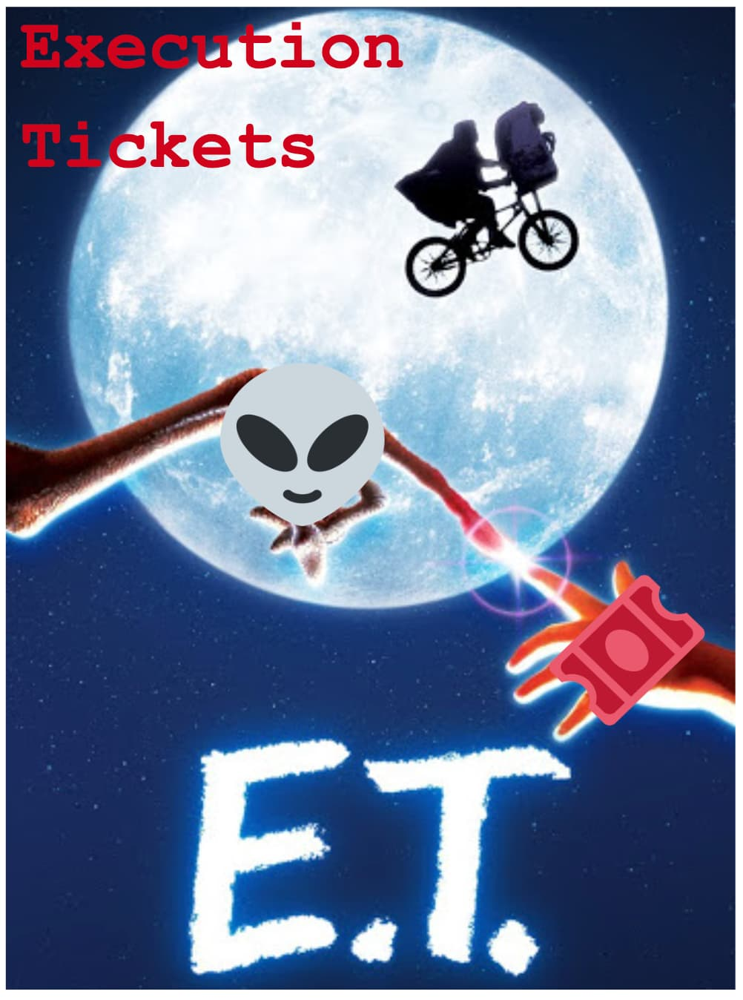
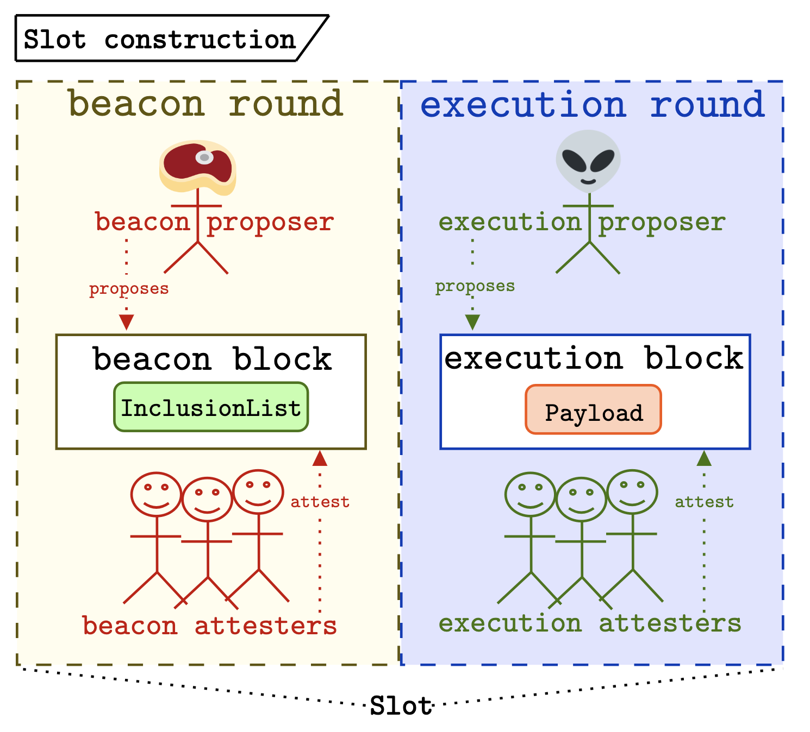
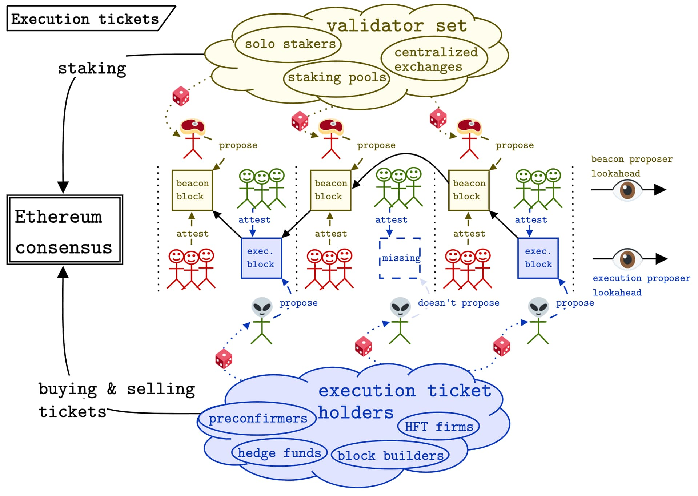
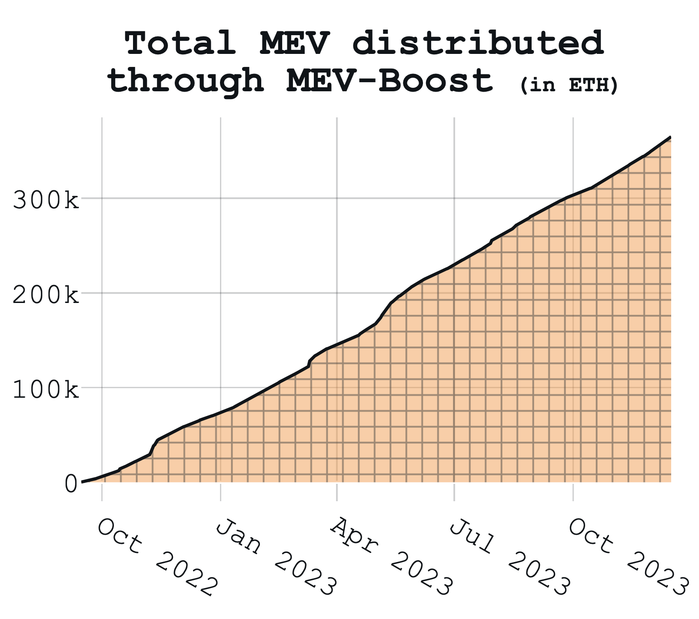
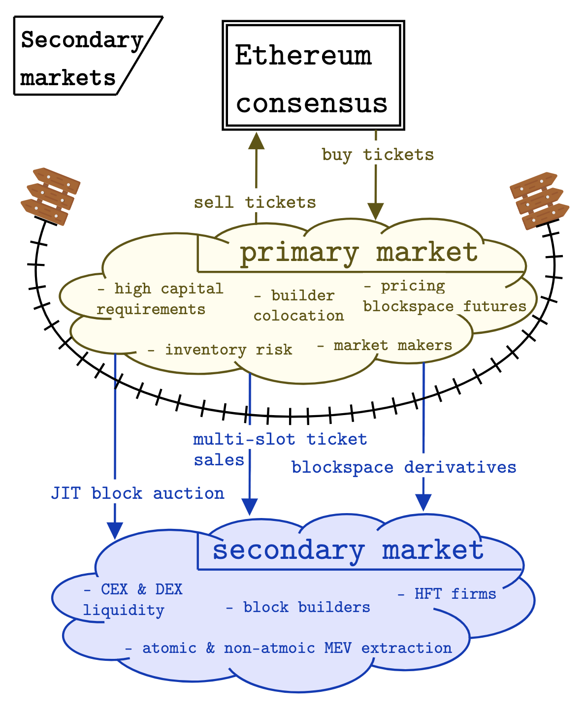

$\cdot$
^👽🎟️. Note that Justin presented this idea at the [Columbia CryptoEconomics Workshop](http://columbiacryptoeconomics.org) as Attester-Proposer Separation (APS); we are rebranding :-)
$\cdot$
*by [justin](https://twitter.com/drakefjustin) (thought leader) & [mike](https://twitter.com/mikeneuder) (scribe + diagrammer),
in discussion with [francesco](https://twitter.com/fradamt) (fork-choice vigilante) & [barnabé](https://twitter.com/barnabemonnot) (preconf skeptic).*
$\cdot$
*december 23 🎄, 2023*
$\cdot$
***Thanks***
*Many thanks to [Vitalik](https://twitter.com/vitalikbuterin), [Davide](https://twitter.com/DavideCrapis), [Toni](https://twitter.com/nero_eth), [Jacob](https://twitter.com/jacobykaufmann), [Dom](https://twitter.com/domothy), [Dankrad](https://twitter.com/dankrad), [Jonah](https://twitter.com/_JonahB_), [Mark](https://twitter.com/EthDreamer), [Conor](https://twitter.com/ConorMcMenamin9), [Quintus](https://twitter.com/0xQuintus), [Roman](https://twitter.com/r_krasiuk), & [Jon](https://twitter.com/jon_charb) and others at CCE for discussions and reviews!! 
Truly a team effort :-)*
$\cdot$
**Contents**
1. [**High-level overview**](https://ethresear.ch/t/execution-tickets/17944#high-level-view-1)
2. [**Definitions**](https://ethresear.ch/t/execution-tickets/17944#definitions-2)
3. [**Design**](https://ethresear.ch/t/execution-tickets/17944#design-3)
4. [**Analysis**](https://ethresear.ch/t/execution-tickets/17944#analysis-4)
5. [**Open questions**](https://ethresear.ch/t/execution-tickets/17944#open-questions-9) 
---

### High-level view
We begin by presenting the design in its most distilled form. The execution ticket mechanism can be succinctly described as:
1. **An in-protocol market for buying and selling tickets.**
    - Tickets entitle the owner to future block proposal rights. Using a dynamic pricing mechanism, we can target a certain number of tickets in circulation and modulate the price based on the existing supply. Tickets are one-time use and only valid in a randomly assigned slot.
3. **A lottery for selecting the beacon block proposer and attesters.**
    - This is the existing Proof-of-Stake lottery, where validators are randomly selected to propose beacon blocks. With execution tickets, the beacon block no longer has the execution payload (the final list of executed transactions for a block), but instead has an inclusion list that specifies a set of transactions that must be present in the execution block. For more details on inclusion lists, see ["*No free lunch*"](https://ethresear.ch/t/no-free-lunch-a-new-inclusion-list-design/16389) and [EIP-7547 related work](https://gist.github.com/michaelneuder/dfe5699cb245bc99fbc718031c773008).
5. **A lottery for selecting the execution block proposer and attesters.**
    - A second lottery to determine the winning ticket. The ticket owner has permission to propose the execution block for the slot. This block is where transactions are included onchain and the state is updated. The execution block proposer posts a collateral per ticket they own as an assurance that they will produce a single execution block during the execution round of the slot that their ticket is assigned. If they equivocate or are offline, the bond is slashed retroactively. Note that the economic security of beacon blocks remains the same, thus a finality reversion still has the settlement assurances of 1/3 of all staked `ETH`.

We decompose the slot into the beacon round and the execution round during which the beacon block and execution block are proposed respectively. Each of the two blocks has an associated attesting committee that casts votes used to determine the head of the chain.

**Buying tickets versus staking** – *Examining today's consensus mechanism using the ticket framework, an existing validator effectively owns a perpetual ticket. They can be selected at any time to be a proposer for a given slot and they retain this right as long as they are in the validator set. With execution tickets, future block proposal rights must be explicitly purchased from the protocol; validators are not given any tickets by default.*
> *To put some hypothetical numbers on what validators today pay for the right to produce blocks, let's do a bit of back-of-the-napkin math. These numbers are constructed to demonstrate the point, not to be perfectly realistic. Consider a validator today and let the cost of money be 3% per year while the rewards from issuance are 2% per year. The validator then has an opportunity cost of 1% per year on the 32 `ETH` they have staked. With 2,628,000 slots in a year and 890,000 validators, a validator should be selected about three times a year. Thus the "cost of being a proposer" is about 0.33% of 32 `ETH`, or about 0.11 `ETH`. In this hypothetical, this value represents the "price of being a block proposer," or in other words, the approximate price of an execution ticket.*

**Relationship to PBS/ePBS** – *While the concepts feel similar, execution tickets are orthogonal to PBS. Execution tickets create a primary market for future block space (e.g., a future-looking [slot auction](https://mirror.xyz/0x03c29504CEcCa30B93FF5774183a1358D41fbeB1/CPYI91s98cp9zKFkanKs_qotYzw09kWvouaAa9GXBrQ)), but the [JIT block auction](https://collective.flashbots.net/t/when-to-sell-your-blocks/2814) of `mev-boost` will still exist as a secondary market once the tickets are assigned to specific slots. It might \~still be worth\~ enshrining a PBS auction in addition to execution tickets. More on this in the analysis section.*

**Why execution tickets** – *The current block proposal process elects a single proposer from the validator set to produce the beacon block and the execution payload. Because of MEV, there are large incentives to outsource the execution payload construction to an external market of builders. This reality continues to place centralizing pressure on the validator set, as vertical integration, colocation, and pooling directly translate to more rewards. Execution tickets aim to detangle the MEV rewards from the beacon block production to "firewall off" the decentralized validator set from these centralizing forces.*

### Definitions
To add some more details, let's examine the slot construction in depth.

- ***Slot*** – *A single iteration of the consensus protocol.*
- ***Beacon lottery*** – *A random process by which the beacon proposers (and possibly attesters) are selected from the validator set.*
- ***Beacon round*** – *The portion of the slot where the beacon block is proposed.*
- ***Beacon block*** – *The [`BeaconBlockBody`](https://github.com/ethereum/consensus-specs/blob/bf09b9a7c4a7b311e86823235815daf31b117574/specs/capella/beacon-chain.md#beaconblockbody) of today, sans the `ExecutionPayload`, but with an inclusion list.*
- ***Beacon proposer*** – *The validator selected as the proposer for a given beacon round (same as today). Since these are normal stakers, the steak head is used in the figure above.*
- ***Beacon attesters*** – *The attestation committee tasked with voting for a beacon block during the beacon round.*
- ***Inclusion lists*** – *A list of transactions specified by the beacon proposer for inclusion in the execution block.*
- ***Execution lottery*** – *A random process by which the execution proposers are selected.*
- ***Execution ticket*** – *A voucher for participation in the execution lottery. Tickets are sold by the beacon chain for the rights to propose future execution blocks.*
- ***Execution round*** – *The portion of the slot during which an execution block is proposed.*
- ***Execution block*** – *The [`ExecutionPayload`](https://github.com/ethereum/consensus-specs/blob/bf09b9a7c4a7b311e86823235815daf31b117574/specs/bellatrix/beacon-chain.md#executionpayload) of today. This includes the set of transactions that get included onchain.*
- ***Execution proposer*** – *The ticket holder who is selected at random to propose the execution block during the execution round.*
- ***Execution attesters*** – *The attestation committee tasked with voting for an execution block during the execution round. This could be a [Payload-Timeliness Committee](https://ethresear.ch/t/payload-timeliness-committee-ptc-an-epbs-design/16054) or a portion of today's attesting committee. Either way, we need some way to ascribe fork-choice weight to the execution block.*

### Design
We call this mechanism "execution tickets" because the execution proposers directly purchase tickets for the lottery from the protocol, rather than being granted block proposal rights as beacon proposers (the case today).

The basic flow for one slot is:
1. During the **beacon round**, the randomly selected **beacon proposer** has authorization to propose a **beacon block**. 
2. This proposer proposes the **beacon block** that contains the **inclusion list**. 
3. The **beacon attesters** vote on the validity and timeliness of the **beacon block**.
1. During the **execution round**, a randomly selected **execution ticket** has authorization to propose an **execution block**.
5. The owner of the ticket is the **execution proposer** and proposes an **execution block**.
6. The **execution attesters** vote for on the timeliness and validity of the **execution block**.

The figure below shows this process unfolding for 3 slots.

A few takeaways from the figure:
- <ins>There are now two lotteries instead of one.</ins> The beacon proposer is still selected from the validator set, but the execution proposer is now randomly selected from the execution ticket holders. This decoupling of the two lotteries is schematized in the figure above by the dice showing the randomness that occurs for both proposer selections. In `mev-boost` and other PBS designs, where there is a single lottery for the beacon proposer, the proposer can choose (but is not obliged) to auction off their slot. Similarly, the execution ticket holder for a given slot can also resell their block proposal rights.
- <ins>There is a design space for the primary market of execution tickets.</ins> The most basic design is a 1559-style pricing mechanism where the price of the tickets is adjusted dynamically based on targeting a total supply of tickets in circulation. We could allow reselling tickets to the protocol which reduces the supply of outstanding tickets, thus decreasing the cost. If we build the primary market into the execution layer, e.g., through an EVM opcode, then the MEV associated with buying and selling tickets will also go to the execution proposers (see "Open question #1" for more).
- <ins>The "validator set" and the "execution ticket holders" are separated.</ins> This is the key design distinction. Rather than the beacon proposer selling their slot to the builders directly, the execution proposers purchase block proposal rights directly from the protocol. Today's large node operators, Lido NOs, Coinbase, Figment, etc., have core competencies of staking security, high validator uptime, and low slashing risk. Execution ticket holders will specialize in pricing future slots, risk management, and low-latency connections to block builders. These skills differ so we expect different entities to fill the gap. Also having large staking positions doesn't benefit the execution ticket holders, removing the incentive for builder-validator vertical integration. Execution ticket holders may be preconfirmers for L2s, hedge funds, builders, and HFT firms who excel at specialized tasks. Alternatively, there could be ticket resellers, block space insurance providers, or gamblers who want to play the lottery in hopes of earning revenue in the secondary market.
- <ins>The execution proposer may miss their slot.</ins> The execution proposer in the middle slot above failed to propose an execution block. The subsequent beacon proposer accounts for this by using the previous beacon block as their parent. This means that blocks can be "empty". In this case, the inclusion list transactions may be executed instead (see "Open question #5" for more). On the other hand, if the beacon proposer misses their block, then no execution block can be proposed, and the execution ticket is added back to the pool of unassigned tickets. Both beacon blocks and execution blocks have an associated attesting committee selected from the validator set. The votes of these attesting committees are used to determine the head of the chain.
- <ins>There exists a lookahead for elected beacon and execution proposers.</ins> The fact that these values could differ may be an important design consideration. For beacon proposers, a long lookahead has the downside of allowing more games to be played with the beacon proposer's slot. For execution proposers, a long lookahead might be desirable to increase the knowledge of upcoming preconfimation-eligible execution proposers and thus may help the secondary market function smoothly. 
- <ins>The fork-choice implications of execution blocks must be robust.</ins> With two sets of attestation committees, we must decide when the attestations are included onchain. For example, if execution blocks include attestations for beacon blocks, then there is potential concern around a situation where a single entity controls a significant portion of the ticket supply and starts censoring attestations. If the execution block does \*not\* include attestations, then the beacon attesting committee could attest late. Additionally, the mechanics of dealing with execution proposer equivocations would need to be considered (see "Open question #2" for more).

### Analysis

Let's explore some of the downstream effects of execution tickets. 

#### Validating & staking
This design significantly changes the role of being a validator in Ethereum. 

1. ***Simplification of tasks.*** 
    - The burden of deciding on the execution block is removed from the validator. Instead, they focus on determining the head of the chain in their local view and constructing an inclusion list of the transactions that they have seen. Importantly, the incentive to play proposer timing games is greatly reduced, because the value of the beacon block should not increase as time passes.
    - One edge case occurs if beacon proposers start giving preconfirmations by including transactions in their inclusion list. This may be undesirable because it reintroduces timing games into the beacon proposer role (longer delay means more time to issue preconfirmations and construct the inclusion list). Preconfimations issued by beacon proposers could be less desirable if the lookahead for the beacon proposers is relatively short and inclusion list compliance is not required on full blocks. The tradeoff here is making the IL enforcement less rigid versus making beacon proposer preconfirmations less valuable. See ["*Fun and games*"](https://ethresear.ch/t/fun-and-games-with-inclusion-lists/16557) for more on how ILs may be manipulated (see "Open question #3" for more). 
3. ***Removes MEV from validator rewards.***
    - By explicitly decoupling MEV from the validator rewards, the original incentives of the consensus mechanism are restored. Their rewards are only derived from their performance on the consensus duties of keeping the chain alive. Note that warping of the validator incentives from restaking or other extra-protocol services is not resolved with execution tickets.
    - The decoupling of MEV rewards also greatly reduces the incentive to pool as there is no MEV-smoothing derived from collaborating with other stakers.
    - By increasing the predictability of the validator rewards (removing the noisy MEV component), volatility in the amount of staked `ETH` may be reduced.
    - With execution block proposing explicitly designated to sophisticated actors (those who hold execution tickets), harsher missed slot penalties can be enforced. This increases the risk of playing [timing games](https://ethresear.ch/t/timing-games-implications-and-possible-mitigations/17612), making them less attractive.
    - Explicitly defining an execution proposer lottery allows validators to participate only by choice. If they like the idea of flipping a coin and getting a high-value slot, they are free to buy execution tickets.
4. ***Enables safer delegation (trusted or trustless).***
    - Staking operators today can steal MEV from the stakers delegating to them; this "rugpool" is likely to happen during moments of extreme volatility. In the execution ticket design, pools cannot steal MEV because the beacon proposer doesn't receive these rewards. There still may be "ticket purchasing pools" that are susceptible to execution proposers stealing the MEV (the same risk delegated stakers face today), but at least it is removed from the core validator set and can be handled out-of-protocol. 

#### Roadmap compatibility
As the [roadmap](https://storage.googleapis.com/ethereum-hackmd/upload_1a45d0f8e3eff90c4832d9cb2700a441.jpg) continues to evolve, let's consider how execution tickets fit into the [endgame vision](https://vitalik.ca/general/2021/12/06/endgame.html). From "Endgame,"
> "Block production is centralized, block validation is trustless and highly decentralized, and censorship is still prevented." – Vitalik

Execution tickets embrace this concept fully and aim to decouple block proposing and block validation while preserving censorship resistance.

1. ***Full ticket price burned.***
    - The current version of [mev-burn](https://ethresear.ch/t/mev-burn-a-simple-design/15590) is tightly coupled with the attesting committee for a given slot. The burning mechanism in the execution ticket design is more straightforward – you simply burn the full price of the ticket.
    - One downside of this is that the "cost of censorship" [benefits](https://ethresear.ch/t/dr-changestuff-or-how-i-learned-to-stop-worrying-and-love-mev-burn/17384#cost-of-censorship-6) from the original mev-burn design are no longer present as the base fee from censored transactions is no longer included in the burn minimum required to produce a block.
    - "Block maximization" or committee-based enforcement (the existing mev-burn design) could also be applied in protocol on a per-slot basis; these two burns are not mutually exclusive.
    - Beyond the MEV generated on Ethereum mainnet, preconfirmations could also be an additional source of value for execution ticket holders, thus driving up the price of tickets and corresponding burn.
7. ***Compatibility with a preconfirmation future.***
    - Note that preconfirmations are a relatively new topic and the jury is still out on how they impact the Ethereum roadmap. The bullets below are conditioned on preconfirmations being an important part of the scaling plan for Ethereum, which may age poorly – *caveat emptor* (see "Open question #3" for more).
    - [Preconfirmations](https://ethresear.ch/t/based-preconfirmations/17353) are critical to L2 UX. By providing a [confirmation rule](https://dba.xyz/do-rollups-inherit-security/) for L2 transactors, sequencers provide much faster settlement assurances than the Ethereum L1 can provide. With based rollups, the L1 proposers provide preconfirmation services for L2s. In the execution tickets model, the execution proposers can give these preconfirmations rather than the beacon proposers. This has pros and cons.
    - On the positive side, it removes the dependency on restaking and inclusion lists for based rollups, simplifying their mechanics immensely. Additionally, since the preconfirmers are sophisticated parties, expecting them to have DDoS protection, high bandwidth connections, and algorithms to price preconfirmation tips is within reason.
    - On the negative side, the execution proposers giving preconfimations introduce trust and centralization into the pipeline. This closely mirrors the `mev-geth` regime, in which a small set of miners were trusted with searcher bundles through their reputation. It's not clear that this is a better outcome.
1. ***Protocol simplicity and aesthetics***
    - Across the board, execution tickets are a simplification: they remove the variance of validator rewards, decrease the impact of proposer timing games, and protect delegated stakers from "rugpools". While this shouldn't be the only reason to do it, there is great value in a reduced design that is easier to reason about, especially as recent research tends in the direction of increased complexity.
    - Historical data for prices paid in the `mev-boost` auctions are also extremely stable at around 800 `ETH`/day. While we can't extrapolate this exact value to the future, the year of historical data implies some stability in the value of block space over time, which could translate to relatively consistent pricing for tickets. See the figure below from Toni's [mevboost.pics](https://mevboost.pics).

#### Secondary market
We define the primary market of tickets as buying and selling directly from the beacon chain. Each of these unused tickets is fungible. Once assigned to a slot, they are no longer resellable on the primary market, and the secondary market emerges. The figure below outlines some secondary market features we expect would evolve.

The "fence" we draw in the protocol is the primary market for unused ticket sales, which are dynamically priced. However, the non-fungible ticket sales on the secondary market are out of view of the protocol, just as they are in `mev-boost` today. Enshrining PBS extends the execution tickets design to protocolize and constrain a portion of the secondary market (e.g., the JIT block auction).

#### Multi-slot MEV considerations
While there are many benefits from execution tickets as expressed above, multi-slot MEV must be explored as it relates to the design.

**What's up with Multi-slot MEV** – Mutli-slot MEV refers to the fact that controlling more than one slot in a row of block proposal rights may have outsized benefits compared to controlling the same number of non-contiguous slots. For example, a builder trying to perform CEX-DEX arbitrage over two slots could try to censor Uniswap transactions for the first slot to let the price on the CEX continue to diverge, capturing outsized value in the second slot.

**Multi-slot MEV today** – In the current system, large node operators are the entities positioned to capture multi-slot MEV. For example, a node operator controlling 10% of the stake will control two consecutive slots 1% of the time (72x per day) and will control three consecutive slots 0.1% of the time (7.2x per day). In the `mev-boost` market structure, slots are sold "JIT" (using the terminology of [*"When to sell your blocks"*](https://collective.flashbots.net/t/when-to-sell-your-blocks/2814)). As such, a builder who wants to buy multiple slots in a row would need to compete in an independent auction for every slot. However, a node operator may instead choose to use a modified version of `mev-boost` and offer to sell multi-slot bundles to a specific builder outright (while we haven't seen this today, it may be taking place in the shadows). This could be rational if the expected value of selling multiple consecutive slots is higher than selling each individually. As we saw with the advent of [timing games](https://ethresear.ch/t/timing-games-implications-and-possible-mitigations/17612), the current status of the MEV markets can change quickly and we should expect node operators to be profit maximizing.

**Multi-slot MEV with tickets** – In the same way that staking pools today may have the incentive to auction off consecutive slots instead of using `mev-boost` JIT auctions, the (hypothetical) ticket holders who control multiple slots in a row could do the same. This would be part of a secondary market for tickets that would arise once they are assigned a slot in the execution proposer lookahead. This is not qualitatively different than the potential for multi-slot block sales today. In either case, the owners of the execution block proposing rights can sell multi-slot bundles either on their own or by cartelizing with other proposers.

**Possible mitigation #1: randomness** – Both the beacon and execution lotteries help mitigate the risk of multi-slot MEV. By randomizing the beacon proposer, there is a different validator constructing an inclusion list during each slot. This inclusion list constrains the action space of the execution proposer. Further, if we work towards SSLE, the randomly selected beacon proposer maintains privacy and is thus protected from attack (e.g., a network DDoS) by a multi-slot execution proposer and can safely construct and broadcast their inclusion list. The execution proposer selection is also random, so it is not possible to directly purchase consecutive slots from the protocol (though we acknowledge that a secondary market for this could evolve with or without execution tickets).

**Possible mitigation #2: honest inclusion list usage** – Under the execution tickets design, the existing beacon proposers build inclusion lists that enforce constraints on the execution block. The potential for multi-slot MEV is reduced greatly if all beacon proposers accurately fill their inclusion list based on their view of the mempool (though the rational beacon proposers may choose to accept a bribe to keep their list empty – see ["*Fun and games*"](https://ethresear.ch/t/fun-and-games-with-inclusion-lists/16557)). This could be rebranded as producing "template blocks", where beacon proposers locally build a candidate block and the execution proposers can reorder and insert but must use all the transactions in the template.

**Possible mitigation #3: block or inclusion list maximization** – The "maximization" concept is explored in the [mev-burn](https://ethresear.ch/t/mev-burn-a-simple-design/15590) design, where we use the attesting committee to enforce some properties of the block that is proposed. Even with execution tickets as the primary market, we could consider enshrining PBS to bring some of the secondary market (the JIT block auction) into view of the protocol and using the committee-based enforcement of block maximization to limit the benefit of controlling multiple consecutive execution rounds. Similarly, inclusion list maximization or [proposer multiplicity](https://blog.duality.xyz/introducing-multiplicity/) could also be used to ensure that an inclusion list is sufficiently utilized.

**Possible mitigation #4: encrypted mempools** – The longer-term solution of encrypted mempools helps dramatically for multi-slot MEV. When combined with block maximization (enforcement by the attesting committee), encrypted mempools force the execution proposer to decide between leaving all transactions out or including all of them. This further reduces the action space of the execution proposer.

**Possible mitigation #5: upfront charge of missed slot fee** – The penalty for a missed slot could be charged as a minimum fee for the ticket itself. This value is refunded assuming the execution block lands onchain when the execution ticket is selected. This would increase the capital requirements of buying many tickets in a row (adding additional stake for execution proposing, with an offline slashing condition).

### Open questions
As with any early research topic, many details need to be further explored. We include a (non-exhaustive) list of questions that need to be answered to flesh out the execution tickets design.
1. ***What are the exact mechanics of the ticket pricing mechanism?***
    - *Should we use a [1559-style](https://notes.ethereum.org/@vbuterin/protodankshardingfaq#How-does-the-exponential-EIP-1559-blob-fee-adjustment-mechanism-work) mechanism? If yes, how does selling factor into the equation? Is the mechanism robust to oscillations? See Barnabé et al's papers [\#1](https://arxiv.org/pdf/2102.10567), [\#2](https://arxiv.org/pdf/2110.04753), & [\#3](https://arxiv.org/pdf/2212.07175) on the topic.*
2. ***What are the fork-choice implications of execution ticketing?***
    - *Should attestations be included in the execution block? If yes, does the execution proposer have an outsized influence on the fork-choice? If not, will beacon attesters simply delay their attestations? If we combine execution tickets with SSF, we will have 3 rounds (beacon, execution, finalization). Adding ePBS would add a fourth round, is that OK?*
3. ***How do execution tickets alter the designs of preconfirmations?***
    - *Should both beacon and execution proposers give preconfirmations? Are there trustless ways to design preconfirmations? Are preconfirmations centralizing?*
4. ***How do we construct the "second" staking mechanism for execution ticket holders?***
    - *Should the missed slot fee be charged up front? What are the collateral requirements for purchasing tickets? How do we penalize execution proposers who equivocate or are offline?*
5. ***Are inclusion lists sufficient for preserving censorship resistance?***
    - *Can we design a mechanism that mandates IL usage (e.g., IL maximization)? Should we explore other censorship resistance alternatives (e.g., [multiplicity](https://blog.duality.xyz/introducing-multiplicity/))? If no execution block is proposed, should the inclusion list be promoted to be the execution block? Does that introduce MEV in the inclusion list construction?*
6. ***What is the market structure of the execution tickets?***
    - *Are we OK with a relatively small and centralized cohort producing all blocks? How will execution ticket holders and builders interact? How much can we constrain the builders' behavior?*

thanks for reading 📖; see you next year 🎆🎉🪩