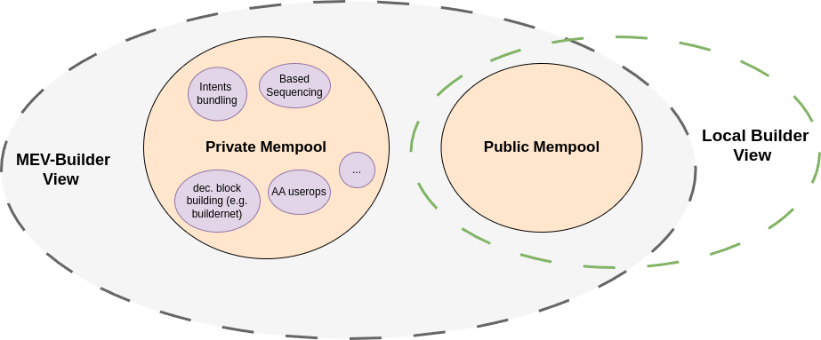
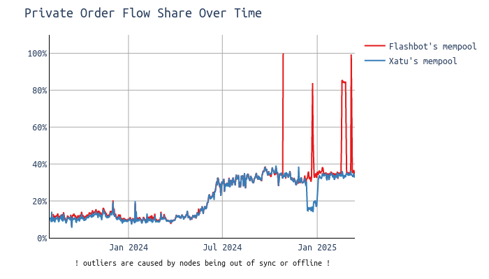
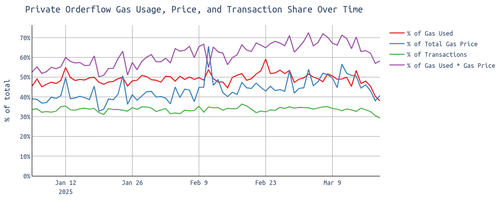
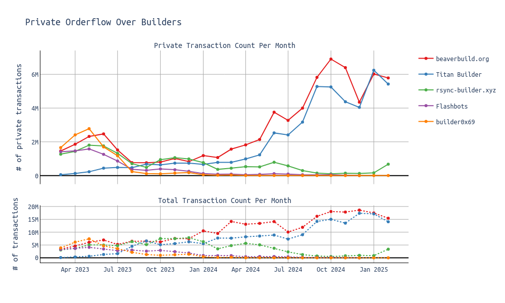
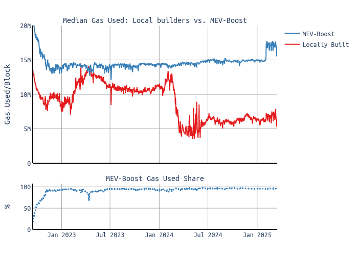
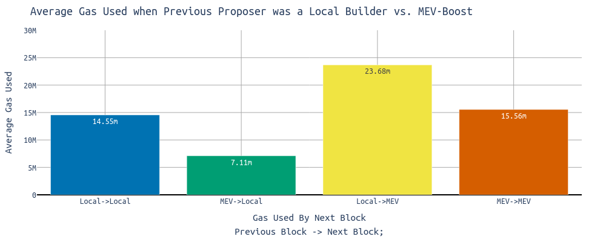
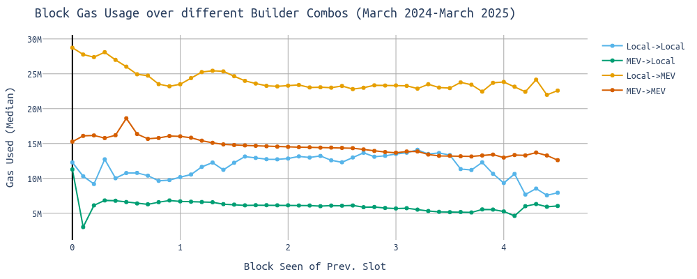
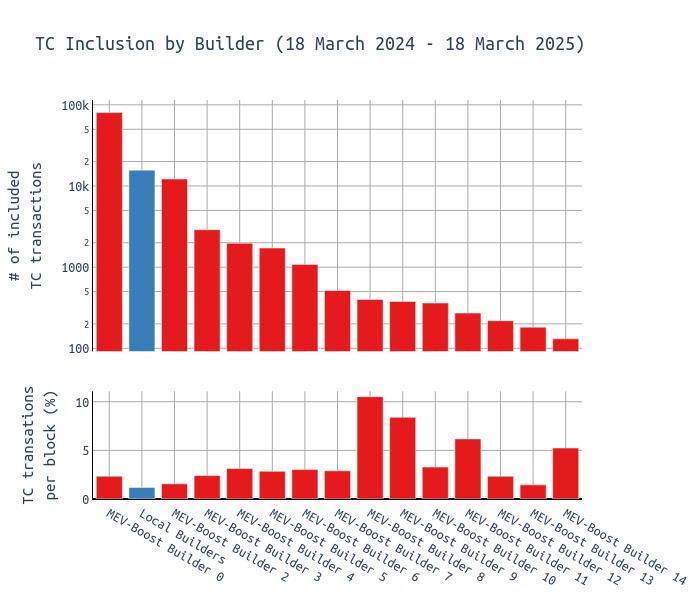

# Expanding Mempool Perspectives

> Many thanks to [dataalways](https://x.com/Data_Always/status/1887574765038411791),  [soispoke](https://x.com/soispoke), [ralexstokes](https://github.com/ralexstokes) and [julianma](https://x.com/_julianma) for feedback on this post and [EthPandaOps](https://ethpandaops.io/data/xatu/) and [Flashbots](https://mempool-dumpster.flashbots.net/index.html) for the mempool data archives.

**TL;DR**: Ethereum might have been overindexing on "local builders" for censorship resistance. 
Local building is required as a **fallback mechanism** to allow proposers (incl. *home stakers*) to **build their own blocks when needed** (e.g. when there's a liveness issue caused by builders/relays). These fallbacks must be **permissionless and trustless**, which can be achieved through local building as it works today, or through open and permissionless gateways (**e.g. ePBS, or decentralized relays**). With permissionless participation in the MEV-Boost market, local building becomes unnecessary while **(weak) censorship resistance and liveness remain intact**.

## The Role of Local Builders, Private Orderflow and the Public Mempool

Ethereum has evolved from a **monolithic, gossip-driven public mempool** into a **dynamic ecosystem** of specialized block builders, private orderflow deals, user-operation bundlers, and L2 sequencers. This transition has resulted in several shifts:

- **Enhanced Specialization** – Introduction of services like [pre-confirmations](https://ethresear.ch/t/based-preconfirmations/17353), [based sequencing](https://ethresear.ch/t/based-rollups-superpowers-from-l1-sequencing/15016), front-running protection ([MEV Blocker](https://cow.fi/mev-blocker), [Flashbots Protect](https://protect.flashbots.net/)), and improved mempool privacy, all contributing to better UX.
- **Diminished Public Mempool Role** – While its economic significance has declined, the **public mempool remains critical for censorship resistance**.
- **Rise of Private Transactions** – Currently, **around 35% of transactions are submitted privately**, predominantly via **Beaverbuild and Titan Builder**—a trend that has remained stable since June 2024.
- **Centralization Concerns** – Exclusive orderflow deals create **economies of scale**, leading to **greater centralization among builders**. However, **PBS protects validators from centralization pressure**, and e.g. [Flashbots' buildernet](https://buildernet.org/) is tackling the risks on the builder side.

**A crucial question arises:**

-> *Do we need local builders?*

> For the following, **let's not confuse the role of *home stakers* with *local builders***. Those roles are different (even though often carried out by the same entity) and should be treated differently. Home stakers unquestionably are highly important to Ethereum, its decentralization and all the properties that result from it.

## Mempool != Mempool

There was never a comprehensive mempool. However, over time, increased sophistication has reduced the economic importance of the public mempool.

### Understanding Builders
- **Local Builders**  
... are proposers who don't use or fallback from MEV-Boost (`min-bid` flag) and access only the public mempool. Typically, these are home stakers who prefer not to rely on MEV-Boost relays, even if it means [missing out on 3x the execution layer profits per block](https://ethresear.ch/t/is-it-worth-using-mev-boost/19753).
- **MEV-Boost Builders**  
... see everything local builders do, plus additional private orderflow. This includes transactions sent to the builder via RPC services, searcher bundles, or builders directly doing based sequencing for L2s. The builders' own transactions (e.g. MEV-Boost payment) are private orderflow too.

### How Much Private Orderflow Exists?

  

Approximately **35% of all transactions** in a block are private, meaning they never appeared in the mempool databases of **both Flashbots and Xatu**.

> Even with the combined efforts of Flashbots (incl. Alchemy, Bloxroute, Chainbound, and Eden) and Xatu nodes consistently logging observed transactions, some will inevitably go unseen. However, I’m confident that the dataset captures **over 99.9% of all public mempool transactions**.  

The trend observed around summer 2024 didn’t continue, and we now see **30-40% of transactions being private**, which aligns with expectations, as many transactions have no clear incentive to be submitted privately. 

> **For DEX transactions**, check out [this query by dataalways](https://dune.com/queries/4873932/8070888), showing **80% private orderflow** for those transactions.

While around 30-40% of all transactions are from private orderflow (*green line*), almost 70% (*violet line*) of the total fee paid originates from private orderflow.

Focusing on builders, we see **Beaverbuild** and **Titan Builder** as the two big contenders for private orderflow:

### Is the Public Mempool Dying?

Today, **locally built blocks** are significantly **less full** than **MEV-Boost blocks**:

- The **median MEV-Boost block** typically **uses 15 million gas** (18 million since the recent gas limit increase to 36 million), aligning closely with the **EIP-1559 target**.  
- In contrast, the **median locally built block** consumes only **5-10 million gas**.  

> This suggests that **blocks from local builders may temporarily reduce throughput**. However this short-term effect is compensated over time with the basefee adjusting.

  
> This is not a new observation—it has already been documented by **[dataalways](https://x.com/Data_Always/status/1887574765038411791)** earlier this year.  

Looking at **gas usage across consecutive block-building combinations** provides insight:

- **Local builders** following another **local builder's block** get close to the **14.55 million** gas target.
- **Local builders** following an **MEV-Boost builder’s block** fill only **7.11 million gas on average**.
- **MEV-Boost builders** following a **local builder** use significantly more gas.

### Timing Games and Block Propagation

MEV-Boost builders, with relay support, frequently engage in timing games ([as detailed here](https://timing.pics/)), potentially delaying block propagation by up to **3 seconds** (~25% of the slot). This delay can impact the next proposer’s ability to include transactions, reducing their gas utilization.

The chart below illustrates **gas usage in block n + 1** based on the **block seen time of the previous block n**. Once again, we observe that **local builders following MEV-Boost builder** blocks come with **around 7 million gas**.  

- As the **block seen time of the previous block increases**, gas usage in the next block **decreases**.
- **Local builders following a MEV-Boost block** typically fill **only ~7 million gas**.
    - At **1 second into the slot**, gas usage is around **7 million**; by **3.5 seconds**, it drops to **~5 million**.

### Economic Perspective

Priority fees contribute **only ~3% of a local builder’s revenue** annually ([see this analysis](https://ethresear.ch/t/is-it-worth-using-mev-boost/19753)), a figure that declines as the **public mempool shrinks**.

Yet, certain transactions remain **non-extractable**, including:
- Simple ETH or token transfers
- Smart contract deployments
- Transactions from privacy apps like Railway or Tornado Cash
- etc.

> From both **UX and CR perspectives**, the **public mempool remains essential**.
Local builders are already sacrificing a significant amount of additional revenue on the EL side and might be happy with the CL side of rewards, so handling fewer transactions might not place much additional burden on them.

## The Future of Local Builders

### Are Local Builders Essential for Censorship Resistance?

The assumption that **local builders are critical for CR** is worth questioning.

> *Local builders naturally order transactions by priority fees and are unlikely to modify their client software for censorship.*

However, the **MEV-Boost market already incentivizes anti-censorship behaviors**:
- If a **widely used app** becomes a censorship target, compliant builders would have to **sacrifice the MEV profits** extractable from that app’s transactions. To stay competitive with non-censoring builders, they have a **strong incentive to avoid censorship** and find ways to bypass restrictions.  
- If a **less frequently used app** faces censorship, **smaller builders can accumulate a queue** of transactions that censoring builders refuse to include. Once the queued transactions offer **sufficient priority fees**, non-censoring builders can **outbid** censoring ones, ensuring eventual inclusion.  

### Case Study: Tornado Cash

Tornado Cash transactions, subject to censorship, [saw increased inclusion delays](https://x.com/nero_eth/status/1889748822735175978). However, small builders, despite their lower market share, **accumulated and batched these transactions to secure inclusion**.

The following chart distinguishes between Local Builders and MEV-Boost Builders. Local builders account for approximately 8–10% of the network. Over the past year, they included the second-most Tornado Cash transactions, yet the lower chart shows local builders had a relatively low inclusion rate per block. Small builders with a relatively low market share appear to have picked up TC transactions to batch-include them, helping them win the block auction.

Even without local builders, sanctioned transactions would still reach the chain, suggesting that some weak form of **a censorship-resistant mechanism can persist without them**. We might see increased inclusion times, but the final impact depends on the user/app being censored.

### What about Liveness?

Liveness is a different matter. Without a permissionless way for local builders to submit bids directly to themselves, bypassing relays that could censor them, Ethereum can't guarantee liveness.

If local builders can transition in a **trustless and permissionless** manner **without relying on relays**, then **their role as local block builders diminishes**.