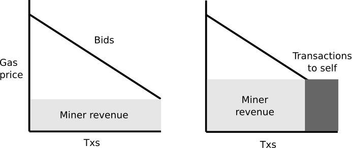

_Special thanks to David Easley, Scott Kominers and others I talked to about these topics at http://www.sigecom.org/ec18/, and to Vlad Zamfir for independently inventing and discussing the 50% targeting mandatory fee model._

In blockchains like Bitcoin and Ethereum, transaction fees are both one of the ways in which miners (or more generally block proposers) get rewarded for processing transactions, as well as the mechanism for transaction prioritization: each transaction includes the fee that it is willing to pay, and miners are incentivized to select transactions with the highest fees in order to maximize their revenue. This means that users that really need high priority in the short run can get prioritized by including a much higher transaction fee, and it ensures that in the long run the blockchain is filled with higher-value use cases rather than lower-value use cases.

Currently, almost all blockchains use a mechanism that is equivalent to a [first-price auction](https://en.wikipedia.org/wiki/First-price_sealed-bid_auction): everyone submits a bid, and then if they get included they pay exactly the bid that they submit. The problem with this kind of mechanism is that there is no simple strategy for choosing the optimal bid price. For example, if you value a tx getting included right now at $1, you would be willing to bid anything up to $1, but if everyone else is bidding $0.05, then you could keep more money by bidding $0.08 instead; optimizing this requires complex models of the economy and real-time blockchain usage.

The usual alternative is a [uniform-price auction](https://en.wikipedia.org/wiki/Multiunit_auction#Uniform_price_auction), which involves charging every participant the same price as the price paid by the lowest bidder; that is, if for example the bids are:

    0.02, 0.03, 0.05, 0.08, 0.13, 0.19, 1.00

And a miner has space for five transactions, they will include the top five, and each sender will pay only $0.05.

This has a much simpler strategy: bid whatever your valuation is. That is, someone who values a transaction getting included at $1 could just bid $1, and the fact that their bid is very high doesn't mean they have to actually pay a large amount unless everyone else's bid is similarly high. 

Under the assumption that every user only wants a small portion of the space in each block, this is "truthful": because each user only has a negligible impact on the price that they pay (which is almost entirely set by the mass of other users), and their bid only affects whether or not they get included in the block, you can show that bidding an amount equal to your valuation ensures an optimal outcome: if the clearing price ends up being lower than your valuation, you get included, and if it ends up being higher, you don't, and so in both cases you're happy with the outcome.

However, uniform-price auctions used in this context have two weaknesses (see [Credible Mechanisms](https://papers.ssrn.com/sol3/papers.cfm?abstract_id=3033208) for a "mainstream" treatment of some related ideas). First, a block proposer can include their own transactions in a block, and thereby increase the clearing price, increasing their own total revenue.

Second, a block proposer can collude with some portion of transaction senders, asking them to submit higher bids than their "actual" bids, and then refund them through a separate channel.

Both attacks are possible because, under the rules of this mechanism, a transaction sender increasing their bid by $1 can increase the block proposer's total revenue by _more_ than $1. First price auctions do not have these weaknesses.

Our goal is to discourage the development of complex miner strategies and complex transaction sender strategies in general, including both complex client-side calculations and economic modeling as well as various forms of collusion; the latter especially is dangerous as it creates an incentive for staking pools that can centrally manage the process of extracting gains from collusion.

The following is a proposal that makes some headway in that direction relative to the status quo, though it definitely does not achieve mathematically perfect optimality. It is an attempt to find the minimal protocol change that leads to a very significant improvement over the status quo.

The mechanism maintains a minimum fee F. Every transaction specifies a fee. For a transaction to be included in a block, the transaction must pay at least F. The fee is adjusted every block by the following formula, where $\frac{prevBlockGas}{prevBlockMaxGas}$ is the portion of the previous block that was full, and $k$ is a constant (0 < k < 2):

$curBlockFee = prevBlockFee * (1 + k * (\frac{prevBlockGas}{prevBlockMaxGas} - \frac{1}{2}))$

Miners receive the revenue from the transaction fee paid, minus the minimum fee. Transactions can include a minimum block number. That's all there is to the mechanism.

Miners' incentive is the same as it is in the first-price model: they try to gather up the most expensive transactions that they can, and include them into their block. One possible transaction sender strategy is as follows:

1. Check if the minfee is higher or lower than how much you value the transaction getting included. If it is higher, do not send the transaction. If it is lower, send a transaction, bidding the minfee plus 1% (or some other standard markup)
2. Publish an identical transaction, but with the minimum block number equal to two blocks in the future, and with the fee set by an imperfect heuristic algorithm as you would use today

In the normal case, blocks will be roughly half full, and so everyone's transactions from case (1) would get in. Case (1) is "truthful" (in that it has a simple strategy that is trivially derived from a user's valuation). In cases where blocks become full, case (2) would temporarily apply, though this would be rare; even in periods of very high demand, blocks being full would only last for a short time before the minfee catches up.

We can improve this further by allowing transaction senders to express their fee in the form of "whatever the minimum fee is, plus an increment $F_i$, up to a maximum of $F_{max}$". Users could then express the preference "I don't care as much about delays, I want to pay as little as possible, though I'm okay with anything up to some maximum", or "try to get through with as little as possible for 5 blocks, then try to pay much more" or a number of other options.

Note also that this mechanism allows the protocol to "capture" most of the revenue from transaction fees, allowing it to be redistributed as the protocol deems optimal (or burned). There are a [number](https://www.cs.princeton.edu/research/techreps/TR-983-16) of [results](http://randomwalker.info/publications/mining_CCS.pdf) that show that block proposer revenue coming primarily from fees leads to high risk of micro-level incentive instability in blockchain protocols. If fees are captured by the protocol, the protocol can distribute the fees to different classes of participants (eg. proposers, attesters), spread the fees out over time, or otherwise more closely replicate a revenue-driven incentive model.