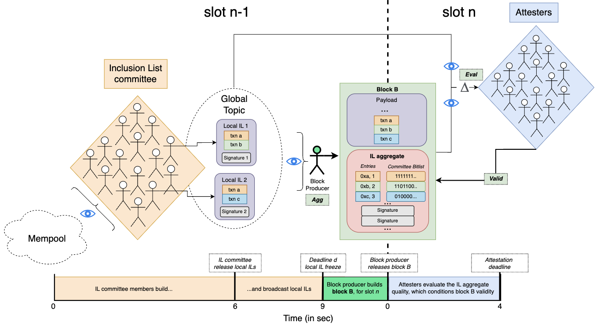

*^focil => fossil => protocol ossification*

*by [Thomas](https://ethresear.ch/u/soispoke/summary), [Barnabé](https://ethresear.ch/u/fradamt/summary), [Francesco](https://ethresear.ch/u/fradamt/summary) and [Julian](https://ethresear.ch/u/julian/summary)* - June 19th, 2024

*This design came together during a small, week long, in-person gathering in Berlin with RIG and friends to discuss censorship resistance, issuance, and Attester-Proposer-Builder-Consensus-Execution-[insert here] Separation.*

*Thanks to Luca, Terence, Toni, Ansgar, Alex, Caspar and Anders for discussions, feedback and comments on this proposal.*

# **tldr**

In this post, we introduce Fork-Choice enforced Inclusion Lists (FOCIL), a simple committee-based IL design. 

FOCIL is built in three simple steps:

1. Each slot, a set of validators is selected to become **IL committee members.** Each member gossips one *local inclusion list* according to their subjective view of the mempool.
2. **The block proposer** collects and aggregates available local inclusion lists into a concise *aggregate*, which is included in its block.
3. **The attesters** evaluate the quality of the *aggregate* given their own view of the gossiped local lists to ensure the block proposer accurately reports the available local lists.

This design ensures a robust and reliable mechanism to uphold Ethereum’s censorship resistance and [chain neutrality](https://ethresear.ch/t/uncrowdable-inclusion-lists-the-tension-between-chain-neutrality-preconfirmations-and-proposer-commitments/19372) properties, by guaranteeing timely transaction inclusion. 

# Introduction

In an effort to shield the Ethereum validator set from centralizing forces, the right to build blocks has been auctioned off to specialized entities known as builders. Over the past year, this has resulted in a few sophisticated builders dominating the network's block production. Economies of scale have further entrenched their position, making it increasingly difficult for new entrants to gain significant market share. A direct consequence of oligopolistic block production is a deterioration of the network’s (weak) censorship resistance properties. Today, [two of the top three builders](https://censorship.pics/) are actively filtering out transactions interacting with sanctioned addresses from their blocks. In contrast, 90% of the [more decentralized and heterogeneous validator set](https://www.ethernodes.org/countries) is not engaging in censorship. 

This has driven [research](https://github.com/michaelneuder/mev-bibliography?tab=readme-ov-file#censorship-resistance) toward ways that allow validators to impose constraints on builders by force-including transactions in their blocks. These efforts recently culminated in the first practical implementation of forward $\text{ILs}$ ($\text{fILs}$) being considered for inclusion in the upcoming Pectra fork (see [design](https://ethresear.ch/t/no-free-lunch-a-new-inclusion-list-design/16389), [EIP](https://eips.ethereum.org/EIPS/eip-7547), and [specs](https://notes.ethereum.org/@mikeneuder/il-spec-overview) [here](https://gist.github.com/michaelneuder/ba32e608c75d48719a7ecba29ec3d64b)). However, some concerns were raised about the specific mechanism proposed in [EIP-7547](https://eips.ethereum.org/EIPS/eip-7547), leading to its rejection. 

Here, we introduce FOCIL, a simple committee-based design improving upon previous IL mechanisms ([Forward ILs](https://ethresear.ch/t/no-free-lunch-a-new-inclusion-list-design/16389), [COMIS](https://ethresear.ch/t/the-more-the-less-censored-introducing-committee-enforced-inclusion-sets-comis-on-ethereum/18835)) or co-created blocks ([CBP](https://ethresear.ch/t/concurrent-block-proposers-in-ethereum/18777)) and addressing issues related to [bribing/extortion attacks](https://ethresear.ch/t/fun-and-games-with-inclusion-lists/16557), IL equivocation, [account abstraction](https://ethereum.org/en/roadmap/account-abstraction/) (AA) and incentive incompatibilities. Note also Vitalik’s recent proposal “[One-bit-per-attester inclusion lists](https://ethresear.ch/t/one-bit-per-attester-inclusion-lists/19797)”, where the committee chosen to build the list is essentially the whole set of attesters.

# **Design**

In this section, we introduce the core properties of the FOCIL mechanism (see **Figure 1.**).

## **High-level overview**

Each slot, a set of validators is randomly selected to become part of an inclusion list ($\text{IL}$) committee. $\text{IL}$ committee members are responsible for creating local inclusion lists ($\text{IL}_\text{local}$) of transactions pending in the public mempool. Local $\text{ILs}$ are then broadcast over the global topic, and the block producer must include a canonical aggregate ($\text{IL}_\text{agg}$) of transactions from the collected local $\text{ILs}$ in its block $B$. The quality of $\text{IL}_\text{agg}$ is checked by attesters, and conditions the validity of block $B$. 

>__Figure 1.__ Diagram illustrating the FOCIL mechanism.

## **Mechanism**

- **Validator Selection and Local Inclusion Lists**
    - A set of validators is selected from the beacon committee to become $\text{IL}$ committee members for slot $n$. This set is denoted as $\text{IL}_\text{committee}(n) = \{ 1, \dots, m \}$, where $m$ is the number of $\text{IL}$ committee members.
    - Each $\text{IL}$ committee member $i \in \text{IL}_\text{committee}(n)$ releases a local $\text{IL}$, resulting in a set of local $\text{ILs}$ for slot $n$, defined as $\text{IL}_\text{local}(n) = \{ \text{IL}_1, \dots, \text{IL}_m \}$.
    - Each local $\text{IL}_i$ contains transactions: $\text{IL}_i = \{ \text{tx}^1_i, \dots, \text{tx}^{j_i}_i \}$, where each $\text{tx}$ is represented as  $\text{tx} = (\text{tx}[\text{From}], \text{tx}[\text{Gas Limit}])$, and  $j_i$ indicates the number of transactions in $\text{IL}_i$. The `From` field represents the sender’s address, and the `Gas Limit` field represents the maximum gas consumed by a transaction. This is used to check whether a transaction can be included in a block given the [conditional](https://ethresear.ch/t/unconditional-inclusion-lists/18500) IL property.
- **Block Producer's Role**
    - The block producer of slot $n$, denoted $\text{BP}(n)$, must include an $\text{IL}$ aggregate denoted $\text{IL}_\text{agg}$ and a payload in their block  $B = (B[\text{IL}_\text{agg}], B[\text{payload}])$.
    - $\text{IL}_\text{agg}$ consists of transactions: $\text{IL}_\text{agg} = \{ \text{tx}^1_\text{agg}, \dots, \text{tx}^{t_\text{agg}}_\text{agg} \}$ where each transaction $\text{tx}_\text{agg}$ is defined as $(\text{tx}_\text{agg}[\text{tx}], \text{tx}_\text{agg}[\text{bitlist}])$, and the $\text{payload}$ must include transactions present in the $\text{IL}_\text{agg}$.
    - The bitlist $\text{tx}_\text{agg}[\text{bitlist}] \in \{0, 1\}^m$ indicates which local $\text{IL}$s included a given transaction.
    - The function $\text{Agg}$ takes the set of available local ILs $\text{IL}_\text{local}(n)$ and outputs a "canonical" aggregate. The proposer aggregate $\text{IL}_\text{agg}^\text{proposer}$ is included in block $B$, and each attester evaluates it quality by comparing it against its own $\text{IL}_\text{agg}^\text{attester}$, using the function $\text{Eval}(\text{IL}_\text{agg}^\text{attester}, \text{IL}_\text{agg}^\text{proposer}, Δ) \in \{ \text{True}, \text{False} \}$.
- **Attesters' Role**
    - Attesters for slot $n$ receive the block $B$ and apply a function $\text{Valid}(B)$ to determine the block validity.
    - $\text{Valid}$ encodes the block validity according to the result of $\text{Eval}$, as well as core IL properties such as [conditional vs. unconditional](https://ethresear.ch/t/unconditional-inclusion-lists/18500).
    - Here are some scenarios to illustrate $\text{IL}$-dependent validity conditions:
        - If local $\text{ILs}$ are made available before deadline $d$, but the proposer doesn’t include an $\text{IL}_\text{agg}^\text{proposer}$, block $B$ is considered invalid.
        - If no local $\text{ILs}$ are made available before deadline $d$, and the proposer doesn’t include an $\text{IL}_\text{agg}^\text{proposer}$, block $B$ is considered valid.
        - If block $B$ is full, local $\text{IL}$s were available before $d$, and the proposer doesn’t include an $\text{IL}_\text{agg}^\text{proposer}$, block $B$ is still considered valid.
        - If $\text{IL}_\text{agg}^\text{proposer}$ doesn’t overlap with most of attesters’ $\text{IL}_\text{agg}^\text{attester}$ according to $\text{Eval}$, block $B$ is considered invalid.

**The core FOCIL mechanism could be defined as:** 

$$
\mathcal{M}_\text{FOCIL}= (\text{Agg}, \text{Eval}, \text{Valid})
$$

## Timeline

The specific timing is given here as an example, but more research is required to figure out which numbers make sense.

- **Slot** $n-1$**,** $t = 6$**:** The $\text{IL}$ committee releases their local $\text{ILs}$, knowing the contents of block $n-1$.
- **Slot** $n-1$**,** $t=9$**:** There is a local $\text{IL}$ freeze deadline $d$ after which everyone locks their view of the observed local $\text{ILs}$. The proposer broadcast the $\text{IL}_\text{agg}$ over the global topic.
- **Slot** $n$**,** $t=0$**:** The block producer of slot $n$ releases their block $B$ which contains both the payload and aggregated $\text{IL}_\text{agg}$.
- **Slot** $n$**,** $t=4$**:** The attesters of slot $n$ vote on block $B$, deciding whether $\text{IL}_\text{agg}$ is “good enough” by comparing the result of computing the $\text{Agg}$ function over their local view of available local $\text{ILs}$ (applying $\text{Eval}$) and checking if block $B$ is $\text{Valid}$.

## **Aggregation, Evaluation and Validation Functions**

As mentioned in the mechanism section, FOCIL relies on three core functions. Each of these needs to be specified to ensure the mechanism fulfils its purpose.

- **The $\text{Agg}$ function** is probably the most straightforward to define: Transactions from all collected local $\text{ILs}$ should be deterministically aggregated and deduplicated to construct $\text{IL}_\text{agg}$. We let:
    - $\text{IL}_\text{local} = \{\text{IL}_1, \text{IL}_2, \ldots, \text{IL}_m\}$ be the set of local inclusion lists collected from committee members $m$.
    - Each $\text{IL}_i = \{\text{tx}_i^1, \text{tx}_i^2, \ldots, \text{tx}_i^{t_i}\}$
     be the transactions in the local inclusion list of the $i$-th committee member.
    - Each transaction $\text{tx}$ be defined by $(\text{hash}, \text{sender}, \text{nonce})$
    
    $\text{Agg}(\text{IL}_\text{local})$  can be thus defined as:
    
    $$
    \text{Agg}(\text{IL}_\text{local}) = {\text{tx} | \text{tx} \in \bigcup_{i \in m} \text{tx}_{i} }
    $$
    
- **The $\text{Eval}$ function** is used by each slot $n$ attester to assess the quality of the $\text{IL}_\text{agg}$ included in block $B$. Each attester calculates the $\text{Agg}$ function over all local $\text{ILs}$ they have observed in their view and then compares their generated $\text{IL}_\text{agg}^\text{attester}$ to the one included by the proposer $\text{IL}_\text{agg}^\text{proposer}$. The **$\text{Eval}$** function can then be defined so that the proposer’s $IL_{\text{agg}}^{\text{proposer}}$ is valid if it includes a sufficient proportion of transactions observed by the attesters, as defined by the parameter $Δ$:
    
  $$
\text{Eval}(IL_{\text{agg}}^{\text{attester}}, IL_{\text{agg}}^{\text{proposer}}, \Delta) = 
\begin{cases} 
\text{True} & \text{if } \frac{|IL_{\text{agg}}^{\text{attester}} \cap IL_{\text{agg}}^{\text{proposer}}|}{|IL_{\text{agg}}^{\text{attester}}|} \geq \Delta \\
\text{False} & \text{otherwise}
\end{cases}
  $$
    
    _Note that the $\text{Eval}$ function, and especially its parameter $Δ$, will determine the trade-off between **(1) the quality** of the $\text{IL}_\text{agg}^\text{proposer}$ and the agency we are willing to give to proposers, and **(2)** **liveness**, as we might see an increase in missed slots if the criteria are set too strictly._
    
- **The $\text{Valid}$ function** encodes whether the  $\text{IL}_\text{agg}$ conforms to pre-defined core $\text{IL}$ properties, such as:
    - **Conditional vs. Unconditional**: Should the proposer include as many $\text{IL}$ transactions in the block as possible as long as there is space left, or is there dedicated block space reserved for $\text{IL}$ transactions?
    - **Where-in-block**: Where should $\text{IL}$ transactions be included in the block? Should they be placed anywhere, at the top of the block, or at the end of the block?
    - **Expiry**: How long do transactions remain in the $\text{IL}$ once they have been included? What happens if a slot is skipped?

## **More rules**

In the following section, we introduce other rules that could be added to the core mechanism to specify:

- How users should pay for having their transactions included ($\text{Payment}$)
- How rewards can be distributed across FOCIL participants ($\text{Reward}$)
- How local $\text{ILs}$ are constructed (**$\text{Inclusion}$**)
- Interactions between $\text{IL}$ and payload transactions ($\text{Priority}$).

### **User Bidding,** $\text{Payment}$ **and** $\text{Reward}$ **rules**

- Users place bids based on the value they assign to having their transactions included in block $B$. They need to take into consideration the FOCIL mechanism $\mathcal{M}_\text{FOCIL}$, but also how the [EIP-1559](https://eips.ethereum.org/EIPS/eip-1559) mechanism works to set their base fees, denoted $\mathcal{M}_\text{1559}$. For instance, a user $t$ makes a bid $b^t(v^t, \mathcal{M}_\text{FOCIL},\mathcal{M}_\text{1559}) = (\delta^t, f^t)$, where $\delta^t$ is the maximum priority fee and $f^t$ is the maximum total fee (i.e., base fee $r$ + priority fee $\delta^t$).
- The vector of bids from all users is denoted as $\mathbf{b} = (b^1, b^2, \dots, b^T)$, where each $b^t$ represents the bid from user $t$.
- The $\text{Payment}$ rule $p(\mathbf{b}) = (p_0(\mathbf{b}), p_1(\mathbf{b}), \dots, p_t(\mathbf{b}), \dots, p_m(\mathbf{b}))$ ensures that users pay no more than their priority fee $\hat{\delta}^t = \min(\delta^t, f^t - r)$. Here, $p_0(\mathbf{b}$) represents the payment to the block producer, and $p_t(\mathbf{b}$) represents the payment made by user $t$ to all other $\text{IL}$ committee members, where the set of users has size $m$ and the block producer is indexed by 0.

The $\text{Payment}$ rule defined above is meant to give a general view of how the value paid by users’ transactions can be redistributed across FOCIL participants (e.g., $\text{IL}$ committee members, block producer) to incentivize behavior that is considered good for the network, in this case preserving its censorship-resistant properties. Incentivizing $\text{IL}$ committee members for including transactions strengthens the robustness of the mechanism by increasing the [cost of censorship](https://arxiv.org/abs/2301.13321), or the amount a censoring party would have to pay for $\text{IL}$ committee members to exclude transactions from their local $\text{ILs}$. Delving into the specifics of how the builder and $\text{IL}$ committee members should be rewarded is beyond the scope of this post as distributing rewards in an incentive-compatible way, especially during congestion, gets quite complex.

However, here are three high-level options to consider:

- **Option 1**: All transaction priority fees go to the builder, and $\text{IL}$ committee members are just not incentivized to include transactions in their local $\text{ILs}$. This simple option doesn’t require any changes to the existing fee market, but entirely relies on altruism from $\text{IL}$ committee members. We could even consider an opt-in version of FOCIL, where validators can choose to be part of a list that may be elected to become $\text{IL}$ committee members and participate in building $\text{ILs}$ altruistically. However, it wouldn’t increase the cost of censorship nor would it make it very appealing for validators to participate in the mechanism. This could also lead to out-of-band payments from users wanted to have their transactions included in local $\text{ILs}$.
- **Option 2**: Priority fees from transactions included in the block are given to the $\text{IL}$ committee members. To distribute rewards among members, we could implement a weighted incentive system by defining a $\text{Reward}$ rule to calculate and distribute rewards for each member, considering the quantity (i.e., count) and uniqueness of transactions included in their local lists (see Appendix 1 of the [COMIS post](https://ethresear.ch/t/the-more-the-less-censored-introducing-committee-enforced-inclusion-sets-comis-on-ethereum/18835) for more details). If transactions are not part of the $\text{IL}_\text{agg}$, priority fees go to the builder. However, this approach could be problematic during congestion periods with the conditional $\text{IL}$ property, as builders might be incentivized to fill the block with transactions that are not in the $\text{IL}_\text{agg}$, even if $\text{IL}$ transactions have higher priority fees. To address this, we might need to design a mechanism that redirects priority fees to the builder during congestion. However, the practical implementation and potential secondary effects need further investigation.
- **Option 3**: A third option is to introduce a new, separate inclusion fee that always go to IL committee members while priority fees always go to the builder. This would likely address the concerns of **Option 2** related to congestion but would introduce a whole other variable that users need to set. A useful distinction between Option 2 and Option 3 is whether the complexity is pushed upon the IL committee members or the end users.

Another interesting question to explore is the impact of fee distribution across $\text{IL}$ committee members on mechanisms like [MEV-burn](https://ethresear.ch/t/mev-burn-a-simple-design/15590/4). **Options 2** and **3** would effectively “reduce the burn” and produce a similar effect as [MEV-smoothing](https://ethresear.ch/t/committee-driven-mev-smoothing/10408), but on a smaller scale limited to the size of the $\text{IL}$ committee (h/t Anders).

### $\text{Inclusion}$ **Rule**

The $\text{Inclusion}$ rule determines the criteria according to which $\text{IL}$ committee members should build their local $\text{ILs}$. In FOCIL, we define it with the premise that IL committee members will try to maximize their rewards. Assuming **Option 2** for the $\text{Payment}$ rule, the $\text{Inclusion}$ rule could be to include all transactions seen in the public mempool, ordered by priority fees. 

### $\text{Priority}$ **Rule**

We assume the block will be made of two components: a payload and an  $\text{IL}_\text{agg}$ included by the proposer to impose constraints on transactions that need to be included in the builder’s payload. Imposing constraints to the block payload via the  $\text{IL}_\text{agg}$ thus requires a priority rule to determine what happens during congestion. Generally, the priority rule in FOCIL states that transactions in the  $\text{IL}_\text{agg}$ might be excluded if the block can be filled with the builder’s payload transactions. In other words, the block will still be valid even if some transactions in the $\text{IL}_\text{agg}$ are not included, as long as the block is completely full (i.e., the `30 M` gas limit is reached).

_Note: Rules are not set in stone and should be interpreted as candidates for FOCIL. Rules also don’t necessarily have to be made explicit. For instance, we can define the $\text{Reward}$ such that the dominant strategy of the $\text{IL}$ committee is to adhere to the $\text{Inclusion}$ rule without any kind of enforcement by the protocol._

## Improvements and Mitigations

In this section, we discuss improvements over previous  $\text{IL}$ proposals, focusing on simplification and addressing specific implementation concerns.

### **Commitment attacks**

One of the main differences between FOCIL and the forward IL ($\text{fIL}$) design proposed in [EIP-7547](https://eips.ethereum.org/EIPS/eip-7547) is that FOCIL relies on a committee of multiple validators, rather than a single proposer, to construct and broadcast the $\text{IL}$. This approach imposes stricter constraints on creating a “good” aggregate list and significantly reduces the surface for bribery attacks. Instead of targeting a single party to influence the exclusion of transactions from the $\text{IL}$, attackers would now need to bribe an entire $\text{IL}$ committee (e.g., `256` members), substantially increasing the cost of such attacks. Previous designs (e.g., [COMIS](https://ethresear.ch/t/the-more-the-less-censored-introducing-committee-enforced-inclusion-sets-comis-on-ethereum/18835) and [anon-IL](https://ethresear.ch/t/anonymous-inclusion-lists-anon-ils/19627)), also involved multiple parties in building inclusion lists but still relied on an aggregator to collect, aggregate, and deduplicate local $\text{ILs}$. In FOCIL, the entire set of attesters now participates in enforcing and ensuring the quality of the $\text{IL}$ included in the proposer’s block, thus removing single-party dependency other than the proposer. Additionally, it is worth noting that a censoring proposer would have to forego all consensus and execution layer rewards and cause a missed slot to avoid including transactions in the $\text{IL}$. 

### **Splitting attacks and IL equivocation**

Another concern with $\text{fILs}$ focused on possible “splitting” attacks using $\text{ILs}$. [Splitting attacks](https://eprint.iacr.org/2021/1413.pdf) like timed release or "equivocation" occur when malicious participants attempt to divide the honest view of the network to stall consensus. On Ethereum, a validator equivocating by contradicting something it previously advertised to the network is a [slashable offense](https://eth2book.info/capella/part2/incentives/slashing/). If there is evidence of the offence being included in a beacon chain block, the malicious validator gets ejected from the validator set. Quick reminder that in the [EIP-7547](https://eips.ethereum.org/EIPS/eip-7547) design, the proposer for slot $n-1$ is responsible for making the $\text{IL}$ to constrain proposer $n$, and can broadcast multiple $\text{ILs}$ (check out the [No-free lunch](https://ethresear.ch/t/no-free-lunch-a-new-inclusion-list-design/16389) post to see why, and how it relates to solving the free data availability problem). This means a malicious proposer could split the honest view of the network through $\text{IL}$ equivocation without being slashed. However, this is not a concern with FOCIL, since $\text{IL}_\text{agg}$ has to be part of proposer $n$’s block. An $\text{IL}$ equivocation would thus be equivalent to a block equivocation, which is a known, slashable offense from the protocol’s perspective.

### Incentives incompatibilities

Previous $\text{fILs}$ proposals did not consider incentivizing the $\text{IL}$ proposer(s) for including “good” transactions. Relying on altruistic behavior might be fine, but there is always the risk that only very few validators will choose to participate in the mechanism if there is no incentive to gain. There is a strong argument to be made that the adoption of any $\text{IL}$ mechanism might be very low if validators risk being flagged as either non-censoring or censoring entities by revealing their preferences (see the [Anonymous Inclusion Lists post](https://ethresear.ch/t/anonymous-inclusion-lists-anon-ils/19627)), and if they are not rewarded for contributing to preserving the network’s censorship resistance properties. In FOCIL, we consider mechanisms to distribute rewards across $\text{IL}$ committee members and mention two options (**Option 2** and Option 3 in the $\text{Payment}$ rule section) for sharing transaction fees based on the quantity (i.e., count) and uniqueness of transactions included in their local lists. We hope to continue working in this direction and to find incentive-compatible ways to increase the costs of censorship.

### Same-slot censorship resistance

By having FOCIL run in parallel with block building during slot  $n-1$, we can impose constraints on the block by including transactions submitted during the same slot in local $\text{ILs}$. This is a strict improvement over $\text{fILs}$ designs, where the forward property imposes a 1-slot delay on $\text{IL}$ transactions. This property is particularly useful for time-sensitive transactions that might be censored for MEV reasons (see [Censorship resistance in onchain auctions](https://cdn.prod.website-files.com/642f3d0236c604d1022330f2/6499f35e0bd0f43471a95adc_MEV_Auctions_ArXiV_6.pdf) paper). Admittedly, the mechanism is not exactly real-time because we still need to impose the “local $\text{IL}$ freeze” deadline $d$ so block producers have time to consider $\text{IL}_\text{agg}$ transactions before proposing their block. 

### $\text{IL}$ conditionality

A core property of $\text{ILs}$ is their conditionality, which determines whether ILs should have dedicated block space for their transactions ([unconditional](https://ethresear.ch/t/unconditional-inclusion-lists/18500)) or share block space with the payload and only being included if the block isn’t full (conditional). For FOCIL, we’re leaning towards using conditional $\text{ILs}$ for a couple of reasons. Firstly, it might generally be best to give sophisticated entities like builders the maximum amount of freedom in organizing block space as long as they include $\text{IL}$ transactions. Allowing them to order transactions and fill blocks as they prefer, rather than imposing too many restrictions on their action space, reduces the risk of them using side channels to circumvent overly rigid mechanisms. Specifically, the unconditional property just couldn’t really be enforced effectively with FOCIL, since builders wanting to use $\text{IL}$ dedicated block space could simply “buy up $\text{IL}$ committee seats” from the elected validators to include their transactions via local $\text{ILs}$. Another reason to opt for conditional $\text{ILs}$ is the flexibility in the size of the list. With unconditional ILs, an added block space must strictly set an arbitrary maximum $\text{IL}$ gas limit (e.g., `3M` gas). In contrast, conditional $\text{ILs}$ allow for a much more flexible $\text{IL}$ size, depending on the remaining space in the block. The known tradeoff with conditional $\text{ILs}$ is block stuffing: censoring builders might fill their blocks up to the gas limit to keep $\text{IL}$ transactions out. More research is needed to determine the sustainability of block stuffing, as [consecutive full blocks exponentially increase base fees](https://timroughgarden.org/papers/eip1559.pdf) and the overall cost of this strategy.

### **Account Abstraction accounting**

In previous proposals, $\text{IL}$ summaries were constructed as structures to constrain blocks without committing to specific raw transactions. Each $\text{IL}$ summary —or $\text{IL}_\text{agg}$ for FOCIL— entry represents a transaction by including the following fields: `From` and `Gas Limit`. Satisfying an entry in the $IL$ summary requires that at least *some* transaction from the `From` address has been executed, *unless* the remaining gas in the block is less than `Gas Limit` . The idea is simple: if a transaction was previously valid and had a sufficiently high basefee, the only two things preventing its inclusion are the lack of sufficient gas in the block or its invalidation, which would require a transaction from the same sender to have been previously executed. Here we rely on a property of Ethereum EOAs: the `nonce` and `balance` of an EOA determine the validity of any transaction originating from that EOA, and can only be modified by such a transaction.

However, even limited forms of Account Abstraction that have been considered for inclusion in Electra (e.g., [EIP-3074](https://github.com/ethereum/EIPs/blob/43fb1e0ca950c42a09efdf9a85d8acfe260efac1/EIPS/eip-3074.md) or [EIP-7702](https://github.com/ethereum/EIPs/blob/43fb1e0ca950c42a09efdf9a85d8acfe260efac1/EIPS/eip-7702.md)) allow a transaction to trigger a change in an EOA’s balance, *without originating from that EOA*. This [raised concerns](https://hackmd.io/@potuz/BkWngLly0#Transactions-that-become-invalid) regarding previous $\text{fIL}$ proposals, as proposer $n$ is not aware of what is included in builder $n$’s payload when proposing its $\text{IL}$. This could lead to a scenario where proposer $n$ includes a transaction $txn_A$ from address $A$ in the $\text{IL}$, while builder $n$ includes an EIP-7702 transaction $txn_B$, originating from address $B$ but sweeping out all the `ETH` from address $A$, and thus invalidating  $txn_A$. Consequently, builder $n+1$ would no longer be able to include $txn_A$, though no other transaction from address $A$ has been previously executed. In other words, the $IL$ summary would be unsatisfiable.

In FOCIL, one simplification is that the constraints from the $\text{IL}_\text{agg}$ apply to the block that is being built concurrently. This means a transaction in the $\text{IL}_\text{agg}$ can’t be invalidated because of a transaction in the previous block, as it can in $\text{fIL}$ designs. In other words, we do not need to worry about what happened in the previous block in order to check for satisfaction of the $\text{IL}_\text{agg}$. However, a builder could still insert EIP-7702 transactions in its payload that invalidate $\text{IL}_\text{agg}$ transactions. To handle this case, we can do the following when validating a block: 

- Before executing the block’s transactions, we store `nonce` and `balance` of all `From` addresses that appear in the $\text{IL}_\text{agg}$.
- After execution, we check the `nonce` and `balance` of all `From` addresses from the $\text{IL}_\text{agg}$ again, and for each (`From`, `Gas Limit`) pair in the $\text{IL}_\text{agg}$ we require that either the `nonce` or the `balance` has changed, or the `Gas Limit` is more than the remaining gas.

If the `nonce` has changed, some transaction from that address has been executed. If the `balance` has changed but the `nonce` has not, some AA transaction has touched that address. In either case, that address has transacted in the block, and the entry is satisfied.

_Note: With "full” AA, transactions could have validity that depends on arbitrary state (e.g., the price changing in a Uniswap pool). In such cases, relying on a reduced form of transactions (i.e., entries with `From` and `Gas limit` fields) is insufficient, as the full validation logic of the transaction is needed. Due to the [free data-availability](https://notes.ethereum.org/@vbuterin/pbs_censorship_resistance#What-are-the-design-goals-of-any-anti-censorship-scheme) problem, putting raw transactions on-chain is not an option. Instead, attesters could check this locally since they need to construct their own $\text{IL}_\text{agg}^\text{attester}$ and could, therefore, evaluate the full validation logic. This allows them to verify if the transaction has been invalidated and if its inclusion should be enforced. However, attesters might have $\text{IL}_\text{agg}^\text{attester}\text{s}$ that contain different transactions from the same `From` address, leading to a situation where one transaction might be invalidated while another is not. This would result in split views and potential attacks_