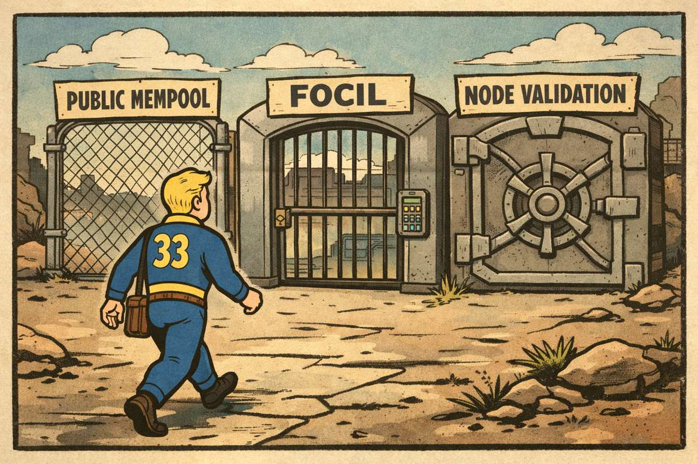
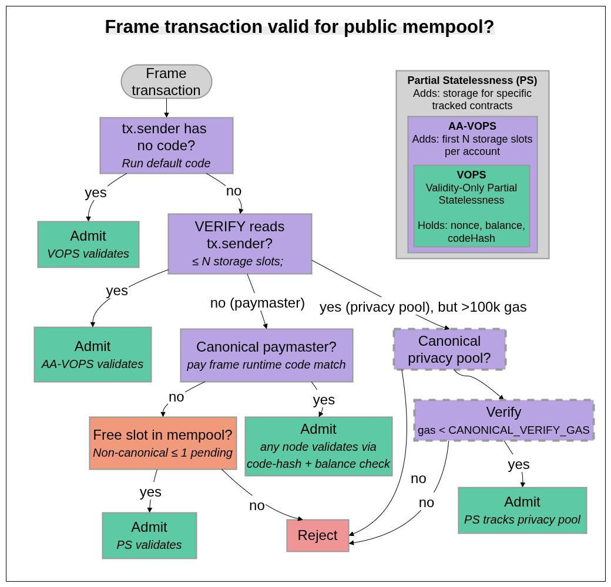

# Frame Transactions and the Three Gates to Privacy

> This post takes [EIP-8141][eip-8141] as given rather than arguing for or against it. The goal is to show how frame transactions could improve privacy protocols, and what would need to change in the public mempool rules and inclusion list enforcement to make that actually work.
> Many thanks to [Carlos](https://ethresear.ch/u/cperezz/summary), [Ben](https://x.com/ben_a_adams), [Milos](https://x.com/MorphNetrunner), and [Matt](https://x.com/lightclients) for feedback!

Frame transactions ([EIP-8141][eip-8141]) promise to eliminate relayers from privacy protocols. But the rules governing public mempool admission, [FOCIL][eip-7805] enforcement, and the statelessness roadmap each draw different boundaries around which transactions they support. This post analyzes where those boundaries intersect and where they conflict, particularly for privacy-preserving transactions.

## how frame transactions eliminate relayers

Privacy protocols like [Tornado Cash][tornado-cash] and [Railgun][railgun] break the on-chain link between depositor and withdrawer using zk-SNARKs. The withdrawal proves knowledge of a valid commitment in a Merkle tree without revealing which one. The problem: the withdrawer's address is fresh and holds no ETH for gas. Today, relayers (centralized, censorable third parties, often offline when needed) bridge this gap by sponsoring withdrawal transactions.

[EIP-8141][eip-8141] changes the economics. A frame transaction's `VERIFY` frame runs as a `STATICCALL`: read-only, no state mutations. If `VERIFY` reverts before payment is approved, the transaction is invalid at the protocol level, never enters a block, and no gas is charged to anyone. A privacy withdrawal becomes:

- **`VERIFY` frame** (with `tx.sender = pool`, so the frame targets the pool's own storage): reads publicInputs from the `SENDER` frame's calldata, verifies the Merkle root against the pool's stored history (`SLOAD`), confirms the nullifier hasn't been spent (`SLOAD`), and executes the Groth16 pairing check against those publicInputs. If everything passes, calls `APPROVE`.
- **`SENDER` frame**: marks the nullifier as spent, transfers the net amount to the recipient, and credits the fee to the sponsor inside the pool.

Crucially, fees no longer need to come from an external sponsor. The withdrawal itself can pay for execution: the `SENDER` frame can route a portion of the withdrawn funds to cover gas, removing the need for a pre-funded sender or third-party relayer. The sponsor's share stays in the pool as an internal credit, claimable later, so the withdrawal emits one outbound transfer instead of two.

| # | Mode | Subclass | Target | Caller | Flags | Data | Role |
|---|---|---|---|---|---|---|---|
| 0 | `VERIFY` | `only_verify` | pool (`null` → `tx.sender`) | `ENTRY_POINT` | `APPROVE_EXECUTION` | SNARK proof | Read `publicInputs` `(root, nullifier, recipient, amount, sponsor, fee)` from Frame 2 calldata, `SLOAD` `acceptedRoots[root]` and `!nullifierHashes[nullifier]`, verify proof, `APPROVE(APPROVE_EXECUTION)` |
| 1 | `VERIFY` | `pay` | sponsor | `ENTRY_POINT` | `APPROVE_PAYMENT` | (empty / sponsor policy data) | Introspect Frame 2: `target` = pool, selector = `withdraw`, encoded `sponsor` = self, encoded `fee` ≥ `MIN_FEE`. `APPROVE(APPROVE_PAYMENT)` — sponsor's ETH debited here |
| 2 | `SENDER` | `user_op` | pool (`null` → `tx.sender`) | pool (`tx.sender`) | `APPROVE_SCOPE_NONE` | `withdraw(publicInputs)` | Mark `nullifierHashes[nullifier] = true`, `ERC20.transfer(recipient, amount − fee)`, `sponsorCredits[sponsor][token] += fee` |

A sponsor's risk is zero for invalid proofs (`VERIFY` reverts, tx dropped) and zero for replayed proofs (nullifier already marked, `VERIFY` reverts). No trust needed, no relayer infrastructure, and no additional censorship surface.

## three gates to inclusion

A privacy-focused frame transaction's path to censorship resistance passes through three independent gates, each with its own constraints:

### gate 1: public mempool admission

EIP-8141's mempool rules, drawing from [ERC-7562][erc-7562] but stripping staking and reputation entirely, define what can propagate through the public P2P network:

- Validation prefix must match a [recognized pattern][eip-8141-prefixes] (`self_verify` or `only_verify` + `pay`, optionally preceded by `deploy`)
- `SLOAD` restricted to `tx.sender` storage only
- Total `VERIFY` gas capped at `MAX_VERIFY_GAS` (100,000)
- Banned opcodes: `TIMESTAMP`, `NUMBER`, `BLOCKHASH`, `BALANCE`, `SELFBALANCE`, `SSTORE`, `TLOAD`, `TSTORE`, etc.
- Canonical paymaster identified by exact runtime code hash, with timelocked withdrawals and node-side pending balance tracking
- Non-canonical paymasters limited to `MAX_PENDING_TXS_USING_NON_CANONICAL_PAYMASTER` (1) pending transaction each

Anything violating these rules is rejected from the public mempool but can still reach builders through alt-mempools or private channels.

### gate 2: focil enforcement

[FOCIL][eip-7805] guarantees transaction inclusion: 16 IL committee members per slot build inclusion lists from their view of pending transactions. Attesters only vote for blocks that include IL transactions (or demonstrate their invalidity at post-state).

For EOAs, FOCIL's omission check is a cheap `nonce`/`balance` lookup against `post-state`. For `FrameTxs`, the omission check requires replaying the `VERIFY` prefix. There is no cheap proxy because transaction validity depends on execution, not just sender state. The [FOCIL-frame-txs proposal][focil-frame] defines eligibility through five constraints:

1. **Validation-prefix ordering**: `VERIFY` frames must precede `DEFAULT`/`SENDER` frames
2. **Bounded per-tx `VERIFY` gas**: `verify_gas(tx) <= MAX_VERIFY_GAS_PER_FRAMETX` (100,000)
3. **Per-IL `VERIFY` budget**: cumulative `VERIFY` gas across an IL capped at `MAX_VERIFY_GAS_PER_INCLUSION_LIST` (250,000)
4. **Basic tx sanity**: `chain_id`, fees, no blobs
5. **Bounded state access**: `VERIFY` may only read `tx.sender` and payer account state (`balance`, `nonce`, code) plus their first `N` storage slots (`N` = 2-4), aligned with [AA-VOPS][vops] caching. Storage reads from any other contract render the transaction ineligible.

`FrameTxs` failing any constraint are excused from FOCIL enforcement: their omission cannot be held against a builder.

### gate 3: node validation capability

> Terminology:
> PS = Partial Statelessness: holding some state, not all
> VOPS = Validity-Only PS: holding enough state to validate txs from EOAs
> AA-VOPS = VOPS + a few storage slots per account

Post-ZKEVM, nodes won't need to hold the full state. [VOPS][vops] nodes, for example, store only ~`8.4 GB` (`nonce`, `balance`, `codeHash` per account). [AA-VOPS][vops] extends this by maintaining the first `N` storage slots for each account in the trie (so some `tx.sender` and payer slots are locally available for `VERIFY` replay). Partially stateful (PS) nodes additionally track storage for selected contracts. The node type determines which `VERIFY` frames it can replay locally, and therefore which transaction classes it can admit to its mempool and source into a FOCIL-like inclusion list:

| Capability  | Full node | PS node | AA-VOPS | VOPS |
|---|---|---|---|---|
| EOA `nonce`/`balance` check | Yes | Yes | Yes | Yes |
| AA wallet `VERIFY` (`tx.sender` storage) | Yes | If tracked | `N`-slot subset | No |
| Canonical paymaster admission (code-hash match + balance reservation) | Yes | Yes | Yes | Yes |
| Canonical paymaster VERIFY trace replay | Yes | If tracked | No | No |
| Privacy pool storage (roots, nullifiers) | Yes | If tracked | No | No |

A node that cannot validate a transaction type cannot maintain it in its mempool and should not include it in an IL. Censorship resistance for that class degrades with the fraction of capable validators. 

> See [Frame Transactions Through a Statelessness Lens][frame-statelessness] for a detailed analysis of which node types can support which [EIP-8141][eip-8141] mempool strategies.

## why privacy transactions fail all three gates

Privacy withdrawals fail all three gates under default parameters:

**gate 1 (public mempool)**: With `tx.sender = pool`, the `VERIFY` frame's `SLOAD`s on the pool's Merkle root history and `nullifierHashes` mapping satisfy the `tx.sender`-only storage restriction, but the Groth16 pairing check exceeds the `100k` `MAX_VERIFY_GAS` cap defined in `EIP-8141`'s [validation trace rules][eip-8141-trace]. Rejected.

**gate 2 (FOCIL eligibility)**: A Groth16 pairing check exceeds the `100k` per-tx `VERIFY` gas budget. Even with `tx.sender = pool` aligning the pool's storage with the bounded state access rule, the gas cap alone disqualifies the transaction. Excused from enforcement.

**gate 3 (node capability)**: [VOPS][vops] and [AA-VOPS][vops] nodes don't hold pool contract storage. Only PS nodes tracking the pool or full nodes can validate.

| Transaction type | Public mempool | FOCIL-eligible | VOPS | AA-VOPS | PS (tracking pool) |
|---|---|---|---|---|---|
| EOA frame tx (ECDSA/P256) | Yes | Yes | Yes | Yes | Yes |
| Smart wallet (`tx.sender` storage, <= `N` slots) | Yes | Yes | No | Yes | Yes |
| Canonical paymaster sponsored | Yes | Yes | No | No | If tracked |
| Privacy withdrawal | **No** | **No** | **No** | **No** | **If tracked** |

Privacy transactions are thus **excluded** from every default path to censorship resistance. The transactions most in need of censorship resistance are the ones the current design cannot protect.

This is not inevitable. The gap stems from how FOCIL enforces inclusion of `FrameTxs`, and the [FOCIL-frame-txs proposal][focil-frame] offers two approaches with very different implications for what can be enforced. The choice between them determines whether privacy-related `FrameTxs` have a path to censorship resistance or not.

## focil enforcement: two approaches

Both approaches address the same problem: how builders prove they didn't censor eligible IL `FrameTx`s, and how attesters verify those claims.

### append-loop approach

The [default approach][focil-frame] has the builder iteratively append excluded eligible IL `FrameTxs` to the block until no omitted `FrameTx` is valid at the final `post-state`. The cost is `O(k²)` in the number of excluded `FrameTxs`. This quadratic builder cost forces conservative parameters: `MAX_VERIFY_GAS_PER_FRAMETX` at `100_000` and `MAX_VERIFY_GAS_PER_INCLUSION_LIST` at `250_000`.

Assuming 25% adversarial IL committee (4 of 16 members, which occurs about once per month with a 1% stake share) and ~100-byte txs: each IL could fit ~81 txs within `MAX_BYTES_PER_INCLUSION_LIST` (`8 KiB`), but the per-IL `VERIFY` gas budget allows only 2 `FrameTxs` with `MAX_VERIFY_GAS_PER_FRAMETX` gas per IL (`2 * 100k = 200k <= 250k`). 4 malicious ILs yield `k=8` invalid `FrameTxs`. The append loop runs `k(k+1)/2 = 36` `VERIFY` replays: `3.6M` gas (~6% of block). Attester work: `4 * 250k = 1M` gas (~1.7%). The overhead is modest, but these parameters make FOCIL largely toothless for `FrameTxs`: `MAX_VERIFY_GAS_PER_FRAMETX` at `100k` excludes Groth16 proofs, PQ signatures, and any non-trivial validation logic, while `MAX_VERIFY_GAS_PER_INCLUSION_LIST` at `250k` caps each IL at just 2 full-gas `FrameTxs`. An IL with room for only 2 enforceable `FrameTxs` is barely enforcing account abstraction at all.

### validation-index approach

The [follow-up][focil-frame-index] eliminates the append loop. Instead, the builder *excuses* each excluded tx by publishing a `(tx_hash, claimed_index)` pair declaring the block index at which it became invalid. Attesters reconstruct state at `claimed_index` using Block Access Lists (`EIP-7928`) and replay the `VERIFY` prefix there. If `VERIFY` succeeds, the builder lied and the block fails IL conditions. Builder cost drops from `O(k²)` to `O(k)`. The trade-off is added protocol complexity: the index claims are an additional network artifact, `engine_newPayload` would need to accept them alongside IL transactions, and the EL would need to validate them accordingly.

With builder cost no longer the bottleneck, `MAX_VERIFY_GAS_PER_INCLUSION_LIST` can rise to `2^20` (~1M gas), and the per-tx cap becomes less critical since each excluded tx is validated once at its `claimed_index` rather than iteratively. The `2^20` per-IL would be high enough for transactions from privacy protocols to benefit from FOCIL's censorship resistance guarantees.

Same 25% adversarial scenario: each IL now budgets up to 10 `FrameTxs` at `100k` each (`10 * 100k = 1M <= 2^20`). Four malicious ILs * 10 = 40 excluded `FrameTxs`. Builder cost is linear: `40 * 100k = 4M` gas (~6.7% of block). Attester cost: `4 * 2^20 ≈ 4.2M` gas (~7%). Worst case across all 16 ILs: `16 * 2^20 = 2^24 ≈ 16.8M` gas (~28%). The ~4x increase in per-IL budget eliminates the quadratic builder blowup entirely.

## node capabilities as the limiting factor

The index approach opens a separation between public mempool rules and FOCIL enforcement. Public mempool rules must be strict because transactions may need re-validation after every block, so state dependencies must be small and deterministic. FOCIL under the validation-index approach replays `VERIFY` exactly once at a fixed `claimed_index`. No ongoing maintenance cost, which is what lets it afford broader state access and higher gas budgets. The flip side: FOCIL validation is on the attester critical path (within the `t=4s` attestation deadline), while mempool validation runs asynchronously. Higher `MAX_VERIFY_GAS_PER_INCLUSION_LIST` directly eats into attester time budgets.

This means IL committee members can source transactions from alt-mempools (including privacy-focused ones) and include them in their ILs, even if the default public mempool doesn't carry them. But for this to work for privacy txs, the bounded state access rule (reads limited to `tx.sender` and payer accounts) needs to be relaxed. And the nodes enforcing inclusion need the state to actually validate these transactions.

[AA-VOPS][vops] cannot bridge this gap. It caches `N` storage slots per account, which is enough for simple wallet validation (owner key, nonce) but not for privacy protocols. Privacy transaction-related `VERIFY` frames read pool contract storage (root ring buffers, nullifier mappings), not sender storage. No value of `N` fixes this: the reads target a different contract entirely. Even if AA-VOPS cached `N` slots for every contract, it wouldn't help: nullifier mappings are keyed by hash, so the accessed slots are unpredictable and spread across the storage trie.

## a canonical privacy pool

The most practical solution is a **canonical pool** pattern, analogous to the [canonical paymaster][eip-8141-paymaster]. A canonical contract, recognized by code hash, could serve as a shared registry for multiple privacy protocols: storing per-pool append-only Merkle roots and nullifier sets in a unified, auditable layout. Designed correctly, such a pool is safe for both the public mempool and FOCIL enforcement: `VERIFY` frames targeting this contract read exactly two storage slots: `acceptedRoots[R]` and `nullifierHashes[h]`, both at calldata-derivable keys. The access pattern is bounded, predictable, and *monotone*: every slot VERIFY reads only ever transitions `false → true`. Instead of requiring nodes to track N separate pool contracts, a canonical registry reduces the problem to one well-known address with a known storage layout, making partial statefulness for privacy practical at minimal cost.

Monotone state is what makes the design mass-invalidation-resistant. Today's privacy protocols use a rolling ring buffer of recent Merkle roots, evicting the oldest entry on every deposit. Under EIP-8141, that eviction is a mass-invalidation vector: a single deposit (or attacker spam) can rotate out a root that dozens of pending sponsored withdrawals depend on, evicting them all from the mempool simultaneously. Replacing the ring buffer with an append-only `acceptedRoots` mapping eliminates the vector entirely. A withdrawal proof generated against any historical root remains valid forever; the nullifier set already prevents double-spends, so accepting old roots is cryptographically safe. The only state change that can invalidate a pending withdrawal is a write to *its specific* `nullifierHashes[h]` slot, which requires possession of the note's secret. That's per-tx and individually targeted, never mass.

> One implementation detail: ring buffers for Merkle roots, as commonly used in today's privacy protocols, must be replaced with append-only mappings to avoid mass invalidation. In terms of size, that's unproblematic: e.g. the most commonly used Tornado Cash contract (1-ETH pool) had 81,881 deposits. That would be roughly 10.5 MB of raw key-value data (81,881 entries each in `acceptedRoots` and `nullifierHashes`, ~64 bytes per entry), or about 25–40 MB once stored in the state trie. A PS node tracking this pool commits to well under 50 MB of extra state, which is negligible compared to the ~8.4 GB VOPS baseline.

With 16 IL committee members per slot, [FOCIL][eip-7805] needs only 1-of-16 honest members to guarantee inclusion. But "honest" here also means "capable": a member who wants to include a privacy tx but runs a [VOPS][vops] or [AA-VOPS][vops] node simply cannot validate it. The 1-of-16 honesty assumption becomes a 1-of-16 *capability* assumption. PS nodes solve this. They don't need full state, just the contracts they care about. A PS node that tracks one canonical privacy pool adds a few MB at most. The infrastructure cost is negligible; the question is whether enough validators choose to do it.

> An alternative to canonicalizing privacy pools is to let transaction senders attach the required state (storage) along with Merkle proofs against the latest state root. This approach falls short for several reasons, most importantly because these proofs become invalid after every block and must be continuously recomputed.

## proposed changes

1. **extend the canonical-contract exception to privacy pools.** EIP-8141 already admits canonical paymasters by runtime code-hash match, exempting them from the strict public mempool rules because their state-dependency is known-safe.
2. **raise the per-tx `VERIFY` gas cap for canonical-contract frames.** `MAX_VERIFY_GAS = 100_000` isn't enough for Groth16 (~250k). Canonical contracts have a fixed verification path, so their worst-case `VERIFY` cost is a static property of the code hash. An invalid proof burns the same gas as a valid one and gets dropped, with no amplification. Keep 100k for generic frames; allow e.g. ~400k for canonical-contract frames, leaving enough room, and cap their number in the mempool
3. **adopt [validation-index FOCIL enforcement][focil-frame-index]**, accepting the added protocol complexity (`(tx_hash, claimed_index)` mappings) to eliminate the quadratic builder overhead that forces conservative gas budgets for `FrameTx`
4. **raise `MAX_VERIFY_GAS_PER_INCLUSION_LIST` to `2^20`** (=1M), letting individual txs with higher `VERIFY` gas (Groth16, PQ signatures) fit within per-IL budgets
5. **relax the bounded state access rule for canonical privacy pool contracts**, allowing IL committee members to source these txs from alt-mempools and making their inclusion enforceable by attesters running PS nodes that track these contracts

Together, these give privacy `FrameTxs` a viable path to censorship resistance: public mempool propagation under the canonical-contract exception, inclusion by PS-capable IL members, and FOCIL enforcement via the validation-index approach, without weakening DoS resistance for non-canonical `FrameTxs`.

> Similar arguments apply to **post-quantum transactions**. PQ signatures are large and expensive to verify, and 100k `VERIFY` gas isn't enough to cover it. Like privacy protocols, PQ txs would need an exemption from the flat cap, either by canonicalizing the verification contracts or by adding canonical precompiles.

The current public mempool rules for `FrameTxs`, VOPS and AA-VOPS are too rigid for privacy protocols. Canonicalizing privacy pools changes that. Recognizing them by code hash lets the public mempool safely validate their `VERIFY` frames, and PS nodes tracking a small set of high-value contracts (privacy pools, canonical paymasters) can build inclusion lists for them. What it buys is censorship resistance for the transactions that need it most. 

## appendix

### why alternative mempools fail

* **fragmentation doesn't compose**: Every tx needing heavier validation (privacy, PQ, etc.) might have to spawn its own alt-mempool. Node operators pick winners, peer counts supporting those thin out, and the weakest alt-mempool becomes the censorship vector for whatever depends on it. Without built-in incentives, alt-mempools only scale by asking volunteers to run them altruistically, potentially even requiring those to buy more powerful and expensive hardware.
* **anonymity set collapse**: The anonymity set degrades from "all Ethereum nodes" to "nodes supporting privacy mempools", and peer connections leak at the network layer.
* **trivially censorable at the network layer**: Bootstrap nodes, DNS records, and peer lists for a single-purpose alt-mempool are chokepoints an ISP or nation-state can drop with one rule. The public mempool is hard to censor because it's load-bearing for the whole network; an alt-mempool isn't. Privacy traffic ends up on infrastructure structurally easier to take offline than the relayer it replaced.
* **focil's 1-of-16 assumption breaks**: Timely inclusion only holds if at least one IL committee member peers with the alt-mempool *and* can validate the tx. The "1-of-16 honest" assumption becomes "1-of-16 honest, subscribed, and capable" which is a much weaker guarantee than [EIP-7805][eip-7805] promises. This is particularly problematic if IL builders are advertised as low-hardware nodes.
* **the relayer doesn't disappear, it just moves**: Alt-mempool txs still have to reach a builder. Bridging nodes that forward across the boundary are exactly the trust and censorship surface frame transactions were supposed to eliminate, one hop down the stack.

### frame tx <> public mempool decision tree:

### canonical privacy pool example

For an example canonical privacy protocol implementation (using pseudo code), check [this](https://github.com/nerolation/eip-8141-pseudo-privacy-pool-contract/blob/main/canonical_privacy_protocol.sol).

[eip-8141]: https://github.com/ethereum/EIPs/blob/master/EIPS/eip-8141.md
[eip-8141-prefixes]: https://github.com/ethereum/EIPs/blob/master/EIPS/eip-8141.md#public-mempool-recognized-validation-prefixes
[eip-8141-trace]: https://github.com/ethereum/EIPs/blob/master/EIPS/eip-8141.md#validation-trace-rules
[eip-8141-paymaster]: https://github.com/ethereum/EIPs/blob/master/EIPS/eip-8141.md#canonical-paymaster
[eip-7805]: https://github.com/ethereum/EIPs/blob/master/EIPS/eip-7805.md
[erc-7562]: https://github.com/ethereum/ERCs/blob/master/ERCS/erc-7562.md
[erc-7562-mass-invalidation]: https://github.com/ethereum/ERCs/blob/master/ERCS/erc-7562.md#definition-of-the-mass-invalidation-attack
[focil-frame]: https://ethereum-magicians.org/t/focil-native-account-abstraction/27999
[focil-frame-index]: https://ethereum-magicians.org/t/focil-native-account-abstraction/27999/2
[vops]: https://ethresear.ch/t/a-pragmatic-path-towards-validity-only-partial-statelessness-vops/22236
[frame-statelessness]: https://ethresear.ch/t/frame-transactions-through-a-statelessness-lens/24538
[tornado-cash]: https://tornadocash.eth.limo/
[railgun]: https://www.railgun.org/