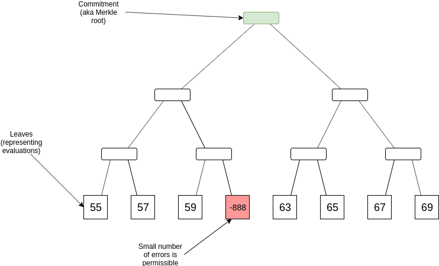
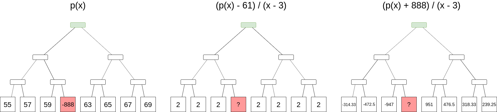
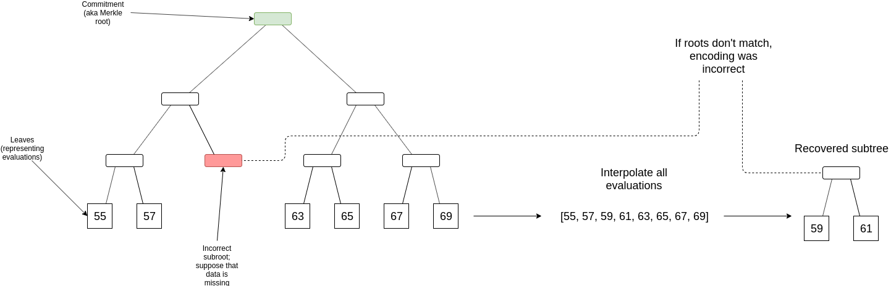

_Special thanks to Eli Ben-Sasson for discussions_

One lower-tech alternative to [using STARKs to prove](https://ethresear.ch/t/stark-proving-low-degree-ness-of-a-data-availability-root-some-analysis/6214) the correctness of a Merkle root is based around the underlying technology behind STARKs: FRI (see [here](https://vitalik.ca/general/2017/11/22/starks_part_2.html) for a technical intro).

To give a quick recap, the problem statement is that you have a Merkle root of $4n$ leaves (we'll use the number 4 for illustrative purposes; it could be any constant), which claim to represent a degree $< n$ polynomial evaluated at $4n$ points. The goal is to prove that a very large fraction of the points (eg. > 90%) actually are evaluations of the same polynomial.

For example, if $n = 2$, then one _completely valid_ evaluation set would be $[10, 11, 12, 13, 14, 15, 16, 17]$ (representing $y = x + 10$). An _almost valid_ evaluation set might be $[55, 57, 59, -888, 63, 65, 67, 69]$ (representing $y = 2x + 55$ except at one point), and an _invalid_ evaluation set might be $[80, 90, 100, 110, 4, 5, 6, 7]$.

 

FRI proves that an evaluation set is completely valid or almost valid by doing random sampling: it involves committing to a degree $\frac{n}{4}$ polynomial, checking the evaluations at a few dozen points to prove that in a certain sense the degree $\frac{n}{4}$ polynomial represents the same function (read [the intro](https://vitalik.ca/general/2017/11/22/starks_part_2.html) to understand this in detail), and then repeating until you get to a very low-degree polynomial that you can check directly. The possibility of admitting _almost_ validity (only 80-99% of points are correct) arises because it's very easy for a random check to miss any specific single point that might contain a mistake.

Now, suppose that we have a Merkle root that represents (maybe with a few mistakes) some polynomial $p(x)$, and we want to determine an evaluation at some position, _without the possibility of a mistake_. It turns out that we can do this, but it's more expensive than a simple Merkle branch. We need to use a "subtract-and-divide" trick: to prove that $p(z) = a$, we commit to a Merkle root of a set of evaluations of _another_ polynomial, $q(x) = \frac{p(x) - a}{x - z}$, and then make a set of queries (ie. provide a randomly selected set of Merkle branches) to the original set of evaluations and the new set to prove that they match (or almost-match), and then do a FRI proof on the new set to prove that it's a polynomial.

The trick here is that if $p(z)$ is _not_ $a$, then $p(x) - a$ is not zero at $z$, and so $x - z$ is not a factor of $p(x) - a$, so the result would be an expression with a quotient, and not a polynomial.

 

Notice how even if we are trying to obtain the evaluation at the position where the original data is incorrect, the correct evaluation leads to a well-formed $q(x)$ and the original incorrect evaluation leads to a poorly-formed $q(x)$. In this case, since $p(x)$ is only a degree-1 polynomial, $q(x)$ will be a deg-0 polynomial, or a constant; in other cases $q(x)$ will generally have a degree 1 less than $p(x)$.

Evaluating _at_ the position $x=z$ is more difficult since simple pointwise evaluation gives you $\frac{0}{0}$, but we can just ignore this and put any value as almost-correct evaluations will generally still pass FRI.

One approach would be to use this technique as our evaluation proving scheme directly instead of Merkle proofs. But the problem here is that FRI proofs are big (~20 kB for big inputs) and take linear time to produce. So what we will do instead is use FRI as a _fraud proof_.

### FRI as fraud proof

Suppose, as in the data availability check setting, that an honest node attempting to make a fraud proof has $> \frac{1}{4}$ of some data $D$ that is an erasure-code extension of some underlying data $D^{*}$ (ie. it's a $deg < |D^{*}|$ polynomial where the first quarter of the evaluations are $D^{*}$ and the rest can be used to recover $D^{*}$ if parts of $D^{*}$ are missing). The node uses the $> \frac{1}{4}$ of $D$ that it has to recover the rest of $D$, and realizes that the Merkle root of the provided $D$ and the Merkle root of the reconstruction do not match, ie. the $D$ provided has errors. The challenge is: can the node prove that this is the case without providing the entire $> \frac{1}{4}$ of $D$ in its possession?

We solve this as follows. When performing data availability checks, we require _clients_ to do one extra step. In addition to randomly sampling $k$ Merkle branches (eg. $k = 80$), they also ask for the middle level of the tree (ie. the level where there are $\sqrt{|D|}$ nodes where each node is itself a sub-root of $\sqrt{|D|}$ data). This ensures that for any blocks that clients accept, this data is available.

If a checker node downloads $> \frac{1}{4}$ of $D$ (from the responses rebroadcasted by clients making samples), and its finds that the Merkle root of the reconstructed $D$ does not match the original Merkle root, then this implies that there is some position where the original data gives an incorrect value. The checker node downloads the middle layer of the tree (guaranteed to be available because clients asked for it before accepting the block), and finds one sub-root in this layer which differs from the sub-root of the data that they reconstructed; at least one such discrepancy is guaranteed to exist.

 

Let $x_1 ... x_n$ be the set of positions inside this faulty sub-root, and $y_1 ... y_n$ be the "correct" evaluations that the checker node computes. The checker node computes an _interpolant_ $I(x)$, which is the $deg < n$ polynomial that evaluates to $y_i$ at $x_i$ for every $x_i$ in this set. This can be computed using Lagrange interpolation, though if we are clever we can specify the coordinates in the tree such that any subtree is a multiplicative subgroup shifted by a coordinate so that we can compute the interpolant using an [FFT](https://vitalik.ca/general/2019/05/12/fft.html) (the explicit construction for this would be for the positions to be powers of a generator $\omega$ sorted by the exponent in binary form with bits reversed, so [$1$, $\omega^4$, $\omega^2$, $\omega^6$, $\omega$, $\omega^5$, $\omega^3$, $\omega^7$] if $|D| = 8$).

Let $p(x)$ be the polynomial that $D$ almost-represents. We will prove that $((x_1, y_1) .. (x_n, y_n) \in p(x)$ by committing to $q(x) = \frac{p(x) - I(x)}{(x - x_1) * ... * (x - x_n)}$, and then proving two claims: (i) $q(x)$ matches $p(x)$ at some randomly selected points, and (ii) $q(x)$ is a polynomial (or almost-polynomial). The fraud proof then consists of the set of evaluations $((x_1, y_1) .. (x_n, y_n)$, sets of probabilistic checks to prove the two claims, along with a Merkle path to the _incorrect_ root in $D(x)$; verifying the proof would involve verifying the checks, and then verifying that the _reconstructed_ root of $((x_1, y_1) .. (x_n, y_n)$ and the _provided_ root inside of $D$ do not match.

One important and subtle nuance here is that for the $q(x)$ vs $p(x)$ check to be sound, we need to randomly sample positions from $D$, but the checker only has at least $\frac{1}{4}$ of $D$, and so will generally not be able to successfully provide $p(x)$ responses for the challenges in the proving process. There are two solutions here.

First, the checker node can masquerade as a client and ask the network for samples; the attacker publishing $D$ would have to provide the desired values in $D$ to convince the "client" that the block is available.

Second, we can require the checker to have a larger fraction of $D$, eg. at least $\frac{1}{2}$, and then prove a probabilistic claim: $q(x)$ matches $p(x)$ on at least 40% of the sampled claims. Making this proof would require hundreds of queries for statistical soundness reasons, but the proof is already $\sqrt{|D|}$ sized so this would not make it _that_ much bigger; also, a Bayesian verification scheme can be used that automatically terminates earlier if a checker successfully answers more queries, which would happen in the usual case where they have much more than 50% of the data. A valid $D$ would not match an invalid $q(x)$ on more than 25% of positions, so a malicious checker would not be able to generate a fraud proof for valid data.

### FAQ

* Why make $I(x)$ from a $\sqrt{|D|}$ sized set of evaluations, why not check a single point? Answer: because we are not guaranteed to have the attacker's provided value at any specific single point, but by checking the middle leaves we _are_ guaranteed to have the attacker provide a hash of the set of values within each $\sqrt{|D|}$ sized range, so we can prove against that. Also note that concretely in the eth2 implementation, "chunk roots" _already are_ these sub-roots.
* Why is this better than the [2D erasure code scheme](https://arxiv.org/pdf/1809.09044.pdf)? Because the number of checks clients need to make is smaller, and the complexity is more encapsulated; fraud proof generation and verification is complex but it is a self-contained pure function, and otherwise the data is just a simple single-dimensional Merkle root. Also it is more compatible with upgrading to STARK-based Merkle roots in the future.