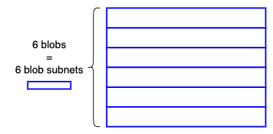
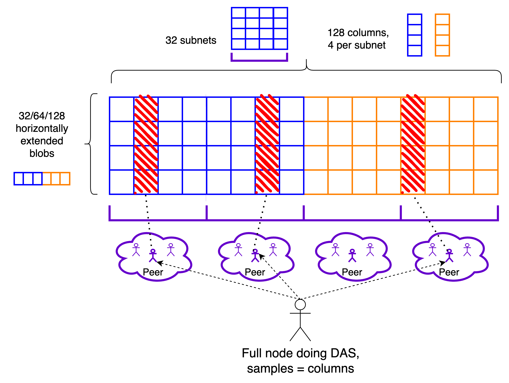
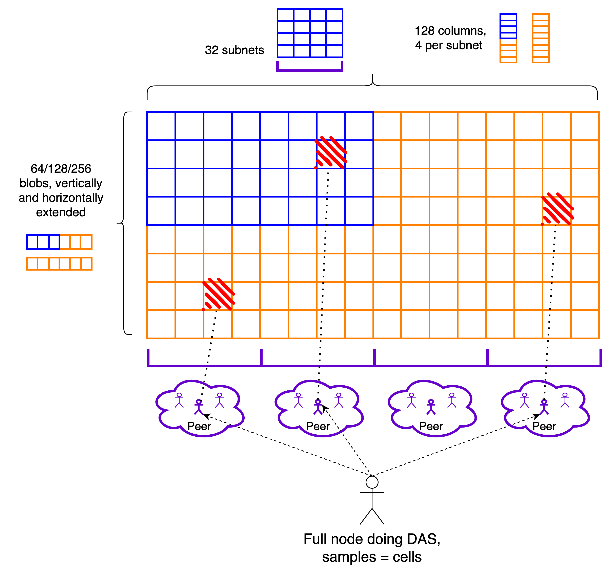

*This post stems from ongoing discussions between many researchers and client devs on the approach to scaling of the DA layer beyond EIP-4844, and is meant to summarize and make accessible some of the prevailing ideas. [PeerDAS](https://ethresear.ch/t/peerdas-a-simpler-das-approach-using-battle-tested-p2p-components/16541) is a recommended first read.
Thanks to Danny Ryan, Ansgar Dietrichs, Dankrad Feist, Jacob Kaufmann, Age Manning, Csaba Kiraly, Leonardo Bautista-Gomez for feedback and discussions.*

EIP-4844 is the first milestone in the quest of scaling the data availability layer of Ethereum. It introduces a new type of resource, blob data, with its own independent fee market, as well as many of the cryptographic components (KZG ceremony, commitments and proofs) required by Data Availability Sampling (DAS). For the time being, full nodes still download all the data, and the scalability gains of 4844 are due to two factors:
- The independent fee market, which prevents blob data and execution from being competing resources. This ensures that the desired blob data throughput is achieved, regardless of how much demand there is for L1 execution.
- The pruning of blobs after a few weeks, which makes the additional storage cost fixed instead of increasing over time.

Increasing the throughput further, while maintaining or lowering the resource requirements, would require that only a portion of the data is downloaded by each node, which means introducing some form of DAS, as is the goal of the Danksharding proposal. Given its ambitious nature, we think it is best to further break down the road from 4844 to Danksharding into more manageable steps, reducing the complexity and risk of each upgrade and allowing us to gradually scale the data layer throughput. 

A possible path goes through intermediate stages, where we gradually introduce all cryptographic and networking components, and gradually obtain more scalability and feature-completeness, while *at most minimally increasing the bandwidth requirements compared to 4844*. A first step might be to introduce a 1D DAS construction, based on PeerDAS, which reduces the complexity and still allows for a substantially greater throughput than 4844. The transition to the final 2D construction is then in principle relatively simple, and can be enacted once all the cryptographic components are ready. Alongside these two larger upgrades, features like distributed reconstruction can be introduced whenever ready, and the throughput can be gradually scaled up to the theoretical maximum as the networking improves and as we gain confidence from observing the system working as intended. From the perspective of both rollups and their users, it should all be perceived as a gradual increase in the number of blobs, much like a gradual gas size increase on the execution layer.

## Stages at a glance

- **Stage 0: EIP-4844**. Subnets are introduced for distributing blobs, but nodes have to participate in all of them, downloading all the data. No DAS.

- **Stage 1: 1D PeerDAS**. Blobs are 1D extended, horizontally. Blob distribution is sharded: column subnets are introduced, and nodes only participate in a subset of them. Blob/row subnets may be deprecated at this point. The networking components of peer sampling are introduced: discovery of sampling peers and peer sampling through a req/resp protocol. Nodes do DAS on columns, and the number of column subnets that they participate in is chosen such that a node's peer set can reliably cover all columns. Within this stage, we might expect the maximum blob count to gradually increase from 32 to 64 to maybe 128.

- **Stage 2: 2D PeerDAS, or full Danksharding**. We implement full Danksharding, with the sampling infrastructure in particular being peer sampling. Blobs are 2D extended, adding the vertical extension. Peer sampling now utilizes cells in the extended matrix instead of columns, becoming lightweight, with negligible bandwidth consumption. Light sampling nodes that do not participate in distribution may be supported. Distributed reconstruction, if/when implemented, becomes more robust to subnet failures. Within this stage, we can expect the blob count to start at 64 or maybe even 128 and gradually increase up to the full Danksharding max throughput of 256.

- **In parallel:**
    - *Distributed reconstruction:* can be implemented at any point whenever ready, either in the 1D or 2D stage. In the 1D stage, we would reintroduce row subnets and allow propagation of individual cells within them, so that blobs may be reconstructed and re-seeded. In the 2D stage, this would also apply to column subnets, resulting in a system which is robust to failures of individual subnets (the lack of vertical redundancy in a 1D construction means that the failure of a row subnet prevents reconstruction altogether). Until it is implemented, reconstruction would rely on nodes that download the *whole* data, reconstruct it locally and re-seed it.  Especially at the initial lower blob counts (32 to 64) this is a quite accessible task, and thus not much of an assumption. In any case, we only rely on a 1/N honesty assumption.
    - *Networking improvements:* most important for peer sampling is supporting higher peer counts, as this addresses its main short-term scaling bottleneck (the long term one being distribution). We can perhaps also eventually support a lighter kind of sampling-only peer with very limited overhead besides occasional pinging, in principle letting nodes have access to the whole network when looking for samples.
    - *R&D on future scaling*: we might at some point want to change the sampling machinery or introduce alternative sampling paths to complement peer sampling, e.g. using a DHT, for greater resilience and less dependence on sampling providers. Still, further scaling (a better ratio of throughput to bandwidth) requires improvements in the data distribution phase, because that's the bandwidth bottleneck, especially once we move to a 2D construction. Some gains might come from improvements in the subnet infrastructure itself, but there are limits to what can be achieved here, because a subnet density of 1/n (1 in n nodes is in each subnet) requires nodes to download 1/n of the whole data. A more radical redesign would be required to improve on this.

## Stage 1: 1D PeerDAS

#### Data format

Blobs are individually extended horizontally, stacked vertically and subdivided in `NUM_COLUMNS` columns, which are used as the sampling unit. `NUM_COLUMNS` determines the maximum column size, and thus how much bandwidth is consumed by sampling (for a given soundness, i.e, number of samples). In the following, I am mostly going to consider the example parameter `NUM_COLUMNS = 128`, which implies a maximum sample size of $256*b/128 = 2b$ KBs, for `MAX_BLOBS_PER_BLOCK = b` (extended blobs are 256 KBs). 

#### Distribution

Each column is mapped to one out of `NUM_COLUMN_SUBNETS` GossipSub topics, which we refer to as column subnets, where it is distributed. Row subnets can likely be deprecated for the time being, and reintroduced whenever distributed reconstruction is implemented. We ask each node to participate in *at least* `CUSTODY_REQUIREMENT` column subnets. `CUSTODY_REQUIREMENT/NUM_COLUMN_SUBNETS` then dictates the minimum fraction of data that each node custodies, which is also the minimum subnet density. As we'll see, this is the most important component of the bandwidth consumption, because it incurs the amplification factor of GossipSub topics (while sampling through req/resp does not) and because sampling becomes eventually extremely cheap when moving to a 2D construction.

From the perspective of subnet density, a safe choice for this ratio might be $1/64$, since we already have experience with this subnet density in attestation subnets, but we might well be ok with $1/128$. On the other hand, as we soon see in [this section](#Scaling-peer-sampling), peer sampling is much more viable if this ratio is high, even better if with `NUM_COLUMN_SUBNETS` as small as possible, i.e., with `CUSTODY_REQUIREMENT = 1`. We might then start with `NUM_COLUMN_SUBNETS = 32`,` CUSTODY_REQUIREMENT = 1`.

*Note: for a given ratio, one possible reason to set `CUSTODY_REQUIREMENT` > 1 could be that `1/NUM_COLUMN_SUBNETS` determines the minimum "custody unit", and we might want nodes to have more flexibility in the amount they custody (beyond the required minimum). For example, with `NUM_COLUMNS = 128`, `NUM_COLUMN_SUBNETS = 32` and `CUSTODY_REQUIREMENT = 1`, the minimum custody unit (in this case corresponding with the minimum required custody) is 4 columns, and a node that wants to custody more than the minimum would have to custody 8, then 12 etc... With `NUM_COLUMN_SUBNETS = 64`, `CUSTODY_REQUIREMENT = 2`, the ratio is still 1/32 and the minimum required custody is still 4 columns, but the minimum custody unit is only 2 columns, so that it is possible to custody 6,8,10 etc... Another reason to have `CUSTODY_REQUIREMENT` > 1 is that the distribution phase then already provides some meaningful security guarantees on its own, before sampling, as we'll see in [this section](#Tradeoff-between-subnet-sampling-and-peer-sampling).*

#### Peer sampling 

As in [the PeerDAS post](https://ethresear.ch/t/peerdas-a-simpler-das-approach-using-battle-tested-p2p-components/16541), samples are obtained from peers through req/resp., except here samples are entire columns, or more precisely *a column sidecar object*. In [this section](#Network-level-validation), we discuss the details of this object, including the accompanying data that allows its verification.  Peers are chosen based on the columns they custody, which can be determined from their ENR, as a function of the *amount* of subnets they claim to be in (which could be more than the required minimum), of their node ID and potentially of the epoch.

#### Scaling peer sampling

The throughput achievable by PeerDAS does not depend only on the available bandwidth, but also on the composition of the peer sets of full nodes, because a node's peer set should cover all samples, ideally with plenty of redundancy to account for unreliable or even plainly malicious peers. Covering all samples requires covering all subnets, so the `NUM_COLUMN_SUBNETS` which can be supported by peer sampling depends on how many peers nodes have, and how many subnets they each participate in. This is precisely why we might want to keep `NUM_COLUMN_SUBNETS` rather low, lower than what we would need just to keep a sufficiently high subnet density. *This may be a limiting factor in the number of blobs we can support*, because it creates a higher floor on the bandwidth required for distribution. In practice, it might mean that we need to increase the throughput (number of blobs) gradually, as networking optimizations allow for higher peer counts, perhaps even through the introduction of a lighter type of sampling peer with very limited overhead.

Note, however, that we can likely scale PeerDAS close to its theoretical limit from day 1, if we are comfortable with relying on there being a small number of honest supernodes or partial supernodes, i.e., nodes that custody more than the required minimum or even all of the data. More generally, a more realistic understanding how far we can scale peer sampling requires taking into account the heterogeneity of the nodes on the network, which affects the amount of data they are willing to custody and serve. In a very heterogenous network, we can get away with much lower peer counts for average nodes. As already anticipated, in the following I am going to assume that `NUM_COLUMN_SUBNETS = 32`, `CUSTODY_REQUIREMENT = 1` are in practice a viable set of parameters.

#### Tradeoff between subnet sampling and peer sampling

By subnet sampling, we mean setting `CUSTODY_REQUIREMENT` high enough that the distribution phase already gives certain security guarantees, *before even getting to peer sampling* (or indeed without peer sampling at all, as is the case in [SubnetDAS](https://ethresear.ch/t/subnetdas-an-intermediate-das-approach/17169)). In particular, we get the guarantee that only a small percentage of nodes will receive all data on the subnets they are participating in, if less than 50% of all columns are available. In other words, *even in the distribution phase*, only a small percentage of nodes can be tricked into thinking that unavailable data is available.

Here, what "small percentage" means very much depends on `CUSTODY_REQUIREMENT`. For example, say the adversary makes columns [0,59] available, slightly less than half. With `CUSTODY_REQUIREMENT = 1` and `NUM_COLUMN_SUBNETS = 32`, honest nodes in the first 15 subnets would receive all sidecars and vote for the associated block, so almost 1/2 of all honest voters would at first vote for an unavailable block. Generally, even a naive adversary can easily trick $2^{-k}$ of all honest nodes for `CUSTODY_REQUIREMENT = k`, so getting any meaningful security from the distribution phase requires `CUSTODY_REQUIREMENT` to be at least $\ge 4$. This might still not be enough against an adaptive adversary, which chooses exactly which portion of the data to make available by observing the exact distribution of nodes on the subnets, as discussed [here](https://ethresear.ch/t/subnetdas-an-intermediate-das-approach/17169#global-safety-15). In that case, an upper bound on the fraction of honest nodes which can be tricked for `CUSTODY_REQUIREMENT = 4` and `NUM_COLUMN_SUBNETS = 128` is roughly 20%. With `CUSTODY_REQUIREMENT = 6`, this would be less than 10%. 

In principle, we can always increase `CUSTODY_REQUIREMENT` and `NUM_COLUMN_SUBNETS` by the same factor, keeping the same ratio, and thus the same subnet density and the same bandwidth consumption for distribution, while increasing the security guarantees of subnet sampling. There is however a tradeoff with the viability of peer sampling: even if we keep the ratio the same, increasing `NUM_COLUMN_SUBNETS` means increasing the amount of honest peers that a node needs in order to cover all subnets, because there are more overlaps. At lower peer counts, this might make it hard to support a `CUSTODY_REQUIREMENT` which gives a meaningful level of security, which has some consequences on the fork-choce and confirmation rule, as we now see.

#### Fork-choice
We need to change the `is_data_available` function. One possibility is to do the following at slot $n$:
- To determine the availability of blob data associated with a block *from slot $n$*, we use the availability of the data in the column subnets we participate in: if we have received all sidecars, we consider the data to be available.
- To determine the availability of blob data associated with a block *from a slot $< n$*, we use the peer sampling result: if we have obtained all requested samples, we consider the data to be available.

This way, the proposer of slot $n+1$ has at least 8s (the time between the attestation deadline and the next slot) to perform peer sampling, whereas the attesters of slot $n$ just have to receive the block and the associated column sidecars by the attestation deadline, much like with blob sidecars in 4844.

##### Possible fork-choice attack vectors

The downside of employing this trailing DA filter, *while having a low* `CUSTODY_REQUIREMENT`, is that votes on the most recent block cannot be fully trusted, because many honest validators might be tricked into voting for a block whose associated data is unavailable, for the reasons we discussed in the previous section. This would of course only be temporary, as no honest voters would continue voting for such a block in future slots, if the data stays unavailable and peer sampling fails. Nonetheless, some subtle fork-choice attacks are possible, such as this one:
1. Blob data associated to a block B proposed at slot $n$ is released in a targeted way, so as to get many honest attesters to vote for block B even while the blob data is not actually available, exploiting the low `CUSTODY_REQUIREMENT`.
2. The proposer slot $n+1$ does peer sampling, sees that the data is unavailable and proposes a block B' which does not extend block B.
3. The data associated to block $B$ is meanwhile made available, and attesters of slot $n+1$ do not vote for B', because it does not extend B, which is available and has a lot of support from the attesters of slot $n$. 

To completely prevent or make this attack harder (requiring the attacker to control more attesters), we can require attesters of slot $n+1$ to remember the outcome of peer sampling by some time before the end of slot $n$, for example 10s into slot $n$, and to use that outcome in their fork-choice at slot $n+1$ unless it disagrees with the proposed block. If you are familiar with consensus research for Ethereum, this should remind you of the [view-merge technique](https://ethresear.ch/t/view-merge-as-a-replacement-for-proposer-boost/13739), although with a lot less complexity because no additional messages are required from the proposer. The downside of doing this is that we tighten the window to perform peer sampling. 

#### Bandwidth requirements

Let's say that the target and max bandwidth constraints are the same as with 4844, i.e., we want to on average require the equivalent of 3 blobs per slot, and a max of 6 blobs per slot. With the amplification factor of 8x, this corresponds to a target/max of ~$3/6$ MBs/slot. With `MAX_BLOBS_PER_BLOCK = b`, let's consider the max bandwidth consumption for a node participating in the minimum `CUSTODY_REQUIREMENT = 1` subnets, each containing four columns:
- *Column distribution:* since distribution happens through GossipSub topics, it incurs the amplification factor, just like blob subnets in 4844. Each cell is $256/128 = 2$ KBs, each column $2b$ KBs. With `MAX_BLOBS_PER_BLOCK = 64`, columns are then 128 KBs, so propagation of a column is equivalent to propagation of a blob in 4844. One subnet then takes up four blobs in our budget.
- *Peer sampling:* the leftover bandwidth budget is the equivalent of two blobs, or $2*128*8 = 2048$ KBs (factoring in the amplification factor). This is enough for up to $k = 2048/128 = 16$ samples, since sampling in PeerDAS is through req/resp, and thus does not suffer from an amplification factor. This gives a soundness of $2^{-16}$ when a node is not specifically targeted by the attacker, and otherwise gives the global security guarantee that no attacker could convince more than $\approx 2$-$3$% of the nodes that unavailable data is available (see [here](https://www.desmos.com/calculator/aodld2j4gq) and the [SubnetDAS post](https://ethresear.ch/t/subnetdas-an-intermediate-das-approach/17169#global-safety-15) for more explanations). These security guarantees are arguably quite sufficient, and we do not need to sample more.

A few comments:
- `MAX_BLOBS_PER_BLOCK = 64` is 10x the current throughput of 4844, and it is entirely within the bandwidth budget without requiring a high `NUM_COLUMN_SUBNETS`, which means we do not need to be particularly concerned about the viability of peer sampling, or too much reliance on sampling providers. A safe path could be to start from an `MAX_BLOBS_PER_BLOCK = 32` and gradually scale up to 64 as we are sure that the network can handle the load.
- Scaling up to `MAX_BLOBS_PER_BLOCK = 128` might require increasing `NUM_COLUMN_SUBNETS` to 64. Supporting this high of a blob count would then likely be highly dependent on the presence of many supernodes in the network, and/or require supporting much higher peer counts.
- At this point, distribution and sampling contribute similarly to the bandwidth load. The impact of sampling can be reduced if we increase`NUM_COLUMNS`, e.g., `NUM_COLUMNS = 512` means sampling consumes half a blob with `MAX_BLOBS_PER_BLOCK = 64` and one blob with `MAX_BLOBS_PER_BLOCK = 128`, 8x less than distribution. If we're ok with a 50% bandwidth increase from 4844, up to a max of 9 blobs, this is already enough to support `MAX_BLOBS_PER_BLOCK = 128` without increasing `NUM_COLUMN_SUBNETS`. Moreover, the bandwidth used by sampling can be made sublinear in the throughput (and effectively negligible) by moving to the 2D construction. This leaves distribution as the ultimate bottleneck, scaling linearly with data throughput (for a minimum subnet density).

#### Network-level validation

As seen in [PR#3531](https://github.com/ethereum/consensus-specs/pull/3531), we want to be able to perform network-level validation during the distribution phase, *without necessarily waiting for the block to arrive*. This way, propagation of the block and of sidecars can actually happen in parallel, rather than the latter having to wait for the former. Ideally, we would like to inherit the slashability guarantees of the block, meaning that the proposer (nor anyone else) cannot propagate sidecars that do not match the commitments in the block without double signing, not even to nodes that have not yet received the block. In EIP-4844, the current solution (from the above PR) is to include the relevant `kzg_commitment` in the blob sidecar, together with a `kzg_proof`, as well as the block header and an inclusion proof against its `body_root`, showing that `kzg_commitment` is indeed contained in the `blob_kzg_commitments` list in the block body. This way, verification just involves checking the kzg proof, which ensures that `kzg_commitment` matches the blob, and the inclusion proof. Slashability guarantees are inherited from the header.

Here we can follow a very similar strategy, aiming to distribute headers, commitments and inclusion proofs separately from the block. We can adapt the current approach for blob sidecars to column sidecars, i.e., to the objects which are distributed on column subnets. In this case, each column sidecar needs to contain *all* of the commitments, because they're all necessary to its verification. It would also contain the header, an inclusion proof, proving the inclusion of `hash_tree_root(blob_kzg_commitments)` in `body_root` (i.e., inclusion of the whole list of commitments, rather than of a specific one. This proof has depth 4), and all cell proofs for the column. The commitments and proofs can then be used to batch-verify the column. 

The advantage of this approach is that a column sidecar has no external dependencies, and can therefore be verified and forwarded as soon as received, meaning that the propagation a of block and the associated columns can truly happen in parallel. For the same reason, sampling can begin immediately, without waiting for the block or for other column sidecars to arrive. 
The disadvantage is that header, inclusion proof and commitments are replicated within each column. Though, note that the first two are negligible and that each column only gets an additional 48 bytes per row from the commitments, as well as another 48 bytes per row from the cell proofs. With `NUM_COLUMNS = 128`, a cell is 2 KBs, so this is roughly a 5% increase in bandwidth. Note also that the inclusion proof only needs to be checked once, not once per column, so the only penalty is really the minor increase in bandwidth.

#### Transition

Being ready to transition from Stage 1 to Stage 2 mostly requires well understood components, i.e., GossipSub topics (aka subnets), used for distribution, and req/resp between peers, used for sampling. Most of the changes do not require a hard fork, because they are either in the networking or in the fork-choice. The only change which does is increasing the blob count, which could also happen after all of the other changes are already in place, i.e., we could transition from Stage 0 to Stage 1 while still having the 4844 blob count of 3/6, and only later increase this. In practice, we would want to perform the networking and fork-choice changes at a coordination point regardless, so it likely makes sense to have all changes be bundled with a hard fork. Once the first transition to Stage 1 has happened, we are free to gradually increase the blob count in any subsequent hard fork (or with some other mechanism, if desired).

## Stage 2: 2D PeerDAS

#### Data format and distribution

Blobs are extended both horizontally and vertically. The resulting rectangle is still subdivided into `NUM_COLUMNS` columns, and samples are now cells, the intersection of rows and columns, as in the Danksharding construction. Nothing changes in the distribution.

#### Peer sampling 

Sampling still utilizes the same networking building blocks, i.e., discovery of a diverse set of peers, with respect to the subnets they participate in, and req/resp to sample from them. The only difference is in what the requested objects are, i.e., cells instead of columns. Cells come with the accompanying proof, to be verified against the KZG commitment of the respective row.

#### Bandwidth requirements

Let's consider `MAX_BLOBS_PER_BLOCK = 256`, which would achieve the originally planned Danksharding (max) throughput of 32 MBs/slot, though in practice we would likely gradually increase the blob count to get to this point. At this point, let's assume we are able to increase `NUM_COLUMN_SUBNETS` to `64`, perhaps because of increased peer counts. 

Each subnet would then contain two columns, each of which weighs 1 MB. Still, a column sidecar would only weigh 0.5 MBs, because it can just contain the first half of the column, while the rest can be reconstructed locally by the receiver. Doing so consists of one FFT of size $2^{14}$ to go from evaluation form to coefficient form, and another FFT also of the same size to recover the evaluation form for the extension ([~4ms in arkworks](https://zka.lc/)). A column subnet then consumes the equivalent of 8 blobs of bandwidth budget, a small increase from the 6 of 4844. The propagation dynamics are likely somewhat different due to there being fewer, larger objects, though this is something we could easily change by increasing `NUM_COLUMNS`.

The total bandwidth required by sampling is just $2k$ KBs, because samples weigh only $2$ KBs instead of the $2b$ KBs from the 1D construction. As anticipated, even with $k = 75$ (which gives soundness of $\approx 2^{-30}$), the bandwidth for sampling is therefore essentially negligible compared to what is required by distribution.

#### Network-level validation

The same approach as in Stage 1 works here. Even with the vertical extension, the number of proofs and commitments that needs to be sent along with a column sidecar is in principle unchanged, because both proofs and commitments for the second half of the column can be reconstructed with a linear combination of those for the first half, due to both proofs and commitments being homomorphic. Although, we might choose to still send all proofs to avoid the reconstruction step, in which case a column sidecar would now contain $2b$ proofs, resulting in 2.5% of additional bandwidth consumption (for `NUM_COLUMNS = 128`).

#### Transition

Being ready to transition from Stage 2 to Stage 3 requires an efficient implementation of the 2D cryptography, though *this mainly affects the block production process*. There is also a small change in peer sampling, as the objects which are exchanged through the req/resp protocol change from columns to cells. In principle, a hard fork is again only required to increase the throughput, because blocks still only contain the same list of KZG commitments, i.e., the ones corresponding to actual blobs and not to extension rows (as already mentioned, we can reconstruct the latter from the former). We would still need all changes to happen at a coordination point, so they would likely still be coupled with a hard fork.