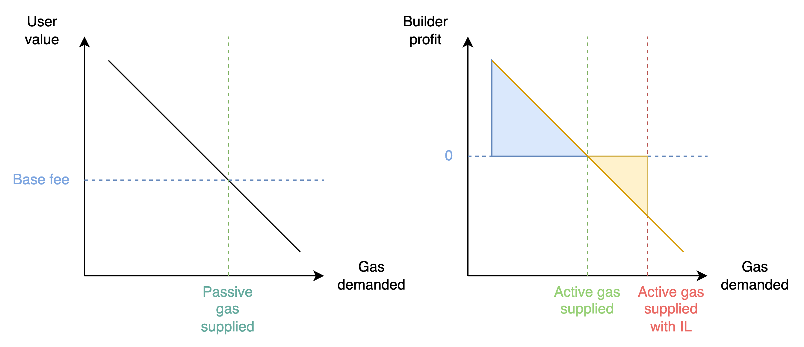

******************Acknowledgements:****************** Previous research with [Georgios Piliouras](https://people.sutd.edu.sg/~georgios/), @daniel_sg @sleonardos and [Manvir Schneider](https://twitter.com/manv_sc) informed the exposition. Many thanks to @Julian, @potuz, @terence, @Nero_eth, @casparschwa, @fradamt, @vbuterin and @mikeneuder for reviews and comments. 

---

Inclusion lists (ILs) are a mechanism aimed at improving censorship-resistance of a chain. They are designed to be non-invasive, such that their satisfaction cannot hurt an honest block producer who is subjected to them. In the following, we show that necessary constraints on their design may induce games or socially undesirable behaviours from rational proposers and builders.

## Model and assumptions for inclusion lists

In the presentation, we do not focus on technical details of implementation (reviewed [here](https://ethresear.ch/t/no-free-lunch-a-new-inclusion-list-design/16389?u=barnabe) by Mike and Vitalik, with variations offered by Toni [here](https://ethresear.ch/t/cumulative-non-expiring-inclusion-lists/16520?u=barnabe)), and assume the availability of a mechanism fulfilling the following conditions:

1. A validator assigned to propose a block at slot $n$ may create an **inclusion list** applicable to the proposer of slot $n+1$
2. The proposer of slot $n+1$, in the presence of an inclusion list $L$, must satisfy either one of the following block validity conditions:
    1. All transactions from $L$ are included in block $n+1$, OR
    2. The gas remaining in block $n+1$ does not allow for further inclusion of any more transaction from $L$, i.e., there is no more room in block $n+1$ to fit another unincluded transaction from the list.

The design of Condition 1. is known as **forward inclusion list**, and is adopted to recover incentive compatibility of list creation, in opposition to **spot inclusion lists** where the proposer of slot $n$ makes a list applicable to their own slot. To understand why forward ILs are incentive compatible, we must make the following assumptions on the behaviour of proposers, builders, inclusion lists and transactions. These assumptions were originally made in our “[Notes on PBS](https://barnabe.substack.com/i/82304191/inclusion-lists-fka-crlists)” post.

1. A transaction may be one of two types: ********************censorable******************** or ********************non-censorable********************. We assume that the type of the transaction is known to and agreed upon by all participants.
2. Inclusion lists only contain censorable transactions.
3. **Proposer assumptions:** A proposer may be ************honest************, ************greedy************, or **************censoring**************.
    1. **Honest proposers** include any and all transactions which pay the prevailing base fee up to the block gas limit, *including* censorable transactions.
        1. In a PBS setting, honest proposers who use MEV-Boost ************do not************ connect to builders which declare themselves as ******************censoring******************.
        2. Honest proposers always honestly build lists, i.e., they always include all known censorable transactions to their lists.
    2. **Greedy proposers** seek to earn the maximum rewards as proposers.
        1. In a PBS setting, greedy proposers connect to any and all builders, regardless of builder type (censoring or not).
        2. Greedy proposers do not add censorable transactions to a list that applies to their own slot, but they add censorable transactions to a list that applies to someone else.
    3. **************Censoring proposers************** do not include censorable transactions in their own block.
        1. In a PBS setting, censoring proposers solely connect to censoring builders.
        2. Censoring proposers never include any censorable transaction to any list.
4. ******************Builder assumptions:******************
    1. A builder may be ******censoring****** or **************************not censoring**************************, i.e., they either do not include or include censorable transactions in their block, respectively.
    2. For a slot where a non-empty inclusion list exists, a censoring builder does not build a block which contains transactions from the list.

Note that these assumptions may be too strong, or too weak, or incommensurate with the realised behaviour of proposers and builders in the presence of an inclusion list mechanism. We discuss some of these issues at the end of the post, but wish anyways to make very explicit what assumptions our results rely on, in an effort to establish common terminology in an environment where there are many ways to model agent behaviour.

Armed with these assumptions, we show the following property:

**************Property 1:************** Forward inclusion lists increase censorship resistance (CR) of the chain, whereas spot inclusion lists do not.

The argument is as follows. Spot ILs are made by honest proposers, but they do not increase censorship-resistance since honest proposers do not connect to censoring builders anyways. Greedy proposers do not make a spot IL, since this would “turn off” the censoring builders they connect to. Censoring proposers also do not make a spot IL for themselves, so the amount of censorship remains the same as without spot ILs.

On the other hand, greedy proposers do not make a spot IL for themselves, but make a forward IL for others. This list may apply to honest proposers, for whom the list is “redundant”: Honest proposers were not connecting to censoring builders anyways. The increase in CR comes from honest or greedy proposers making a list for other greedy proposers. These proposers subjected to the list, while connected to all builders, can no longer receive bids from censoring builders, and thus CR is increased.

Property 1 motivates the use of forward ILs over spot ILs, so we consider this design in the following.

## Block stuffing in forward ILs

Assumption 4-2. asserted that faced with a non-empty list for the current slot, a censoring builder turns off and does not produce a block. We show that there exists outcomes where a rational censoring builder may still produce a winning censoring block when faced with a non-empty list.

When a builder starts the work of packing a block to maximise its MEV, it collates transactions obtained from the global public mempool, and transactions they alone know about (known as exclusive order flow). With EIP-1559, many transactions may not be includable, if their maximum fee parameter is lower than the prevailing base fee for the current slot. We assume that a builder is able to “top up” a transaction, i.e., it is able to subsidise the entry of a transaction which is not includable. If the transaction declares a maximum fee of $M$, and the prevailing base fee is $b$, then the builder must expense $(b-M) \times g$, where $g$ is the gas used by the transaction, to top up the transaction such that it pays at least the base fee.

Topping up a transaction is not currently feasible with type-2, EIP-1559 transactions, but we foresee a future where this is possible, from one of two ways:

- Either the builder receives “orders”, e.g., from order-flow auctions, or user operations *à la* ERC-4337, which are not fully-formed transactions. Acting as a bundler, the builder is able to top up the order, by creating a meta-transaction which pays the prevailing base fee on behalf of the user operation.
- The second approach has been discussed in the past, but is not currently available: Charging a block-based base fee at the end of the block, rather than per transaction. In this case, the builder must ensure that they return $b \times G$, where $G$ is the total gas used by the block, by the end of the block, rather than making this check for each transaction. We expect this capability to eventually be adopted, as it loosens the constraints of block packing and by extension allows for more valuable blocks.

We note here the connection with recent work by Bahrani, Garimidi and Roughgarden, “[Transaction Fee Mechanism Design with Active Block Producers](https://arxiv.org/abs/2307.01686)”. The application of a base fee can be incentive-compatible for **passive block producers**, who then simply collect transactions paying a maximum fee in excess of the base fee. Meanwhile, **active block producers** who maximise the surplus of their block may be led to top up transactions which do not pay the prevailing base fee, as long as the revenue earned by the block producer is greater than the cost of topping up the transaction (and the potential extra cost of forming a bundle around the transaction).

In our forward IL model, we observe that it may be rational for a block producer to top up transactions up until Condition 2b. of the list is satisfied, i.e., there is no more room to include any additional transaction from the list. In other words, a profit curve may be obtained for the block producer, which plots the maximum profit obtained by the builder from the inclusion of one additional unit of gas. To maximise block value, the builder includes transactions and bundles up until the point they would earn a negative profit. Yet, if the builder included transactions and bundles up until the point the block could not fit transactions from the list, the builder may still form a competitive block with the potential to win the PBS block auction.

****************Figure:**************** *Left:* A passive block producer supplies gas to users with a value (evidenced by the maximum fee of their transaction) greater than the basefee. *Right:* An active block producer does not “read” the user demand curve as much as their profit curve, in which transactions may be ordered differently from the user demand curve, e.g., a transaction with low maximum fee but very high MEV. An unconstrained active builder will supply the amount of gas denoted with a green line, earning a profit equal to the blue area. An active *censoring* builder faced with an IL will produce a block nonetheless, offering a block value equal to the blue area *minus the yellow area*.

Censoring builders are at a disadvantage, since they must expend a cost equal to the size of the yellow area, in addition to paying the opportunity cost of not including censorable transactions, which may carry fees or yield additional MEV. Yet, in some cases, this disadvantage may be small enough that a censoring builder stuffing their block still wins the block auction. This may be the case when the optimal gas supplied by an unconstrained active builder is close to the gas limit, and the constrained active builder need not stuff the block by a lot further.

We offer a couple of observations on the consequences of such block stuffing:

- The attack may appear innocuous at first: After all, isn’t it a good thing that the inclusion list mechanism has this side effect of forcing a censoring builder to include extra demand that was not going to be served in the current slot? To some extent, when there is a positive dependency between the value of a transaction to a user and the value to a builder, a builder is induced to include transactions with high user value first, which is efficient from a user welfare perspective. However, an argument relative to the fairness of the market may be made here. By moving demand forward in time, the builder raises the base fee beyond its equilibrium level for the next block, where users who would have been willing to pay the equilibrium base fee are now priced out. In other words, the market distortion prevents the base fee mechanism from charging a fair price for inclusion. Note however that active builders distort this market in any case, by selecting transactions for inclusion based on their own builder profit rather than the user’s own value.
- The attack cannot be sustained, as base fee increases multiplicatively with every full block. If an active but constrained builder wins by stuffing their block in slot $n$, they increase the base fee by about 12.5% for the next block, which increases the costs for the next builders in slot $n+1$ to launch the same attack, all else equal. This implies that whenever constrained active builders become uncompetitive, censorship resistance guarantees are returned, albeit with some delay.

## Commitment attacks on forward inclusion lists

We now detail an attack aimed at bribing a rational proposer into keeping their forward inclusion list empty, regardless of the presence of censorable transactions. We first provide the sequence of the attack, and we then detail its conditions.

1. Proposer of slot $n+1$ deploys a “retro-bribe” smart contract before the slot of Proposer $n$.
2. The retro-bribe contract declares the following:
    If the forward inclusion list made by Proposer $n$ (applicable to Proposer $n+1$) is kept empty, then Proposer $n$ is able to claim half of the difference between the highest reported bid made by a censoring builder, and the highest reported bid made by a non-censoring builder. Call this difference $\Delta$.
    
    $$
    \Delta = \text{max bid}_\text{Censoring} - \text{max bid}_\text{Non-censoring}
    $$
    
3. The retro-bribe contract is initialised with an agreed upon list of addresses for censoring and non-censoring builders which both proposers will consider to settle the bribe.
    1. Builders sign their bids, allowing authentication.
    2. Proposer $n+1$, looking to minimise $\Delta$, is responsible for supplying the highest bid made by a non-censoring builder.
    3. Proposer $n$, looking to maximise $\Delta$, is responsible for supplying the highest bid made by a censoring builder.
    4. Proposer $n$ is able to claim the bribe after the slot of Proposer $n+1$.

We call the construction a retro-bribe, to emphasise that the bribing infrastructure is deployed before the course of the events but summoned after them, allowing for a fully trustless mechanism to [warp](https://medium.com/@virgilgr/ethereum-is-game-changing-technology-literally-d67e01a01cf8) the incentives of a rational proposer.

To function properly, the contract must be able to check the timeliness of the bids, e.g., a late bid from a censoring builder should not be eligible for Proposer $n$ to report. We are dealing here with a “[fast game](https://docs.google.com/presentation/d/1q_wmduMLr7IKkOPgWTWiYFfpgZNALFAah7ekB0I7X3o/edit#slide=id.g23f8f0f6b1c_0_14)”, played in the time between two blocks of a chain, for which the chain has no access by construction. Therefore, it is not possible to deploy the retro-bribe on the chain where the inclusion list mechanism is deployed. With the advent of rollups and chains with faster block times than Ethereum, we observe that it is entirely possible to deploy the retro-bribe on another domain (”bribing domain”) with which exists a trustless communication interface with Ethereum, e.g., a rollup. Should the bribing domain allow for fast blocks (compared to the base chain) as well as the ability to evaluate statements such as “block $x$ of the bribing domain was published before block $n+1$ of the base chain was published”, it is then possible to record the bids on the bribing domain directly, and verify their timeliness.

Note that the bribe amount was chosen arbitrarily to split the difference between the two proposers. The shape of the game is that of an [ultimatum game](https://en.wikipedia.org/wiki/Ultimatum_game), where any positive amount offered by the Proposer $n+1$ is rational for Proposer $n$ to accept.

If $\Delta < 0$, then non-censoring builders are more profitable than censoring builders, meaning that greedy proposers ultimately align with the goal of censorship-resistance. The bribing contract could activate only if $\Delta > 0$ is satisfied, i.e., nothing is paid out to Proposer $n$ if the best non-censoring bid is higher than the best censoring bid.

Is this attack realistic? Its conditions are somewhat contrived, and require advance planning such as deciding the list of builders that the proposers agree to consider for the reports. It has also been observed that many mechanisms of Ethereum or other chains ultimately fail in the presence of systematic commitment attacks. But we may argue that the flavour of the attack here is different. Where attacks on the fork choice or finality gadget require bribing an otherwise honest majority, i.e., a very large set of people in a sufficiently decentralised system, this attack is localised to two parties only, i.e., two successive proposers. Should it “disable” greedy proposers (assumed to be rational, and thus amenable to a bribe), then the mechanism is moot.

### Extortion attacks

We note here a variant of the attack, where Proposer $n$ threatens Proposer $n+1$ with the inclusion of a censorable transaction in their forward IL, unless Proposer $n+1$ pays off Proposer $n$. In the absence of an available censorable transaction, Proposer $n$ could simply craft a censorable transaction to grief Proposer $n+1$.

Proposer $n$ threatens the loss of $\Delta$ to Proposer $n+1$, so it would follow that $\Delta$ is the maximum amount that Proposer $n$ can extort from Proposer $n+1$. This amount is not known at the time when Proposer $n$ must decide whether to include the censorable transaction in their list, but it can be “discovered” ex post using a similar procedure as described above. To make the extortion trustless, it is only required that Proposer $n+1$ ’s payoff is paid out to some escrow contract rather than to Proposer $n+1$ ’s balance directly. In other words, the attack would look like the following:

1. Proposer $n+1$ must set their `feeRecipient` to the escrow contract, otherwise Proposer $n$ includes a censorable transaction in their list.
2. If 1. is verified, then Proposer $n$ does not include a censorable transaction in the list, and the funds received by the escrow contract can be withdrawn by both parties after some time has elapsed. During this time, proposers must supply the bids they have observed, according to the following:
    1. Proposer $n+1$, looking once again to minimise $\Delta$, is responsible for supplying the highest bid made by a non-censoring builder.
    2. Proposer $n$, looking to maximise $\Delta$, is responsible for supplying the highest bid made by a censoring builder.

Here again, the extortion contract could pay out $\Delta / 2$ to each proposer, though it would be rational for Proposer $n+1$ to route their payoff to the escrow contract even if they only got to keep an amount $\epsilon \Delta$, for $\epsilon$ small.

We leave open the question of how the game plays out when both contracts, bribe and extortion, are available to each party. It appears logical that the first party to deploy their contract (extortion contract for Proposer $n$, bribe contract for Proposer $n+1$) “wins”, in that they get to set the terms of the payoff distribution (Proposer $n$ can maximise the extortion amount, while Proposer $n+1$ can minimise the bribe amount). Studies of such "Stackelberg attacks" are currently being addressed in the literature, as seen in [Stackelberg Attacks on Auctions and Blockchain Transaction Fee Mechanisms](https://arxiv.org/abs/2305.02178) by Landis and Schwartzbach, but these studies ultimately leave open the question of who gets to play first, which is decided exogenously. However, in blockchains, the problem of who gets to play first is well-known to MEV researchers! We hope to see a larger theory develop from these problems.

## Revisiting our assumptions

The previous arguments relied on the assumptions stated in the first section of this post. One may contend that many of them would not reflect the actual behaviour of builders or proposers in the presence of an inclusion list mechanism. For instance, censoring proposers may find that they do not mind making the list for a future proposer, or censoring builders may resolve to following the conditions of the list honestly if a list existed, even if they would not include censorable transactions without the presence of a list.

While we cannot fully anticipate deviations from the behaviours exposed above, we note here that our results would be weaker if lists generally participate in setting a shared negative norm around censorship. This norm has as much to do with the analysis of mechanism incentive-compatibility as with the sentiment of the community and its capacity to influence the behaviour of network operators such as proposers and builders.

If the design of the lists was modified to be more stringent, then some of our results would no longer hold. For instance, suppose a list made by a proposer automatically appended the contents of the list as long as the block was not full, without the builder’s discretion in the matter. Then spot ILs may indeed increase censorship-resistance beyond the single set of honest proposers, to the set of greedy proposers. However, different games may be played there, which require further careful analysis. We note here the [existence of ongoing implementation work](https://ethresear.ch/t/cumulative-non-expiring-inclusion-lists/16520/4?u=barnabe) on mechanisms that more directly impose such constraints, which could be referred to as “forced inclusion lists”.