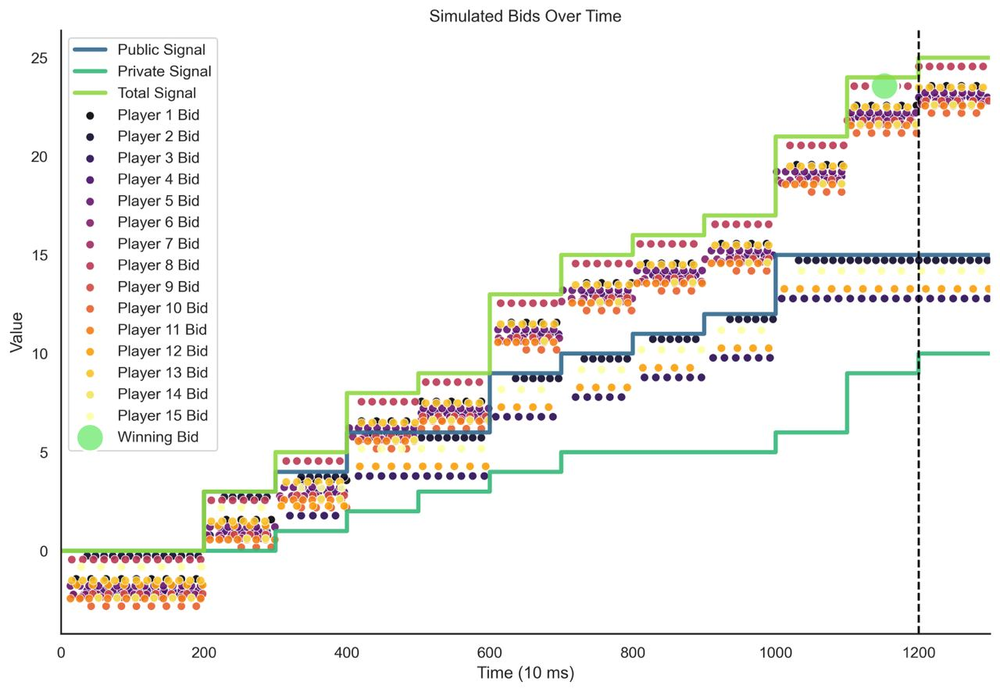

*[Thomas Thiery](https://twitter.com/soispoke) – July 27th, 2023*

*Thanks to [Julian](https://twitter.com/_julianma), [Fei](@William33203632), [Stefanos](https://twitter.com/StefLeonardos), [Carmine](https://twitter.com/1carven1), [Barnabé](https://twitter.com/barnabemonnot), [Davide](https://twitter.com/DavideCrapis) and [Mike](https://twitter.com/mikeneuder) for helpful comments on the draft.*

## Introduction

On September 15th, 2022, with the Merge was introduced a novel protocol feature designed to reduce computational overhead and foster decentralization among Ethereum validators. This feature, known as Proposer-Builder Separation (PBS), distinguishes the role of block construction from that of block proposal, thus shifting the burden and computational complexity of executing complex transaction ordering strategies for Maximum Extractable Value (MEV) extraction to builders. Subsequently, block proposers (i.e., validators randomly chosen to propose a block) partake in the less computationally intensive task of selecting and publishing the most valuable builder-generated block to the rest of the peer-to-peer network. To safeguard builders against potential MEV theft or strategy appropriation by validators until a version of [enshrined PBS](https://ethresear.ch/t/why-enshrine-proposer-builder-separation-a-viable-path-to-epbs/15710) is agreed upon, researchers from [Flashbots](https://www.flashbots.net/) and the [Ethereum Foundation](https://ethereum.foundation/) introduced [MEV-Boost](https://github.com/flashbots/mev-boost#installing), an out-of-protocol piece of software running as a sidecar alongside the validators’ consensus and execution clients.

### MEV-Boost auctions

MEV-Boost allows validators selected to propose blocks (i.e., proposers) to access blocks from a builder marketplace through trusted intermediaries, known as relays, via MEV-Boost auctions. In MEV-Boost auctions, builders compete for the right to build blocks auctioned off by proposers by submitting valid, EVM-compatible blocks alongside bids to relays. Bid values represent block rewards, and include priority fees from user transactions pending in the public mempool, as well as searchers’ payments for bundle inclusion, indicative of the amount of MEV opportunities (e.g., [arbitrages, sandwiches, liquidations](https://arxiv.org/pdf/2101.05511.pdf), [cross-domain MEV](https://arxiv.org/pdf/2112.01472.pdf)) created by user transactions. Relays act as trusted facilitators between block proposers and block builders, validating (validation now depends on optimistic relaying, see [documentation](https://github.com/michaelneuder/optimistic-relay-documentation/blob/4fb032e92080383b7b5d8af5675ef2bf9855adc3/towards-epbs.md) for more details) blocks received by block builders and forwarding only valid headers to validators. This ensures proposers cannot steal the content of a block builder’s block, but can still commit to proposing this block by signing the respective block header. When the proposer returns the signed header to the relay, the relay publishes the full signed block to the p2p network. This cycle completes one round of MEV-Boost auction and repeats for every block proposed via MEV-Boost.

In this post, we present a MEV-boost auction game-theoretic model, in which (1) players represent _block builders_, submitting bids alongside block headers to _relays_ and (2) _proposers_ act as auctioneers, ultimately choosing the highest paying block and terminating the auction. We then give example strategies that could be used by builders to try and win the auction.

## Model

### Player Definition
Let us define a set of players as 𝑁 = {0, 1, ..., n-1}.

### Strategy Space

Each player 𝑖 ∈ 𝑁 employs a bidding strategy denoted by 𝛽i(𝑥), where 𝑥 indicates a variety of inputs: the aggregated signal 𝑆i(𝑡) at a specific time 𝑡, network delay ∆, individual delay ∆i, bids made by all players up until time t {bj,k : j ∈ 𝑁, k ≤ t} with a particular attention given to the current maximum bid maxj∈𝑁{bj,k}, and a predetermined, player specific profit margin 𝑃𝑀i. A player 𝑖's bid at a particular time k, represented as bi,k, is determined by this strategy.

### Input Variables

- Public signal 𝑃(𝑡): Within the scope of MEV-Boost auctions, 𝑃(𝑡) represents the cumulative sum of priority fees and direct transfers to builders from transactions visible in the public mempool at a given time t. We model this as a compound Poisson process, with a rate λ(t) drawn a log-normal distribution. This public signal, available to all builders, can thus be expressed as 𝑃(𝑡), where 𝑃(𝑡) constitutes the cumulative sum of N(t) transaction values, each following a log-normal distribution. N(t) denotes the number of transactions up to time t, following a Poisson process with rate λ(t). Hence, N(t) is a random variable, its distribution being dependent on ∫λ(u) du from 0 to t, where λ(u) ~ Normal(α, β). Each transaction value, represented by Vi, is a random variable drawn from a log-normal distribution, i.e., Vi ~ LogNormal(ξ, ω). Therefore, 𝑃(𝑡) signifies the cumulative sum of these log-normally distributed transaction values from time 0 to t.

- Private signal 𝐸i(𝑡): Each player 𝑖 possesses a player-specific, private signal based on Exclusive OrderFlow (EOF), representing confidential transactions and payments secured from searchers. We model this private signal as a compound Poisson process with a rate λi(t) drawn from a log-normal distribution. The rate λi(t) is specific to player i and is not common knowledge among the other players. There exists a global correlation coefficient ρ which reflects the average correlation between the private signals of all players, indicating the general likelihood of different builders receiving similar order flow of transactions. In the event that a player does gain access to their private signal, the aggregated signal transforms into 𝑆i(𝑡) = 𝑃(𝑡) + 𝐸i(𝑡), where 𝐸i(𝑡) is the cumulative sum of Ni(t) transaction values, each following a log-normal distribution. Here, Ni(t) is the number of transactions up to time t and follows a Poisson process with rate λi(t), i.e., Ni(t) is a random variable whose distribution depends on ∫λi(u) du from 0 to t, where λi(u) ~ Normal(αi, βi). If a player does not have access to the private signal, the aggregated signal is simply 𝑆i(𝑡) = 𝑃(𝑡). Each transaction value in the private signal, represented by Vi, is a random variable drawn from a different log-normal distribution, i.e., Vi ~ LogNormal(ξi, ωi). The correlation coefficient ρ is a significant factor as it indicates the degree to which individual private signals are similar to each other. High values of ρ suggest that players often receive similar private signals, while low values suggest that each player's private signal is generally distinct.
- Network delay ∆ and player-specific delay ∆i: Both kinds of delay affect the player's capability to bid in a timely manner.
- Current highest bid maxj∈𝑁{bj,k}: This represents the maximum bid value from any player in the set 𝑁, inclusive of player 𝑖, which can be queried at any given time.
- Predetermined profit margin 𝑃𝑀i: This is a predetermined threshold that a player uses to decide when bidding would be profitable. We expect 𝑃𝑀i to differ across builders based on the risk they're willing to take, and whether they're established as a trusted builder or not. New entrants might be willing to reduce their profit margin to acquire new orderflow from searchers, and gain relays' trust. Note that 𝑃𝑀i is not considered common knowledge, as the incentives of each builder can be kept private.

### Value and Payoff

The value for player 𝑖 is denoted by 𝑣i and is equal to the aggregated signal at the time of bidding, i.e., 𝑣i = 𝑆i(𝑡), where 𝑡w denotes the time at which the bid was place. Note that the value is the same whether player 𝑖 wins or doesn't win the auction.

The payoff for player 𝑖, denoted as 𝑢i, is calculated as 𝑢i = 𝑣i - bi, tw if player 𝑖 wins, 0 otherwise. This suggests that a player's payoff is the difference between their value and their bid if they win the auction; their payoff is zero otherwise.

### Timing and Game Progression
The game proceeds in continuous time over the interval [0, 𝑇], where 𝑇 represents the time at which the winning bid is chosen by the validator. Players, also known as builders, dynamically adjust their bids according to their strategies throughout this interval based on available information and the balance between high bids and potential payoff. Bid cancellation is allowed, providing players the opportunity to substitute their bids with ones of lower value, though with the associated risk of cancelling too late (after time 𝑇).

At time 𝑇, the auctioneer selects the winning bid. The distribution of 𝑇 is Gaussian, centered around an average of 𝐷 (usually approximating a 12-second block interval) with a standard deviation of 𝜎. Despite the auctioneer determining the duration of the game, the winning bid is typically selected around 𝑇=12 seconds, consistent with the theoretical expectation for proposers to propose a block to the peer-to-peer network. Players can estimate the Gaussian distribution's parameters 𝐷 and 𝜎 by analyzing historical data from past MEV-boost auctions. It's also worth mentioning that proposers might deviate from the expected behavior specified in the consensus specifications, and delay the moment at which they commit to a winning bid to collect more MEV (see [Timing games](https://arxiv.org/abs/2305.09032) paper). 

Throughout the continuous time interval, players are free to submit and adjust their bids according to their strategies, and respond to changes in information and the bidding environment. Note that the frequency and delay between bids will depend, in part, on network and individual delays, and can be modeled as being subject to random variations following a normal distribution, promoting realistic bid dynamics.

*__Figure 1.__ An example of a simulated MEV-boost auction during a 12 seconds slot. Players (i.e., builders) submit bids based on the public and private value signals they receive until the auctioneer (i.e., the proposer) selects the winning bid (light green dot) at time 𝑇 and terminates the auction.*

### Model Assumptions

In the development of our proposed model for MEV-Boost auctions, we knowingly made a number of assumptions and trade-offs between realism and tractability. Within this context, players should be considered as programs with different strategies, implemented by builders, adhering to the following rules and conditions:

>- Continuous Bidding: Players can bid at any time during the interval [0, 𝑇]. The process of bidding is continuous, and players can dynamically change their bids.
>- Bid cancellations: Our model allows bid cancellations to reflect the current state of MEV-Boost auctions. Bid cancellations are executed by substituting bids with ones of lower values. However, this mechanism operates on the assumption that proposers are honest, rather than rational. The system presupposes that proposers invoke the getHeader function only once, specifically at the auction's close, aiming to select the highest bid at that point. But, this approach is not immune to strategic manipulation. Proposers could potentially call getHeader multiple times during the auction, enabling them to cherry-pick the highest bid from a selection at various times. This loophole could nullify the effectiveness of bid cancellations, as it allows proposers to take advantage of fluctuations in bids throughout the auction duration (for more details, see [Bid cancellations considered harmful](https://ethresear.ch/t/bid-cancellations-considered-harmful/15500)).
>- Bounded Rationality: This model operates under the assumption that participants exhibit 'bounded rationality.' Although their intentions align towards the pursuit of payoff maximization, their decision-making processes are not devoid of constraints. These constraints manifest in their imperfect knowledge regarding the private signals of other players, coupled with limitations in time and computational resources. Consequently, it is assumed that players adopt heuristic methodologies, such as the principles of 'availability' and 'representativeness.' Availability refers to the inclination of players to make choices based on the most readily accessible or easy-to-comprehend information, as opposed to exhaustively analyzing all available data. Representativeness, on the other hand, is the players' propensity to extrapolate future outcomes based on observed historical patterns, operating under the assumption that past trends will continue into the future. This amalgamation of heuristic strategies guides players towards making 'satisficing' decisions—adequate but not necessarily optimal choices—in lieu of relentlessly pursuing the most optimal strategies.
>- Contrary to standard assumptions in auction theory, our model does not assume symmetric bidding strategies or that strategies increase monotonically with valuation. Here, players have the freedom to employ more complex, meta-strategies, where the bidding approach is contingent upon the valuation of the bid. For instance, a player may choose to use a naive strategy when their bid valuation falls below a predefined threshold, and switch to a last-minute strategy if this threshold is exceeded, leading to approach that does not display a direct, increasing correlation with the value signal.
>- No Transaction Costs: There are no costs associated with adjusting or cancelling a bid. This allows players to adjust their bids freely, at any time during the game.
>- Network and Individual Delays: Our model accounts for two forms of delay that may impact the timing and effectiveness of players' actions:
>   - Network Delay: This delay represents the latency inherent to p2p networks, and affects all actions, including the process of bidding, across all time intervals and is shared uniformly across all players.
>   - Individual Delay: This is a player-specific delay associated solely with the act of bidding. It encapsulates the latency period between a player's decision to bid and the time at which that bid is made available to other players by the relay. 
>
>   These delays consider the real-world dynamics of decision-making, transmission, and information propagation within the network.
>- Arbitrary Winner Selection: The block proposer has the freedom to choose the winning bid at any time within (0, 𝑇], regardless of when the bids were placed. This means players have to bid within this interval because they don't know when the auction ends.

The goal was to establish a framework with enough fidelity to actual conditions to allow for insightful deductions from simulations, machine learning, and empirical investigations. However, the current complexity of the model may prove to be a too complex for formal analytical methods. We hope that certain properties of our proposed model, such as arbitrary winner selection or delays due to network and players, can be simplified to accommodate more formal analyses. We also encourage readers to check out [pbs-og](https://github.com/20squares/pbs-auctions/tree/master/pbs-og), a framework that was recently implemented by [20squares](https://github.com/20squares), allowing to derive equilibria and simulate various auction procedures.

### Example Strategies
- __Naive strategy__: The naive strategy operates on a straightforward principle: it is based on the aggregated signal at the time of bidding, 𝑆i(𝑡i), and a predetermined profit margin, 𝑃𝑀i. This strategy implies that a player will place a bid only when the value of the aggregated signal at the time of bidding surpasses the predetermined profit margin.

    $$
    b_{i,k} = \beta_{\text{naive}}(S_i(t_i), PM_i) = 
    \begin{cases} 
    S_i(t_i) - PM_i & \text{if } S_i(t_i) > PM_i, \\
    0 & \text{otherwise}.
    \end{cases}
    $$

- __Adaptive Bidding Strategy__: Players adjust their bids based on the observed behavior of other players. In the adaptive strategy, players keep track of the current highest bid and only place their own bid if their valuation (signal) allows them to outbid the current highest bid while maintaining their predetermined profit margin. If they can't do so, they go back to a naive strategy and bid their true value reduced by the profit margin.

    $$
    b_{i,k} = \beta_{\text{adaptive}}(S_i(t_i), \max_{j\in N} {b_{j,k}}, PM_i) =
    \begin{cases} 
    \max_{j\in N} {b_{j,k}} + \delta & \text{if } S_i(t_i) - PM_i > \max_{j\in N} {b_{j,k}} + \delta, \\
    S_i(t_i) - PM_i & \text{if } S_i(t_i) - PM_i \leq \max_{j\in N} {b_{j,k}} + \delta \text{ and } S_i(t_i) > PM_i, \\
    0 & \text{otherwise}.
    \end{cases}
    $$

    Here, δ is a small constant value that is added to the current maximum bid to ensure that the player's bid is higher. The adaptive strategy thus attempts to maximize the chance of winning the auction by closely tracking the current highest bid and adjusting accordingly, while still ensuring a desired level of profit.

- __Last-minute strategy__: In the last-minute strategy, players withhold their bids until the final possible moment before the auction closes, then submit their highest acceptable bid. This limits the opportunity for competitors to react and outbid them, but also risks missing the closing deadline due to network or individual delay, or because the realized auction time was shorter than the expected auction time.

    This strategy is defined as follows:

    $$
    b_{i,k} = \beta_{\text{last-minute}}(S_i(t_i), PM_i, \Delta, \Delta_i, T, D, \varepsilon) = 
    \begin{cases} 
    S_i(t_i) - PM_i & \text{if } T - \Delta - \Delta_i - \varepsilon \leq k \text{ and } S_i(t_i) > PM_i, \\
    0 & \text{otherwise}.
    \end{cases}
    $$

    The variable ε represents the players' estimation of when to bid to account for the uncertainty of when the proposer will choose the winning bid (which is random but typically around the 12-second mark) as well as potential network and individual delays.

- __Stealth Strategy__: A more evolved version of the last -minute strategy. Players only bid their public values 𝑃(𝑡), and only reveal their accumulated private value 𝐸i(𝑡) at the last second, hoping to time the moment at which their reveal their private value right before the proposer chooses the winning bid, so other players with adaptive bidding strategies don’t have time to react. For player 𝑖, the stealth strategy can be formally defined as follows:

    $$
    b_{i,k} = \beta_{\text{stealth}}(S_i(t_i), P(t), t_{i,\text{reveal}}, PM_i, \Delta, \Delta_i, T, D, \varepsilon) = 
    \begin{cases} 
    P(t) & \text{if } k \leq t_{i,\text{reveal}} \text{ and } P(t) > PM_i, \\
    S_i(t_i) - PM_i & \text{if } k \geq t_{i, \text{reveal}} \text{ and } S_i(t_i) > PM_i, \\
    0 & \text{otherwise}.
    \end{cases}
    $$

    where ti, reveal = 𝑇 - ∆ - ∆i - ε is the time when player 𝑖 switches from bidding their public value to their full aggregated signal.

- __Bluff Strategy__: Players intentionally bid significantly higher than their value 𝑆i(t) to force other players to reveal their true values if they want to win the auction. However, players plan to cancel their bids by submitting a lower value bid close to their true value at the last second, using the bid cancellation property of the game. The goal in this strategy is to manipulate other players into overbidding rather than aiming to win the auction themselves.

    The bluff strategy for player 𝑖 is as follows:

    $$
    b_{i,k} = \beta_{\text{bluff}}(S_{i}(t_{i}), b_{i,\text{bluff}}, t_{i,\text{bluff}}, PM_{i}, \Delta, \Delta_{i}, T, D, \epsilon) =
    \begin{cases} 
    b_{i,\text{bluff}} & \text{if } k \leq t_{i,\text{bluff}}; \\
    S_{i}(t_{i}) - PM_{i} & \text{if } k \geq t_{i,\text{bluff}} \text{ and } S_{i}(t_{i}) > PM_{i}; \\
    0 & \text{otherwise.}
    \end{cases}
    $$

    where where ti, bluff = 𝑇 - ∆ - ∆i - ε is the time at which player i switches from their bluff bid to their final bid.
    
    Note that this strategy involving bid cancellation depends on an honest assumption from proposers (more details in the Model assumptions section).

- __Bayesian Updating Strategy__: In this strategy, each player initially assumes a probability distribution over the possible values of each other player's private signal. As the game progresses and more bids are observed, each player updates their beliefs about the other players' private signals using Bayes' rule. The player then uses these updated beliefs to adjust their bidding strategy.

- __Meta Strategy__: Instead of sticking to one strategy, a player may switch between multiple strategies based on the current state of the game. For example, a player might start with a naive strategy, switch to a stealth strategy if they notice other players are bidding aggressively, and finally switch to a last-minute strategy if the game is nearing its end and they have not yet won. This approach requires a deep understanding of each strategy's strengths and weaknesses, as well as the ability to quickly analyze and respond to changing game conditions.

- __Machine Learning (ML) Strategies__: Players use ML algorithms to predict the behaviors of other players based on historical bidding data, current market conditions, and other factors. ML algorithms would analyze past actions and outcomes to devise a bidding strategy that maximizes expected payoff.

- __Collusion Strategy__: Players form alliances and agree to bid in a certain way to manipulate the auction outcome. For example, they might agree to keep their bids low to suppress the auction price.

## Future research and considerations

We hope this model can serve as a stepping stone for future research aimed at designing efficient mechanisms for MEV extraction and redistribution. Future work will include simulations and empirical analyses to determine how auctions designs shape bidders' strategies. We also see this work as an opportunity to kickstart research on how ML can be used in the blockchain context to (1) automate processes involved in block building (e.g., devising bidding strategies, packing bundles and transactions efficiently), and (2) provide a concrete use-case with a large amount of data to study coordination between automated agents.