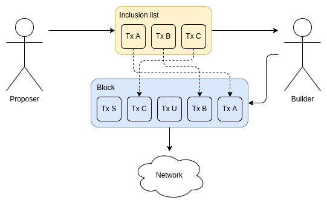
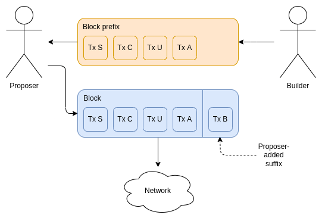
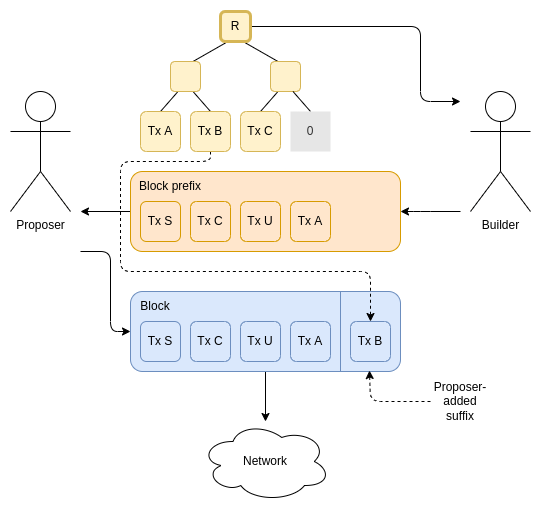

One natural response to the risks of builder centralization (mainly censorship, but also various forms of economic exploitation) is to try to constrain the power that builders have. Instead of builders having full rein to construct the _entire_ block if they win an auction, builders would have a more limited amount of power. This power should still be enough to capture almost all MEV that could be captured, and it should ideally still be enough to capture other benefits of PBS, but it should be weakened to limit opportunities for abuse.

This idea is sometimes called **partial block auctions**: instead of auctioning off the right to decide everything in a block, auction off the right to decide _some things_, where those "some things" could be much more nuanced than eg. "the builder chooses the first half of the block and not the second": you could give the builder the right to reorder, prepend, append, and you could even constrain the proposer. This post gets into some possible ways of doing this, and some of the tradeoffs that result.

## Inclusion lists

In the inclusion list paradigm, a proposer provides an _inclusion list_, a list of transactions that they demand must be included in the block, unless the builder can fill a block _completely_ with other transactions.

For a profit-maximizing builder that is not affected by unusual external incentives, an inclusion list is no constraint at all: adding an additional transaction to the end of a block always gives the builder that transaction's priority fee as an extra profit.

In the case where the block is filled up to the full gas limit (2x the target), so the builder would have to choose between that transaction and other transactions, the constraint is disabled. This does not affect inclusion in the long run, because a run of full blocks can only be sustained briefly as it makes the base fee rise exponentially (~2.02x every 6 blocks).

However, if a builder does have some desire to refuse to include specific transactions that it disapproves of or is incentivized to exclude, that builder would be forced to not participate in the auction.

This design is reasonably simple, but it is important to describe some of its weaknesses:

* **Incentive compatibility issues**: the builder sees the inclusion list ahead of time, and the builder can refuse to build blocks that contain an inclusion list that they do not want to build on. This creates an immediate incentive for proposers to have empty inclusion lists, to maximize the chance that builders will build blocks for them.
* **Extra burdens on proposers**: the proposer needs to be able to identify fee-paying transactions. This requires **(i) access to the mempool** and **(ii)** either **ability to read the state** to determine fee-paying-ness, or **witnesses attached to transactions**. Witnesses are preferable, as they would preserve the PBS property that validators could be stateless clients.
* **The builder can still engage in some abuses**: notably sandwich attacks. However it's not clear how it's possible to remove this issue without extreme approaches like using advanced cryptography to encrypt mempools, since otherwise taking this power away from the builder implies giving it to the proposer, which would incentivize proposers joining stake pools.
* **Requires partial enshrining for account abstraction to work**: see https://notes.ethereum.org/@vbuterin/account_abstraction_roadmap#Transaction-inclusion-lists

## Proposer suffixes

An alternative construction is to allow the proposer to create a suffix for the block. The builder would see no information about the proposer's intentions when they build a block, and the proposer would be able to add to the end any transactions that the builder missed.

* **Reduced incentive compatibility issues**: the builder can still retroactively punish proposers (eg. by refusing to build for them in the future) that include transactions that the builder disapproves of, and sends the root to the builder. This is unavoidable, but this is much more proposer-friendly than builders being able to refuse to construct blocks in real time (especially since each individual proposer only proposes occasionally, today once every ~2 months).
* **Even more extra burdens on proposers** - the proposer now has to compute the post-state root, which means that **the proposer must hold the entire state**. Hence, no statelessness is possible, unless the proposer outsources this task to a _separate_ intermediary.
* **The proposer gets some MEV opportunities** between getting the response from the builder and having to publish the block. This is likely only half a second worth, but it's still some increase to the incentive for validators to join stake pools to be able to optimize in-house.
* **The builder can still engage in some abuses**, as before
* **Requires partial enshrining for account abstraction to work**, as before

## Fix to proposer suffixes: pre-commitment

The proposer pre-commits to a Merkle tree or KZG commitment or other accumulator of the set of txs that they want to include. The builder creates their block. The proposer must then add the suffix consisting exactly of the subset of the Merkle tree that has not yet been included by the builder, and that the gas limit allows them to include, ordering by txhash or some other standardized order (if they add any other suffix, they get slashed).

The details of enforcing the slashing are somewhat involved, especially if you want to avoid putting the proposer's inclusion tree in the clear. It could be reasonably easily done with KZG commitments and special-purpose ZK-SNARKs, using specialized polynomial equations to verify the concept of "if you start from the set with commitment X, and remove anything that's in Y, then the remaining set is Z".

This removes the proposer's MEV opportunities, because the proposer has zero degrees of freedom in what block to publish once the builder replies back with their own block contents, but it leaves the other issues unresolved.

## The longer-term endgame: how do we constrain the builder _and_ minimize responsibilities of the proposer?

The proposer's role should ideally be kept minimal: simply identify transactions that deserve to be included. Minimizing the proposer's role ensures that the role is kept highly accessible. The builder's role should ideally be kept minimal: the builder should have the right to reorder transactions from the mempool and insert their own transactions to collect MEV, without being able to discriminate against blocks based on which transactions they will include.

But this leaves many other important tasks unallocated, especially tasks that will become necessary in the future:

* The task of computing the post-state root
* The task of computing and publishing the witness
* The task of making a ZK-SNARK attesting to the block's correctness

If these tasks do not go to the builder, or the proposer, then they would have to go to some _third_ actor. There are a few possible ways to implement this:

* We create a separate class of builder-like intermediary, which proposers contract with, and which considers itself to merely be a specialized cloud computing provider whose job it is to compute outputs of functions (ZK SNARK generation, state root computation, etc), and is not involved in choosing block contents
* We require the _next_ block to contain these values for the previous block. It's up to the next block's proposer to find an intermediary to construct these values and if needed to verify them.
* We enshrine a separate class of intermediary in-protocol and add in-protocol incentives for them
* We leave it up to altruistic actors in the network to publish these values (so they do not get hashed into the block). Attesters only attest once they see correct values provided.

In any case, the simultaneous need to minimize the powers and information available to the builder, and the load imposed on the proposer, seems to clearly point towards the need for some third actor in the block production pipeline (unless we bite the bullet and accept that builders have the right to see the inclusion list, and hence discriminate against particular transactions being included in the same slot). We should start thinking more deeply about how exactly this is going to be handled.