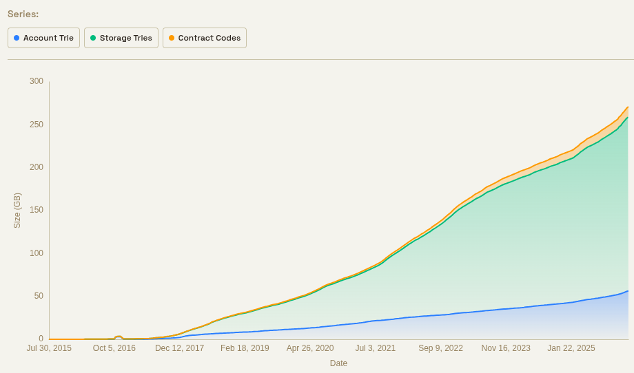
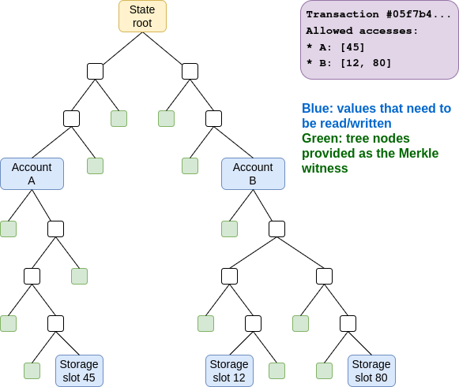
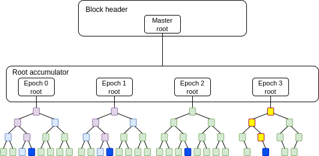
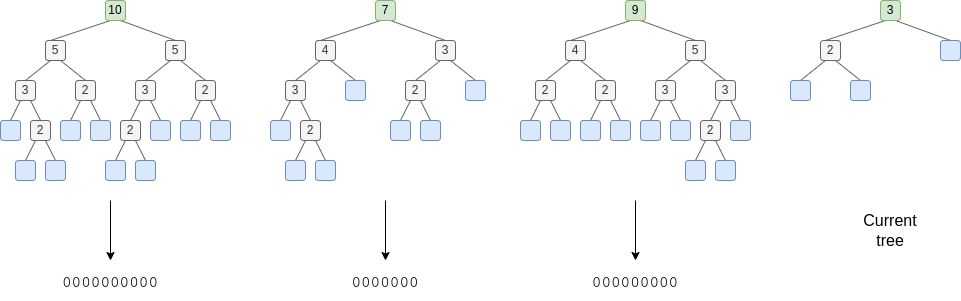
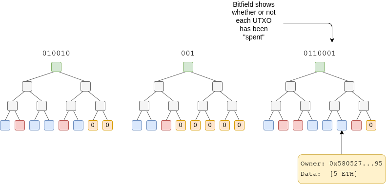

_Special thanks to Guillaume Ballet, Marius van der Wijden, Jialei Rong, CPerezz, Han, soispoke, Justin Drake, Maria Silva and Anders Elowsson for feedback and review_

In order to scale Ethereum over the next five years, we need to scale three resources: **execution** (EVM computation, signature verification…), **data** (transaction sender, recipient, signature, calldata…) and **state** (account balances, code, storage). Our goal is to scale Ethereum by ~1000x. But there is a fundamental asymmetry between the first two of these resources and the third.

 

||Short term|Long term|
| --- | --- | --- |
|**Execution** &nbsp;&nbsp;|ePBS, block-level access lists (BAL) and gas repricings → **~10-30x increase**|ZK-EVMs (most nodes can avoid re-executing blocks entirely) → **~1000x increase**    For a few specific types of computation (signatures, SNARKs/STARKs), off-chain aggregation could get us **~10000x**|
|**Data**|p2p improvements, multidimensional gas → **~10-20x increase**|Blocks in blobs + PeerDAS → 8 MB/sec (**~500x increase**)|
|**State**|Syncing with BALs, p2p improvements, database improvements → **~5-30x increase**|?|

 

In the short term, we can increase the efficiency of all three resources. But to achieve the 1000x gain desired for the longer term, we need magic bullets. ZK-EVMs are the magic bullet of execution. PeerDAS is the magic bullet of data. But there is no magic bullet of state. So what do we do?

This post proposes an ambitious solution: alongside making incremental improvements to the current state (eg. binary tree, leaf expiry), and pricing improvements like multidimensional gas, **we introduce new (much cheaper, but more restrictive) forms of state alongside the existing state**.

The major tradeoff is that if we set “target” levels for state growth to eg. 20x today, and execution to 1000x today, then the “relative prices” between execution and storage will change drastically compared to today. Creating a new storage slot may literally be more expensive than verifying a STARK (!!). Likely, both will be cheap, but mental models of what is *cheaper* will change drastically.

Developers will thus have a choice: they could either have *reasonably low* transaction fees if they keep building applications the same way that they do today, or *very low* transaction fees if they re-design their apps to make use of the newer forms of storage. For common use cases (eg. ERC20 balances, NFTs), there will be standardized workflows for this. For more complex use cases (eg. defi), they will have to figure out application-specific tricks to do it themselves.

## Why can’t we scale state as-is by more than ~10-20x?

 

 

Today, state is growing at a rate of about 100 GB per year. If we increase it by 20x, this becomes 2 TB per year. After 4 years, this implies a state size of 8 TB.

This state will not have to be stored by fully validating nodes (as they can get everything they need with ZK-EVM + PeerDAS), and it will not even have to be stored by FOCIL nodes (VOPS is significantly smaller; it will be under 1 TB even with no changes, likely under 512 or even 256 GB, and it can be optimized further). But it will be required by builders (not just sophisticated builders, also local “home builders” running “vanilla” software).

Storing 8 TB on disk is not difficult in itself. We may need some tricks to store only part of the state “hot” and charge extra gas for other parts, so that they can be stored in a flat file instead of a DB, but ultimately 8 TB disks are easy to obtain. There are two “hard parts”: one short-term and one long-term:

* **Short term: database efficiency**. Present-day databases in clients were not designed to handle multi-terabyte states. A major problem today is that state writes need to make log(n) updates to the tree, and each of those updates is itself log(n) operations in the database, and the concrete factors blow up quickly once n is many times larger than RAM. There are already database designs that solve this problem; they just need to be refined and widely adopted.
* **Long term: syncing**. We want being a builder to be permissionless, and not unreasonable to set up. Even with perfect efficiency, 8 TB takes a long time to sync, and in many cases even runs up against monthly bandwidth limits.

This is all in addition to questions of *who you sync the state from*, who runs RPC nodes, and a host of other issues. As a first approximation, with each doubling of the state size, the number of actors willing to do some function with the state altruistically (or even at a fee) will cut in half. Database efficiency improvements, using HDDs and flat files instead of SSDs and databases, etc, help only partially with some of the issues, and do not help at all with others.

Unlike data and computation, these are not areas where we can say “we rely on professional builders for scale, if they all disappear, regular builders can just build blocks that are 10% as large”. To build a block at all, you need the full state. Decreasing the gas limit does not make the state any smaller.

This means that (i) we need to be more conservative about state than computation and data, and (ii) many “sharding” techniques that work for computation and data do *not* work for state storage.

## Why strong statelessness is probably insufficient

One major strategy that has been proposed to get around this problem is **strong statelessness**. We would require users making transactions to (i) specify which accounts and storage slots their transaction reads and writes, with a rule that any attempted reads or writes outside this set will fail, and (ii) provide Merkle branches proving their state accesses.

If we do this, we no longer need builders to store the full state. Instead, either users themselves would store state (and updated proofs) relevant to their own use, or a decentralized network would store state (eg. each node would keep a random 1/16th).

 

 

There are three major downsides to this approach:

* **Off-chain infrastructure dependency**: realistically, users would not be able to store state and proofs relevant to their own use, because what is “relevant to their own use” will keep changing, and because many users would not be online all the time to download updated branches. So we would need a decentralized network for state storage and retrieval. This also has privacy consequences for users.
* **Backwards incompatibility**: applications where the storage accessed is a dynamic function of the execution of the transaction are fundamentally incompatible with binding access lists. This could include onchain order books, appendable lists, and many other types of structures. For these applications, users would need to simulate locally, make an access list, and then a large portion of the time the transaction would will simply fail onchain (while consuming gas) and they would have to repeatedly retry.
* **Bandwidth cost**: for each storage slot accessed, transactions would need to provide ~1000 byte proofs. This greatly increases transaction size (eg. a simple ERC20 transfer might take up 4 kB of witness data: one branch for the sender account, one for the ERC20 token, one for the sender balance, one for the recipient balance, compared to ~200 bytes today)

A weaker version of strong statelessness is an idea that has been called “**cold state**”. The idea is that some state (eg. state that has not been accessed for >1 year) would still be accessible, but with an asynchronous delay (realistically, between one second and one slot). This would allow builders to run without having that storage, as whenever they are met with a read they would ping a decentralized network for the data.

This solution may work, but it is brittle because of its tight infrastructure dependency, and it has the same backwards incompatibility problem. There are worst-case transactions that have a deep multi-hop dependency graph going through different regions of cold state: call A, depending on the output call some other address B, depending on the output of that call some other address C…

## Why state expiry is very hard to make backwards-compatible

There has been a decade of attempts to propose *state expiry*: designs where state that is not accessed for a long time is automatically removed from the active state, and users who want to continue using that state have to actively “resurrect” it.

The inevitable problem that these designs all run into is: **when you create new state, how do you prove that there was never anything there before**?

If you create an account at address X, you have to prove that nothing else was created at address X, not just this year, or the previous year, but every previous year in Ethereum’s history.

 

*If we create a new tree every year to represent state modified in that year (“repeated [regenesis](https://ethresear.ch/t/regenesis-resetting-ethereum-to-reduce-the-burden-of-large-blockchain-and-state/7582)”), then creating a new account in year N requires N lookups.*

 

One idea invented to mitigate this issue is the *address period* mechanism: we add a new account creation ruleset (“CREATE3”) that lets you create an address that is provably only valid to create in year >= N. When you create such an account, there would be no need to provide a proof for any year < N, because such an account existing then is impossible.

However, this design has major limitations once we start trying to integrate it into the nitty gritty real Ethereum world. Particularly, notice that for each new account, we need to create not just *accounts*, but also *storage slots*. If you create a new account X, then you have to create the ERC20 balance of X, for every token that you want to hold. This is made worse because address period mechanisms are not “understood” by existing ERC20s: even though the Ethereum protocol might understand that an account X, with an address that somehow encodes “2033” via a new address-generation mechanism, could not have been created before 2033, the storage slot for the balance of X is sha256(…, X), which is an opaque mechanism that the protocol does not understand.

We *could* solve this with some clever tricks. One idea is for new ERC20s to be designed in a way that spawns a new child contract each year, which holds the balances of accounts associated with that year. Another idea is to make a new type of storage that can be owned by a token contract, but “lives with” your account, which can thus be expired and resurrected along with your account. But both of these ideas already require ERC20 token contracts to completely rewrite their logic, hence it is not backwards-compatible.

All attempts to make state expiry backwards-compatible seem to run into similar issues, which all stem from this problem of not having good ways to prove inexistence. Also unfortunately, there is no way to create a mapping of “what addresses / storage slots were not created before” that is significantly smaller or simpler than the current state. A map {32-byte key: {0,1}} has all of the implementation complexities of a map {32-byte key: 32-byte value}.

## Lessons learned from these explorations

We can compress the big-picture lessons from our exploration of strong statelessness and state expiry into two big “stylized facts”:

1. **Replacing all state accesses with Merkle branches is too much (bandwidth-wise), replacing exceptional-case state accesses with Merkle branches is acceptable.** “State expiry” is in fact an example of precisely the latter: if we assume that eg. 90% of state accesses touch state less than six months old, and 10% touch older state, then we can keep only the recent state in the “mandatory-for-builders” bucket, and require witnesses for the older state, and instead of paying 20x overhead, we would on average only pay 2x overhead (plus the original tx).    This kind of exploration seems to inevitably lead to the conclusion that we need **tiered state**: a distinction between high-value state that we know will be accessed often, and lower-value state that we expect will be accessed rarely. Tiering can be done either (i) by recency, as in state expiry proposals, or (ii) through explicit separate classes of state (eg. VOPS is a very limited version of this).   
2. **Backwards-compatibility is very difficult**. Lower tiers of state are not just *more expensive* to manipulate in certain ways (esp. dynamic synchronous calls), they *cannot be manipulated that way at all*. Hence, if we want to avoid outright breaking applications, the only option may be to push existing applications into the more expensive tier of state, and require developers to actively opt in to use newer cheaper tiers of state.

## What would it look like to create new cheaper types of state?

If existing state cannot be made to expire backwards-compatibly, the natural solution is to accept the lack of backwards-compatibility, and instead take a “barbell solution”

* **Keep existing state almost exactly as is, but allow it to become relatively more expensive** (ie. execution may get 1000x cheaper, but new state creation might only get 20x cheaper)
* **Create new types of state** that are designed from the start to be friendly to extremely high levels of scalability.

When designing these new types of state, we should keep in mind the reality of what kinds of objects make up the bulk of Ethereum’s state is today: balances such as ERC20 tokens and NFTs.

## Temporary storage

One idea is to create a new class of temporary storage which is medium-length in duration. For example, we could have a new tree which gets zeroed out each time a new period (eg. 1 month) begins.

This type of storage would be ideal for handling throwaway state of onchain events: auctions, governance votes, individual events inside of games, fraud proof challenge mechanisms, etc. Its gas cost could be set quite low, allowing it to scale 1000x along with execution.

To implement ERC20-style balances on top of this kind of state, one would inevitably have to resolve a problem: what happens if someone goes into a cave for over a month?

One nice thing about the ERC20 use case is that it is friendly to out-of-order resurrection. For example: if you receive 100 DAI in 2025, then forget about it, then receive 50 DAI in that same account in 2027, and then finally remember you had your earlier balance and resurrect it, you get your 150 DAI back. You don’t even have to provide any proof of whether or not anything happened to your account in 2026 (if you also got coins then, you could provide that proof later). The only thing we want to prevent is using the same historical state to resurrect your balance twice.

Here is a sketch of how resurrection could work:

* As part of the tree design, store in each node the total number of leaves “under” that node. This makes it practical to, within a proof of any leaf, simultaneously verify the leaf’s index (in left-to-right order) in the tree: you would add up the totals of all left-facing sister nodes in the proof.
* For each month, we would store a bitfield of permanent state, one bit per value in the tree at time of deletion. This bitfield is initialized to all-zeroes.
* If, during month N, an account X had the authority to write to a slot Y, then during any month > N, the account can edit its corresponding bitfield value. Also, anyone at any time can simply provide a proof.

 

 

* An ERC20 contract would by default store balances in the current tree, but it would have a balance resurrection feature, which takes as input a branch proving the sender’s historical state entry, and resurrects the balance while flipping the bit from 0 to 1, so it cannot be resurrected again.

Today, state grows by ~100 GB per year. If we scale Ethereum by 1000x, we could imagine that same level of state growth multiplied by 1000, but all stored in temporary trees. This would imply ~8 TB of state (assuming 1-month expiry), plus a negligible amount (1 bit per 64 byte state entry, so 8 TB * 1/8 / 64 = 16 GB per month) of permanent storage.

## UTXOs

Alternatively, we could take the temporary storage idea to its logical extreme: **set the expiry period to zero**. Essentially, contracts could create records, and these records would be hashed into a tree in that block, and immediately go straight into history. For each block, you would have a bitfield in the state that would store whether the records are “spent” or “unspent”, and that would be permanent state, but otherwise that’s it.

 

 

Potentially, UTXOs could be built simply by reusing the existing LOG mechanism, and adding the state bitfield mechanism on top. If we *really* want, it could even be done as a fully out-of-protocol ERC, though this has some disadvantages: a few random users would get the responsibility to pay 256x as much as everyone else to be the first to create a new storage slot that represents a size-256 section of a bitfield.

ERC20s, NFTs, and all kinds of other state can be built on top of these kinds of UTXOs.

There is also a hybrid version between these two ideas. We do UTXOs, but we make the last eg. month of trees directly accessible from the state, without witnesses. This reduces bandwidth load (at the expense of a higher storage size). The main difference between this and the temporary storage idea is that here, there would only be one “interface” for dealing with previously created objects (as UTXOs) rather than two (as current-epoch storage slots, and as previous-epoch UTXOs).

## A strong-stateless storage tree

We could also make a single storage tree, which requires Merkle branches to access (or alternatively, nodes have to store the top N-8 levels of it (ie. 1/256 the size), and nodes would provide 256-byte witnesses). This new storage tree would live alongside the existing one, so we would have two storage trees: a witness-required cheaper one and a witness-free expensive one.

My view, however, is that this is inferior to the temporary storage proposal. The reason is that in the long run, if most of such a tree is forgotten junk, and people only care about a few parts of it, then the network would have to store at worst the entire tree including the junk, or at best extra-long Merkle branches proving the useful state (as each useful state object would be “surrounded” by junk in the tree). Whereas a two-tree design only admits two “tiers” of storage, a temporary storage design creates space for a state expiry mechanism to be built on top, allowing recency tiering to live on top of economic tiering.

## Consequences for developer experience

Here is a sketch of how some applications and workflows would work with these kinds of tiered architecture:

* **User accounts** (including new per-account state associated with native AA) would live in permanent storage. User accounts would thus be cheaply and easily accessible at all times.
* **Smart contract code** would all live in permanent storage.
* **NFTs, ERC20 token balances, etc** would live in UTXOs or temporary storage.
* **State associated with short-term events** (eg. auctions, fraud-proof games, oracle games, governance actions) would live in temporary storage.
* **Core defi contracts** would live in permanent storage to maximize composability.
* **Individual units of defi activity** (eg. CDPs) would in many cases live in UTXOs or temporary storage.

At the beginning, developers could continue to put everything into existing permanent storage. Probably, NFTs and ERC20 token balances would be the easiest to move into UTXOs or temporary storage. From there, the ecosystem would optimize for more efficient storage use over time.

The underlying hypothesis here is that “mixed permanent storage and UTXOs” would be much easier to develop for than “only UTXOs”. One major reason why Ethereum has been so successful as a developer platform is that accounts and storage slots are simply much more developer-friendly than UTXOs. If we can deliver developer-friendly abstractions that allow eg. 95% of use of state to move to UTXOs without significant pain, and keep the last 5% as permanent storage (and give developers confused by even that the ability to just keep using permanent storage for everything at the expense of higher cost), then we can get most of the scaling benefit of UTXOs and most of the developer-friendliness benefits of Ethereum-style accounts and storage slots at the same time.