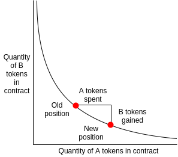

Two years ago I [made a post](https://www.reddit.com/r/ethereum/comments/55m04x/lets_run_onchain_decentralized_exchanges_the_way/) where I suggested that we could run on-chain decentralized exchanges in a similar way to what Augur and Gnosis were proposing for on-chain market makers (eg. LMSR), and Martin Köppelmann from Gnosis suggested a simple approach for doing so, that I call the "x*y=k market maker". The idea is that you have a contract that holds $x$ coins of token A and $y$ coins of token B, and always maintains the invariant that $x*y=k$ for some constant $k$. Anyone can buy or sell coins by essentially shifting the market maker's position on the $x*y=k$ curve; if they shift the point to the right, then the amount by which they move it right is the amount of token A they have to put in, and the amount by which they shift the point down corresponds to how much of token B they get out.

Notice that, like a regular market, the more you buy the higher the marginal exchange rate that you have to pay for each additional unit (think of the slope of the curve at any particular point as being the marginal exchange rate). The nice thing about this kind of design is that it is provably resistant to money pumping; no matter how many people make what kind of trade, the state of the market cannot get off the curve. We can make the market maker profitable by simply charging a fee, eg. 0.3%.

However, there is a flaw in this design: it is vulnerable to front running attacks. Suppose that the state of the market is (10, 10), and I send an order to spend one unit of A on B. Normally, that would change the state of the market to (11, 9.090909), and I would be required to pay one A coin and get 0.909091 B coins in exchange. However, a malicious miner can "wrap" my order with two of their own orders, and get the following result:

* Starting state: (10, 10)
* Miner spends one unit of A: (11, 9.090909), gets 0.909091 units of B
* I spend one unit of A: (12, 8.333333); I get 0.757576 units of B
* Miner spends 0.757576 units of B: (11, 9.090909), gets 1 unit of A

The miner earns 0.151515 coins of profit, with zero risk, all of which comes out of my pocket.

Now, how do we prevent this? One proposal is as follows. As part of the market state, we maintain two sets of "virtual quantities": the A-side (x, y) and the B-side (x, y). Trades of B for A affect the A-side values only and trades of A for B affect the B-side values only.

Hence, the above scenario now plays out as follows:

* Starting state: ((10, 10), (10, 10))
* Miner spends one unit of A: ((11, 9.090909), (10, 10)), gets 0.909091 units of B
* I spend one unit of A: ((12, 8.333333), (10, 10)); I get 0.757576 units of B
* Miner spends 1.111111 units of B: ((12, 8.333333), (9, 11.111111)), gets 1 unit of A

You still lose 0.151515 coins, but the miner now _loses_ 1.111111 - 0.909091 = 0.202020 coins; if the purchases were both infinitesimal in size, this would be a 1:1 griefing attack, though the larger the purchase and the attack get the more unfavorable it is to the miner.

The simplest approach is to reset the virtual quantities after every block; that is, at the start of every block, set both virtual quantities to equal the new actual quantities. In this case, the miner could try to sell back the coins in a transaction in the next block instead of selling them in the same block, thereby recovering the original attack, but they would face competition from every other actor in the system trying to do the same thing; the equilibrium is for everyone to pay high transaction fees to try to get in first, with the end result that the attacking miner ends up losing coins on net, and all proceeds go to the miner of the next block.

In an environment where there is no sophisticated market of counter-attackers, we could make the attack even harder by making the reset period longer than one block. One could create a design that's robust in a wide variety of circumstances by maintaining a long-running average of how much total activity there is (ie. sum of absolute values of all changes to `x` per block), and allowing the virtual quantities to converge toward the real quantity at that rate; this way, the mechanism is costly to attack as long as arbitrageurs check the contract at least roughly as frequently as other users.

A more advanced suggestion would be as follows. If the market maker seems to earn profits from the implied spread from the difference between the virtual quantities, these profits could be allocated after the fact to users who seem to have bought at unfair prices. For example, if the price over some period goes from P1 to P2, but at times in between either exceeds P2 or goes below P1, then anyone who bought at that price would be able to send another transaction after the fact to claim some additional funds, to the extent that the market maker has funds available. This would make griefing even less effective, and may also resolve the issue that makes this kind of market maker fare poorly in handling purchases that are large relative to its liquidity pool.