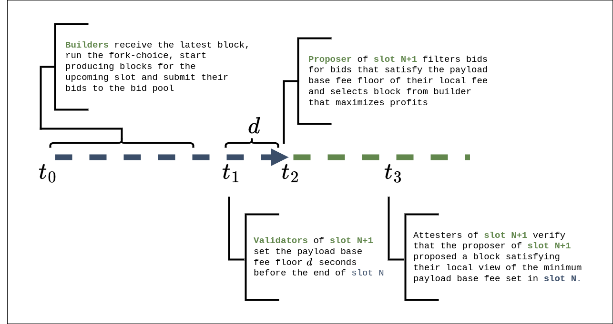
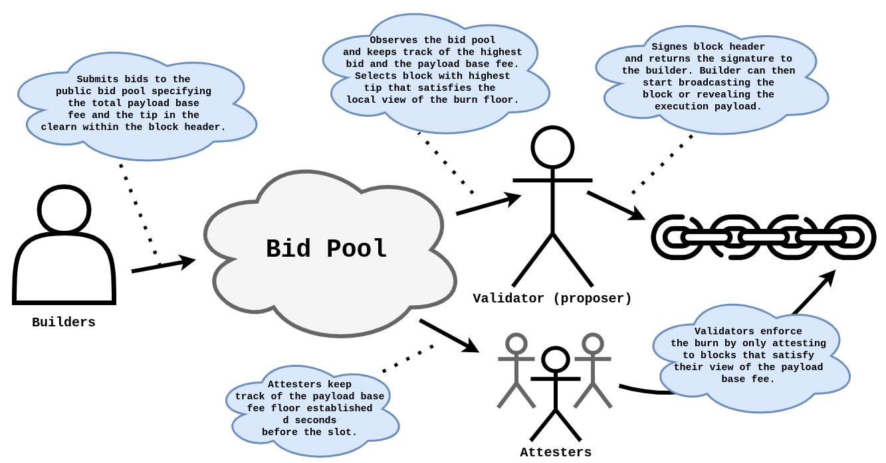
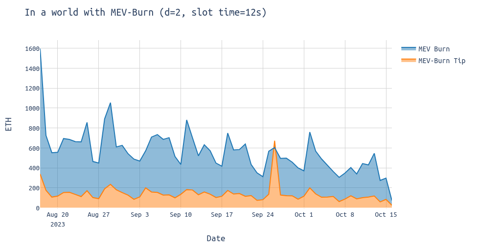
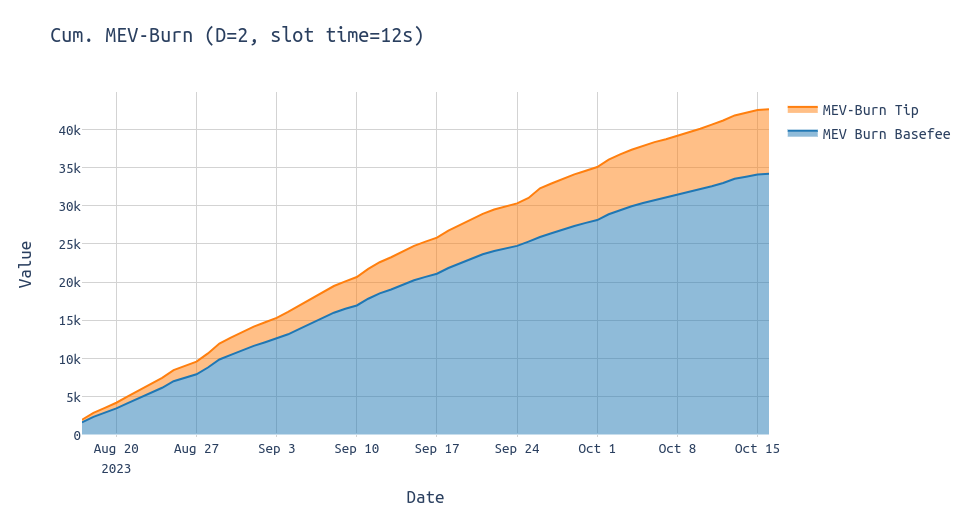
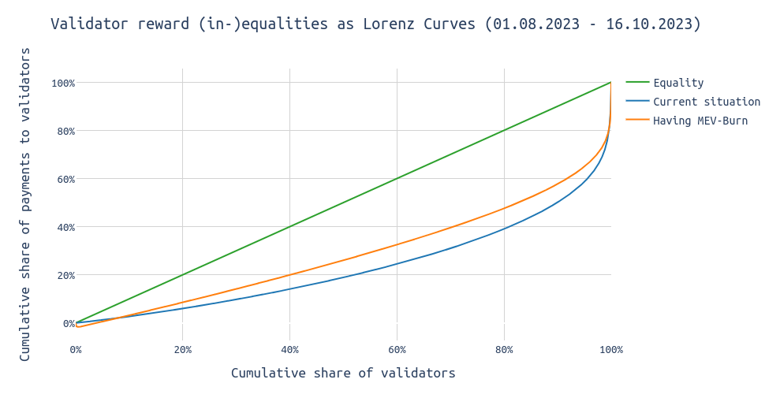
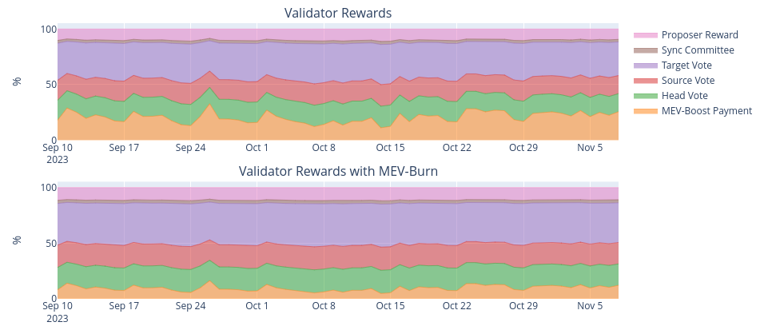
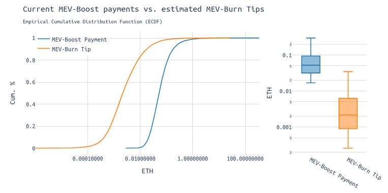
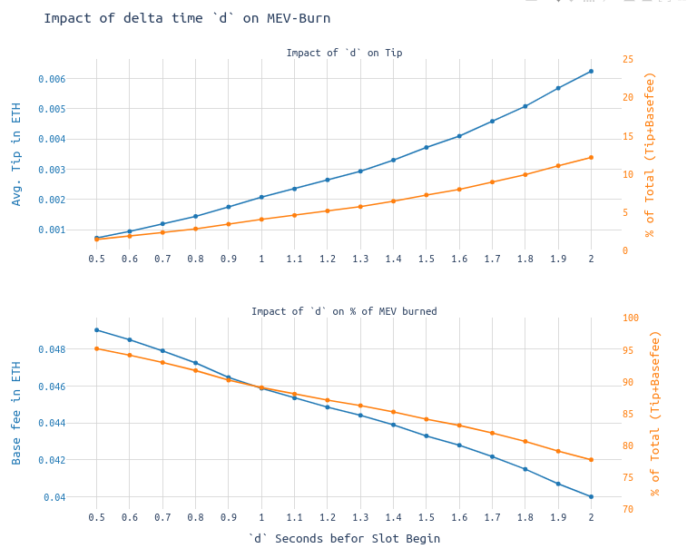

# In a post MEV-Burn world - Some simulated stats

***TL;DR:*** MEV-Burn has great potential in lowering the impact of MEV on the consensus layer incentives. On the downside, it might not be capable of getting rid of MEV lotteries or disincentivize DoS attacks/rug-pools. Tired of reading? The charts are self-explanatory if you got the context.

**Summary:**

* In the past, MEV rewards have overtaken Ethereum's intrinsic consensus layer rewards, making MEV the main economic incentive to participate in Ethereum's consensus.
* With MEV-Burn (and assuming no changes in the bidding dynamics), ~60% of the MEV that currently went to validators would have been burned; in the past 2 months 35k ETH would have been burned.
* The median MEV profits per block proposed may decrease by 96% from ~0.05 ETH to ~0.002 ETH.
* MEV-Burn might decrease the inequality in validator revenue in absolute, as well as in relative terms.
* Although >10 ETH-lotteries become very rare (assuming no changes to the slot time and a delta time $d$ < 2), we will still see >1 ETH jackpots on a quite regular basis.
* The delta time $d$ between setting the payload base fee and the end of the slot might have a linear relationship. Higher $d$ leads to relatively higher MEV-Burn $tip$ for the validator.

*Many thanks to [Mike](https://twitter.com/mikeneuder), [Justin](https://twitter.com/drakefjustin) and [Thomas](https://twitter.com/soispoke) for their feedback and review!*

#### Terminology 
| Term | Explanation |
|:-----------|:----------------|
| MEV-Boost value   | ETH given to validators as a bribe to select a certain block from a builder 
| Payload Base Fee   | Part of current MEV-Boost value that will be burned 
| MEV-Burn Tip   | Part of current MEV-Boost value that will still go to validators

## How is MEV-Burn supposed to work?

[MEV-Burn](https://ethresear.ch/t/mev-burn-a-simple-design/15590) was presented as an add-on to ePBSs, attempting to resolve the negative externalities associated with MEV and PBS. 

MEV-Burn is designed to address several issues. First, validators are being overcompensated for their security tasks, and second, the unpredictable and sporadic nature of rewards generated from MEV and their associated economic dynamics.

MEV-Burn works by setting a fixed deadline within a slot for establishing the payload base fee. At a specific second within that slot, the highest bid becomes the payload base fee, which is then burned. The highest observed bid value until the deadline is burned and the difference between the highest bid value at the end of the slot and what was burned goes to the validator as a MEV-Burn tip.

Other validators are watching and will only attest to blocks that align with their local view of what the minimum base fee should be. There's also a time interval $d$ that ensures everyone has enough time to determine the highest bid by the deadline.
With MEV-Burn, the slot's progression would look much like the following:

As usual, from second $t_0$ (as soon as the builder has observed the latest block), builders begin constructing on the most recent head of the chain. At second $t_2$ in the slot, the proposer selects the most valuable bid that offers them the greatest benefit.

The change introduced by MEV-Burn is that **the maximum bid value observed at second $t_1$ in the slot** will be burned. This burn is **enforced by the protocol**, such that a valid block must always burn the amount of ETH that the majority of the attestors of the current epoch are fine with.

Therefore, builders bid until second $t_2$ in the slot. Then, exactly at second $t_2$ of an attestors perception, attesters check what the highest bid up until second $t_1$ was and remember that value. Following, attesters will then only attest to blocks that burn at least their perceived minimum payload base fee. 

> In a post-ePBS world, builders would submit their bids to a public bid pool. The upcoming proposers and the attestation committée of the upcoming slot pay particular attention to the payload base fee establishing $d$ seconds before the end of the slot. The attesters of the upcoming slot then enforce the burn by only attesting to blocks that satisfy their local view of the payload base fee, by at least burning what they see as the minimum.

Either the block burns at least the amount that the majority of the attesters are fine with or nothing by not making it into the canonical chain.

## Numbers, visualized

The following diagram shows the amount of ETH that would be burned having MEV-Burn in place (blue), as well as the MEV-Burn tip (orange) that would still go to the proposers.

The chart indicates that approximately **10%** of the MEV, which currently flows to validators, would continue to do so. The remaining **90%** would have been burned, which would benefit the entire ETH holder community.

Taking the cumulative over the past two months, it looks like the following:

#### Impact of MEV-Burn
The graph below uses [Lorenz curves](https://en.wikipedia.org/wiki/Lorenz_curve) to visualize the disparities in both validator rewards. These curves are commonly used in economics to illustrate income inequality within a population. Here we can use them to effectively show the uneven distribution of revenue among validators.  
> In this initial step, I've sorted the MEV payouts from smallest to largest and plotted the cumulative sum against the proportion of validators. Then, I've added a constant estimator representing the usual consensus layer rewards.The x-axis shows the cumulative percentage of validators, and the y-axis shows the cumulative share of MEV payouts. 

The "Equality" line represents an ideal scenario where MEV payments are distributed evenly among validators—for example, where 50% of validators receive 50% of the MEV payments. A larger deviation from the equality line indicates a higher level of payout inequality.

The diagram above demonstrates that both, the existing MEV-Boost system and a world with MEV-Burn come with significant payment disparities for proposers. The relative inequality of revenue for proposers would actually decrease with the introduction of MEV-Burn. 

> Importantly, with decreasing payments in absolte terms, their impact on the total validator rewards (CL rewards + EL rewards, where EL rewards = MEV payment) decreased. This is highly desirable.

A lower absolute amount is beneficial as it lessens the incentive to DoS a particular proposer in order to steal the MEV profits from that proposer. Additionally, it might enable staking pool providers such as Rocketpool to decrease their minimum stake while still preventing [rug-pools](https://ethresear.ch/t/mev-burn-a-simple-design/15590).

The chart below shows the reward share of individual tasks carried out by validators over time. The upper diagram shows the reward allocation with the current MEV-Boost setting, while the lower chart shows how the picture in a post-MEV-Burn world would look like. The delta time $d$ is assumed to be 2 seconds. 

Although the impact of MEV on the usual rewards of a validator is reduced, **large-scale [lotteries](https://twitter.com/mevproposerbot)**, influenced by events in the final $d$ seconds after the payload base fee is established, **may still occur** as they do today. 
If the payload base fee is set relatively low and a significant MEV opportunity arises in the last $d$ seconds of the slot, the MEV-Burn tip might drastically exceed the payload base fee. This can lead to a large proposer payment with only a small portion of it being burned.
Depending on the events in an individual slots causing substantial MEV opportunities, MEV lotteries may become smaller, but they won't disappear entirely.

The following chart shows the decrease in MEV profits for validators. **The median MEV profit decreases from 0.05 ETH to 0.002 ETH, representing a 96% decrease.**

Looking into outliers, in the past 60 days, we saw a total of 177 blocks with an MEV-Boost payment of more than 10 ETH. Assuming MEV-Burn with a delta time $d$ of 2 seconds, we'd still have 19 blocks paying more than 10 ETH in MEV-Burn tips to the proposers. Still, the absolute number of these massive lotteries would be drastically reduced.

| MEV payments to proposers (16.08.2023-16.10.2023)| #MEV-Burn Tip   | #MEV-Boost Payments   |
|:-----------|:----------------|:----------------------|
| >10 ETH    | 19              | 177                   |
| >1 ETH     | 696             | 3,920                 |
| >0.1 ETH   | 8,903           | 73,184                |
| >0.01 ETH  | 120,808         | 416,493               |
| >0.001 ETH | 389,956         | 423,254               |

## The perfect delta time 

The delta seconds $d$ introduce a **synchrony assumption**, and its value can be adjusted to **strike a balance between synchrony among attestors and maximizing the amount of MEV that gets burned.**

The delta time $d$ between setting the payload base fee must be carefully chosen:

* It must be long enough to allow attestors to agree on a common base fee, ensuring all validators see the bid in time.
* It must also be short enough to ensure a sufficient amount of MEV gets burned. If we assume MEV increases linearly during a slot and a $d$ of 2 seconds, then 5/6 of the MEV would be burned each slot. 

The following diagram plots the percentage of MEV burned vs. different settings of $d$ of the last 60 days. The upper chart shows the impact of $d$ onto the MEV-Burn tip and the lower chart onto the payload base fee, referred to as "MEV burned".

We can see that setting $d$ to 1 second causes 90% of the MEV payment to be burned, leaving 10% to the proposer. With a $d$ of 2 seconds, 80% of the total would get burned.

## Bypassability and Collusion
There were concerns similar to the currently discussed [ePBS designs](https://notes.ethereum.org/@mikeneuder/infinite-buffet), that MEV Burn might suffer from [bypassability](https://notes.ethereum.org/@mikeneuder/infinite-buffet).
The argument is that builders wouldn't bid until the payload base fee is established (eg. in second 10 in the slot) and then start bidding.
From a builder's perspective, this doesn't make much sense because nothing changes for the builders. The builders still pay what they bid at the end of the slot/beginning of the new slot and can't influence their own profits by not setting a burn floor.
So, from a collusion-standpoint, MEV-Burn doesn't come with additional incentives to collude but is more a neutral mechanism safeguarded by the set of attesters.