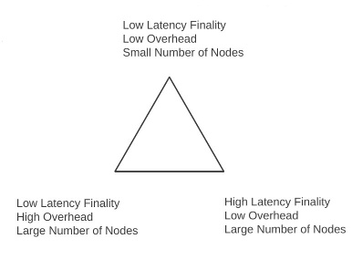
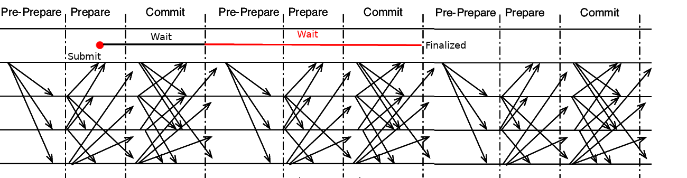

There is a line of thinking that argues in favor of mechanisms that are fork-free; that is, mechanisms that immediately go from zero consensus to some definitive kind of finality, and do not have the possibility of "reorganizations" where partially confirmed blocks can get reverted. This post will argue that:

1. The whole notion of forkful vs fork-free protocols is meaningless
2. The faster confirmations of fork-free algorithms seen in practice are actually because they pick a different point on the finality time / overhead tradeoff curve
3. If we fix a particular point among the tradeoff curve, "forkful" (which actually really means _chain-based_) algos outperform "fork-free" (ie. a specific kind of non-chain-based) algos in terms of a certain kind of concrete efficiency. Specifically, Casper FFG fundamentally has a _better tradeoff frontier_ (in fact, 20% better) than PBFT-style algos, and Casper CBC is potentially even better (in fact, 20-50% better than PBFT-style algos).
4. In the context of non-consensus applications that have surface similarities to consensus, like randomly sampled honest-majority votes, similar arguments apply. Is an randomly sampled honest-majority vote on some property of ongoing data (eg. transactions) is called for, a forkful chain-based system is in fact the best way to conduct such a vote.

-----------------------------

Regarding forkfulness in general, the key thing to understand is fundamentally what forkfulness _is_. In any consensus algorithm, transactions (or collations, blocks, proposals, whatever) start off fully unconfirmed, and at some point become fully confirmed, at which point they cannot be changed without a large number of equivocations. But transactions don't go from one state to the other immediately; at any time in between, clients can make intelligent guesses about the probability that transactions will get confirmed, and this probability for any given transaction goes toward 0% or 100% over time. This ability to make probabilistic guesses **is** partial confirmation, just like blocks in chains with a small number of blocks on top of them. And by definition of probability, these partial confirmations can, at least sometimes, get reverted.

Hence, _all_ consensus algos (except dictatorship, where the dictator _can_ provide a 100% guarantee immediately) are forkful. **It is entirely a client-side decision whether or not to expose the partial confirmation to users**; if a client does not, then the user will see a protocol state that always progresses forward and never (unless the threat model is violated) moves backward, and if a client does, then the user will see new protocol states more quickly, but will sometimes see reorgs.

-----------------------------

To understand the next part, we need to brush up on the finality / overhead / node count tradeoff curve. Recall the funamental inequality:

$\omega \ge 2 * \frac{n}{f}$

Where $\omega$ is protocol overhead (messages per second), $n$ is the number of nodes, and $f$ is the time to finality. Also expressed in Zamfir's triangle:

The argument is simple: in all algorithms of the class that we are considering, you need at least two rounds of messages from every node to finalize something, and at that point there's simply the choice of how often a round of every node sending a message takes place. Whatever is that period length $p$, finality takes twice that time, and the overhead in that period is $\frac{n}{p}$, so $\omega = \frac{n}{p}$, and since $f \ge 2p$, $\omega \ge  2 * \frac{n}{f}$. [see footnote]

Now we can better understand the different points on the tradeoff curve. In PBFT-style algorithms, there is some block time $B$ (eg. 5 seconds), and for any block, $f = B$, so the overhead $\omega = 2 * \frac{n}{B}$. In a purely chain-based algorithm (eg. think Casper FFG, but where blocks are votes), you need $n$ blocks or $n * B$ time to go through every node to do a round of voting, so (for a checkpoint) $f = n * 2B$, and $\omega = \frac{1}{B}$. These are the most extreme points on the curve, though there are ways to get something in the middle (eg. $f = \frac{n * 2B}{50}$, $\omega = \frac{50}{B}$).

So we see that "non-forkful" algorithms can only get low finality time by accepting either high $\omega$ or low $n$, and in reality they are simply one end of a tradeoff curve that has other possibilities. However, as we will see below, at _any_ point on the tradeoff curve, we can improve performance by adding a chain-based structure.

Above, we looked at the finality time of PBFT and Casper FFG from the point of view of _blocks_ (or rounds). But what if we look at it from the point of view of _transactions_? On average, each transaction has to wait 0.5 rounds to get into a round; hence, PBFT's average finality time is actually $1.5* B$, or $3 * \frac{n}{\omega}$.

In Casper FFG, data is finalized two epochs after it is included in a checkpoint, and on average a transaction needs to wait 0.5 epochs to get into a checkpoint; hence, Casper FFG's average finality time is $2.5 * E$, or $2.5 * \frac{n}{\omega}$. Notice that it is specifically Casper FFG's chain-based approach that allows a "commit" for older data to serve double-duty as a "prepare" for newer data and thereby speed up confirmations in this way.

I suspect Casper CBC may in fact have even stronger performance, at least in the case where the interval between checkpoints is longer than one block, as there is no need to wait for a checkpoint; as soon as a transaction is included in a block, two rounds of messages from all validators suffice to include it. This is because the safety oracle gets calculated on all blocks in the chain simultaneously, so a vote performs multiple duty in confirming every block behind it in the chain. Hence, average finality time is $2 * \frac{n}{\omega}$, exactly the theoretical optimum.

Note also that because Casper CBC's chain selection uses a GHOST-based algo, it is fully compatible with fancy DAG algorithms, and in any case other techniques can be used as well to fully explore the tradeoff curve in terms of target time to finality.

-----------------------------

Another use case for this kind of reasoning is data availability voting on collations. Suppose you have a scheme where in order for a collation to be accepted into the main chain, we need signatures from N voters; the purpose of this is to enable "internal-fork-free" sharding where inclusion into the main chain immediately implies final inclusion within that history, while having an honest majority vote as an additional backstop on top of data availability proofs and fraud proofs to ensure that invalid or unavailable chains don't get included in the history.

Suppose collations come once every T seconds, and we want N voters. Then, the overhead to the main chain is $\frac{N}{T}$, and a transaction needs to wait $1.5 * T$ to be finalized (half a collation round expected waiting time to be included in a collation, and then a further $T$ to collect the votes). But instead, suppose that we had a forkful sharding model, where collations are organized into a chain, there is a collation once every $\frac{T}{N}$ seconds (so same $\frac{N}{T}$ overhead), and a collation can no longer be reverted once it is $N$ confirmations deep in the chain. This has the same voting effect, but a transaction needs only to wait $0.5 * \frac{T}{N} + T$ time to be finalized, because of how the chain data structure allows the different stages of finalization to be interleaved with each other. And from a client's point of view, a client can, if it wishes, only look at finalized collations, not see any reversions or forks.

-----------------------------------------------------

Footnote: yes, threshold signatures, client-side random sampling and similar tech exists, but we are considering protocols that provide _cryptoeconomic incentivization_, which you can't do with such schemes because you have to actually process everyone's messages in order to reward or penalize them. Fancy algorithms that achieve consensus in one round of messaging in optimal conditions at the cost of large reductions in fault tolerance also exist, but we're not willing to accept those reductions in fault tolerance :)