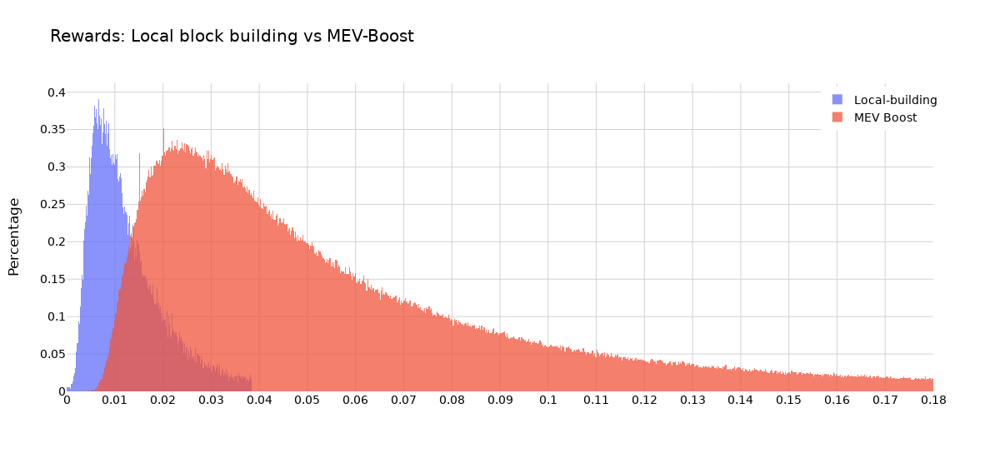
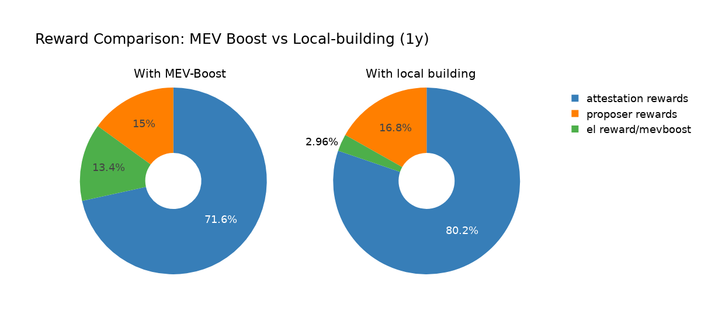

# Is it worth using MEV-Boost?

To answer that question from an economic perspective, we will look into the APYs. 
\> *For simplicity, we assume a total of 1 million active validators and ignore sync-committee rewards.*
\> *The underlying data ranges from November 2023 - 6 June 2024 and includes all slots.* 

First, let's check the **difference between local block building and using MEV-Boost**. 
We can see that the block reward is higher for MEV-Boost users:

**The median block reward increases from 0.0076 to 0.0380 ETH (400% more).**

## What does that mean on an annual basis?

The statistical 2.6 blocks a validator gets to propose per year yield a total of **0.0199 ETH in block rewards**.
For MEV-Boost blocks, the 2.6 blocks yield a total of **0.0998 ETH per year**.

When shown in a pie chart, we can see that the share of the block reward (green) grows from 2.96% to 13.4%, compared to the total expected rewards per year.

### What does that mean for the APY?

For validators **not using MEV-Boost**, the expected annual revenue is **0.929 ETH.**
For validators **using MEV-Boost**, the expected annual revenue is **1.009 ETH.**
**These are additional ~8.6% of revenue.**

**Using MEV-Boost increases the APR from 2.93% to 3.24%.**

For the **APY** (compounding every epoch):

$\text{APY}_{local\ builder} = \left(1 + \frac{\text{APR}}{n} \right)^n - 1  = \left(1 + \frac{\text{0.0297}}{365 \times 225} \right)^{365 \times 225} - 1 = 2.97\%$

$\text{APY}_{mevboost} = \left(1 + \frac{\text{APR}}{n} \right)^n - 1  = \left(1 + \frac{\text{0.0324}}{365 \times 225} \right)^{365 \times 225} - 1 = 3.29\%$

**Finally, using MEV-Boost increases the APY from 2.97% to 3.29%.**

---

Find the code used for this analysis [here](https://github.com/nerolation/is-mevboost-worth-it).