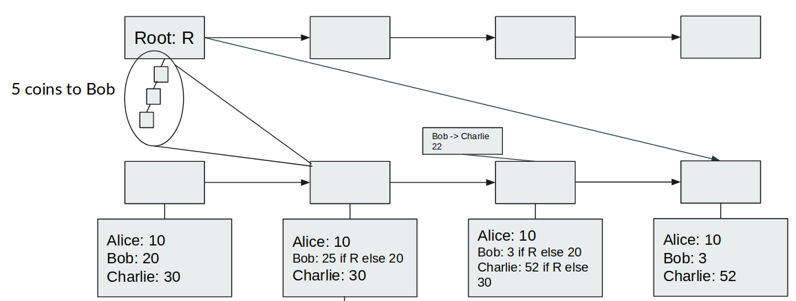
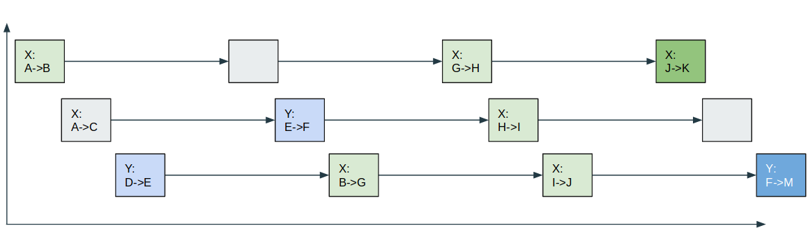

_Special thanks to Karl Floersch and Ben Jones for ideas around Plasma with on-chain publication_

An interesting class of constructions that is starting to appear for eth2 is that where the blockchain is used as a data and computation layer, but there is not a trivial direct mapping between the blockchain state and the actual state (eg. account balances) that users care about.

One example of this is https://ethresear.ch/t/a-layer-2-computing-model-using-optimistic-state-roots/4481, where we create a higher-layer scheme to pretend that cross-shard transactions happen much more quickly than they actually "settle" by storing dependency graphs as part of the state and letting clients figure out what the state _will_ resolve to when all the dependencies settle.

 

In this example, someone sends 5 coins to Bob, but the Merkle root that the receipt depends on for validity will not reach the bottom shard for three blocks. To get around this, Bob's state is stored as a conditional value, storing the balance if R is correct and the balance if R is not correct, and transactions operate on the conditional values. Eventually, the bottom shard learns about R and "collapses the superposition". Bob and Charlie's _clients_ can have private knowledge about the top shard, and can predict early on that R is the correct root, so they can hide the complexity and simply show to the user the expected balances immediately.

### On-Chain Plasma

A more radical construction looks more similar to Plasma Cash. Imagine a system where a smart contract stores assets, and this contract processes an "exit game" with the following rules:

* Anyone can start the process to exit some asset A by providing a Merkle proof of a transaction T in which they become the recipient of A.
* An exit-in-progress can be challenged by providing a transaction T' that was included in the chain later than T and that references T as a parent. This challenge immediately cancels the exit.
* An exit-in-progress can be challenged by providing a transaction T' that was included in the chain earlier than T and that touches A. This challenge can in turn be challenged by providing a child of T' that was still included in the chain earlier than T (or that equals T itself).

Transactions can be included on any shard (or we could restrict to a specific set of shards for each asset).

 

Here, we have a scheme where are using the chain to provide near-instant initial-confirmation guarantees for transactions, and we are using it for data availability (and for computation if there are many exit games at the same time), but we are not really storing the current owner of any asset on chain. Notice that this scheme is easily extensible to synchronous cross-shard transactions: you can just have one transaction that touches any two assets, and simply put that transaction on any shard.

So how would clients know what the application state is? Either they could scan all of the shards on which transactions could legally appear and locate all the transactions relevant to assets that they might own, or they could use a light-client protocol where they ask servers to provide them Merkle proofs of transactions that touch accounts that they care about.

I expect that such schemes are likely to proliferate for several reasons:

* They can provide near-instant cross-shard transactions even if the underlying chain does not provide this functionality
* They can provide synchronous cross-shard transactions
* They can potentially have ~O(log(N)) times more scalability, due to the absence of any need for on-chain Merkle proofs in the normal case
* They can allow near-instant block times due to the ability to send a transaction on one of multiple shards

### Fee market issues

But these schemes pose a significant challenge: they complicate the fee market. Particularly, unless block producers are aware of how all of these layer-2 state schemes work (unlikely; there are just too many possible designs), if someone attempts to pay fees inside of one of these schemes then the block producer has no way to determine whether or not a fee is actually being paid.

Another possible alternative is out-of-band fee payment: anyone wishing to send transactions must also have unencumbered coins that they send to the block producer separately from the transaction they want included. But this is unacceptable because it breaks privacy (eg. see discussion here https://ethereum-magicians.org/t/meta-we-should-value-privacy-more/2475).

The solution that survives is a _relayer market_: an actor that understands some layer 2 state scheme packages others' transactions, claiming fees from them inside of the scheme, and sends along the package as a regular transaction, with a fee paid using unencumbered state.