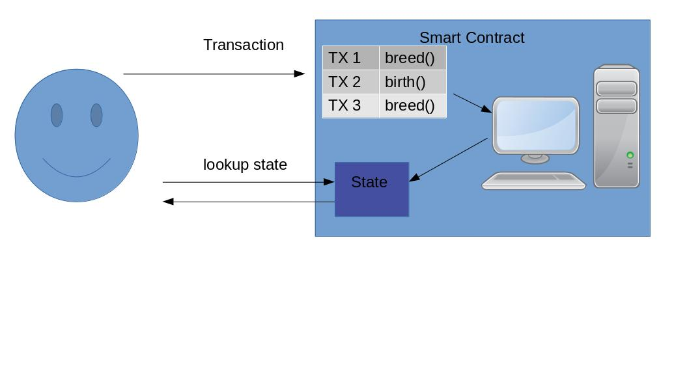
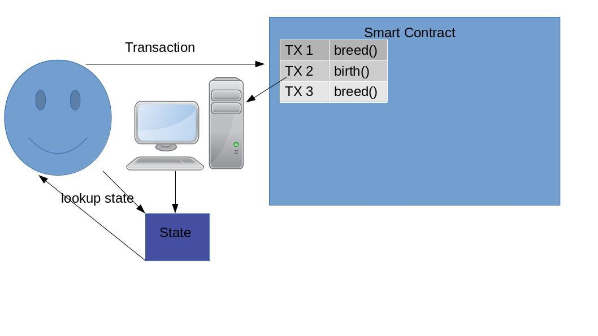

## intro 

The great scaling bake off made us realize that different use cases need different scaling approaches. For example the most popular use case for scaling was transfers or exchanges. This meant developers optimized for various things like making transfers cheap. They did not think about making it cheap to give tokens to 1000's of users. 

This lead us to realized that for different use cases a different scaling solutions are preferred.

For example applications that do not interact with external contracts can use the lazy paradigm. Where basically users publish their transactions on chain but the execution is carried out by the users instead of the smart contract. For more than a brief intro see [here](https://arxiv.org/abs/1905.09274).

## What is lazy approach 

Currently a user creates a transaction, sends it to a smart contract which executes that transaction. The user can then query the smart contract for the current state of the system. 

 

This technique is limited at 15 transactions per second. We can get an improvement of nearly 700 transactions per second (for snarks its 100 TPS)if we instead of executing the transactions in the smart contract we ask the users to execute them. 

 

So a list of transactions is published on chain and then executed by each user independently. They do this to reconstruct the state. Because the transactions are ordered by the smart contract each user will get the same result. 

## Limitations 

1. We can cannot withdraw tokens from the lazy world to regular etheruem. 
2. Users have to execute a bunch of transactions. 
3. You can have limited ability to inter op

## Launch strategy

A lot of projects have a launch strategy where they first launch a centralized solution and then fully decentralize it over time. This makes sense and allows teams to test and experiment. 

We propose to add the lazy launch strategy
1. A project launches the lazy version where the users need to execute every transaction themselves. There is limited inter op to other lazy applications. 
2. They transition to optimistic or zk rollup to provide scalability and interoperability. 

## Example Projects 

1. ZKP based reputation system: Here the cost of execution on chain is very expensive ~ 7 USD per operation. Seems like a lazy soft launch can allow for experimentation in the short term while inter op can be added later with scalability. 
2. Games: A lot of games would happily trade off interoperability in the short term while they build a community of users. Then unlocking this later once scaling solution has been built. 
3. Decentralized Social Media: Because the value of social media is inherently social it does not need to be validated on chain it can just be committed to on chain so other users can reconstruct the state. This example is especially compelling with a reputation system included. 
3. Exchange: Users could deposit their erc20s but then they have to wait to withdraw them until the scaling solution is done. Also the developers could steal the funds by providing a broken scaling solution that they could hack. 

## Conclusion 

Lazy approach works well for things who's value is "off chain first". For example if I have 10 reputation in a system i can use that off chain to get into a special party or join a message board. 1 eth is only valuable when it is fungible. Would 1 eth be as valuable if it was locked inside some scaling solution where it was unclear if / when the devs would allow you to withdraw it. 

We wont be able to inter op with other ethereum smart contracts. Other contracts will be able to give reputation to others. 

In the mean time having an off chain first reputation systems and games makes a lot of sense while we build. It will allow us to bootstrap and learn how people use these systems while we work to scale them.