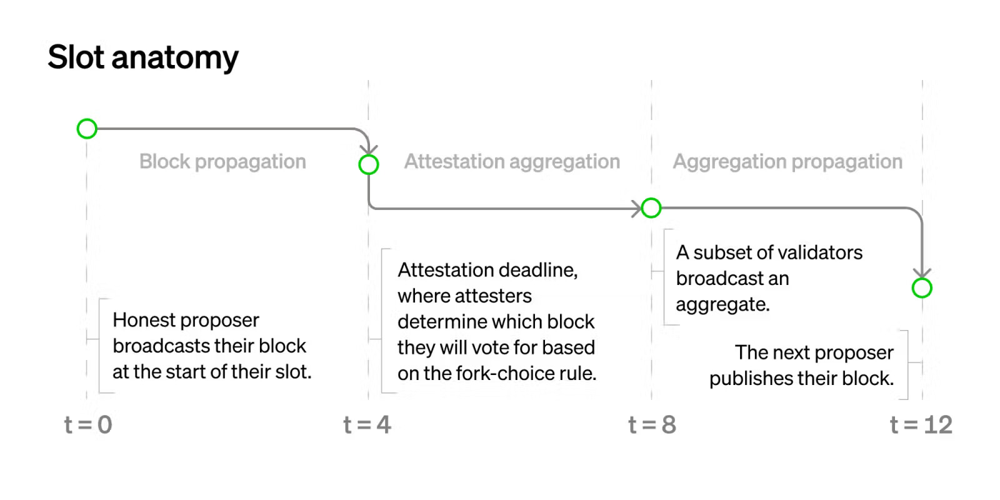

_Epistemic status: early exploration_

Recently, there has been discussion about more aggressive ways to reduce Ethereum's slot time. This can be done in two ways:

1. Reducing the $\delta$ parameter (our assumption on maximum expected network latency). This can only be done safely if we get improvements at the p2p layer that reduce latency
2. Re-architecting the slot structure to reduce the number of network latency rounds in one slot.

There is significant p2p hardening and optimization work going on to enable (1); the top candidate for enabling a significant speedup is erasure coding. Research work is focusing on (2).

This post will argue that the optimal approach to (2) may be to move somewhat away from the tight coupling between slots and finality introduced in [3SF](https://ethresear.ch/t/3-slot-finality-ssf-is-not-about-single-slot/20927), and instead have a more separate LMD GHOST fork choice rule and finality gadget, with different participant counts.

First, let's look at the current slot structure ([source](https://www.paradigm.xyz/2023/04/mev-boost-ethereum-consensus)):

$\delta$ here is 4 seconds. The first section (block propagation) is unavoidable. Now, notice that there are _two_ stages related to attestations: aggregation and propagation. This takes place because there are too many attestations (~30,000 per slot) to gossip directly. Instead, we first broadcast a subset inside of a subnet, and then we broadcast aggregates inside of a global p2p network.

If we were to increase the validator count much more (eg. to 1 million per slot), we may have to go up to _three_ stages to keep the size of each stage manageable (indeed, [previous writing](https://notes.ethereum.org/@vbuterin/single_slot_finality#What-might-the-exact-consensus-algorithm-look-like) suggested exactly this).

In general, we can approximate:

$aggregation\_time = log_C(validator\_count)$

Where **$C$ is the capacity: how many signatures can be safely simultaneously broadcasted within a single subnet**. It seems like realistic values for $C$ are in the hundreds or low thousands. If we want to be quantum-resistant, we should assume more conservative numbers (eg. if a quantum-resistant signature takes up 3 KB and there's 256 of them per slot, that's 768 kB per slot, roughly similar to worst-case execution block sizes).

Finality depends on the "full validator set" participating; [perhaps 8192](https://ethresear.ch/t/sticking-to-8192-signatures-per-slot-post-ssf-how-and-why/17989) if we either (i) accept more staking centralization or mandatory delegation or (ii) do [Orbit](https://ethresear.ch/t/orbit-ssf-solo-staking-friendly-validator-set-management-for-ssf/19928), and much more (likely $10^5$ to $10^6$) otherwise. That is, either $C^2$ or $C^3$ depending on our assumptions.

Meanwhile, a stable LMD GHOST instance only requires a randomly selected quorum participating; here, size 256 (ie. less than $C$) is acceptable to achieve [very low failure rates](https://vitalik.eth.limo/general/2017/12/31/sharding_faq.html#how-is-the-randomness-for-random-sampling-generated).

What this implies is that any approach that attempts to do one step of finalizing consensus per slot will inherently take $3\delta$ or $4\delta$ (adding in one $\delta$ for the proposer). Meanwhile, if we _don't_ do that, one step will only take $2\delta$.

This brings me to my key proposal:

1. Have an **LMD GHOST chain where ~256 validators are randomly selected per slot**. Use this as the primary "heartbeat"
2. Have a **finalizing consensus mechanism trail closely behind** (realistically, finalize in perhaps $12\delta$), that uses _all_ the active validators. Don't try to couple LMD GHOST votes and finalizing consensus votes; treat them as fully separate.

This gives us the following benefits:

1. Very fast slot times that are good enough for the normal case, without changing any security assumptions (because the "aggregation" step is no longer part of the slot time)
2. We get much more freedom to choose a finalizing consensus mechanism, including taking off-the-shelf traditional ones (eg. Tendermint), although we do need to think about compatibility; roughly, "prepared" chains need to win the fork choice rule (similar criterion to [2017-era PoW-based Casper FFG](https://arxiv.org/abs/1710.09437))
3. We get a natural answer for "how to handle inactivity leaks": during an inactivity leak, the LMD GHOST chain continues, the finalizing consensus stops. The LMD GHOST chain itself then deteremines the progression of the inactivity leak, which determines when finalization can recover.
4. We get much more freedom to take more ambitious choices for the consensus step (eg. 1 ETH validator req and 1 million validators)
5. More simplicity, because there are fewer interaction effects, and because we can get higher valdiator counts without needing Orbit-like techniques.