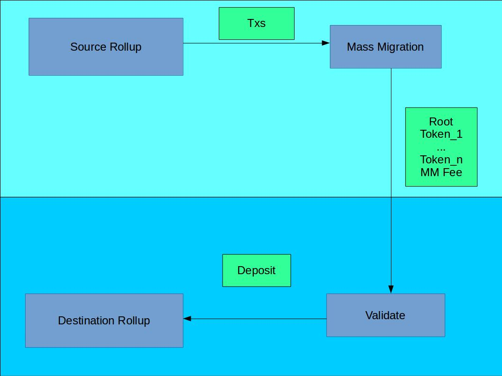

## Intro 

A pressing concern for rollups is user lockin. As gas price continue to rise. More and more people will hold funds which is not economical for them to withdraw to layer 1. As an example at the moment a transfer in rollup costs ~0.01 usd while a withdraw costs at least 0.40 USD. This means that if a user deposits 1 USD. Sends someone else 0.40 USD then both will effectively never be able to withdraw these funds unless the gas price goes down. They can transact internally. 

This is really scary because users can get locked in to a certain rollup. It is unlikely that we will build the best version of rollup in the next six months. We will probably build multiple different versions that are good for different things. If users get locked in to the first few versions of layer 2 that we build it could be a problem for these users and the whole community. 

Here we describe mass migrations where users can transfer from layer 2 to another layer 2 in a way that batches the token transfers + on chain gas costs. This post build upon https://ethresear.ch/t/batch-deposits-for-op-zk-rollup-mixers-maci/6883

## What it looks like 

We have a source rollup and a destination rollup. We want users to withdraw from one to the other. So the source coordinator use mass migrations to combine many transfers together so that the total amount can be sent in one transaction. 

On the destination side the migration is validated by the coordinator of the destination rollup. This involves 

1. Proving that the data is available (this is required to allow trustless mass migrations)
2. Checking that the balance transferred == the sum of the balance of every leaf. 

After these checks the mass migration can be merged into the destination state tree. 

## Translation 

If both rollup follow the same standards they can mass migrate as above. 
If they do not we will need to add an extra step of translate between mass migration and validate. In this step a coordinator converts from one format to another. 

Things that should be the same 
* signature 
* Public Key Index Mapping. This is how do I map the from index to public key.
* hash function 
* leaf format

For example migrating from zk to optimistic rollup may require this translation. 

## Incentives

When users mass migrate they need to pay fees on the source and the destination. On the source they pay a fee directly to the source coordinator as they do in other transactions. 

The destination side allows mass migrations only with a predefined fee in eth. This fee is paid directly from source coordinator at the time of the mass migration. The destination coordinator can then validate the mass migration in order to include the transactions and receive the fee. 

There is risk here that the gas price will fluctuate and the mass migration fee defined in the source rollup will not be enough to cover the cost of validating. NOTE: Think about this more

## Orbits (Linking validity + data availability)

If a rollup wants to

* Speed up mass migrations (for optimistic rollup only)
* Make mass migrations cost o(1)

They can choose the "orbit" the source rollup. Orbit means that you 
1. Use the same standard for leaf, signature, public key availability. 
2. Trust the validity of the source. For zkrollup this means trusting that the security of the zksnark and trusted setup and smart contracts. For optimistic rollup this means that if the source rolls back you roll back to the point if you history where you last accepted a mass migration from that source. 

The orbit pattern means you can continue optimistically on the destination side before a mass migration has been finalized on the source side ie the tokens have been transferred. It is also a good upgrade pattern where you can allow users to migrated from the old rollup chain to a new one at the cost of about a single transfer. 

## Conclusion 

In order to allow for mass migrations to happen efficiently we need to standardize between rollups. Its probably best to standardize the flavors first. As ZK and optimistic do not use the same primitives. But efforts to standardize components and mass migrations would probably pay future dividend in a more robust ecosystem of solutions where networks effect is not the be all and end all. 

At the moment rollups are naturally monopoly forming. Its important that we build rollups in a way that users can exit without the prohibitive cost that current solutions provide. Its too early to build the perfect solution. We should instead try and build in a way that allows users to upgrade and change as the tech evolves. 

User lockin in a big problem that we need to be careful about.