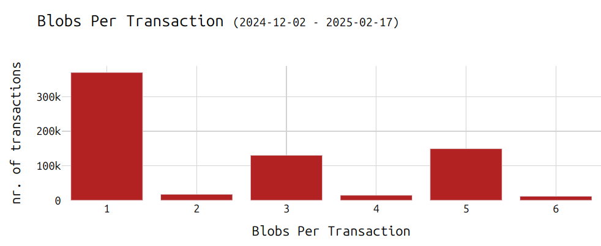
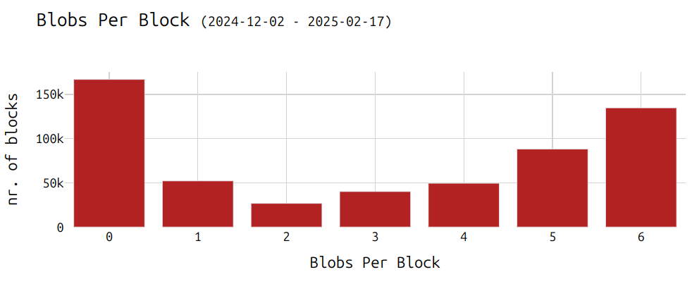
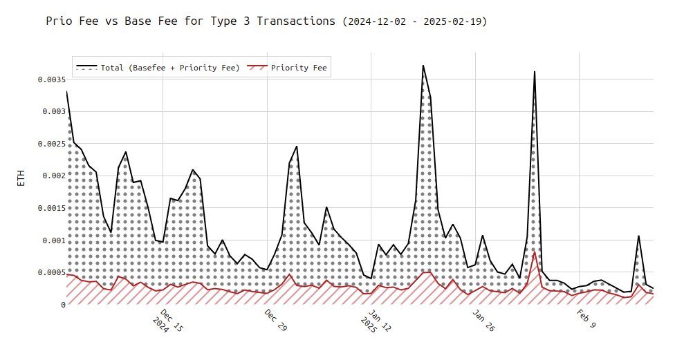
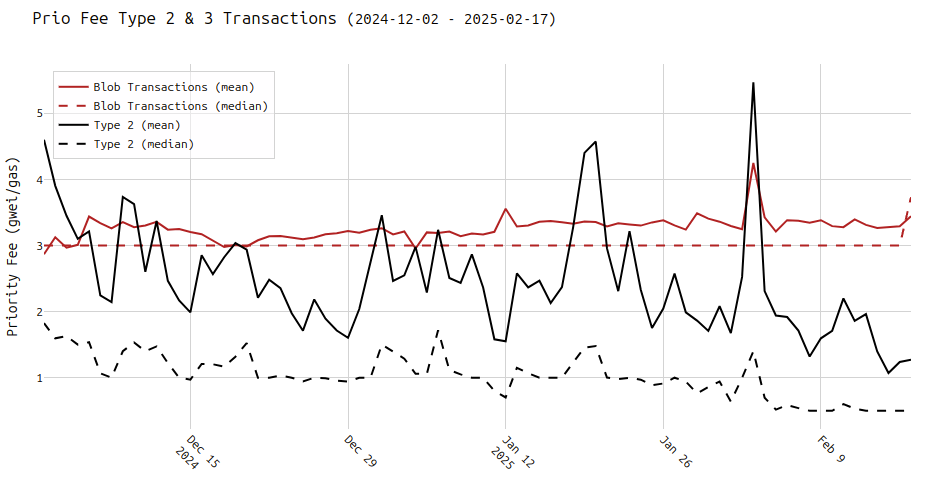
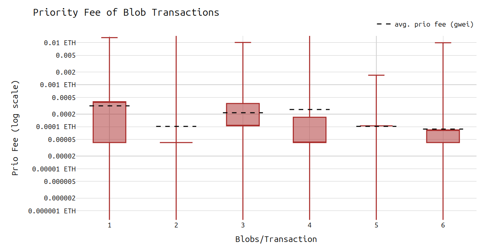
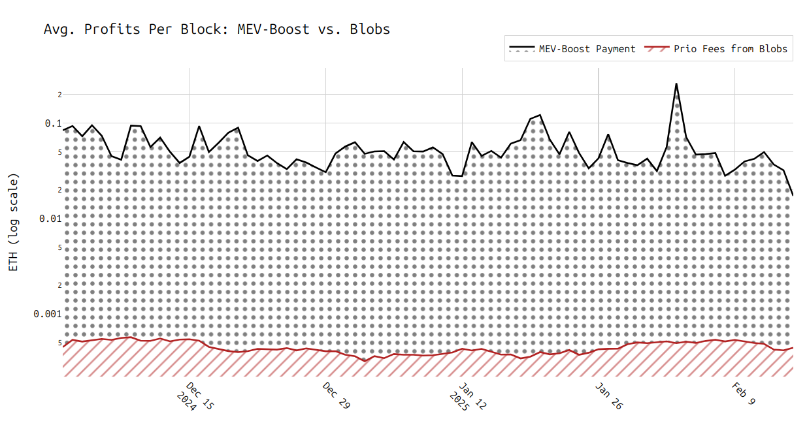

## Max-Blobs Flag: Economic Perspective

> Special thanks to [dataalways.eth](https://x.com/Data_Always) for feedback and review!

The `max-blobs` flag, which allows local builders to limit the number of blobs included in a block, has been discussed for some time. [Originally proposed](https://hackmd.io/ljsmwo6QQ8i3zqToZUPs2A#On-raising-the-blob-count-in-Pectra) by [Alex Stokes](https://x.com/ralexstokes) during an ACD call in late 2024, this feature gives local builders more control over block construction, helping them manage the workload of processing blob-heavy blocks.

### Background and Evolution

At the time of the original proposal, blob usage among builders was quite uneven:
- Some builders included only very few (or no) blobs (see [here](https://ethresear.ch/t/blobs-reorgs-and-the-role-of-mev-boost/19783)). This improved over time.
- Others considered the cost of blob inclusion too high to justify adding them (blob transactions did not pay enough) (see [here](https://ethresear.ch/t/blobs-reorgs-and-the-role-of-mev-boost/19783)).
- As a result, local builders frequently ended up including more blobs (often 6-blob transactions) than MEV-Boost builders, who opted not to include many blob transactions.
- Over time, Ethereum clients have undergone performance optimizations, leading to the lowest reorg rate since the Merge (see [here](https://ethresear.ch/t/steelmanning-a-blob-throughput-increase-for-pectra/20499)).

### Key Takeaway

- Empirically, the economic impact of using a `max-blobs` flag would have been negligible.
- This flag is intended for local builders who have experienced reorgs and do not rely on MEV-Boost. MEV-Boost users remain unaffected, as relays and specialized builders handle block propagation.
- Setting a maximum of three blobs would have resulted in an estimated loss of about 1.5 USD per block in foregone priority fees.

> The data used in the following analysis ranges from Dec. 2024 to February 2025 and contains all transactions in that time frame.

## Understanding Blob Inclusion

Currently, a single blob transaction can carry anywhere from 1 up to the maximum number of blobs allowed per block (6 blobs).

- Most blob-carrying transactions today include 1, 3, or 5 blobs:

- Looking at how blobs appear per block, it seems 5-blob transactions are often paired with 1-blob transactions. This combination leads to the distribution shown below:

### Priority Fees and Blob Economics

There is no direct priority fee for including blobs themselves; they have a separate base fee but no priority fee. The incentive for including a blob transaction comes solely from the gas used by the Type-3 transaction that carries the blobs.

To incentivize builders to include a transaction, an L2 can set a higher priority fee for that transaction. 

**Two common hypotheses arise:**

1. **A transaction with 6 blobs should pay a higher priority fee than one without blobs if users rely on priority fees to incentivize blob inclusion.**  
2. **Transactions with more blobs should pay higher overall fees (and priority fees) to compensate for the additional bandwidth and DA costs.**

#### Checking (1)

* The following chart compares the priority fees of Type-2 and Type-3 transactions:

We can see that **blob transactions pay more in priority fees than Type-2 transactions**. Notably, the division by "gas" doesn't include blob gas. Thus, the above chart shows the gas costs per unit of gas spent on the transaction that ends up at the block's `COINBASE`.

#### Checking Hypothesis (2)

* The next chart illustrates how the number of blobs correlates with total priority fees:

It turns out that while Hypothesis (2) is correct (transactions with more blobs do pay more overall), this does not apply to the **priority fee** specifically. Regardless of the number of blobs, the priority fee to the block’s `COINBASE` remains nearly the same as the number of blobs increases.

This outcome is somewhat counterintuitive. One might expect 6-blob transactions to be ignored if their priority fees are not significantly higher than 1-blob transactions. However, this doesn’t seem to be the case, likely due to the limited number of blob transactions and the fact that proposers may not have much choice in selection. Over time, the market may self-correct as builders realize they could earn more priority fees by including multiple 1-blob transactions instead of a single 6-blob transaction—unless the latter pays significantly more in priority fees. Prioritizing blob transactions by `priorityFee/nr_blobs` would help, but a more sophisticated packing algorithm is still needed.

#### The Role of `max-blobs`

When using `max-blobs`, a local builder is effectively restricting the set of transactions it considers. If a sender signs a transaction with the maximum number of blobs, the builder’s only options are to include it as-is or exclude it entirely. A `max-blobs` setting of 3 means the proposer (i.e., local builder) automatically discards any transaction that carries more than 3 blobs.

> **Note:** It’s not possible to split a single transaction’s blobs across multiple smaller transactions. The bundle of up to 6 blobs is atomic; it must be included or excluded as a whole.

## How Much Revenue is Lost by Using `max-blobs`?

In practice, using `max-blobs` does not create a direct monetary loss; it only forgoes some potential extra priority fees. For example, setting `max-blobs=3` excludes transactions with 4 or more blobs, resulting in lost priority fees from those transactions.

On average, **blob transactions pay around 0.0005 ETH** (about 1.5 USD, assuming 1 ETH = 3000 USD) in priority fees. The table below summarizes the estimated losses (i.e., missed opportunities) at various `max-blobs` settings (only 70% of blocks contain blobs, which is considered in the following):

| `max-blobs` flag | Missed Priority Fees (ETH) per proposed block | Missed Fees in USD (1 ETH = 3000 USD) | % of Total Priority Fees |
|:-----------------|:----------------------------------|:-------------------------------|:----------------------|
| max-blobs=0      | 0.00029581 ETH per proposed block | 0.88741785 USD                 | 1.2691 %              |
| max-blobs=1      | 0.00026466 ETH per proposed block | 0.79398322 USD                 | 1.1355 %              |
| max-blobs=2      | 0.00023866 ETH per proposed block | 0.71599078 USD                 | 1.0239 %              |
| max-blobs=3      | 0.00021600 ETH per proposed block | 0.64800100 USD                 | 0.9267 %              |
| max-blobs=4      | 0.00016755 ETH per proposed block | 0.50263688 USD                 | 0.7188 %              |
| max-blobs=5      | 0.00011694 ETH per proposed block | 0.35080566 USD                 | 0.5017 %              |
| max-blobs=6      | 0.00000000 ETH per proposed block | 0.00000889 USD                 | 0.0000 %              |

**Note: These estimates are based on historical data and may no longer be fully accurate.**

> ^ the methodology for the table above works as follows:
First, I calculated the average revenue per slot, including all blob transactions regardless of blob count. Then, I recalculated the average revenue per slot, this time excluding transactions that exceeded the blob limit set by the max-blobs flag.

### Significance of These Losses

For local builders (who do not leverage the low-latency MEV-Boost infrastructure), these priority fee losses are minor in comparison to the larger MEV rewards already being missed. In other words, if a proposer is not using MEV-Boost, the additional lost revenue from blob transactions is relatively small.

Local builders earn an average of 0.0233 ETH in priority fees per block. Excluding Type-3 transactions could reduce EL profits by approximately 1.2% to 1.5%. For bandwidth-constrained proposers, this trade-off may be justified if it improves block propagation and lowers the risk of reorgs.

***Find the code for this analysis here:***
https://github.com/nerolation/max-blob-flag-analysis