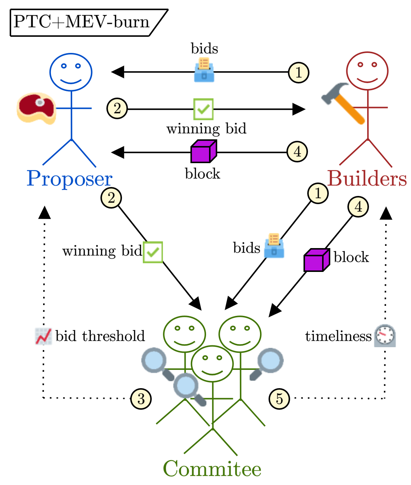
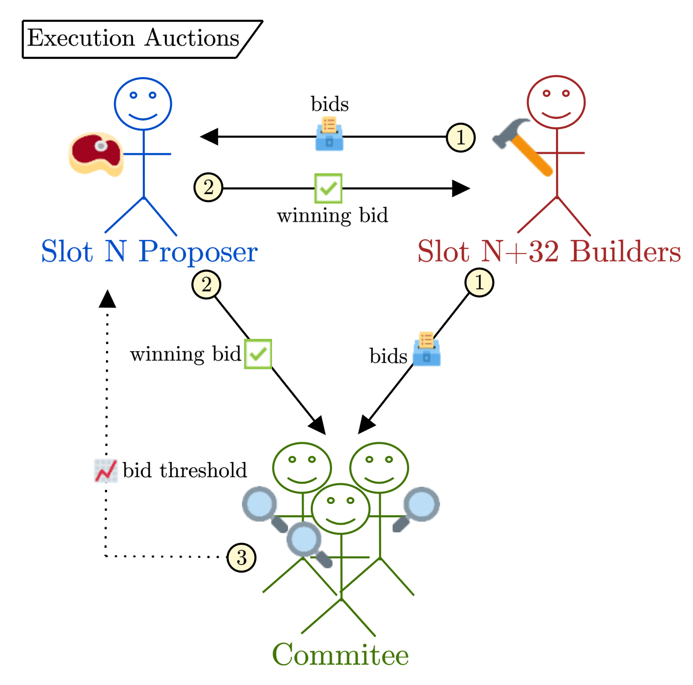
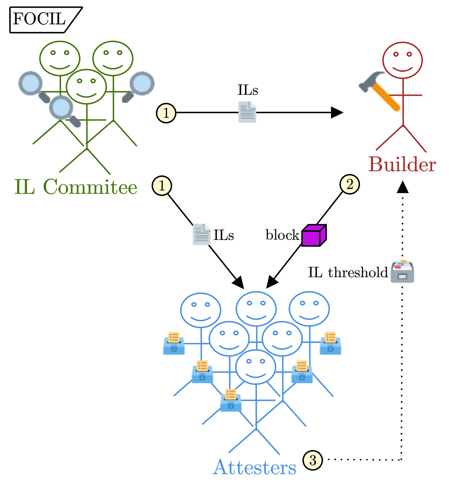
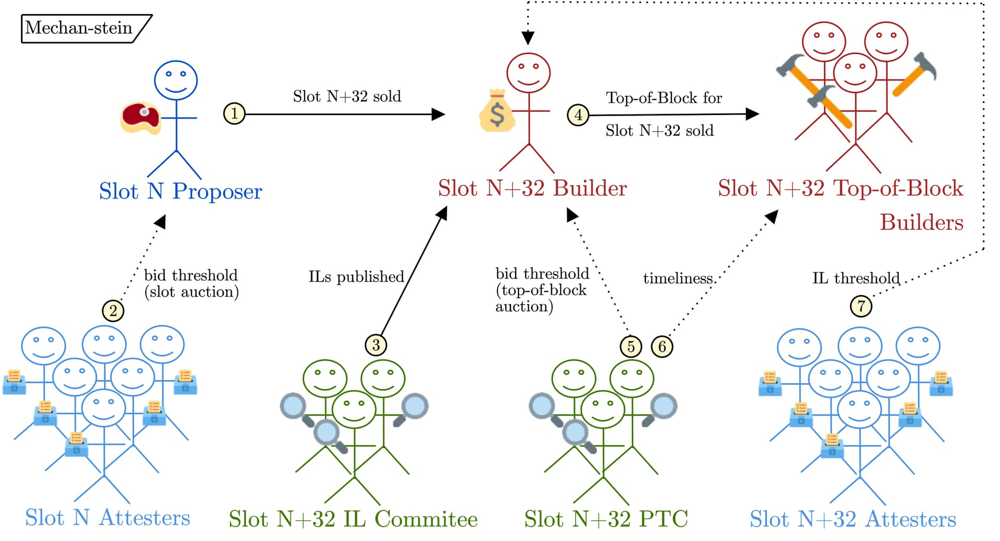

# Mechan-stein (alt. Franken-ism) 
<small>*^ [choose your own adventure](https://x.com/VitalikButerin/status/1788489148183019929) – either way, just trying to portmanteau 'Frankenstein' and 'Mechanism.'*</small>

***^"don't worry bro, just one more auction, i swear. check it out." h/t Mallesh for the relevant [tweet](https://x.com/malleshpai/status/1748026472923623619).*** 

$\cdot$
*by [mike](https://twitter.com/mikeneuder) – wednesday; august 21, 2024.*
*^hbd [Bo](https://en.wikipedia.org/wiki/Bo_Burnham). if you, dear reader, haven't seen ["Inside"](https://en.wikipedia.org/wiki/Bo_Burnham:_Inside) or ["Inside Outtakes,"](https://www.youtube.com/watch?v=5XWEVoI40sE) watching them is your homework assignment.*
$\cdot$
*Many thanks to [Barnabé](https://x.com/barnabemonnot), [Julian](https://x.com/_julianma), [Thomas](https://x.com/soispoke), [Jacob](https://x.com/jacobykaufmann), [mteam](https://x.com/mteamisloading), [Toni](https://x.com/nero_eth), [Justin](https://x.com/drakefjustin), [Vitalik](https://x.com/vitalikbuterin), [Max](https://x.com/MaxResnick1), and [Mallesh](https://x.com/malleshpai) for discussions around these topics and comments on the draft!*
$\cdot$
*The idea for the combined mechanism explored in [Part 2](#p-49714-h-2-mechan-stein-9) of this post came from a Baranbé-led whiteboarding session and accompanying [tweet thread](https://x.com/barnabemonnot/status/1808444733305258047). These ideas are also explored in the [this doc](https://efdn.notion.site/Block-construction-session-bd611621250f45948eff05fcf6a34067?pvs=4), which inspired [this talk](https://github.com/michaelneuder/talks/blob/268e273b55cf2c753b2479c3ebbb826d41811754/misc2024/sbc.pdf).*
$\cdot$
**tl;dr;** *We sketch a high-level framing for Ethereum block construction centered around the design goals of encouraging builder competition, limiting the value of validator sophistication, and preserving the neutrality of block space. We then highlight three proposed mechanisms and how they interface with the established desiderata. We conclude by exploring the potential synergies of combining these designs into a single flow, called `Mechan-stein`.* 
$\cdot$
**Contents**
(1) [The building blocks of block-space market design](#p-49714-h-1-the-building-blocks-pun-intended-of-block-space-market-design-2)
&nbsp;&nbsp;  [Enshrined PBS & MEV-burn via PTC](#p-49714-enshrined-pbs-mev-burn-via-ptc-3)
&nbsp;&nbsp;  [Execution Auctions (an Attester-Proposer Separation instantiation)](#p-49714-execution-auctions-an-attester-proposer-separation-instatiation-5)
&nbsp;&nbsp;  [FOCIL](#p-49714-focil-7)
(2) [Mechan-stein](#p-49714-h-2-mechan-stein-9)
&nbsp;&nbsp;  [Potenital Issues with Mechan-stein](#p-49714-potential-issues-with-mechan-stein-10)
$\cdot$

**Related work**
| Article | 
|---|
|[*More words on Proposer-Builder Separation*](https://mirror.xyz/barnabe.eth/QJ6W0mmyOwjec-2zuH6lZb0iEI2aYFB9gE-LHWIMzjQ) |
| [*Notes from block construction session*](https://efdn.notion.site/Block-construction-session-bd611621250f45948eff05fcf6a34067?pvs=4) |
|[*MEV-burn*](https://ethresear.ch/t/burning-mev-through-block-proposer-auctions/14029) | 
|[*PTC*](https://ethresear.ch/t/payload-timeliness-committee-ptc-an-epbs-design/16054) | 
|[*FOCIL*](https://ethresear.ch/t/fork-choice-enforced-inclusion-lists-focil-a-simple-committee-based-inclusion-list-proposal/19870) | 

---

# [1] The building blocks (pun intended) of block-space market design

Since before the Merge, [much](https://github.com/michaelneuder/mev-bibliography) has been (and continues to be) written about Ethereum's transaction supply chain and block-space market design. I still think Vitalik's [*Endgame*](https://vitalik.eth.limo/general/2021/12/06/endgame.html) summarizes the best-case outcome most succinctly with,
> *"Block production is centralized, block validation is trustless and highly decentralized, and censorship is still prevented."*

We can operationalize each of these statements into a design goal for our system:
1. *"Block production is centralized."* $\rightarrow$ MEV is a fact of life in financial systems, and some actors will inevitably specialize in its extraction. We can't expect solo-stakers to run profitable builders, but we can encourage competition and transparency in the MEV markets. When discussing `MEV-boost`, we usually describe it as aiming to democratize access to MEV for all proposers (which it does extremely well), but one under-discussed element of the existing system is that it *encourages builder competition* by creating a transparent market for buying block space. There are (and always will be) advantages and economies of scale for being a big builder (e.g., colocation with relays, acquiring exclusive order flow deals, and holding large inventory on various trading venues – for more, see this [recent paper](https://arxiv.org/pdf/2407.13931) from Burak, Danning, Thomas, and Florian), but anyone can send blocks and compete in the auction. Another important element of `MEV-boost` is that the auction happens Just-In-Time (JIT) for the block proposal, making [timing games](https://ethresear.ch/t/on-attestations-block-propagation-and-timing-games/20272) around the block proposal deadline valuable to the proposer who serves as the auctioneer. Still, the real-time nature of the auction ensures that the builder with the highest value *for this specific slot* wins the auction (rather than, e.g., the builder with the highest average value for any slot – see [Max & Mallesh's argument](https://arxiv.org/pdf/2408.03116) for why ahead-of-time auctions are more centralized). This leads to **design goal \#1: encourage builder competition.**[$^{[1]}$](#fn1dst)
2. *"Block validation is trustless and highly decentralized"*[$^{[2]}$](#fn2dst) $\rightarrow$ Ethereum's primary focus has been preserving the validator set's decentralization (why this is important in item #3 below). This fundamental tenet instantiates itself in both the engineering/technical design and the economic/incentive design. On the engineering front, the [spec](https://github.com/ethereum/consensus-specs/tree/dev) is written with the [minimum hardware requirements](https://docs.ethstaker.cc/ethstaker-knowledge-base/hardware/hardware-requirements) in mind. This constraint ensures that participation in Ethereum's consensus is *feasible* given (relatively) modest resources. On the economic level, the goal is to minimize the disparity in financial outcomes between at-home stakers and professional operators. Beyond feasibility, this aims to make at-home staking *not too irrational.* This double negative is tongue-in-cheek but hopefully conveys the message of trying to ensure there is some economic viability to at-home staking rather than staking through a centralized provider. Another lens for interpreting this is keeping the marginal value of sophistication low. We can't expect at-home operators to have the exact same rewards as Coinbase and Lido (e.g., because they may have higher network latency), but the centralized staking providers shouldn't benefit greatly from sophistication. This leads to **design goal \#2: limit the value of validator sophistication.**
3. *"Censorship is prevented."* $\rightarrow$ Credible neutrality is what differentiates crypto-economic systems from FinTech. If centralized entities determine which transactions land on chain and which do not, it's over. To ensure the anti-fragility and neutrality of Ethereum, we must rely on a [geographically distributed](https://collective.flashbots.net/t/decentralized-crypto-needs-you-to-be-a-geographical-decentralization-maxi/1385) validators; the validator set is the most decentralized part of the block production pipeline. In my opinion, (i) the main point of having a decentralized validator set is to allow those validators to express different preferences over the transactions that land on chain ("high preference entropy" – [h/t Dr. Monnot](https://ethresear.ch/t/unbundling-staking-towards-rainbow-staking/18683)), and (ii) relying on this decentralization is the only way to preserve neutrality of the chain (c.f., [*Uncrowdable Inclusion Lists*](https://ethresear.ch/t/uncrowdable-inclusion-lists-the-tension-between-chain-neutrality-preconfirmations-and-proposer-commitments/19372) for more discussion on chain neutrality). This leads to **design goal \#3: preserve the neutrality of Ethereum block space.**

Right. To summarize:

1. *"Block production is centralized."* $\rightarrow$ **design goal \#1: encourage builder competition.**
2. *"Block validation is trustless and highly decentralized"* $\rightarrow$ **design goal \#2: limit the value of validator sophistication.**
3. *"Censorship is prevented."* $\rightarrow$ **design goal \#3: preserve the neutrality of Ethereum block space.**

Ok. This is all great, but let's talk specifics. Many proposals aim to accomplish some of the design goals above. I am going to focus on three: 
1. **Enshrined [Proposer-Builder Separation](https://barnabe.substack.com/p/pbs) & [`MEV-burn`](https://ethresear.ch/t/burning-mev-through-block-proposer-auctions/14029) via [Payload-Timeliness Committee](https://ethresear.ch/t/payload-timeliness-committee-ptc-an-epbs-design/16054)** (abbr. `PTC` onwards).
2. **[Execution Auctions](https://mirror.xyz/barnabe.eth/QJ6W0mmyOwjec-2zuH6lZb0iEI2aYFB9gE-LHWIMzjQ)/Attester-Proposer Separation**.
3. **[Fork-Choice Enforced Inclusion Lists](https://ethresear.ch/t/fork-choice-enforced-inclusion-lists-focil-a-simple-committee-based-inclusion-list-proposal/19870/5?u=barnabe)** (abbr. `FOCIL` onwards).

This may seem jargon-laden, and I apologize; please check out the links for the canonical article on each topic; for even more legibility, I will present a high-level view of each proposal below. 

### Enshrined PBS & `MEV-burn` via `PTC`

This design enshrines a JIT block auction into the Ethereum consensus layer. The diagram below summarizes the block production pipeline *during the slot*. 

1. **The builder bids** in the auction by sending `(block header, bid value)` pairs to the proposer and the committee members.
2. **The proposer commits** to the highest bid value by signing and publishing the winning bid.
3. **The committee enforces** that the proposer selected a sufficiently high bid according to their view.
4. **The builder publishes** the block.
5. **The committee enforces** the timeliness of the builder's publication.

#### Analysis
- `PTC` allows the protocol (through the enforcement of the committee) to serve as the trusted third-party in the [fair-exchange](https://citeseerx.ist.psu.edu/document?repid=rep1&type=pdf&doi=208b22c7a094ada20736593afcc8c759c7d1b79c) of the sale of the block building rights. `MEV-burn` (maybe more aptly denoted as "block maximization" because burning isn't strictly necessary for the bids) asks the attesters to enforce a threshold for the bid selected as the winner by the proposer.
- `PTC` primarily implements **design goal #1: encourage builder competition.** `PTC` enshrines `MEV-boost`, fully leaning into creating a competitive marketplace for block building. As in `MEV-boost`, the real-time block auction allows any builder to submit bids and encourages competition during each slot. Additionally, the JIT auction and bid-threshold enforcement of `MEV-burn` reduces the risk of multi-slot MEV by forcing each auction to take place during the slot. Lastly, `PTC` and other ePBS designs historically were aimed at [removing relays](https://ethresear.ch/t/why-enshrine-proposer-builder-separation-a-viable-path-to-epbs/15710#reasons-to-enshrine-4). With bid thresholds from `MEV-burn`, the [bypassability of the protocol](https://ethresear.ch/t/relays-in-a-post-epbs-world/16278) becomes less feasible (even if the best builder bypasses, the second best can go through the protocol and ensure their bid wins).
- `PTC` marginally addresses **design goal #2: limit the value of validator sophistication.** By creating an explicit market for MEV-aware blocks, `PTC` ensures that all validators can access a large portion of the MEV available in their slot. `MEV-burn` also smooths out the variance in the validator rewards. However, one of the major limitations of this auction design is the "value-in-flight" (h/t Barnabé for [coining](https://www.youtube.com/watch?v=KHw7gdJ14uQ) the [term](https://mirror.xyz/barnabe.eth/QJ6W0mmyOwjec-2zuH6lZb0iEI2aYFB9gE-LHWIMzjQ)) problem of the auction taking place during the slot. Because the value of the sold item changes dramatically throughout a slot, the auctioneer's role benefits from sophistication. Beyond simple [timing games](https://dataalways.mirror.xyz/-m0-bp3aZpcqa15_QbMX3MD1v9xg7VCcfGtZBR7I9Bg), more exotic strategies around the fork-choice rule (e.g., using extra fork-choice weight to [further delay block publication](https://ethresear.ch/t/on-attestations-block-propagation-and-timing-games/20272), h/t Toni) are possible, and we are just starting to see these play out.
-  `PTC` does not address **design goal #3: Preserve the neutrality of Ethereum block space.** Neither `PTC` nor PBS generally are designed to encourage censorship resistance. The fact that a few builders account for most of Ethereum's blocks is not surprising, and we should not count on those builders to uphold the credible neutrality of the chain (even if they are right now). While it is true that `PTC` aims to maintain a decentralized validator set, the fact that the full block is sold counter-acts that effect by still giving discretionary power of the excluded transactions to the builder (e.g., consider the hypothetical where 100% of validators are at-home stakers (maximally decentralized), but they all outsource to the same builder $\implies$ the builder fully determines the transactions that land onchain).

### Execution Auctions (an Attester-Proposer Separation Instatiation)

In contrast to the JIT block auction enabled by `PTC`, this design enshrines an ahead-of-time slot auction into the Ethereum consensus layer. A [slot auction](https://mirror.xyz/0x03c29504CEcCa30B93FF5774183a1358D41fbeB1/CPYI91s98cp9zKFkanKs_qotYzw09kWvouaAa9GXBrQ) still allocates the entire block to the winner of the auction, but they no longer need to commit to the specific contents of the block when bidding (e.g., they are buying future block space) – this allows the auction to take place well in advance of the slot itself. The diagram below summarizes the block production pipeline *32 slots ahead of time* (the 32 is just an arbitrary number; you could run the auction any time in advance or even during the slot itself; the key distinction is the fact that the bids don't contain commitments to the contents of the block). 

N.B., the first three steps are nearly identical to the `PTC` process. The only differences are (a) the auction for the `Slot N+32` block production rights takes place during `Slot N` and (b) the bid object is a single `bid value` rather than the `(block header, bid value)` tuples. The actual building and publication of the block happen during `Slot N+32`, and `Execution Auctions` are agnostic to that process.

1. **The builder bids** in the auction by sending `bid value` to the proposer and the committee members.
2. **The proposer commits** to the highest bid value by signing and publishing the winning bid.
3. **The committee enforces** that the proposer selected a sufficiently high bid according to their view.

#### Analysis
- `Execution Auctions` allow the protocol (through the enforcement of the committee) to serve as the trusted third party in the [fair-exchange](https://citeseerx.ist.psu.edu/document?repid=rep1&type=pdf&doi=208b22c7a094ada20736593afcc8c759c7d1b79c) of the sale of the block building rights <u>for a future slot</u>.
- `Execution Auctions` primarily support **design goal #2: limit the value of validator sophistication.** With the real-time auction of `PTC`, we described how the value-in-flight problem results in value from the sophistication of the validators who conduct the auction. In `Execution Auctions`, the auction occurs apriori, making the value of the object sold less volatile. The validator conducting the auction has a much simpler role that doesn't benefit from timing games in the way they do in the JIT auction, thereby reducing their value from sophistication.
- `Execution Auctions` do not address **design goal #1: encourage builder competition.** By running the auction ahead of time, the highest value bidder will always be the builder who is best at producing blocks (h/t Max and Mallesh for [formalizing this](https://arxiv.org/pdf/2408.03116)). The builder may still choose to sell the block production rights on the secondary market, but only at a premium over the amount they can extract.[$^{[3]}$](#fn3dst) 
- `Execution Auctions` do not address **design goal #3: Preserve the neutrality of Ethereum block space.** `Execution Auctions` are *not designed to encourage censorship resistance*. We fully expect the future block space and builder markets to remain centralized. Another major concern with `Execution Auctions` is the risk of multi-slot MEV. Because the auction is not real-time, it is possible to acquire multiple consecutive future slots and launch multi-slot MEV strategies without competing in any auction during the slot itself. (We could try to mitigate this by making the look-ahead only a single slot – e.g., `Slot N+1` auction during `Slot N`, but this may open up the same value-in-flight issues around JIT block auctions. More research is needed (and actively being done h/t Julian) here.)

### FOCIL

This design allows multiple consensus participants to construct lists of transactions that must be included in a given slot. In contrast to the previous designs, this *is not* an auction and *does not* aim to enshrine a MEV marketplace into the protocol. Instead, the focus here is improving the system's neutrality by allowing multiple parties to co-create a template (in the form of a set of constraints) for the produced block. The diagram below describes the block production process *during the slot itself.*

1. **The IL committee publishes** their inclusion lists to the builder (clumping this together with the proposer for this diagram because the builder must follow the block template) and the attesters.
2. **The builder publishes** a block that includes an aggregate view of the ILs they received and conforms to the constraints therein.
3. **The attesters enforce** the block validity conditions, which now check that the builder included a sufficient threshold of observed inclusion lists.

#### Analysis
- `FOCIL` increases the protocol's neutrality by allowing multiple validators to express their preferences in the block co-creation.
- `FOCIL` primarily contributes to **design goal #3: preserve the neutrality of Ethereum blockspace.** This is the direct goal; more inputs to the block construction seems like a no-brainer (very much in line with the latest thread of [concurrent proposer research](https://www.youtube.com/watch?v=mJLERWmQ2uw)). Critically, `FOCIL` intentionally does not give any MEV power to the inclusion list constructors (see [*Uncrowdability*](
https://ethresear.ch/t/uncrowdable-inclusion-lists-the-tension-between-chain-neutrality-preconfirmations-and-proposer-commitments/19372) for more) to avoid the economic capture of that role. In particular, `FOCIL` *does not* aim to constrain the builder's ability to extract MEV generally; the builder can still reorder and insert transactions at will in their block production process. Instead, it's their ability to *arbitrarily exclude* transactions, which `FOCIL` reduces.
- `FOCIL` does not address **design goal #1: encourage builder competition.** `FOCIL` is agnostic to the exact block production process beyond enforcing a block template for transactions that cannot be excluded arbitrarily. 
- `FOCIL` does not address **design goal #2: limit the value of validator sophistication.** `FOCIL` is agnostic to the exact block production process beyond enforcing a block template for transactions that cannot be excluded arbitrarily.

Right. That was the "vegetable eating" portion of this article. The critical takeaway is **each of the above proposals primarily addresses <u>one</u> of the cited design goals, but none address all three simultaneously.** This makes it easy to point out flaws in any specific design. 
...
You probably see where we are going with this. Let's not bury the lede. What if we combine them? Each serves a specific role and operates on a different portion of the slot duration; why not play it out?

# [2] Mechan-stein

With the groundwork laid, we can \~nearly\~ combine the three mechanisms directly. There is one issue, however, which arises from both auctions selling the same object – the proposing rights for `Slot N+32`. The resulting bids in the first auction (the slot auction sale of `Slot N+32` during `Slot N`) would thus not carry any economic meaning because bidders would be competing for the slot but would then be forced sellers by the time the slot arrived. To resolve this, the second auction (which happens JIT during the slot) could instead be a Top-of-Block auction (e.g., the first 5mm gas consumed in the block). There are many articles exploring the Top-of-Block/Rest-of-Block split (sometimes called block prefix/suffixes) (see, e.g., [here](https://ethresear.ch/t/how-much-can-we-constrain-builders-without-bringing-back-heavy-burdens-to-proposers/13808), [here](https://github.com/bharath-123/pepc-boost-relay), [here](https://ethresear.ch/t/state-lock-auctions-towards-collaborative-block-building/18558)), so we won't go into the details of the consensus changes required to facilitate this exchange. Taking its feasibility for granted, the double-auction design of Mechan-stein makes more sense. 
    - **Auction 1 during `Slot N`** sells the block proposing rights for `Slot N+32` and is conducted by the proposer of `Slot N`.
    - **Auction 2 during `Slot N+32`** sells the Top-of-Block to a (potentially different) builder who specifies the specific set of transactions to be executed first in the block. This auction is conducted just in time by the builder/winner of Auction 1.

With this framing, the winner of Auction 1 effectively bought the option to build (or sell) the Rest-of-Block for `Slot  N+32` – thus the expected value of the bids in that auction would be the average amount of MEV extractable in the block suffix (aside: this might play nicely with [preconfs](https://x.com/barnabemonnot/status/1808444762376020121)). The diagram below shows the flow at a high level (leaving off many back-and-forths for legibility).

1. **The `Slot N` proposer auctions off** the `Slot N+32` proposing rights.
2. **The `Slot N` attesters enforce** the bid threshold of the slot auction.
3. *[32 slots later]* **The `Slot N+32` IL committee publishes** their ILs.
4. **The `Slot N+32` builder auctions off** the Top-of-Block for `Slot N+32`.
5. **The `Slot N+32` `PTC` enforces** the bid threshold of the Top-of-Block auction.
6. **The `Slot N+32` `PTC` enforces** the timeliness of the block publication from the winning builder.
7. **The `Slot N+32` attesters enforce** the IL threshold of the final block.

Yeah, yeah – it's a lot of steps, but the pitch is pretty compelling.

- Mechan-stein addresses **design goal #1: encourage builder competition.** The permissionless, JIT Top-of-Block auction helps mitigate the risk of multi-slot MEV in `Execution Auctions` by *forcing* the slot auction winner to sell a portion of the block or at least pay a threshold to build the full block themselves.
- Mechan-stein addresses **design goal #2: limit the value of validator sophistication.** The role of an average validator in block production is now the simple combination of (1) conducting the ahead-of-time slot auction and (2) publishing their inclusion list when part of an IL committee. This greatly reduces the power bestowed on the validator because (1) they are now conducting an auction apriori (thus, latency and timing games play a smaller role) and (2) the inclusion list intentionally does not generate much value for MEV-carrying transactions (because it only guarantees inclusion rather than ordering).
- Mechan-stein addresses **design goal #3: preserve the neutrality of Ethereum block space.** By allowing many participants to co-create the set of constraints enforced on the builder of each block, high preference entropy is achieved without unduly benefiting the transactions that land in an inclusion list, as block builders can still reorder and insert at their leisure. However, the builder's ability to exclude is limited, removing some of their monopolist power over the transactions in the block.

The combined mechanism creates a set of checks and balances where the weaknesses of one design in isolation are the strengths of another. Everything is perfect, right?

### Potential issues with Mechan-stein
It might not be only rainbows and butterflies. Without being comprehensive (neither in the list of potential issues nor the responses to said issues), let's run down a few of the most obvious questions with Mechan-stein and some initial counter-points.

- **Point \#1** – complexity, complexity, complexity. This could (and maybe should) count for multiple points (h/t Mallesh for the relevant [tweet](https://x.com/malleshpai/status/1748026472923623619)). Each of these proposals involves massive changes to the consensus layer of Ethereum with wide-ranging impact (particularly on the fork-choice rule). The devil is truly in the details, and getting something like this spec'ed out and implemented would be an immense research and engineering lift – let's just say [William of Ockham](https://en.wikipedia.org/wiki/Occam%27s_razor) would not be impressed.
    - **Counter-point \#1** – building the future of finance in a permissionless and hyper-financialized world wasn't going to be simple ("Rome wasn't built in a day"). It shouldn't be shocking that there doesn't seem to be a silver bullet for building an MEV-aware, decentralized, credibly neutral blockchain. Maybe eating the complexity now can leave the chain in a more stable equilibrium. Also, there may be significant synergies in combining designs (e.g., using the same committee for `FOCIL` and `PTC`). You could probably do a subset of Mechan-stein and still get some benefits (e.g., `FOCIL` + `PTC`).
- **Point \#2** – how may the ahead-of-time slot auction distort the MEV market? Mostly just reciting [Max and Mallesh's](https://arxiv.org/pdf/2408.03116) argument (3rd time referencing that paper in this article lol). By removing the real-time nature of the initial auction, you bias it towards a winner-take-all for the best builder (or the "Best Block Space Future Value Estimator™"). I'd say this is similar in spirit to the Phil Daian view of making the competition as deterministic as possible (e.g., ["deterministic vs statistical opportunities"](https://youtu.be/SBOGdofF4u8?t=620)). 
    - **Counter-point \#2** – that is the point of still having the `PTC` conduct a JIT Top-of-Block auction. I think this feels reasonable. However, there is still a slight edge that the auctioneer (who may be a builder themselves) has in the JIT auction, which is they can benefit from the sophistication and latency investments as they are the auctioneer and a participant. As mentioned above, you could consider skipping the `Execution Auctions` part of Mechan-stein and just going with `FOCIL` + `PTC` (or even leave `MEV-boost` alone as the primary PBS market and just do `FOCIL`). (h/t Justin for pointing out that you could try to do `Execution Auctions` where multiple proposers (more than one auction winner) are selected – another combined mechanism that tries to mitigate the multi-slot MEV risk.)
- **Point \#3** – there is still power in being the block producer. As pointed out in this [comment](https://ethresear.ch/t/fork-choice-enforced-inclusion-lists-focil-a-simple-committee-based-inclusion-list-proposal/19870/3) and [its response](https://ethresear.ch/t/fork-choice-enforced-inclusion-lists-focil-a-simple-committee-based-inclusion-list-proposal/19870/4) on the `FOCIL` post, there is still some discretionary power in being the block builder. Namely, they can choose which ILs they exclude from their aggregate up to some protocol-enforced tolerance. This notion of having an IL "aggregator" is the main difference between `FOCIL` and a leaderless approach like [Braid](https://www.youtube.com/watch?v=mJLERWmQ2uw). 
    - **Counter-point \#3** – this seems like a fundamental feature. Again, I find myself leaning on Phil's comment and mental model for "how economic power expresses itself in the protocol." In a distributed system with network latency and geographic decentralization, some parties will have advantages over others. Suppose the protocol doesn't explicitly imbue some participants with power during some period (e.g., by electing a leader). In that case, that power will still manifest somewhere else, likely in a more implicit (thus more sophisticated) way. This is more of a meta point, and I am happy to be convinced otherwise. 

All right, going to cut it here; hope you found it interesting. Lot's to think on still. 

*thank for reading ♥ -mike*

---
    
### footnotes

$^{[1]}$: It is worth noting that, conditioned on having strong censorship resistance properties, the difference between a monopolist builder and a competitive marketplace of builders isn't so vital. As discussed with Barnabé and Julian, perhaps a more important property is the "replace-ability" of a monopolist builder if they begin abusing their power. All else being equal, I still prefer the outcome where we have multiple builders, even if just for the memetic reality of having a single block builder looks highly centralized, even if the other consensus participants heavily constrain them. Hence, builder competition still feels like a fair desiderata.[↩︎](#fn1)

$^{[2]}$: Vitalik pointed out that when he originally wrote this, he was referring more to the act of validating the blocks (e.g., by verifying a ZK proof) rather than explicitly participating in consensus. The name "validator" denotes someone who engages in consensus, which has been a nomenclatural pain point since the launch of the beacon chain. Despite this, I still like the framing of keeping some form of consensus participation decentralized (mainly as a means to better chain neutrality), so I will slightly abuse the naming confusion. xD [↩︎](#fn2)
    
$^{[3]}$: It is worth noting that validators could also choose to only sell their block at a premium in the more general case through the use of the [`min-bid`](https://writings.flashbots.net/the-cost-of-resilience) feature of `MEV-boost`. See more on `min-bid` from [Julian](https://mirror.xyz/0x03c29504CEcCa30B93FF5774183a1358D41fbeB1/8aCbi_a-Gh5DWnkJWstm8zA5fvtoQB-QR5we7C8XC90) and [Data Always](https://hackmd.io/@dataalways/resilience). [↩︎](#fn3)