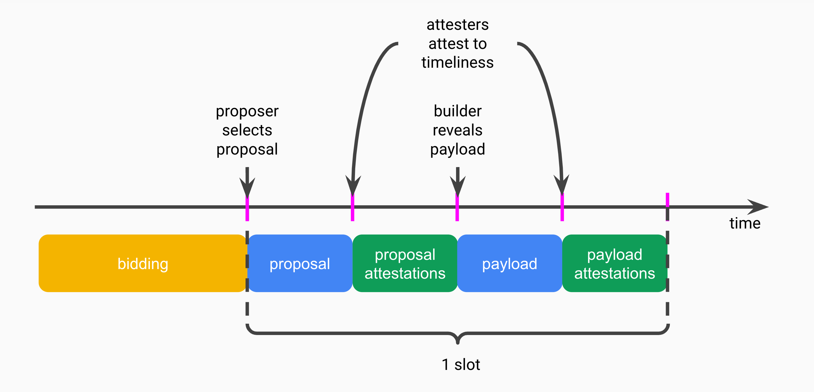

**TLDR**: We describe a simple enshrined PBS add-on to smooth and redistribute MEV spikes. Spike smoothing yields security benefits. Redistribution yields economic benefits like EIP-1559.

*Special thanks to @dankrad, @domothy, @fradamt, @joncharbonneau, @mikeneuder, @vbuterin for feedback.*

part 1: enshrined PBS recap
---

We recap enshrined PBS before describing the MEV burn add-on.

* **builder balances**: Builders have an onchain ETH balance.
* **builder addresses**: Builder balances are held in EOA addresses.
* **builder bids**: Builders gossip bids which contain:
    * *payload commitment*: a commitment to an execution payload
    * *payload tip*: an amount no larger than the builder balance
    * *builder pubkey*: the ECDSA pubkey for the builder address
    * *builder signature*: the signature of the builder bid
* **winning bid**: The proposer has a time window to select a bid to include in their proposal.
* **payload reveal**: The winning builder has a subsequent time window to reveal the payload.
* **attester enforcement**: Attesters enforce timeliness:
    * *bid selection*: an honest proposer must propose a timely winning bid
    * *payload reveal*: an honest winning builder must reveal a timely payload
* **payload tip payment**: The payload tip amount is transferred to the proposer, even if the payload is invalid or revealed late.
* **payload tip maximisation**: Honest proposers select tip-maximising winning bids.

part 2: MEV burn add-on
---

MEV burn is a simple add-on to enshrined PBS.

* **payload base fee**: Bids specify a payload base fee no larger than the builder balance minus the payload tip.
* **payload base fee burn**: The payload base fee is burned, even if the payload is invalid or revealed late.
* **payload base fee floor**: During the bid selection attesters impose a subjective floor on the payload base fee.
    * *subjective floor*: Honest attesters set their payload base fee floor to the top builder base fee observed D seconds (e.g. D = 2) prior to the time honest proposers propose.
    * *synchrony assumption*: D is a protocol parameter greater than the bid gossip delay.
* **payload base fee maximisation**: Honest proposers select winning bids that maximise the payload base fee.

*builder race to infinity*

ePBS without MEV burn incentivises builders to compete for the largest builder balance. Indeed, for exceptionally large MEV spikes the most capitalised builder has the power to capture all MEV above the second-largest builder balance. This design flaw can be patched with a L1 zkEVM that provides post-execution proofs.

Alternatively, MEV burn can solve the issue by relaxing the requirements on the pre-execution builder balance to cover a maximum upfront payload base fee of M ETH (e.g. M = 32) plus the payload tip. The payload is deemed invalid (with transactions reverted) if the post-execution builder balance is not large enough to cover the payload base fee.

With this change a malicious builder can force an empty slot for M ETH. The ability to force empty slots cannot be weaponised to steal MEV spikes above M ETH as empty slots merely delay the eventual burn of MEV spikes.

part 3: technical remarks
---

* **prior art**: The design is inspired by [Francesco's MEV smoothing](https://ethresear.ch/t/committee-driven-mev-smoothing/10408). See also [Domothy's MEV burn](https://ethresear.ch/t/burning-mev-through-block-proposer-auctions/14029), a significantly different design.
* **unbounded burn**: Besides providing a fair playing field and reducing builder capital requirements, the fix to the builder race to infinity (see above) allows for an unbounded MEV burn, beyond the largest builder balance.
* **honest proposer liveness**: Honest proposers enjoy provable liveness under the synchrony assumption that bids reach validators within D seconds. 
    * *proof*: Under synchrony, whatever top payload base fee was observed by an honest attester D seconds prior to an honest proposer selecting their top bid (i.e. the attester's payload base fee floor) will have also been observed by the proposer.
* **efficient gossip**: Bid gossip is particularly efficient because:
    * builder balances provide p2p Sybil resistance (a minimum builder balance, e.g. 1 ETH, is recommended)
    * bids fit within a single Ethernet packet (1,500-byte MTU)
    * gossip nodes can drop all but their current top bid
* **optimisation game**: Rational proposers will want to maximise the payload tip by guessing the payload base fee floor and accepting bids with non-zero tips after the payload base fee floor has been established. This creates a second optimisation game for rational proposers, in addition to the existing optimisation game with proposal timeliness.
* **splitting attack**: Dishonest proposers can use the payload base fee to split attesters into two groups: attesters that believe the payload base fee floor is satisfied, and attesters that do not. Dishonest proposers can already split attesters on the timeliness of their payload reveals.
* **late bidding**: Builders can try to deactivate MEV burn by not bidding until after the D seconds tipping window has started, causing attesters to set their payload base fee floor to 0. We argue this is irrational for builders by considering two cases in the prisoner's dilemma:
    * *colluding builders*: If all the builders capable of extracting a given piece of MEV are colluding then the optimal strategy is to not bid at all for that piece of MEV, even within the D seconds tipping window. Instead, the cabal of builders is better off coordinating to distribute the MEV among themselves, a strategy possible with or without MEV burn.
    * *non-colluding builders*: If one of the builders capable of extracting a given piece of MEV defects by bidding there is no benefit for any of the builders to bid late. If anything, late-bidding builders risk not having bids reach the proposer on time.
* **inclusion lists**: Inclusion lists allow proposers to specify a set of transactions they want included in the winning payload. This is sufficient for proposers to fight censorship and provide soft pre-confirmations, by including censored and pre-confirmed transactions in the inclusion list.

*technical similarities with EIP-1559*

* **honest majority**: Both depend on an attester honest majority. (As argued in the "side note for validators" section, validators are not incentivised to defect.)
    * *EIP-1559*: A dishonest majority can control the fork choice rule to only include lower-than-target blocks till the base fee is zero, deactivating EIP-1559 and devolving to a first-price auction.
    * *MEV burn*: A dishonest majority can set the payload base fee floor to zero, deactivating the smoothing and redistribution of MEV spikes.
* **partial burn**: Both are partial burns.
    * *EIP-1559*: Base fees partially capture congestion fees when blocks are full. (Ethereum blocks have limited elasticity with a gas limit set to 2x the gas target.)
    * *MEV burn*: The payload base fee floor is merely an MEV lower bound, and rational proposers may collect some MEV above the payload base fee floor.
* **onchain oracle**: Both provide an onchain oracle.
    * *EIP-1559*: Base fees yield an onchain congestion oracle.
    * *MEV burn*: payload base fees yield an onchain MEV oracle. (Payload base fees are augmented with the builder address metadata.)

part 4: security benefits from smoothing
---

* **micro consensus stability**: Spike smoothing significantly reduces the incentives for individual proposers to steal MEV via short chain reorgs, proposer equivocations, and p2p attacks (e.g. DoSes, eclipses, and saturations).
* **macro consensus stability**: An extreme MEV spike can create systemic risk for Ethereum, possibly bubbling to the social layer. Consider a malicious proposer receiving millions of ETH from a rollup hack.
* **lower reward variance**: MEV spikes cause the average MEV reward to be significantly higher than the median MEV reward. [Smoothing significantly reduces proposer reward variance](https://ethresear.ch/t/committee-driven-mev-smoothing/10408), reducing the need for pool-based MEV smoothing.
* **rugpool protection**: Pools with collateralised external operators (e.g. Rocket Pool and Lido) are liable to a "rugpool" (portmanteau of "rugpull" and "staking pool"). That is, whenever the operator's collateral (financial or reputational) is worth less than the MEV spike at a given slot, the operator is incentivised to collect the spike instead of having the smoothing pool receive it.
* **censorship resistance**: The payload base fee floor is a forcing function for proposers to consider bids from all builders. Proposers that only consider bids from censoring builders (e.g. proposers that today only connect to censoring relays) will not satisfy the payload base fee floor for some of their proposals.
* **toxic MEV whitewashing**: Stakers and staking pools suffer a dilemma when receiving toxic MEV spikes: should toxic MEV (e.g. proceeds from sandwiching, user error, smart contract bugs) be returned to affected users? This dilemma disappears when toxic MEV is burned, resolving several issues:
    * *incentive misalignment*: Rational stakers are incentivised to keep toxic MEV, incentivising "bad" behaviour.
    * *ethical, reputational, legal, tax liabilities*: Stakers have to weigh the pros and cons of a complex tradeoff space. Beyond the ethical and reputational conundrum, the legal and accounting situation may be a grey zone.
    * *disputes*: Staking pools may suffer disputes on how to deal with toxic MEV. Pools with governance (e.g. RocketPool and Lido) may disagree on how to deal with MEV, and centralised pools may suffer backlash from their users if the "wrong" decision was made.

part 5: economic benefits from redistribution
---

EIP-1559 and MEV burn yield the same economic benefits.

* **reduced validator count**: EIP-1559 and MEV burn reduce aggregate ETH staking rewards, itself reducing the amount of ETH staked. This has several benefits:
	* *lower issuance*: Aggregate issuance shrinks with reduced ETH staking. Since the beacon chain is designed to be secure with issuance only, EIP-1559 and MEV burn reduce overpayment for economic security and improve economic efficiency.
	* *more economic bandwidth*: Reducing the amount of staked ETH increases the amount of ETH available as pristine economic bandwidth (e.g. as collateral for decentralised stablecoins). EIP-1559 and MEV burn prevent staking from unnecessarily starving applications that consume pristine economic bandwidth.
	* *lower validator count*: Reducing the validator count reduces pressure on beacon nodes and makes single slot finality (SSF) easier to deploy. EIP-1559 and MEV burn reduce the urgency of [active validator capping](https://notes.ethereum.org/@vbuterin/single_slot_finality).
* **staking APR**: The primary cost of ETH staking is the opportunity cost of money so staking rewards in an efficient market should approximate the broader cost of money. As such, neither EIP-1559 nor MEV burn should significantly affect long-term staking APRs.
    * *side note for validators*: EIP-1559 and MEV burn should increase per-validator USD-denominated rewards. The reason is that ETH-denominated rewards are dictated by the cost of money but the USD price of ETH is positively impacted by EIP-1559 and MEV burn. EIP-1559 and MEV burn increase returns for decentralised staking pools (see "rugpooling"), and raise median returns especially for solo stakers.
* **economic sustainability**: EIP-1559 and MEV burn are independent revenue steams for ETH holders, both contributing to economic sustainability. This diversity hedges against one of the revenue streams drying up:
    * *EIP-1559 dry up risk*: Exponential growth of computational resources may lead to blockspace supply outstripping demand and crushing congestion fees. (The bull case for EIP-1559 is [induced demand](https://en.wikipedia.org/wiki/Induced_demand).)
    * *MEV burn dry up risk*: Most MEV may be captured by rollups and validiums at L2. (The bull case for MEV burn is [based rollups](https://ethresear.ch/t/based-rollups-superpowers-from-l1-sequencing/15016) and [enshrined rollups](https://www.reddit.com/r/ethereum/comments/vrx9xe/ama_we_are_ef_research_pt_8_07_july_2022/if7auu7/).)
* **tax efficiency**: EIP-1559 and MEV burn can significantly improve staking tax efficiency in some jurisdictions by converting income (taxed at, say, 50%) into capital gains (taxed at, say, 20%). EIP-1559 has already prevented ~1M ETH of tax sell pressure, and MEV burn would similarly prevent millions of ETH of sell pressure.
* **economic scarcity**: EIP-1559 and MEV burn increase ETH scarcity. Not counting the reduced issuance (see "lower issuance" above), the ETH supply since the merge would have decreased ~2.5x faster with MEV burn. (The supply would have reduced by ~270K ETH instead of just ~110K ETH.)
* **enshrined unit of account**: EIP-1559 and MEV burn enshrine ETH as unit of account for congestion and MEV respectively.
* **memetics**: EIP-1559 and MEV burn have [memetic potential](https://ultrasound.money/) and strengthen ETH as a Schelling point for collateral money on the internet. The success of Ethereum as a settlement layer for the internet of value is tied with the success of ETH. 

part 6: mental model
---

Blockspace fundamentally provides both transaction inclusion and transaction ordering services. Competition for inclusion leads to congestion, and competition for ordering leads to contention. Congestion and contention are externalities that can be natively priced with EIP-1559 and MEV burn, and each mechanism yields an independent revenue stream.

|                       | transaction inclusion | transaction ordering |
|----------------------:|:---------------------:|:--------------------:|
|       **externality** |       congestion      |      contention      |
| **pricing mechanism** |        EIP-1559       |       MEV burn       |
|    **revenue stream** | transaction base fees |   payload base fees  |

*EIP-1559 and MEV burn—two sides of the same coin*