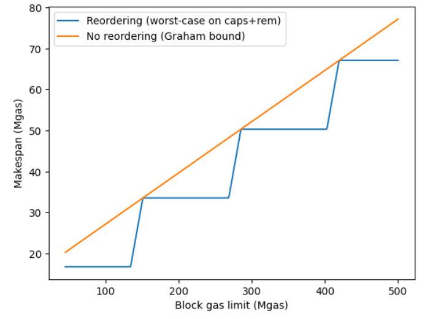
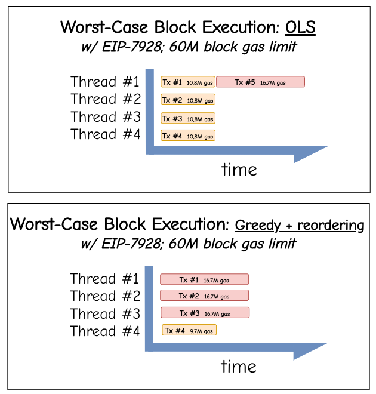

# Modeling the Worst-Case Parallel Execution under EIP-7928

> Special thanks to [Gary](https://x.com/Gary_Rong), [Dragan](https://x.com/rakitadragan), [Milos](https://x.com/MorphNetrunner) and [Carl](https://x.com/CarlBeek) for feedback and review!

Ethereum’s **[EIP-7928: Block-Level Access Lists (BALs)](https://eips.ethereum.org/EIPS/eip-7928)** opens the door to *perfect parallelization* of transactions. Once each transaction’s read/write footprint is known upfront, execution no longer depends on order: all transactions can run independently.

But even with perfect independence, **scheduling** might matter.
If we respect natural block order instead of reordering transactions, we could end up with idle cores waiting on a single large transaction. The solution to this would be attaching `gas_used` values to the block-level access list, as presented in *EIP-7928 breakout call* [#6](https://github.com/ethereum/pm/issues/1787) and spec'ed [here](https://github.com/ethereum/execution-specs/pull/1723).

> One could approximate the `gas_used` values by using the already available transaction gas limit; however, this can be easily tricked. Other heuristics such as the number of BAL entries for a given transaction, or the balance diff of the sender may yield even better results but bring additional complexity.

*Check out [this tool](https://nerolation.github.io/eth-bal-gas-used-static-page/) allowing you to visualize worst-case blocks for a given block gas limit and number of cores, comparing *Ordered List Scheduling* with *Greedy Scheduling with Reordering*.*

---

## 1. Setup

We model a block as a set of indivisible “jobs” (transactions) with gas workloads:

| Symbol       | Meaning                                                              |
| :----------- | :------------------------------------------------------------------- |
| $G$        | Total block gas (here $300\text{M})$                                |
| $G_T$      | Per-transaction gas cap ([EIP-7825](https://eips.ethereum.org/EIPS/eip-7825), $2^{24}=16.78\text{M}$) |
| $g_i$      | Gas of transaction (i), with $0 < g_i \le G_T$                      |
| $g_{\max}$ | Largest transaction in the block $\le G_T$                         |
| $n$        | Number of cores                                            |
| $C$        | Makespan: total gas processed by the busiest core                    |

We compare two schedulers:

* **Greedy (Reordering allowed)**: transactions can be freely rearranged to balance total gas across cores.
* **Ordered List Scheduling (OLS)**: transactions stay in natural block order; each new transaction goes to the first available core.

---

## 2. Lower Bound: Greedy Scheduling with Reordering

Even the optimal scheduler cannot do better than:

$$
C_* \ge \max\Big(\frac{G}{n}, g_{\max}\Big)
$$

The term $G/n$ represents the *average load per core*;
$g_{\max}$ ensures no core can be assigned less than the largest single transaction.

---

## 3. Ordered List Scheduling (OLS)

For natural block order, [Graham’s](https://ia801900.us.archive.org/27/items/bstj45-9-1563/bstj45-9-1563_text.pdf) bound on list scheduling gives:

$$
\boxed{C_{\text{OLS}} \le \frac{G}{n} + \Big(1-\frac{1}{n}\Big) g_{\max}}
$$

Intuitively:

* The first term $G/n$ is the ideal average work per core.
* The second term is a **tail effect**: one near-max transaction might be scheduled last, forcing a single core to keep working while others are idle.

Replacing $g_{\max}$ with the cap $G_T$:

$$
\boxed{C_{\text{OLS}} \le \frac{G}{n} + \Big(1-\frac{1}{n}\Big) G_T}
$$

This is the *upper bound* for ordered, conflict-free block execution.

---

### 3.1. Two Regimes

Let $R = G / G_T$: the number of cap-sized transactions that fit in a block.
For $G = 300\text{M}$ and $G_T = 16.78\text{M}$, we get $R \approx 17.9$.

This ratio defines two distinct regions:

### **Case A: Average load ≥ single transaction $n \le R$**

Here, many transactions fill the block, so the additive tail matters.

$$
\begin{aligned}
C_* &\ge \frac{G}{n},
\end{aligned}
$$

$$
\begin{aligned}
C_{\text{OLS}} &\le \frac{G}{n} + \Big(1-\frac{1}{n}\Big)G_T
\end{aligned}
$$

**Relative overhead upper bound:**

$$
\boxed{\Delta_A(n) \le \frac{(n-1)G_T}{G}}
$$

---

### **Case B: Average load < single transaction $n > R$**

With too many cores, each one’s average workload is smaller than a single transaction.

$$
\begin{aligned}
C_* &\ge G_T,
\end{aligned}
$$

$$
\begin{aligned}
C_{\text{OLS}} &\le \frac{G}{n} + \Big(1-\frac{1}{n}\Big)G_T
\end{aligned}
$$

**Relative overhead upper bound:**

$$
\boxed{\Delta_B(n) \le \frac{1}{n}\Big(\frac{G}{G_T}-1\Big)}
$$

As $n \to \infty$, both schedulers converge to $C = G_T$: only one transaction dominates execution.

## 4. Greedy with Reordering

In contrast to *Ordered List Scheduling*, the *Greedy with Reordering* model assumes that transactions can be freely reordered to minimize the total makespan.
This represents the ideal situation in which the validator knows all transaction gas used in advance and assigns them optimally to cores to balance total load.

The Greedy algorithm fills each core sequentially with the largest remaining transaction that fits, producing a near-perfect balance except for a small remainder.

Formally:

$$
\boxed{
C_{\text{greedy}}^{\max} =
\begin{cases}
r, & q = 0,\\[6pt]
\displaystyle
\max\!\Big(\lceil q/n \rceil\,G_T,\;\lfloor q/n \rfloor\,G_T + r\Big), & q \ge 1,
\end{cases}
}
$$

with

$$
q = \left\lfloor \frac{G}{G_T} \right\rfloor, \quad r = G - q \, G_T
$$

This represents the **upper bound** on the total gas executed by the busiest core under perfect reordering:

* $\lfloor q/n \rfloor G_T$: uniform baseline load per core.
* $r$: remainder that cannot be evenly distributed.

---

## 5a. Practical Example $G = 300\text{M}; G_T = 16.78\text{M}$

| Cores $n$ | Case | Lower bound $C_*$ (Mgas) | Greedy worst-case $C_{\text{greedy}}^{\max}$ (Mgas) | OLS upper bound (Mgas) | Overhead vs Greedy |
| :-------: | :--: | -----------------------: | --------------------------------------------------: | ---------------------: | -----------------: |
|     4     |   A  |                    75.00 |                                           **83.90** |                  87.58 |         **+4.4 %** |
|     8     |   A  |                    37.50 |                                           **50.34** |                  52.18 |         **+3.7 %** |
|     16    |   A  |                    18.75 |                                           **33.56** |                  34.48 |         **+2.7 %** |
|     32    |   B  |                    16.78 |                                           **16.78** |                  25.63 |        **+52.7 %** |

### Interpretation

* Up to 17 cores, Ethereum operates in **Case A**.
  The ordered scheduler’s imbalance grows roughly linearly with $n$ because each additional core reduces $G/n$, but the tail term $(1-1/n)G_T$ remains constant.
* Under a 300M block gas limit and having beyond 17 cores, **Case B** begins: adding more cores no longer helps: the per-transaction cap $G_T$ becomes the bottleneck.
* The irreducible worst-case tail is **one transaction’s gas cap**.
  Even with perfect parallelization, you can still end up waiting on one full-cap transaction running alone.
* $C_{\text{OLS}}$ always adds an unavoidable $(1 - 1/n)G_T$ tail.
* Ideal scaling $\sim G/n$ is achievable only with reordering (*Greedy* baseline).
* For realistic configurations (≤ 16 cores), *OLS* can increase the worst-case per-core load by **16–84 %**, compared to the best-case scenario and depending on $n$.

## 5b. Practical Example $G = 268\text{M}; G_T = 16.78\text{M}$

| Cores $(n)$ | Case | Avg load $(G/n)$ (Mgas) | Greedy worst-case $(C_{\text{greedy}}^{\max})$ (Mgas) | OLS upper bound (Mgas) | Overhead vs Greedy |
| :---------: | :--: | ----------------------: | ----------------------------------------------------: | ---------------------: | -----------------: |
|      4      |   A  |                   67.11 |                                             **67.11** |                  79.30 |        **+18.2 %** |
|      8      |   A  |                   33.56 |                                             **33.56** |                  48.26 |        **+43.8 %** |
|      16     |   A  |                   16.78 |                                             **16.78** |                  31.33 |        **+86.7 %** |
|      32     |   B  |                    8.39 |                                             **16.78** |                  24.62 |        **+46.7 %** |

### Interpretation

* Up to $n = 16$ cores, we’re in **Case A** ($\text{avg} \ge G_T$).
  OLS’s imbalance grows roughly linearly with $n$, since the additive tail $(1 - \tfrac{1}{n}) G_T$ stays constant.
* Beyond $n > 16$, **Case B** starts: the Greedy limit saturates at one full-cap transaction ($G_T$), but OLS continues to add the tail term, creating a $\sim47%$ overhead.
* Compared to the previous $300\text{M}$ gas example, setting the block gas limit to an exact multiple of $G_T$ smooths out small tail effects but keeps the same overall behavior: ordered execution still lags behind the Greedy bound by roughly **20–90 %**, depending on the number of cores.

---

Going with `gas_used` values in the BAL unlocks scheduling with reordering. However, the block gas limit dictates how efficiently the system behaves under worst-case scenarios compared to *Ordered List Scheduling*. Validators could strategically set the gas limit to the threshold at $n \times G_T$ to fully leverage the benefits of reordering transactions.

**With $n\to\infty$ greedy scheduling with reordering yields another 2x in scaling, compared to OLS.**

---

Summarizing:
- *OLS* scales linearly but suffers up to +80% overhead for ≤16 cores.
- *Greedy with Reordering* reaches near-ideal scaling, limited only by $G_T$.
- Including `gas_used` values in BALs could double parallel efficiency, but adds complexity.

---

**In practice, Ethereum validators aren't a homogeneous group with identical hardware specs. Furthermore, it is not entirely clear how many cores are available for execution, making optimizations more challenging and less effective. Instead of facing a stepwise-scaling worst-case execution time, *OLS* guarantees a worst-case that scales linearly with the block gas limit. Given the heterogeneous validator landscape and uncertainty around the number of cores available for execution, including `gas_used` values might add complexity without guaranteed benefit, making *Ordered List Scheduling* the more predictable baseline for Ethereum’s scaling path.**

## 6. Appendix

**Worst-case $C$ of *OLS* (orange) vs. *Greedy+Reordering* (blue) over increasing block gas limits using 8 threads:**

**Worst-case scheduling comparison for 60M block gas limit and 4 threads:**

