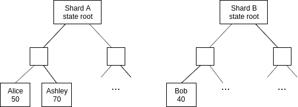

In general, the way that tokens are handled on a sharded blockchain is through accounts and receipts that exist inside of execution environments. That is, a token is something that exists inside of an EE, in the form of account balances on different shards that have units of that token. On shard A, Alice might have 50 ExampleCoin (EXC) and Ashley 70 EXC, on shard B, Bob might have 40 EXC, etc, and these are all represented as leaves in the EE's state tree.

 

Alice transferring EXC to Ashley is easy: it's just a transaction within one shard that updates both balances. Alice transferring EXC to Bob is slightly more involved, but the method is established: Alice converts the EXC she wants to send into a receipt, waits for it to get included in the shard, and then Bob includes a Merkle proof of this receipt (plus a witness _from shard B_ proving that receipt has not yet been spent) into shard B, at which point the balance in the receipt gets added to his account.

Now, let's look at how ETH is different from EXC. EXC is an asset defined inside an EE, that exists only in that EE. Trust in the EE's code is required to trust that EXC follows standard properties of an asset: if the EE's code were bugged, Bob might be able to claim the EXC from the receipt multiple times, printing new EXC into existence (to give one possible example of a failure). ETH, on the other hand, is defined at protocol layer, and the protocol layer needs to be sure that ETH works securely.

Furthermore, there is a requirement that EEs must be able to hold ETH, and assign "ownership" to that ETH internally to accounts within that EE, and this ETH must be "spendable". This is for paying transaction fees: if Alice wants to send a transaction, that transaction will need to spend Alice's ETH to pay for gas, and the EE code must be able to take ETH that it holds and pay it to the block producer.

At EE internal state level:

[yuml]
[Alice: 0.5 ETH] -> [Alice: 0.499 ETH]
[/yuml]

In the top-level state:

[yuml]
[EE balance: 5255.125 ETH] -> [EE balance: 5255.124 ETH]
[EE balance: 5255.125 ETH] -> [0.001 ETH to block proposer]
[/yuml]

For transfers within a shard, there are no challenges: transfers within a shard purely affect the internal accounting of an EE instance on some shard, they do not affect the total balance. But transfers _between_ shards are tricky.

Suppose Alice (on shard A) wants to transfer 1 ETH to Bob (on shard B). There are actually _two_ transfers that must take place:

1. Alice's balance in the EE-internal state drops 1 ETH, Bob's balance in the EE-internal state gains 1 ETH
2. The EE instance on shard A loses 1 ETH, the EE instance on shard B gains 1 ETH

(1) is purely an EE-internal matter so we do not need to care. But (2) must, somehow, be handled at protocol layer.

### Solutions

**1) Every shard crosslink publishes to the beacon chain all cross-shard transfers that it is making**. 

Problem: this technically makes Ethereum sharding no longer quadratic, as for N shards there would be N shard blocks each containing N transfers in a high-usage scenario, so a total $O(N^2)$ beacon chain load. These numbers are significant even in concrete terms: assuming 4 different EEs are popular, that's 256 total transfers, and even if each transfer is compactly encoded into 10 bytes that's 2560 bytes * 64 shards = 163 kB overhead.

**2) every shard crosslink publishes to the beacon chain a Merkle root of all transfers, every shard chain block is requires to contain Merkle branches from all most-recent transfer roots corresponding to the transfers to their shard**

That is, shard i would have a Merkle root detailing the transfers to shard (0, 1, 2 .... N), and then shard j in the next block would be required to have the Merkle branch at position j from all shard blocks.

Problem: this feels like an awkward halfway-house between having protocol-guaranteed cross-shard transactions and not having such transactions. It has the complexity and mandatory data-passing requirements of a guaranteed cross-shard transaction scheme, without providing to users the benefits that such a scheme properly implemented would give them.

**3) Netting**

Shard blocks have the ability to record up to one transfer going to another EE on another shard. EEs would in general be expected to have small amounts of extra ETH locked up forever on each shard. When Alice sends ETH to Bob, Bob receiving the receipt gives him the right to use that ETH, dipping into this deposit if needed. The EE keeps track of its "debts" to copies of itself on other shard, and in every block sends a transaction that resolves its largest outstanding debt.

**4) Enshrine one EE for ETH / asset holdings that everyone is required to understand**

Problem: this creates an enshrined in-protocol state, and creates risks that this form of state because of its greater level of enshrinement will be abused for other application purposes.

**5) Create some form of "guaranteed cross-shard transaction" system and piggyback on that**

Basically, bring the entire infrastructure for cross-shard transactions into the base protocol, establishing some mechanism for guaranteeing arrival. If it is guaranteed in-protocol, then we can ensure that receipts are processed sequentially, removing the need for nontrivial amounts of state to store which receipts have been claimed and which have not; we just have a "next unclaimed receipt ID" ticker. However, this would require creating a sustainable gas mechanic, and handling cases where all shards send cross-shard transactions to the same destination shard simultaneously (this could be a DoS attack or an exceptional application activity, eg. an ICO).