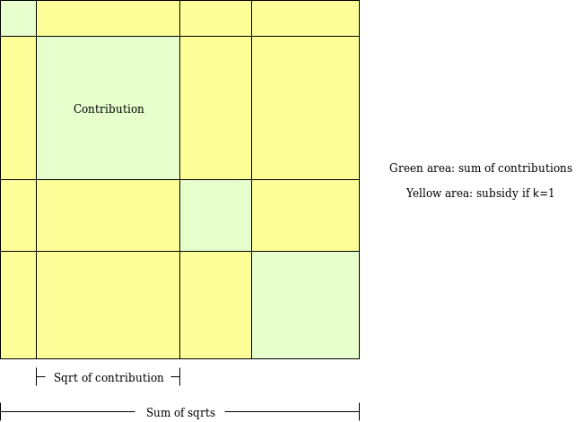

After my [review of Gitcoin Grants round 4](https://vitalik.ca/general/2020/01/28/round4.html) yesterday, there have been many questions asking what exactly it would mean to add negative contributions to quadratic funding, and how this would work. The purpose of this post is to provide a mathematically principled explanation of why negative contributions are a natural extension to quadratic funding, and in what way.

### Quadratic voting

First, let us start with the granddaddy of quadratic decision protocols, quadratic voting. Quadratic voting is a voting mechanism where you can make $n$ votes for or against a candidate at a cost $n^2$; the cost could be in dollars or in specially designated "voting tokens" that each person is assigned the same amount of (see [here](https://vitalik.ca/general/2019/12/07/quadratic.html) and [here](https://papers.ssrn.com/sol3/papers.cfm?abstract_id=2003531) for background on why this is a good idea).

Consider a quadratic vote in a case where there are more than two candidates, let's say for example five; we'll call them A B C D E. Suppose that you want to express the opinion "I think candidate A deserves one less vote". There are actually two ways to do it:

1. Vote `(-1, 0, 0, 0, 0)`
2. Vote `( 0, 1, 1, 1, 1)`

Notice how (1) and (2) have the exact same effect; they both push A one unit behind the other four candidates. However, in terms of voting tokens cost, (1) is much more economical than (2): (1) costs you $1$ token, whereas (2) costs you $1^2 + 1^2 + 1^2 + 1^2 = 4$ tokens. Hence, any negative vote can be simulated by positive votes, but doing so is much more costly. And if the voter wanted to spend a _fixed_ budget (say, four tokens) on opposing A, then by doing (2) they would push A one unit back, but by doing a scaled-up version of (1) that costs four tokens, that is `(-2, 0, 0, 0, 0)` they could push A _two_ units back.

Technically, the optimum is `(-0.8, 0.2, 0.2, 0.2, 0.2)` which costs $(-0.8)^2 + 0.2^2 + 0.2^2 + 0.2^2 + 0.2^2 = 0.8$ tokens to push A one unit back, or we can do `(-1.788, 0.447, 0.447, 0.447, 0.447)` which pushes A $\sqrt{5} \approx 2.236$ units back at a cost of four tokens. But it's clear that if you had to make the binary choice between opposing-by-opposing and opposing-by-supporting-everyone-else, the former is vastly more efficient, and so a quadratic _voting_ system that only allowed opposing-by-supporting-everyone-else would not give fair representation to negative signals.

### Quadratic funding

As I described in [my article on QV/QF](https://vitalik.ca/general/2019/12/07/quadratic.html), quadratic funding can be viewed as a form of quadratic voting. When you donate \$x to a project, you are actually making $\sqrt{x}$ votes in favor of a resolution that moves money from a central pool to that project. How much money? An amount of money equal to the amount that the central pool would have to spend to individually counteract everyone's vote for the resolution with a single vote against. If two people donate \$x and \$y, then their combined votes are $\sqrt{x} + \sqrt{y}$, and the total donation would be $(\sqrt{x} + \sqrt{y})^2$ - exactly the cost of making $\sqrt{x} + \sqrt{y}$ countervailing votes against.

So now it becomes natural to ask: why not allow people to make votes against? Much like in regular QV, where you can spend $x$ to make $\sqrt{x}$ votes in favor of a motion or to make $\sqrt{x}$ votes against a motion, here too we could allow anyone who contributes $x$ the choice to determine whether this should be treated as a positive signal or a negative signal. For example, if three people contribute \$x, \$y and \$z, but the third participant is making a vote against, the total amount received by the project would be $(\sqrt{x} + \sqrt{y} - \sqrt{z})^2$. Every voter chooses whether their square root carries a plus sign or a minus sign. If the total sum is negative, then the grant fails outright and the amount received by the project is zero.

Note that the argument for allowing explicit downvoting, and not just downvoting-by-supporting-everyone-else, is the same as before. Spreading your vote among N projects would decrease the strength of each vote by a factor of $\approx\sqrt{N}$ for the same reasons as before, and it certainly adds an imbalance to penalize negative opinions to such a large extent.

### Pairwise-bounded quadratic funding

In the case of _[pairwise-bounded QF](https://ethresear.ch/t/pairwise-coordination-subsidies-a-new-quadratic-funding-design/5553)_, we unpack the square-of-sum-of-square-roots into a matrix and look at each pair of contributors separately:

In the case of negative contributions, we can look at this as follows (showing only a single positive contributor and a single negative contributor for simplicity):

 

However, there is a problem. In pairwise-bounded QF, every pair has a separate matching coefficient. It's conceivably possible that there is a set $S_1$ of contributors who all vote for a project, a set $S_2$ who all vote against a project, where the matching coefficients _between_ members of $S_1$ and members of $S_2$ are all low (because eg. there are N other projects where each project received a large donation from a member of $S_1$ and from a member of $S_2$), but matching coefficient between members _within_ $S_2$ are high. Then, the _positive_ matches $M_{i,j} =  (-\sqrt{c_i}) * (-\sqrt{c_j})$ (where $i,j \in S_2$) would exceed the negative matches $M_{i,k} = (-\sqrt{c_i}) * (+\sqrt{c_k})$ where $k \in S_1$, and so a set of negative matches could _increase_ the total!

I see two solutions to this:

1. Force the product of two negative numbers to zero (note that this includes the squares on the diagonal)
2. Separately compute the total subsidy considering only positive contributions (call this $s_+$) and the total subsidy considering only negative contributions as though they were positive contributions (call this $s_-$). The final subsidy would be $(\sqrt{s_+} - \sqrt{s_-})^2$

I prefer the second; particularly, note that in the case where all correlation coefficients are identical it returns the result that you get from the basic quadratic matching formula.

When a negative contribution reduces the total match from a project, where do the funds go? Simple: they get proportionately redistributed to other projects.

### Other concerns

There are other reasons to potentially avoid allowing negative votes; that it "creates bad vibes" is the most common criticism. It's certainly possible that on net this makes allowing negative votes a bad idea. At the very least, it seems reasonable to work harder to make negative votes anonymous. This is all out of scope for this post, which focuses on the math.