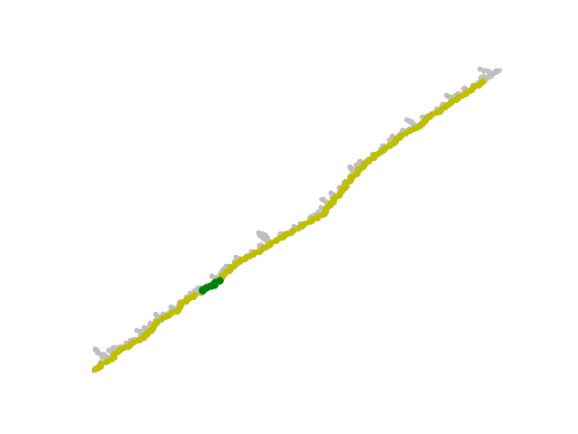
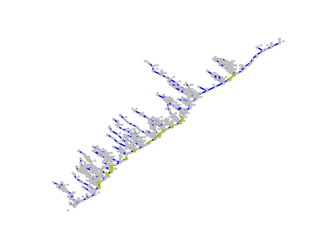
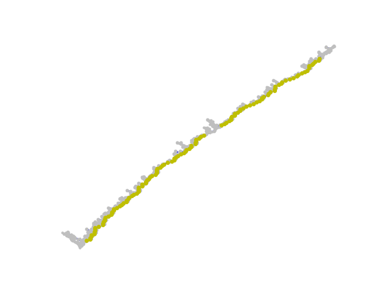
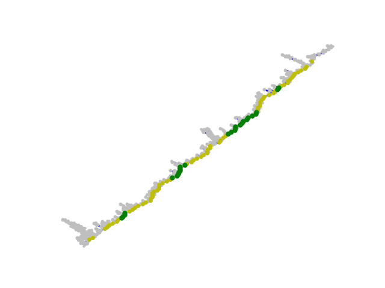
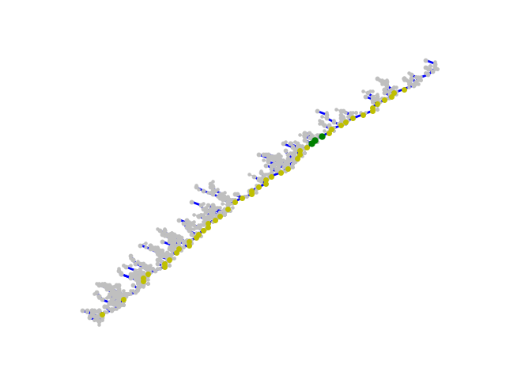

One common criticism of many proof of stake algorithms is that they place a large dependence on the requirement that nodes' local blocks must be roughly synchronized. In practice, this assumption seems to be roughly satisfied even in the current Ethereum PoW network, but this is often accomplished by the [relatively centralized NTP protocol](https://en.wikipedia.org/wiki/Network_Time_Protocol).

This post describes one way to eliminate NTP. For illustration, we will use the [beacon chain network simulator](https://github.com/ethereum/research/tree/master/clock_disparity), specifically the `lmd_node.py` and `lmd_test.py` files. First of all, here is a dry run of the protocol with no modifications, network latency ~= 2/3 slot length, clock disparity ~= 1/3 slot length:

 

The execution is by no means perfect, but it is fairly orderly. Now, let's crank up clock disparity to ~30x slot length.

 

The chain runs, and blocks even get justified, a true testament to the sheer power of LMD GHOST, but nothing gets finalized.

Now, we will adopt the following mechanism. When a node receives a message from another node, it calculates the implied timestamp of that node: for example, if genesis time is 1500000000, slot length is 8 seconds, and it receives a block with slot number 10, it takes an implied timestamp of 1500000080. A node can compute the median implied timestamp of all nodes based on their latest messages, and simply adopt it:

 

The timestamps of the nodes differ by an amount roughly equal to network latency.

Another rule that has similar consequences is adopting the implied timestamp of any new block that becomes the head; this is equivalent to replacing all references to clock time with a rule "build or accept a block using the slot after the head 8 seconds after receiving the head, using the slot two after the head 16 seconds after receiving the head, etc".

However such rules are dangerous because they remove all pressure to converge on the "real time", making rewards unpredictable and the `block.timestamp` opcode unpredictable. Fortunately, we can compromise, instead of the median taking the 67th percentile of the nodes' implied timestamps (in the direction closer to one's own timestamp). This rule gives less perfect results, though the results are still impressive:

 

Now we go up to the 83rd percentile:

 

Note that in practice, percentiles above the 75th are not recommended, as a relatively small portion of attackers could then "veto" any drifts away from a node's local clock.

Another alternative is an adjusting-percentage rule: to make shifts up to 10 minutes away from a node's local clock, we follow the majority, to shift 20 minutes we require 55% agreement between latest observed implied timestamps, to shift 40 minutes we require 60%, and so forth until the maximum a node can shift is 10240 minutes ~= 7 days.

This technique could be applied generically to reduce the level of reliance on local clocks in proof of stake algorithms.