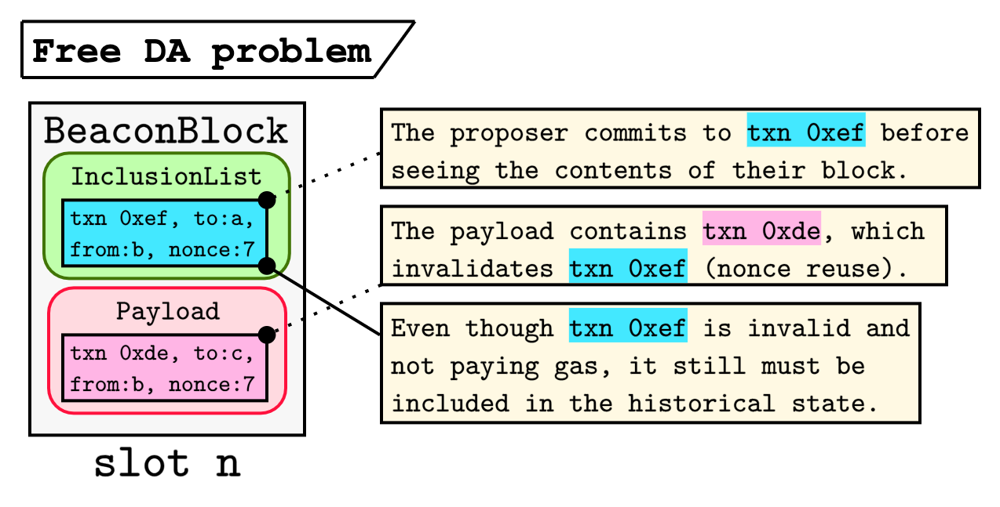
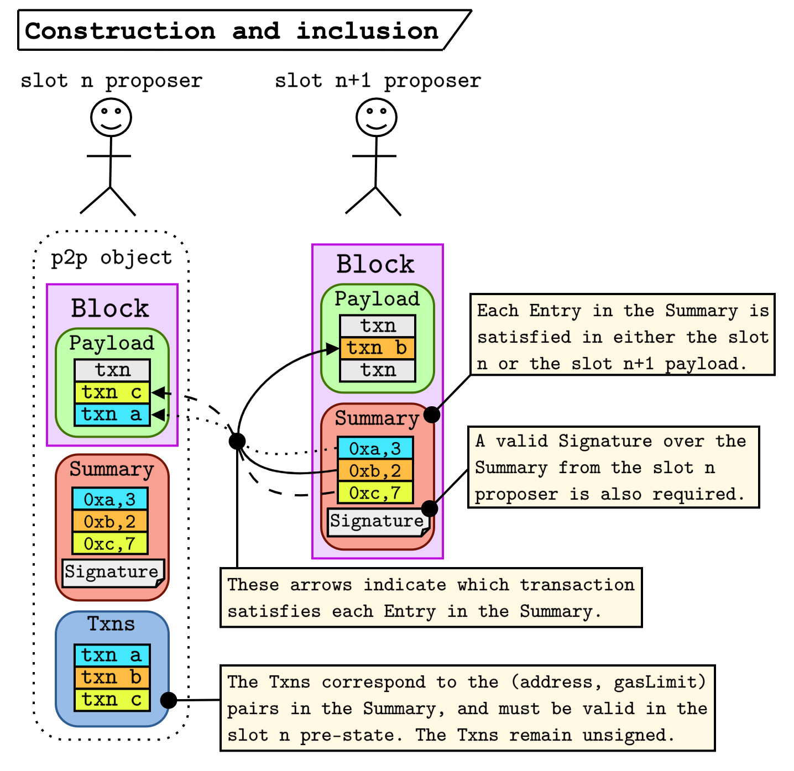
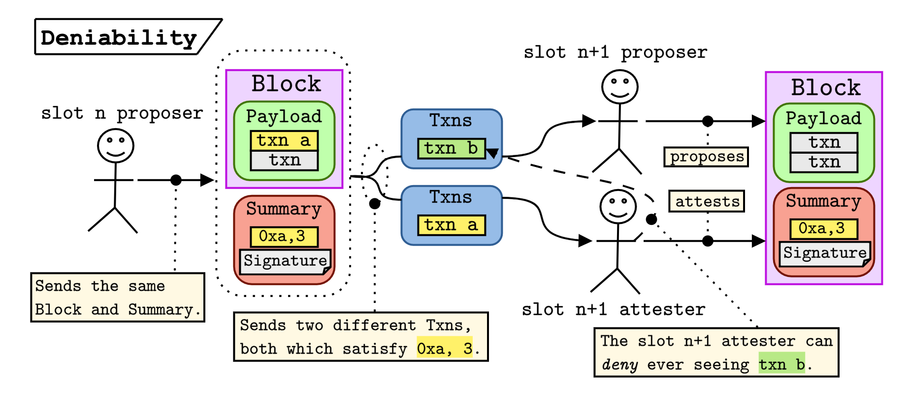
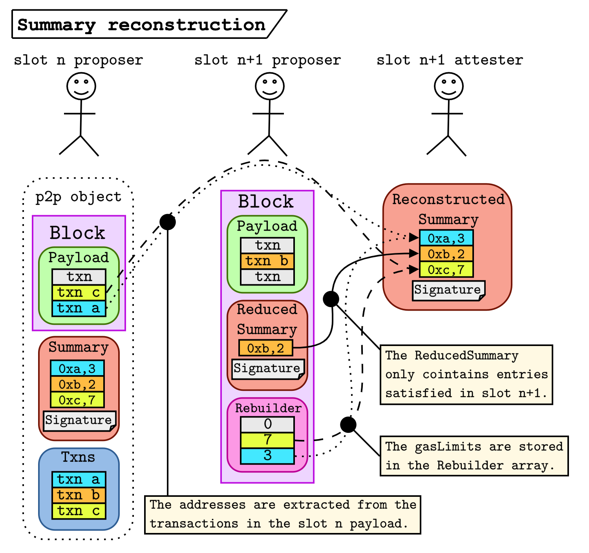

# No free lunch – a new inclusion list design
*by [vitalik](https://twitter.com/vitalikbuterin) & [mike](https://twitter.com/mikeneuder)*
*august 15, 2023*
$\cdot$
***tl;dr;*** *The free data availability problem is the core limitation of many inclusion list instantiations. We outline the mechanics of a new design under which the inclusion list is split into a `Summary`, which the proposer signs over, and a list of `Txns`, which remain unsigned. By walking through the lifecycle of this new inclusion list, we show that the free data availability problem is solved, while the commitments of the inclusion list are enforceable by the state-transition function. We conclude by modifying the design to be more data efficient.*
$\cdot$
**Contents**
1. [The free data availability problem](https://ethresear.ch/t/no-free-lunch-a-new-inclusion-list-design/16389#h-1-the-free-data-availability-problem-2)
1. [Core mechanics](https://ethresear.ch/t/no-free-lunch-a-new-inclusion-list-design/16389#h-2-core-mechanics-3)
    - [Definitions](https://ethresear.ch/t/no-free-lunch-a-new-inclusion-list-design/16389#definitions-4)
    - [Inclusion list lifecycle](https://ethresear.ch/t/no-free-lunch-a-new-inclusion-list-design/16389#inclusion-list-lifecycle-5)
    - [How does that solve the free DA problem?](https://ethresear.ch/t/no-free-lunch-a-new-inclusion-list-design/16389#how-does-that-solve-the-free-da-problem-6)
3. [Solving the data efficiency problem](https://ethresear.ch/t/no-free-lunch-a-new-inclusion-list-design/16389#h-3-solving-the-data-efficiency-problem-7)
    - [What the heck is the “`Rebuilder`”?](https://ethresear.ch/t/no-free-lunch-a-new-inclusion-list-design/16389#what-the-heck-is-the-rebuilder-8)
    - [Inclusion list lifecycle (revisited)](https://ethresear.ch/t/no-free-lunch-a-new-inclusion-list-design/16389#inclusion-list-lifecycle-revisited-9)
4. [FAQ](https://ethresear.ch/t/no-free-lunch-a-new-inclusion-list-design/16389#faq-10)
4. [Appendix 1: `Rebuilder` encoding strategy](https://ethresear.ch/t/no-free-lunch-a-new-inclusion-list-design/16389#appendix-1-rebuilder-encoding-strategy-11)
5. [Appendix 2: `ReducedSummary` stuffing](https://ethresear.ch/t/no-free-lunch-a-new-inclusion-list-design/16389#appendix-2-reducedsummary-stuffing-12)


$\cdot$
***Related work***
- [State of research: increasing censorship resistance of transactions under proposer/builder separation (PBS)](https://notes.ethereum.org/@vbuterin/pbs_censorship_resistance) by Vitalik – Jan 2022.
- [How much can we constrain builders without bringing back heavy burdens to proposers?](https://ethresear.ch/t/how-much-can-we-constrain-builders-without-bringing-back-heavy-burdens-to-proposers/13808) by Vitalik – Oct 2022.
- [PBS censorship-resistance alternatives](https://notes.ethereum.org/@fradamt/H1TsYRfJc) by Francesco – Oct 2022.
- [Forward inclusion list](https://notes.ethereum.org/@fradamt/forward-inclusion-lists) by Francesco – Nov 2022.
- [Censorship Résistance & PBS](https://www.youtube.com/watch?v=XZJcZ05d-Wo) by Justin – Sept 2022.
- [Censorship Resistance: crlists in mev-boost](https://github.com/flashbots/mev-boost/issues/215) by Quintus – July 2022.

$\cdot$
**Acronyms & abbreviations**
| source | expansion |
|--- | ---| 
|`IL`| inclusion list|
|`DA` | data availability|
|`Txns` | transactions|

$\cdot$
***Thanks***
*Many thanks to [Justin](https://twitter.com/drakefjustin) and [Barnabé](barnabemonnot) for comments on the draft. Additional thanks to [Jon](https://twitter.com/jon_charb), [Hasu](https://twitter.com/hasufl), [Tomasz](https://twitter.com/tkstanczak), [Chris](https://twitter.com/metachris), [Toni](https://twitter.com/nero_eth), [Terence](https://twitter.com/terencechain), [Potuz](https://twitter.com/potuz1), [Dankrad](https://twitter.com/dankrad), and [Danny](https://twitter.com/dannyryan) for relevant discussions.*

---
## 1. The free data availability problem
As outlined in Vitalik's [*State of research*](https://notes.ethereum.org/@vbuterin/pbs_censorship_resistance#What-are-the-design-goals-of-any-anti-censorship-scheme) piece, one of the key desiderata of an anti-censorship scheme is not providing free data availability (abbr. DA). Francesco's [*Forward Inclusion List*](https://notes.ethereum.org/@fradamt/forward-inclusion-lists) proposal addresses this by not incorporating data about the inclusion list (abbr. IL) into any block. The `slot n` IL is enforced by the slot `n+1` attesting committee based on their local view of the p2p data. While this is an elegant solution that eliminates the free DA problem, it is a *subjective enforcement* of the IL. A non-conformant block can still become canonical if, for example, the `slot n+1` attesters collude to censor by pretending to not see the IL on time. Additionally, it adds another sub-slot synchrony point to the protocol, as a deadline for the availability of the IL must be set.

Ideally, we want *objective enforcement* of the IL. It should be *impossible* to produce a valid block that doesn't conform to the constraints set out in the IL. The naïve solution is to place the IL into the block body for `slot n`, allowing `slot n+1` attesters can use the data as part of their state-transition function. This is objective because any block that doesn't conform to the IL would be seen as invalid, and thus could not become canonical. Unfortunately, this idea falls victim to the free DA problem.

The key issue here is that a proposer must be able to commit to their IL before seeing the contents of their block. The reason is simple: in proposer-builder separations (PBS) schemes ([mev-boost](https://boost.flashbots.net/) today, potentially [ePBS](https://ethresear.ch/t/why-enshrine-proposer-builder-separation-a-viable-path-to-epbs/15710) in the future) the proposer has to commit to their block before receiving its contents to protect the builder from MEV stealing. Because the proposer blindly commits to their block, we cannot enforce that all of the transactions in the IL are valid after the `slot n` payload is executed. The figure below depicts an example:




Here the proposer commits to an IL which includes `txn 0xef`, which is `from: b` with `nonce: 7`. Unfortunately (or perhaps intentionally), the payload for their slot includes `txn 0xde` which is also `from: b` with `nonce: 7`. Thus `txn 0xef` is no longer valid and won't pay gas, even if it is much larger than `txn 0xde`; getting `txn 0xef` into the IL but not the block itself may offer extreme gas savings by not requiring that the originator pays for the calldata stored with the transaction. However, since it is part of the state-transition function, it must be available in the chain history.

> **(Observation 1)** *Any inclusion list scheme that*
>  - *allows proposers to commit to specific transactions before seeing their payload, and*
> - *relies on the state-transition function to enforce the IL commitments,*
> 
> *admits free DA.*

The reasoning here is quite simple – if the conditions of **(Obs. 1)** are met, the contents of the IL transactions *must be available* to validate the block. Even if the block only committed to a hash of the IL transaction, we still need to see the full transaction in the clear for the state-transition function to be deterministic.

## 2. Core mechanics
To solve the free DA problem, we begin by specifying the building blocks of the new IL design and lifecycle, which is split into the ***construction***, ***inclusion***, and ***validation*** phases.

### Definitions
- **`slot n` pre-state** – *The execution-layer state before the `slot n` payload is executed (i.e., the state based on the parent block).*
- **`slot n` post-state** – *The execution-layer state after the `slot n` payload is executed.*
- **`InclusionList (abbr. IL)`** – *The transactions and associated metadata that a `slot n` proposer constructs to enforce validity conditions on the `slot n+1` block. The IL is decomposed into two, equal-length lists – `Summary` and `Txns`.*
- **`Summary`** – *A list of `(address, gasLimit)` pairs, which specify the `from` and `gasLimit` of each transaction in `Txns`.* Each pair is referred to as an `Entry`.
- **`Txns`** – *A list of full transactions corresponding to the metadata specified in the `Summary`. These transactions must be valid in the `slot n` pre-state and have a `maxFeePerGas` greater than the `slot n` block base fee times 1.125 (to account for the possible base fee increase in the next block).*
- **`Entry`** – *A specific `(address, gasLimit)` element in the `Summary`. An `Entry` represents a commitment to a transaction from `address` getting included either in `slot n` or `n+1` as long as the remaining gas in the `slot n+1` payload is less than `gasLimit`.*
- **`Entry` satisfaction** – *An `Entry` can be satisfied in one of three ways:*
    *1. a transaction from `address` is included in the `slot n` payload,*
    *2. a transaction from `address` is included in the `slot n+1` payload, or*
    *3. the gas remaining (i.e., the `block.gasLimit` minus gas used) in the `slot n+1` payload is less than the `gasLimit`.*
    
> **(Observation 2)** *A transaction that is valid in the `slot n` pre-state will be invalid in the `slot n` post-state if*
> - *the `slot n` payload includes at least one transaction from the same address (nonce reuse) or*
> - *the `maxFeePerGas` is less than the base fee of the subsequent block.*

While transactions may *fail* for exogenous reasons (e.g., the price on a uniswap pool moving outside of the slippage set by the original transaction), they remain *valid*.


### Inclusion list lifecycle
We now present the new IL design (this is a slightly simplified version – we add a few additional features later). Using `slot n` as the starting point, we split the IL lifecycle into three phases. The `slot n` proposer performs the ***construction***, the `slot n+1` proposer does the ***inclusion***, and the entire network does the ***validation***. Each phase is detailed below.

1. ***Construction*** – The proposer for `slot n` constructs at least one `IL = Summary + Txns`, and signs the `Summary` (the fact that the proposer *can construct multiple ILs* is important).
    - The transactions in `Txns` *must be valid based on the `slot n` pre-state* (and have a high enough `maxFeePerGas`), but the proposer does not sign over them.
    - The proposer then gossips an object containing:
        1. their `SignedBeaconBlock`, and
        2. their `IL = Summary (signed) + Txns (unsigned)`.
    - *Both the block and an IL must be present in the validator's view to consider the block as eligible for the fork-choice rule*.
2. ***Inclusion*** – The proposer for `slot n+1` creates a block that conforms to a `Summary` that they have observed (there must be at least one for them to build on that block).
    - The `slot n+1` block includes a `slot n` `Summary` along with the signature from the `slot n` proposer.
3. ***Validation*** – The network validates the block using the state-transition function.
    - Each `Entry` in the `Summary` must be satisfied for the block to be valid.
    - The signature over the `Summary` must be valid.

Wait... that's it? yup :-) (well this solves the free DA problem – we introduce a few extra tricks later, but this is the gist of it). The figure below shows the construction and inclusion stages.



- The `slot n` proposer signs the `Summary=[(0xa, 3), (0xb, 2), (0xc, 7)]` and broadcasts it along with `Txns = [txn a, txn b, txn c]`.
- The `slot n` payload includes `txn c` and `txn a` (order doesn't matter). These transactions satisfy `(0xc, 7)` and `(0xa, 3)` respectively.
- The `slot n+1` proposer sees that the only entry that they need to satisfy in their payload is `(0xb, 2)`, which they do by including `txn b`.
- The rest of the network checks that each `Entry` is satisfied and that the signature over the `Summary` is valid.

Validators require that there exists at least one valid IL before they consider the block for the fork-choice rule. If a malicious proposer publishes a block without a corresponding `IL=Summary+Txns`, the honest attesters in their slot (and future slots) will vote against the block because they don't have an available IL.

### How does that solve the free DA problem?
Two important facts allow this scheme to avoid admitting free DA.
1. *Potential for multiple ILs.* Since the proposer doesn't include anything about their IL in their block, they can create multiple without committing a proposer equivocation.
2. *Reduced specificity of the `IL` commitments.* The `Summary` can be satisfied by a transaction in either the `slot n` or the `slot n+1` payload and the transaction that satisfies a specific `Entry` in the `Summary` needn't be the same transaction that accompanied the `Summary` in the `Txns` list.

By signing over the list of `(address, gasLimit)` pairs, the proposer is saying: "I commit that during `slot n` or `slot n+1`, a transaction from `address` will be included as long as the remaining gas in the `slot n+1` payload is less than `gasLimit`." 

By not committing to a *specific set of transactions*, the `slot n` proposer gives the network *deniability.* This concept relates to [cryptographic deniability](https://signal.org/blog/simplifying-otr-deniability/) in that validators can deny having received a transaction without an adversary being able to disprove that. This property follows from the observation below.

> **(Observation 3)** *The only way to achieve free DA is by sending multiple transactions from the same address with the same nonce.*

Recall that the free DA problem arises when a transaction that was valid in the `slot n` pre-state is no longer valid in the `slot n` post-state but is still committed to in the inclusion list. From **(Obs. 2)**, the only way this can happen is through nonce reuse (the base fee is covered by requiring the transactions to have 12.5% higher `maxFeePerGas` than the current block base fee). This leads to the final observation.

> **(Observation 4)** *If `txn b` aims to achieve free DA, then there exists a `txn a` such that `txn a` satisfies the same `Entry` in the `Summary` as `txn b`. Thus validators can safely deny having seen `txn b`, because they can claim to have seen `txn a` instead.*

In other words, validators don't have to store the contents of any transactions that don't make it on chain, and the state-transition function is still deterministic. The figure below encapsulates this deniability.



- The `slot n` proposer creates their `Block` and `Summary`. They notice that `txn a` and `txn b` are both valid at the `slot n` pre-state and satisfy the `Entry` `0xa, 3`.
- The `slot n` proposer distributes two versions of `Txns`, one with each transaction.
- The `slot n+1` proposer sees that `txn b` is invalid in the `slot n` post state (because `txn a`, which is also from the `0xa` address, is in the `slot n` payload).
- The `slot n+1` proposer constructs their block with the `Summary`, but safely drops `txn b`, because `txn a` satisfies the `Entry`.
- The `slot n+1` attester includes the block in their view because they have seen a valid IL (where the `Txns` object contains `txn a`).
- The `slot n+1` attester verifies the signature and confirms that the `Entry` is satisfied.
- ***Key point** – the `slot n+1` attester never saw `txn b`, but they are still able to verify the `slot n+1` block. This implies that the attester can credibly deny having `txn b` available.*

Thus `txn b` can safely be dropped from the beacon nodes because it is not needed for the state-transition function; `txn b` is no longer available. This example is slightly simplified in that `txn a` and `txn b` are both satisfied by the same `Entry` in the `Summary` (meaning they have the same `gasLimit`). With different `gasLimit` values, the `slot n` proposer would need to create and sign multiple `Summary` objects, which is fine because the `Summary` is not part of their block.

## 3. Solving the data efficiency problem

The design above solves the free DA problem, but it introduces a new (smaller) problem around data *efficiency*. The `slot n+1` proposer includes the entire `slot n` `Summary` in their block. With 30M gas available and the minimum transaction consuming 21k gas, a block could have up to 1428 transactions. Thus the `Summary` could have 1428 entries, each of which consumes 20 (`address`) + 1 (`gasLimit`) bytes (using a single byte to represent the `gasLimit` in the `Summary`). This implies that the `Summary` could be up to 29988 bytes, which is a lot of additional data for each block. Based on the fact that each `Entry` in the `Summary` is either satisfied in `slot n` or `slot n+1`, we decompose the `Summary` object into two components:
- **`ReducedSummary`** – the remaining `Entry` values that *are not* satisfied by the `slot n` payload, and
- **`Rebuilder`** – an array used to indicate which transactions in the `slot n` payload satisfy `Entry` values in the original `Summary`. 

The `slot n+1` proposer only needs to include the `ReducedSummary` and the `Rebuilder` for the rest of the network to reconstruct the full `Summary`. With the full `Summary`, the `slot n` proposer signature can be verified as part of the `slot n+1` block validation.

### What the heck is the "`Rebuilder`"?
The `Rebuilder` is a (likely sparse) array with the same length as the number of transactions in the `slot n` payload. For each index `i`:
- `Rebuilder[i] = 0` implies that the `ith` transaction of the `slot n` payload can be ignored.
- `Rebuilder[i] = x`, where `x !=0` implies that the `ith` transaction of the `slot n` payload corresponds to an `Entry` in the signed `Summary`, where `x` indicates the `gasLimit` from the original `Entry`. 

Now the algorithm to reconstruct the original `Summary` is as follows:

```python=
ReconstructedEntries = []
for i in range(len(Rebuilder)):
    if Rebuilder[i] != 0:
        ReconstructedEntries.append(
            Entry(
                address=SlotNPayload[i].address,
                gasLimit=Rebuilder[i]
            )
        )
Summary = sorted(ReducedSummary.Extend(ReconstructedEntries))
```
The `Summary` needs some deterministic order to verify the `slot n` proposer signature. The easiest solution is to simply sort based on the `address` of each `Entry`. We can further reduce the amount of data in the `Rebuilder` by representing the `gasLimit` with a `uint8` rather than a full `uint32`.

### Inclusion list lifecycle (revisited)
The IL lifecycle largely remains the same, but it is probably worth revisiting it with the addition of the `ReducedSummary` and `Rebuilder`.

1. (unchanged) ***Construction*** – The proposer for `slot n` constructs at least one `IL = Summary + Txns`, and signs the `Summary` (the fact that the proposer *can sign multiple ILs* is important).
    - The transactions in `Txns` *must be valid based on the `slot n` pre-state* (and have a high enough `maxFeePerGas`), but the proposer does not sign over them.
    - The proposer then gossips an object containing:
        1. their `SignedBeaconBlock`, and
        2. their `IL = Summary (signed) + Txns (unsigned)`.
    - *Both the block and an IL must be present in the validator's view to consider the block as eligible for the fork-choice rule*.
2. (changed) ***Inclusion*** – The proposer for `slot n+1` creates a block that conforms to the `Summary` they have observed.
    - They construct the `ReducedSummary` and `Rebuilder` based on the `slot n` payload.
    - The block includes the `ReducedSummary`, `Rebuilder`, and the original signature from the `slot n` proposer.
3. (changed) ***Validation*** – The network validates the block using the state-transition function.
    - The full `Summary` is reconstructed using the `ReducedSummary` and the `Rebuilder`.
    - The `slot n` proposer signature is verified against the full `Summary`.
    - Each `Entry` in the `Summary` must be satisfied for the block to be valid.

The figure below demonstrates this process.



- (unchanged) The `slot n` proposer signs the `Summary=[(0xa, 3), (0xb, 2), (0xc, 7)]` and broadcasts it along with `Txns = [txn a, txn b, txn c]`, which must be valid in the `slot n` pre-state.
- (unchanged) The `slot n` payload includes `txn c` and `txn a` (order doesn't matter).
- (changed) The `slot n+1` proposer sees that entries `0,2` in the `Summary` are satisfied, so makes the `ReducedSummary=(0xb, 2)`. This is the only entry that they need to satisfy in `slot n+1`, which they do by including `txn b` in their payload.
- (changed) The `slot n+1` proposer constructs the `Rebuilder` by referencing the transaction indices in the `slot n` payload needed to recover the addresses. The `Rebuilder` array also contains the original `gasLimit` values that the `slot n+1` proposer received.
- (changed) The `slot n+1` attesters use the `Rebuilder`, the `ReducedSummary`, and the `slot n` payload to reconstruct the full `Summary` object to verify the signature.

This scheme takes advantage of the fact that most of the `Summary` data (the `address` of each `Entry` satisfied in `slot n`) will be already stored in the `slot n`  payload. Rather than storing these addresses twice, the `Rebuilder` acts as a pointer to the existing data. The `Rebuilder` needs to store the `gasLimit` of each original `Entry` because the transaction in the `slot n` payload may be different than what originally came in the `Txns`. 

*\-*thanks for reading! 📖♡-\**

### FAQ
- *What is the deal with the `maxFeePerGas`?*
    - One of the transaction [fields](https://ethereum.org/en/developers/docs/transactions/) is `maxFeePerGas`. This specifies how much the transaction is willing to pay for the base fee. To ensure the transaction is valid in the `slot n` post-state, we need to enforce that the `maxFeePerGas` is at least 12.5% (the max amount the base fee can increase from block to block) higher than the current base fee.
- *Why do we need to include the `ReducedSummary` in the `slot n+1` payload?*
    - We technically don't! We could use a `Rebuilder` structure to recover the `Summary` entries that are satisfied in the `slot n+1` payload as well. It is just a little extra complexity that we didn't think was necessary for this post. This ultimately comes down to an implementation decision that we can make.
- *What happens if a proposer never publishes their IL, but gets still accumulates malicious fork-choice votes on their block?*
    - Part of the honest behavior of accepting a block into their fork-choice view is that a valid IL accompanies it. Even if the malicious attesters vote for a block that doesn't have an IL, all of the subsequent honest attesters will vote against that fork based on not seeing the IL.
- *Can the `slot n` proposer play timing games with the release of their IL?*
    - Yes, but no more than they can do already. It is the same as if the `slot n` proposer tried to grief the `slot n+1` proposer by not sending them the block in time. They risk not accumulating enough attestations to overpower the proposer boost of the subsequent slot.
- *What happens if a proposer credibly commits (e.g., through the use of a TEE) to only signing a single `Summary`?*
    - Justin came up with a scenario where a proposer and a transaction originator can collude to get a single valid `Summary` published (e.g., by using a TEE) that has an `Entry` that is only satisfied by a single transaction. This would break the free DA in that all honest attesters would need to see this transaction as part of the IL they require to accept the block into their fork-choice view. We can avoid this by allowing *anyone* to sign arbitrary `Summary` objects for any slot that is at least $n$ slots in the past. The default behavior could be for some validators to simply sign empty `Summary` objects after 5 slots have passed. 
- *How does a sync work with the IL?*
    - This is related to the question above, because seeing a block as valid in the fork-choice view requires a full IL for that slot. If we allow anyone to sign ILs for past slots, the syncing node can simply sign ILs for each historical slot until it reaches the head of the chain.
- *Why use `uint8` instead of `uint32` for the gas limits in the `Summary`?*
    - This is just a small optimization to reduce the potential size of the maximum `Summary` by a factor of four. The constraint would be that the `Txns` must use less than or equal to the uint8 `gasLimit` specified in the corresponding entry. This becomes an implementation decision as well.


### Appendix 1: `Rebuilder` encoding strategy
The `slot n` proposer has control over some of the data that ends up in the `slot n+1` `Rebuilder`, and thus can use it to achieve a small amount of free DA (up to `1428 bits = 178.5 bytes`). The technique is quite simple. Let's use the case where the proposer's payload contains 1000 transactions, which allows the proposer to store a 1000-bit message for free, denoted `msg`. Let `payload[i]` and `msg[i]` denote the `ith` transaction in their payload and the `ith` bit in the message respectively.
1. The `slot n` proposer self-builds a block, thus they know the contents of the block before creating their `Summary`.
2. To construct their `Summary`, for each index `i`, do
    - if `msg[i] == 0`, don't include `payload[i]` in the `Summary`.
    - if `msg[i] == 1`, include `payload[i]` in the `Summary`.

It follows that by casting `Rebuilder` from a byte array to a bit array, `msg` is recovered. Since the `Rebuilder` is part of the `slot n+1` block, `msg` is encoded into the historical state. However, the fact that this is at most 178.5 bytes per block makes it unlikely to be an attractive source of DA. Additionally, it's only possible to store as many bits as there are valid transactions to include in the `slot n` payload. The maximum is 1428 if each transaction is a simple transfer, but historically blocks contain closer to 150-200 transactions on average.

### Appendix 2: `ReducedSummary` stuffing
It is also worth considering the case where the `slot n` proposer tries to ensure that the `slot n+1` `ReducedSummary` is large. The most they can do is self-build an empty block while putting every valid transaction they see into their `Summary` object. With an empty block, the `slot n+1` `ReducedSummary` is equivalent to the `slot n` `Summary` (because none of the entries have been satisfied in the `slot n` payload). As we calculated above, the max size of the `ReducedSummary` would be 29988 bytes, which is rather large, but only achievable if there are 1428 transfers lying around in the mempool. Even if that happens, the `slot n` proposer just gave up all of their execution layer rewards to make the next block (at most) 30kB larger. Blocks can already be much larger than that (some are hundreds of kB), and post-4844, this will be even less relevant. Thus this doesn't seem like a real griefing vector to be concerned about. We also could simply use a `Rebuilder` for the `slot n+1` payload as well if necessary.