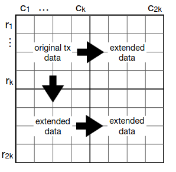
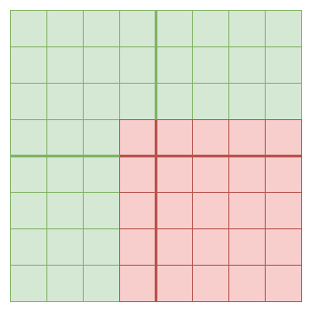
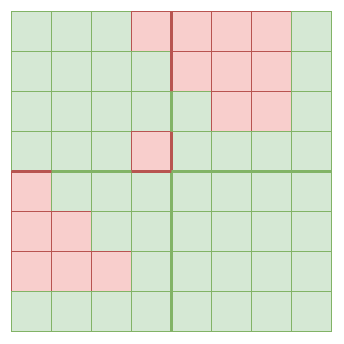

_Special thanks to Dankrad Feist and Eli ben-Sasson for discussion._

Ethereum plans to use [data availability sampling](https://www.paradigm.xyz/2022/08/das) to expand the amount of data space available to rollups. Specifically, it uses 2D data availability sampling, where data is arranged into a grid, taken as representing evaluations of a two-dimensional low-degree polynomial $P(X, Y)$, and is extended _both horizontally and vertically_.

If you have most of the data, but not all of the data, you can recover the remaining data as follows. Take every row or column where $\ge 50\%$ of the data is available, use [erasure coding algorithms](https://github.com/ethereum/research/blob/51b530a53bd4147d123ab3e390a9d08605c2cdb8/polynomial_reconstruction/polynomial_reconstruction.py) to recover the remaining data on those rows and columns. Repeat this process until all the data is recovered. This is a decentralized algorithm, as it only requires any individual node to operate over $O(N)$ data; recovered rows and columns can get re-broadcasted and passed to other nodes.

There is a proof that if $\ge 75\%$ of the _entire_ data is available, then it is possible to recover the remaining data. And if $< 75\%$ of the data is available, then the data may not be available. There are known examples of this that are very close to $75\%$; particularly, if the original data is a $M * N$ rectangle, and so the extended data is a $2M * 2N$ rectangle, then a missing rectangle of size $(M + 1) * (N + 1)$ makes the data unrecoverable using the above algorithm:

_Example where $M = N = 4$: if a 5x5 square is removed, there are no rows and columns that can be recovered, and so we are stuck._

This is why the data availability sampling algorithms ask clients to make $\approx 2.41 * log_2(\frac{1}{p_{fail}})$ samples: that's how many samples you need to guarantee that $\ge 75\%$ of the data is available (and so the remaining data is recoverable) with probability $\ge 1 - p_{fail}$.

## The complicated edge cases

The goal of data availability sampling is not strictly speaking to ensure _recoverability_: after all, an attacker could always choose to publish _less than_ $75\%$ (or even less than $25\%$) of the data. Rather, it is to ensure _rapid consensus on recoverability_. Today, we have a property that if even one node accepts a block as valid, then they can republish the block, and within $\delta$ (bound on network latency), the rest of the network will also accept that block as valid.

With data availability sampling, we have a similar guarantee: if $< 75\%$ of the block has been published, then almost all nodes will not get a response to at least one of their data availability sampling queries and not accept the block. If $\ge 75\%$ of the block has been published, then at first some nodes will see responses to all queries but others will not, but quite soon the rest of the block will be recovered, and those nodes will get the remaining responses and accept the block (there is no time limit on when queries need to be responded to).

However, it is important to note a key edge case: **recoverability by itself does not imply _rapid_ recoverability**. This is true in two ways:

### 1. There exist subsets of the $2M * 2N$ extended data that can be recovered using row-by-row and column-by-column recovery, but where it takes $O(min(M,N))$ rounds to recover them

[Here](https://github.com/ethereum/research/blob/51b530a53bd4147d123ab3e390a9d08605c2cdb8/erasure_code/2d_recovery/recover.py) is a python script that can generate such examples. Here is such an example for the $M = N = 4$ case:

This takes seven rounds to recover: first recover the topmost column, which then unlocks recovering the leftmost row, which then unlocks recovering the second topmost column, and so on until the seventh round finally allows recovering everything including the bottom square. An equivalent construction works for arbitrarily large squares, similarly taking $2N-1$ rounds to recover, and you can extend to rectangles (WLOG assume width > height) by centering the square in the rectangle, making all data to the left of the square unavailable, and making all data to the right of the square available.

Especially if recovery is distributed, requiring data to cross the network between each round, this means that it is possible for an attacker to publish "delayed release" blocks, which at first have a lot of data missing, but then slowly fill up over time, until after a minute or longer the entire block becomes available.

**Fortunately there is good news: while O(N)-round recoverable blocks do exist, the $\ge 75\%$ _total_ availability property guaranteed by data availability sampling actually guarantees not just recoverability, but _two-round_ recoverability.**

Here is a proof sketch. Assume the expanded data has $2*N$ rows and each row has $2*M$ columns.

**Definition**: a row is available if $\ge M$ samples on that row are available,  and a column is available if $\ge N$ samples on that column are available.

**Sub-claim**: assuming $3MN$ samples ($75\%$ of the data) are available, at most $N-1$ rows are not available

**Proof by contradiction**: for a row to be unavailable, it must be missing at least $C+1$ samples. If $\ge N$ rows were unavailable, then you would have $\ge N * (M+1) = MN + N$ samples missing, or in other words $\le 3MN - N$ samples available. This contradicts the DAS assumption.

**Two round recovery method**:

In the first round, we take advantage of that fact that at least $N+1$ rows are available (see the sub-claim), and fully recover those rows.

In the second round, we use the full availability of all samples on those rows to fully recover all columns.

Hence there is at most a delay of $3\delta$ (sample rebroadcast, row recovery and rebroadcast, column recovery and rebroadcast) between the first point at which a significant number of nodes see their DAS checks passed, and the point at which _all_ nodes see their DAS checks passed. 

### 2. You can recover from much less of the data, using algorithms that operate over the entire $O(N*M)$ data

Even if you don't have enough data to recover using the row-and-column algorithm, you can sometimes recover by operating over the full data directly. Treat the evaluations you have as linear constraints on the polynomial with unknown coefficients, which is made up of $M * N$ variables. If you have $M * N$ linearly independent constraints, then you can use Gaussian elimination to recover the polynomial in $O(M^3N^3)$ time. With more efficient algorithms, this could be reduced to $O(M^2N^2)$ and perhaps even further.

There is a subtlety here: while over 1D polynomials, each evaluation is a linearly independent constraint, over 2D polynomials, the constraints may not be linearly independent. To give an example, consider the polynomial $M(x) = (x - x_1) * (x - x_2) * ... * (x - x_{N-1}) * (y-y_1) * (y - y_2) * ... * (y - y_{N-1})$, where the evaluation coordinates are $x_1 .. x_{2N}$ on the X axis and $y_1 ... y_{2N}$ on the Y axis. This polynomial equals zero at nearly 75% of the full $2N * 2N$ square. It logically follows that for any polynomial $P$, $P$ and $P + M$ are indistinguishable if all you have are evaluations on those points.

In other cases where recovery using an algorithm that looks directly at the full 2D dataset _is_ possible, recovery requires the recovering node to have a large amount of bandwidth and computing power. As in the previous case, however, **this is not a problem for data availability sampling convergence**. If a block with $< 75\%$ of the data is published that is only recoverable with such unconventional means, then the block will be rejected by DAS until it is recovered, and accepted by DAS after.

**In general, all attacks involving publishing blocks that are partially available but not two-round-recoverable are equivalent to simply publishing the block at the point in time two rounds before when the recovery completes. Hence, these subtleties pose no new issues to protocol security.**