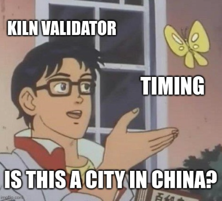
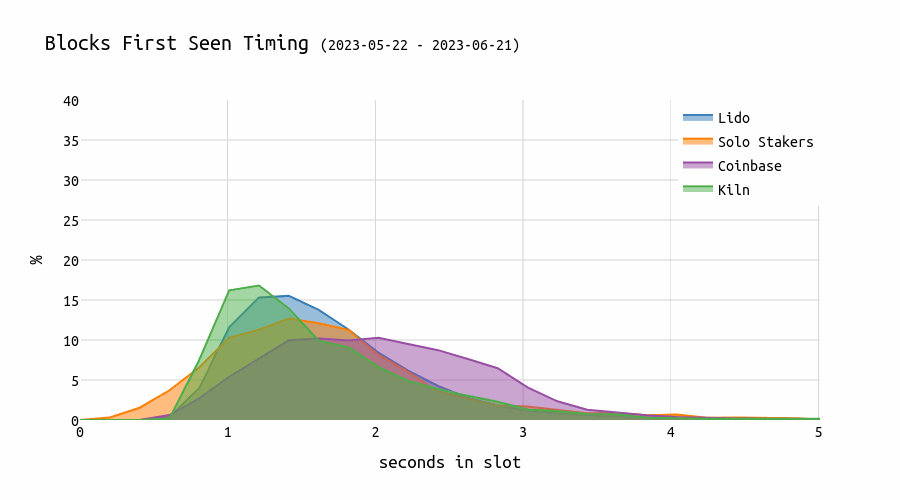
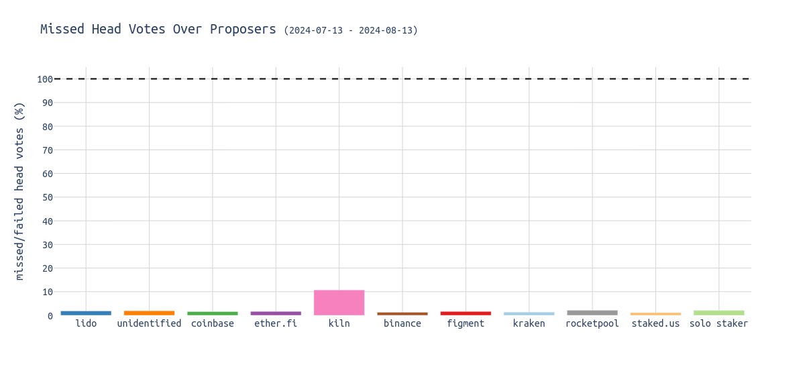
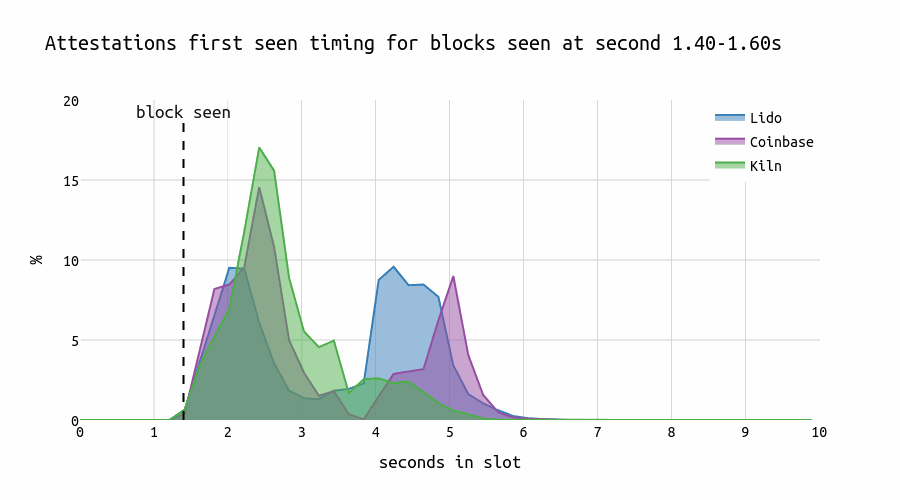
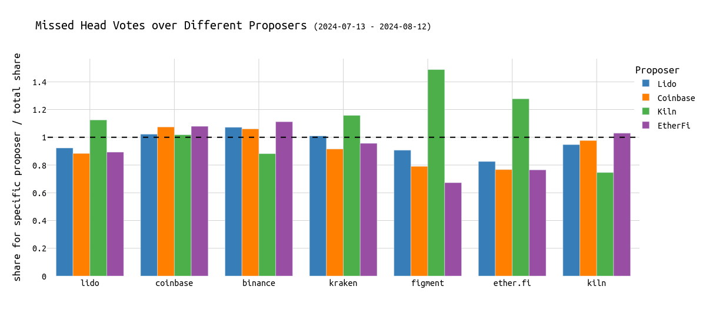
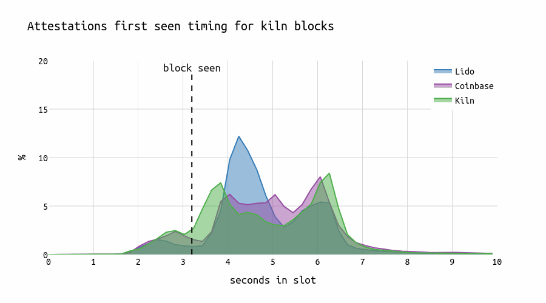
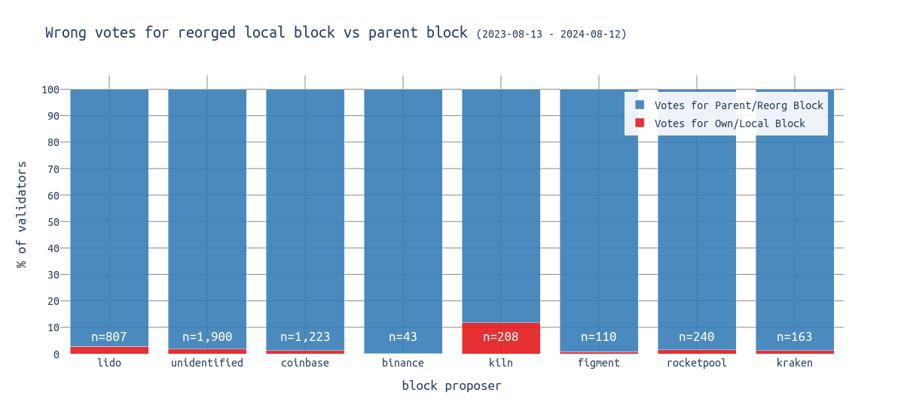

# On Attestations, Block Propagation, and Timing Games

By now, [proposer timing games](https://timing.pics/) are no longer a new phenomenon and have been analyzed, [here](https://eprint.iacr.org/2023/760), [here](https://arxiv.org/abs/2305.09032) and [here](https://ethresear.ch/t/deep-diving-attestations-a-quantitative-analysis/20020).

In the following research piece, I want to show the **evolution of [proposer timing games](https://timing.pics/)** and analyze their impact on attesters. Through a case study of the node operators of Lido, Coinbase, and Kiln, we dive deep into block proposal timing and its impact on Ethereum's consensus.

As of August 2024, the **block building market is largely outsourced**, with [~90%](https://mevboost.pics/) handled by [mevboost](https://github.com/flashbots/mev-boost) block builders. In practice, two builders, [Titan Builder](https://www.titanbuilder.xyz/) and [Beaverbuild](https://beaverbuild.org/), produce approximately [80%](https://mevboost.pics/) of all blocks that make it on-chain.

**Kiln is among the entities pushing timing games the furthest**, delaying block proposals to the **3-3.5 second** mark within the slot.

> In today's environment with mevboost, **block propagation is primarily handled by relays.** Although proposers still propagate the block after receiving it from the relay, relays typically have better network connectivity and can therefore do it faster. **However, the timing remains under the control of proposers**, who can delay their `getHeader` calls to engage in timing games.

This chart shows the **evolution of timing games**. We can see that blocks from Kiln validators appear later and later over time. 

**This comes with an impact on the network: for blocks proposed by Kiln proposers, the missed/wrong head vote rate is significantly higher:**

[Previous analysis](https://ethresear.ch/t/deep-diving-attestations-a-quantitative-analysis/20020) showed that **the longer one waits, the higher the expected number of missed head votes** (*"80% of attestations seen by the second 5 in the slot"*). Kiln proposes blocks very late, causing some attesters to miss them and instead vote for the parent block. **Given that there are approximately 32,000 validators assigned to each slot, this results in about 10% of them voting for the wrong block.**

Let's examine the attesting behavior of three large node operators and compare how they respond to **blocks proposed at different times within a slot.** The chart below illustrates the distribution of correct and timely head votes across the seconds within a slot.

For early blocks, we observe that both **Lido and Coinbase display a characteristic "U"-shape** in their voting patterns that might be caused by different geo locations or client software. In contrast, **Kiln shows a single prominent peak** that slightly lags behind the first peaks of Coinbase and Lido. **However, for late blocks, Kiln attesters also show the "U"-shape pattern.**

**When blocks are first seen at the 4-second mark in the p2p network during a slot, most Lido attesters attest up to 2 seconds earlier than most of the Kiln or Coinbase attesters.** This pattern doesn’t necessarily suggest that Kiln is executing "individual strategies." Instead, it could be attributed to running different clients or using different geographical locations.

### ***But who affects whom?***

In the following chart, we compare a node operator's performance over different proposers. A bar above y=1, for example, the green bar at Lido, indicates that Lido attesters miss more head votes for blocks from Kiln proposers. At the same time, Lido attesters do better for Lido blocks. The dashed line at 1 indicates the average share in missed head votes over all entities as proposers. A bar below 1 means the specific entity misses fewer head votes in conjunction with the respective proposer compared to the average.

> Importantly, it is expected that each node operator does best with its local blocks. This is expected even without a coordination oracle, simply by co-locating nodes.

To quickly summarize what we see:
* Most node operators are rather stable across different proposers.
* **Figment performs significantly worse for Kiln proposers.** The same applies to Lido, Kraken, and EtherFi attesters. 
* **Kiln and Binance are the only entities performing better for Kiln blocks** (which are, as a reminder, very late).

**Kiln attesters generally do well.** [Earlier analysis](https://ethresear.ch/t/deep-diving-attestations-a-quantitative-analysis/20020) showes that Kiln does a more than good job when it comes to running high-performing validators. Refer to [this analysis](https://ethresear.ch/t/deep-diving-attestations-a-quantitative-analysis/20020) for further details of Kiln's attestation performance.

**Kiln causes stress.** Now, we know that Kiln blocks cause stress to other attesters but not necessarily to Kiln's attesters. 

**Explaining how.** The "*how*?" is difficult to respond to at this point. A possible explanation might be that Kiln's validators are heavily co-located, with many validators running on the same machine, or have very dense peering. Another reason might be coordinated behavior across multiple nodes, either through custom peering/private mesh networks or through another additional communication layer connecting their validators. The latter is regarded as more centralizing as it leverages economies of scale even more.

A similar pattern can be observed when examining the (correct & timely) attestation timing of Lido and Coinbase for the blocks proposed by each respective entity (26.07.2024-03.08.2024).

Interestingly, Kiln develops a "U"-shape distribution ranging from $3.8 \Rightarrow
 6.1$ for their own late blocks, Lido a peak at 4.2s, and Coinbase a plateau starting at second 4 with a small peak at second 6 in the slot.

## "Prevent reorgs of my own proposed blocks"

Let's shift our focus to reorged blocks. One strategy from the perspective of a node operator might be to **never** vote for reorging out one's own block. Simply speaking, "*never vote for the parent block as the head if the proposer is me*".

Instead of calling it *an entity's own block*, I will use *local block* in the following.

The following chart shows the percentage of attesters voting for the reorged block vs voting for the parent block. The red part displays the % of all attesters from that entity that voted for a reorged block built by that entity.

Kiln shows outlier behavior. While most node operators' attesters correctly vote for the parent block rather than the local block, Kiln's attesters appear to disregard this norm. **Over 10% of Kiln attesters attempt to keep the local block on-chain by voting for it.** If such strategies are adopted, they might justify the losses from incorrect head votes if they prevent the local block from being reorged. However, these tactics are generally frowned upon within the Ethereum community: "*don't play with consensus*".

> The chart uses 365 days of data. Thus, if some sophisticated strategy was implemented during the last year, the red portion would be proportionately smaller.

## But how do we feel about any additional level of coordination?

Regarding coordinated attesting, we, as community, seem to accept that validators run on the same node vote for the same checkpoints.

We probably don't want any additional efforts that cross the boundaries of physical machines to improve coordination across validators. It's something that everyone can build that goes beyond [what the specs describe](https://github.com/ethereum/consensus-specs/blob/b2f2102dad0cd8b28a657244e645e0df1c0d246a/specs/phase0/validator.md#attesting). Such coordination could have different forms:
* **Level 1 - Fall-backs & Static Peering**: Have a central fall-back/back-up node for multiple physical machines. This can also be a circuit breaker, some particularly fault-tolerant machine acting as a private relayer for information. Setups with improved peering, private mesh networks, or similar might also fall into this category.
* **Level 2 - If-else rules**: Have hard-coded rules waiting longer in certain slots. Those would be installed on multiple physical machines, allowing them to "coordinate" based on predefined rules.
* **Level 3 - Botnet**: Have a centralized oracle that communicates with all validators and delivers the checkpoints to vote for and the timestamp when they should be published. 

In my opinion, crossing the line into the latter form of coordination (*level 2 and 3*) is problematic, and node operators should be held accountable. Finally, there may be a **gray area** for strategies involving **static peering** and **private mesh networks**. 

**Such setups could be used to run (malicious) strategies such as:**
* ensuring to never vote for different checkpoints across multiple physical machines.
* ensuring to never vote for reorging out a block from one's own proposer.
* coordinating based on the consecutive proposer ([honest reorg client](https://github.com/ethereum/consensus-specs/pull/3034) (y/n)).
* censoring attestations of a certain party.
* not voting for the blocks of a certain party.
* etc.

**When discussing *coordination*, it's important to distinguish between two types:**

1. Coordinated behavior that occurs when validators are **run from the same physical machine**.
2. Coordinated behavior that arises from running the same **modified client software** or relying on the same **centralized oracle**.

A potential solution to counter sophisticated coordinated validator behavior is [EIP-7716: Anti-Correlation Penalties"](https://ethereum-magicians.org/t/eip-7716-anti-correlation-attestation-penalties/20137), which proposes to scale penalties with the correlation among validators.

***Find the code for this analysis [here](https://github.com/nerolation/timing-games-and-economies-of-scale).***

# More on that topics

| Title | Author |
| -------- | -------- | 
| [Timing.pics](https://timing.pics)     | DotPics Website|
| [Timing Games: Implications and Possible Mitigations](https://ethresear.ch/t/timing-games-implications-and-possible-mitigations/17612?u=nero_eth)     | Caspar & Mike   |
| [Deep Diving Attestations - A quantitative analysis](https://ethresear.ch/t/deep-diving-attestations-a-quantitative-analysis/20020)     | Toni   |
| [Time, slots, and the ordering of events in Ethereum Proof-of-Stake](https://www.paradigm.xyz/2023/04/mev-boost-ethereum-consensus)     | Georgios & Mike |
| [Time is Money: Strategic Timing Games in Proof-of-Stake Protocols](https://arxiv.org/abs/2305.09032)     | Caspar et al.   |
| [Time to Bribe: Measuring Block Construction Market](https://eprint.iacr.org/2023/760)     | Toni et al.  |
| [The cost of artificial latency in the PBS context](https://ethresear.ch/t/the-cost-of-artificial-latency-in-the-pbs-context/17847)     | Chorus One  |
| [Empirical analysis of the impact of block delays on the consensus layer](https://ethresear.ch/t/empirical-analysis-of-the-impact-of-block-delays-on-the-consensus-layer/17888) | Kiln |
| [P2P Presentation on Timing Games (Youtube)](https://youtu.be/J_N13erDWKw?t=1061) | P2P_org |
| [Time is Money (Youtube)](https://www.youtube.com/watch?v=gsFU-inKRQ8) | Caspar