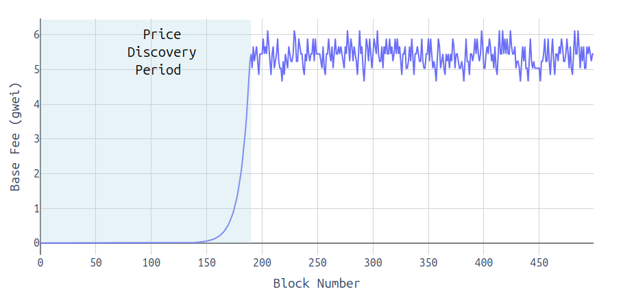
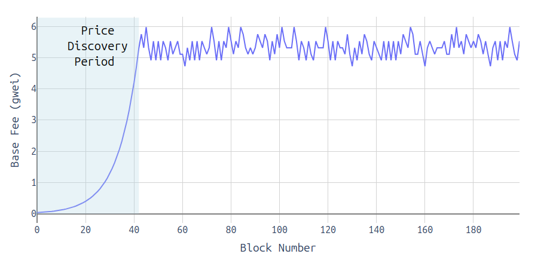
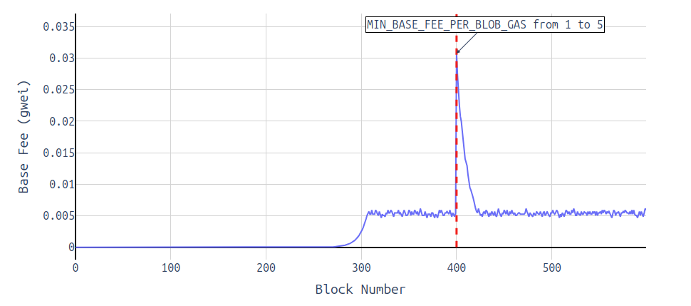
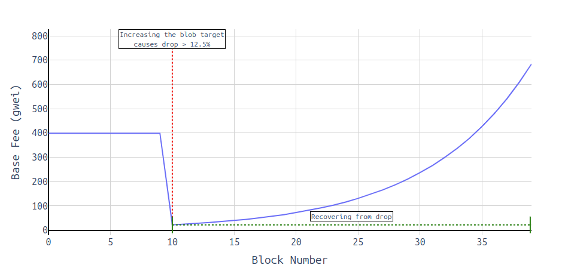
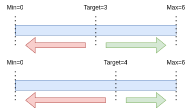
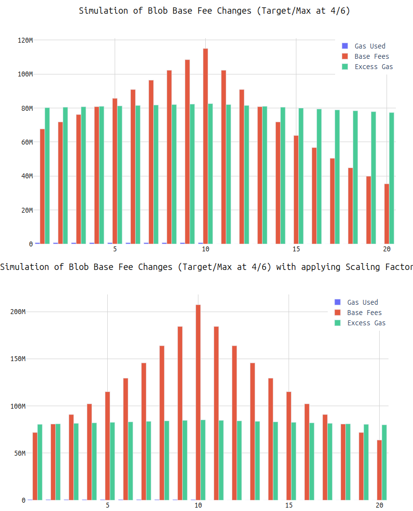

# On Blob Markets, Base Fee Adjustments and Optimizations

> Special thanks to [Ansgar](https://x.com/adietrichs), [Barnabé](https://x.com/barnabemonnot), [Alex](https://x.com/ralexstokes), [Georgios](https://x.com/gakonst), [Roman](https://x.com/r_krasiuk) and [Dankrad](https://x.com/dankrad) for their input and discussions, as well as [Bert](https://x.com/BertKellerman), [Gajinder](https://x.com/Gajpower) and [Max](https://x.com/MaxResnick1) for their efforts on this topic!

**The tl;dr:**
All the suggested updates make sense in theory. Should we do them in Pectra - depends.
1. Raising the min blob fee allows faster price discovery.
2. Automating the blob gas update fraction makes it future-proof.
3. Normalizing the excess gas prevents an edge gas where the blob base fee drops after a fork that increases the target, though, nothing bad can happen if we don't do it.
4. Making the base fee scaling symmetric ensures the mechanism stays as-is (scales $\pm 12.5%$ at the extremes of 0 and 6 blobs)

---

**I would propose to summarize all those changes in [EIP-7762](https://github.com/ethereum/EIPs/blob/16a12dcf41251c592f74042b6aa5727097f60167/EIPS%2Feip-7762.md) and ship them together when we change the target/max from 3/6 to 4/6. If we're afraid that Pectra might grow too big with adding yet more changes, I'd propose them in the following order with decreasing importance:**
1. Increase blob count.
a) Do 4/6, being conservative, or something like 6/9 if we feel more confident.
b) Ship [EIP-7623](https://github.com/ethereum/EIPs/blob/16a12dcf41251c592f74042b6aa5727097f60167/EIPS/eip-7623.md) to ensure the EL payload size is significantly reduced to make room for more blobs.
3. Ship the outlined base fee changes.
 

---

### Recap of the Blob Fee Mechanism
With the launch of [EIP-4844](https://github.com/ethereum/EIPs/blob/16a12dcf41251c592f74042b6aa5727097f60167/EIPS%2Feip-4844.md), Ethereum added a new dimension to its fee market. Blobs, coming with their own base fee, provide dedicated space for data, allowing applications and rollups to post information on-chain without requiring EVM execution.
The blob fee structure is governed by a base fee update rule, which approximates the formula:


```python
base_fee_per_blob_gas = MIN_BASE_FEE_PER_BLOB_GAS * e**(excess_blob_gas / BLOB_BASE_FEE_UPDATE_FRACTION)
```

In this equation, `excess_blob_gas` represents the total surplus of blob gas usage compared to the target amount (`TARGET_BLOB_GAS_PER_BLOCK` per block). Like the [EIP-1559](https://github.com/ethereum/EIPs/blob/16a12dcf41251c592f74042b6aa5727097f60167/EIPS%2Feip-1559.md) fee mechanism, this formula is self-adjusting: as the excess blob gas increases, the `base_fee_per_blob_gas` rises exponentially, which discourages excessive usage and nudges the excess back toward a level at which rollups perceive the base fee as a "fair" price.

The process operates as follows: if block `N` consumes `X` blob gas, then in block `N+1`, the `excess_blob_gas` increases by `X - TARGET_BLOB_GAS_PER_BLOCK`. Consequently, the `base_fee_per_blob_gas` for block `N+1` adjusts by a factor of `e**((X - TARGET_BLOB_GAS_PER_BLOCK) / BLOB_BASE_FEE_UPDATE_FRACTION)`.

The parameter `BLOB_BASE_FEE_UPDATE_FRACTION` controls the maximum possible rate of change for the blob base fee. This rate is set to achieve a target maximum increase and decrease of approximately `1.125` per block, based on `e**(TARGET_BLOB_GAS_PER_BLOCK / BLOB_BASE_FEE_UPDATE_FRACTION)`.

In the initial rollout, blob prices were expected to be low, with gradual increases until the market finds an equilibrium or "fair" price (i.e., price discovery). The blob fee market introduced by EIP-[4844](https://github.com/ethereum/EIPs/blob/16a12dcf41251c592f74042b6aa5727097f60167/EIPS%2Feip-4844.md) follows a structure similar to [EIP-1559](https://github.com/ethereum/EIPs/blob/16a12dcf41251c592f74042b6aa5727097f60167/EIPS%2Feip-1559.md), with a base fee that adjusts dynamically based on demand.

#### Reaching the Point of "Price Discovery"

As of November 2024, Ethereum has reached a level of demand where rollups would stop posting blobs no matter what the base fee is, but instead post an amount of blobs that keeps the base fee quite stable. People like calling that a phase of "price discovery", even though it just means that at that specific point in time a certain base fee X is regarded as a fair price. At the time of "price discovery", rollups would no longer consistently post 6 blobs per block without considering the blob base fee, as it is no longer negligible. However, an increasing demand for blobs without an increasing supply (i.e. more blobs available) will lead to higher blob fees. For the following, forgive me when using this simplified concept of "price discovery," even though prices are discovered every 12 seconds with every slot.

## Proposed Adjustments, and their Pros & Cons

Looking ahead to the upcoming Pectra fork, there is a clear demand for scaling blobs (from 3/6 to 4/6 or, more sophisticated, 6/9), which could necessitate adjustments to the blob fee market.

In the following sections, I will outline 4 potential changes to the blob fee market and discuss the associated benefits and challenges for each.

1. **Adjusting the Minimum Base Fee**: One of the simplest adjustments is to modify the `MIN_BASE_FEE` parameter, as suggested by Max Resnick.
3. **Automating Blob Base Fee Update Fraction**: A simple change to ensure the blob base fee update fraction scales with the target number of blobs.
4. **Normalization of Excess Gas**: Another proposal from Bert Kellerman and Gajinder suggests "normalizing" the calculation for excess gas usage.
5. **Symmetrizing the Base Fee Updates**: A proposal to adjust the base fee formula.

---

## 1. Increase MIN_BASE_FEE_PER_BLOB_GAS ([EIP-7762](https://github.com/ethereum/EIPs/blob/16a12dcf41251c592f74042b6aa5727097f60167/EIPS%2Feip-7762.md))

The blob base fee starts at 0 and then slowly increases until the point of price discovery. Every ~6 blocks (with 6 blobs) the base fee doubles but it's a long way to go from 1 wei to a price that is more reasonable, like, for example, 5 gwei. Until we're at that level, the price may fluctuate a lot and rollups basically get "overly" cheap DA.




The mentioned EIP proposes to increase the minimum base fee from 1 wei to ~0.034 gwei. This would shorten the time until price discovery and thus quicker pushes rollups towards a more stable price range that is considered "fair".

For the base fee to climb from 1 to 5 gwei, it takes...
 $\frac{\ln\left(\frac{\text{base_fee_target}}{\text{base_fee_start}}\right)}{\text{growth_rate}} = \frac{\ln(5 \times 10^9 / 1)}{0.117} \approx 190 \text{ blocks}$ and all of those blocks need to have 6 blobs. This equals to approx. 38 minutes.

With the new, increased `MIN_BASE_FEE_PER_BLOB_GAS`, we would lower this duration to...
 $\frac{\ln(5 \times 10^9 / 2^{25})}{0.117} \approx  \text{42 blocks}$, equaling 8.4 minutes.



**One highly important caveat/implementation detail:**

**We MUST reset the excess gas when updating the `MIN_BASE_FEE_PER_BLOB_GAS`**.

The reason for that is that otherwise we would see an unpredictable, extreme spike in the blob base fee right after the fork. This is because the min base fee acts as a multiplier to the base fee and a small adjustment to it can greatly impact the base fee if the excess gas accumulated until that point is not reset.
Here's an example of that: A apparently "meaningless" increase from 1 to 5 wei is enough to make the base fee skyrocketing and then, rollups would have to wait for a certain period of time until the price calms down again.



### Summarizing
#### Pros:
* Faster "price discovery".
* Less volatility in times of supply < demand.

#### Cons:
* Required touching the protocol and we usually aren't "micro-optimizing" things that aren't broken.
* Since excess gas is reset, we have to go through a phase of price discovery again, though, starting at a higher level thus shortening that time.

This can be simplified as "ossification vs. optimizations" and, imo, there's no right or wrong, even though I personally think that NOT touching the protocol has value too.

---

## 2. Automating Blob Base Fee Update Fraction

This change is super simple: As of now, the update fraction is set to 3338477, as specified in [EIP-4844](https://github.com/ethereum/EIPs/blob/16a12dcf41251c592f74042b6aa5727097f60167/EIPS%2Feip-4844.md). One gets to that number by doing $\frac{target\_gas}{ln(1.125)}$. If we now replace the hardcoded number with this, we can make sure that we maintain the desired $\pm 12.5%$ change.

There is currently an [open PR](https://github.com/ethereum/EIPs/pull/8994) for this change to be included in [EIP-7742](https://github.com/ethereum/EIPs/blob/16a12dcf41251c592f74042b6aa5727097f60167/EIPS%2Feip-7742.md) but I'd argue we shouldn't bundle it together and instead propose this change individually together with the other changes to the base fee mechanism that we might want to ship.

---

## 3. Normalization of Excess Gas

That's a proposal that aims to avoid steep base fee drops after forks that increase the blob target.

To avoid a sudden drop in the base fee right after a fork that increases the blob target, this proposal suggests adjusting the way we calculate excess gas. Normally, the base fee should change smoothly—only up to 12.5% per slot. By normalizing excess gas, we can ensure the base fee remains stable and doesn’t drop sharply beyond the expected 12.5% limit when the target increases, keeping fee adjustments predictable and gradual.

Simply put, instead of accumulating excess gas, we accumulate normalized excess gas. This way the target blob number doesn't matter.



By introducing a normalization factor in the excess gas calculation, we can adjust the accumulated excess gas to remain proportionate to the new target. This ensures that the base fee adjusts smoothly, maintaining consistent fee dynamics even when the target changes.

Normalization involves scaling the excess gas using a constant factor, so that it reflects the deviation from the target in a consistent manner regardless of the target's value. This approach keeps the base fee adjustments within the expected limits, preventing sudden drops or spikes that could disrupt the network's fee market.

For more details on this change, check [this commit](https://github.com/ethereum/EIPs/blob/4ce73bd55eacae560073622c1af2aac0ab362a52/EIPS/eip-7742.md).


### Summarizing
#### Pros
* Avoids base fee drop after fork with target increase.
  * more predictability for blob users

#### Cons
* Another potential "micro-optimization".

---


### Symmetrizing Blob Base Fee Updates around the Target

With changing the target such that $target=\frac{max}{2}$ doesn't hold anymore, we change the distance from the target to the min/max. E.g., going to a blob target of 4 and a max of 6, there is room for 2 blobs up and 4 blobs down.



Now, with more room on the negative side than on the positive side, the base fee can move down faster than it can move up.




A simple fix to this is the following:
We first determine the delta between the gas used and the target (same as we do now). Then we apply a scaling factor that is simply `target/(max-target)` to the side that has **less** "room" (e.g., the "up" side when doing 4/6 target/max).

The `calc_excess_blob_gas` function would look like the following:
```python
def calc_excess_blob_gas(parent_header: Header) -> int:
    scaling_factor = TARGET_BLOB_GAS_PER_BLOCK / (MAX_BLOB_GAS_PER_BLOCK - TARGET_BLOB_GAS_PER_BLOCK)
    blob_gas_delta = parent_header.blob_gas_used - TARGET_BLOB_GAS_PER_BLOCK
    if blob_gas_delta > 0:
        scaled_delta = blob_gas_delta * scaling_factor
    else:
        scaled_delta = blob_gas_delta
    excess_blob_gas = max(0, parent_header.excess_blob_gas + scaled_delta)
    return excess_blob_gas
```

Of course, this only works in cases where $max-target<target$ and one could generalize it even more, but I'd guess it's not worth it.

To better understand the effects of this symmetrizing process, let’s walk through a simple example:

1. Imagine we have three slots:
   - The first two slots contain 6 blobs each.
   - The last slot contains 0 blobs.
2. This results in a total of 12 blobs across the 3 slots.
3. The target is set to 4 blobs per block, with a maximum of 6 blobs.

#### Symmetric vs. Non-Symmetric Base Fee Adjustments:
- **Symmetric Base Fee**:  
  - The base fee increases by approximately 12.5% twice (for the two 6-blob slots) and then decreases by 12.5% once (for the 0-blob slot).  
  - After these adjustments, the base fee ends up **higher** than its initial value.  

- **Non-Symmetric Base Fee**:  
  - The base fee remains unchanged after the 6-6-0 blob sequence.

This example highlights the benefits of a symmetric adjustment:  
- The 6-6-0 blob sequence pushes us toward extremes (max utilization followed by none), which is undesirable.  
- Ideally, the load should be more evenly distributed across the three slots (e.g., 4 blobs in each block).  
- A symmetric base fee discourages extreme behavior by "penalizing" uneven usage (6 blobs instead of 4) more with a higher base fee, promoting a more balanced load.
- Of course, one could argue that blob users might not care about pushing the base fee up because they might only need to post blobs a few times in every epoch and therefore don't care about the slot following their 6-blob posting. Though, this argument is short-sighted.


### Summarizing
#### Pros
* Ensure "price discovery" happens as fast as it does now.
* Ensure the "extremes" (0 and 6 blobs) cause the same percentage increases/decreases.

#### Cons
* Yet another "micro-optimization" and everything might be fine without doing it.
* Introducing some path dependency. E.g. jumping between $gas\_used= target \pm 1\ blobs$ causes the base fee to increase steadily over time. This behavior can be counteracted by avoiding posting more blobs than the target, which may even incentivize a more balanced posting strategy.