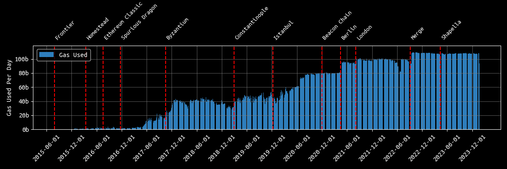
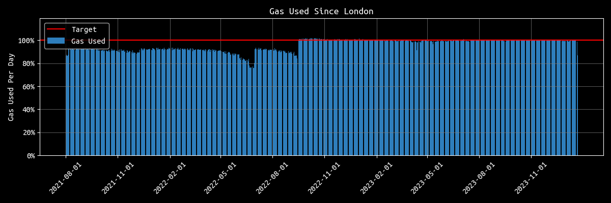
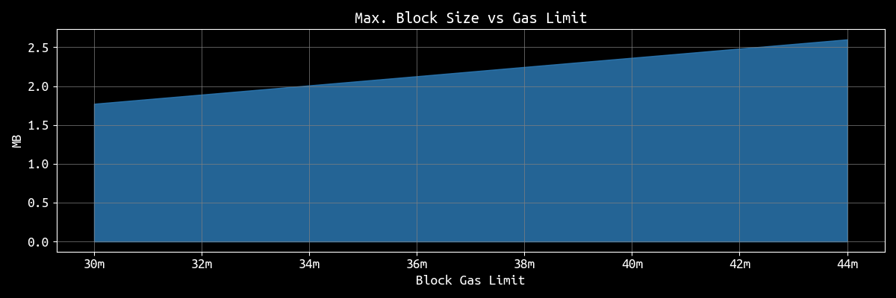
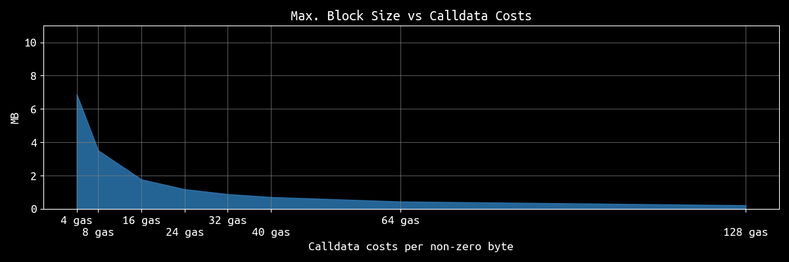
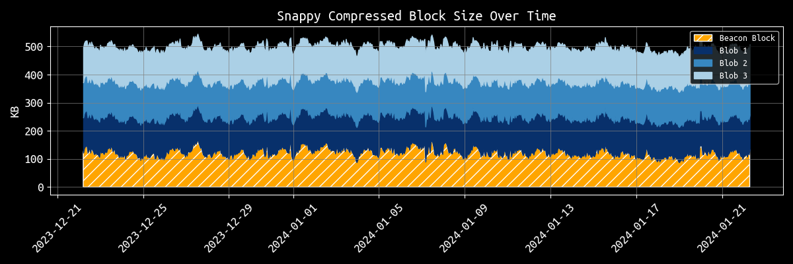

# On Block Sizes, Gas Limits and Scalability

> *Thanks to [Alex Stokes](https://twitter.com/ralexstokes), [Matt (lightclients)](https://twitter.com/lightclients) and [Matt Solomon](https://twitter.com/msolomon44) for feedback and review!*

There has been much discussion about raising Ethereum's block gas limit recently. 
Some argue for bigger blocks based on Moore's law, some based on a personal gut feeling, some are just trolling around and others are afraid that other chains like Solana will outpace Ethereum when it comes to widespread user adoption.

**In the following, I want to present some charts and figures that may be helpful in guiding us towards a decision that maxes out the gas limit without compromising Ethereum's decentralization.**

## From the beginning
In contrast to Bitcoin, Ethereum doesn't have a fixed block size limit. Instead, Ethereum relies on a flexible block size mechanism governed by a unit called "gas." Gas in Ethereum is a unit that measures the amount of computational effort required to execute operations like transactions or smart contracts. Each operation in Ethereum requires a certain amount of gas to complete, and each block has a gas limit, which determines how many operations can fit into a block.

Ethereum started with a gas limit of 5000 gas per block [in 2015](https://blog.ethereum.org/2015/07/22/frontier-is-coming-what-to-expect-and-how-to-prepare).
This limit was then quickly raised to ~3 million and then to ~4.7 million [later in 2016](https://soliditydeveloper.com/max-contract-size).
With the Tangerine Whistle hardfork and, more specifically, [EIP-150 in 2016](https://github.com/ethereum/EIPs/blob/6572e92dccb2a581c0082befb953050f75d0ece5/EIPS/eip-150.md), the gas limit was raised to 5.5 million, based on a repricing of various IO-heavy opcodes as a response to DoS attacks. After these attacks, the limit was continuously raised by miners to [~6.7 million in July 2017](https://www.preethikasireddy.com/post/blockchains-dont-scale-not-today-at-least-but-theres-hope), then [~8 million in December 2017](https://vitalik.eth.limo/general/2017/12/17/voting.html), then [~10 million in September 2019](https://cryptomode.com/news/crypto/ethereum-mining-pools-push-for-a-block-gas-limit-increase/), then [12.5 million in August 2020](https://twitter.com/etherchain_org/status/1273912037274537984?s=20) and finally to [~15 million in April 2021](https://www.coindesk.com/tech/2021/04/22/ethereum-gas-limit-hits-15m-as-eth-price-soars/).

Further on, with the Spurious Dragon, Byzantium, Constantinople, Istanbul and Berlin hardforks, the pricing of certain opcodes was further refined. Examples of these refinements are [EIP-145](https://eips.ethereum.org/EIPS/eip-145), [EIP-160](https://eips.ethereum.org/EIPS/eip-160), [EIP-1052](https://eips.ethereum.org/EIPS/eip-1052), [EIP-1108](https://eips.ethereum.org/EIPS/eip-1108), [EIP-1884](https://eips.ethereum.org/EIPS/eip-1884), [EIP-2028](https://eips.ethereum.org/EIPS/eip-2028), [EIP-2200](https://eips.ethereum.org/EIPS/eip-2200), [EIP-2565](https://eips.ethereum.org/EIPS/eip-2565) and [EIP-2929](https://eips.ethereum.org/EIPS/eip-2929).

The most significant change to Ethereum's fee market happened with the London hardfork in August 2021 and more specifically [EIP-1559](https://eips.ethereum.org/EIPS/eip-1559).
EIP-1559 introduced a base fee that dynamically adjusts over time/blocks depending on the demand for blockspace. At the same time a so called target has been introduced and set to 15 million gas per block. This target is used to guide the dynamic adjustment of the base fee. If the total gas used in a block exceeds this target, the base fee increases for the subsequent block. Conversely, if the total gas used is below the target, the base fee decreases. This mechanism aims to create a more predictable fee market and improve the user experience by stabilizing transaction costs. Additionally, EIP-1559 also introduced a burning mechanism for the base fee, permanently removing that portion of ether from circulation. This hardended the protocol's sustainability while creating the [ultra sound money meme](https://ultrasound.money/).

Under EIP-1559, there is also a maximum (or "hard cap") gas limit, set to twice the target, which is 30 million gas. This means that a block can include transactions using up to 30 million gas.

**Since then Ethereum's block gas limit remained the same and, as of 2024, it is still at 30 million gas per block.**

## Are we ready for an increase?

Recently, some raised concerns about Ethereum's gas limit and demanded it to be increased. In the most recent [Ethereum Foundation AMA](https://www.reddit.com/r/ethereum/comments/191kke6/ama_we_are_ef_research_pt_11_10_january_2024/) on Reddit, Vitalik [considered](https://www.reddit.com/r/ethereum/comments/191kke6/comment/kh7ekx3) the idea of increasing the gas limit by 33% to 40 million. He based his reasoning on [Moore's law](https://en.wikipedia.org/wiki/Moore%27s_law) which states that the number of transistors on a microchip doubles approximately every two years, leading to a corresponding increase in computational power. This principle suggests that network capabilities, including processing and handling transactions, could also increase over time. 

Support came from [Dankrad](https://x.com/dankrad/status/1745406611202437356?s=20) and [Ansgar](https://x.com/adietrichs/status/1745190417254003123?s=20), both researchers at the Ethereum Foundation, who like the idea of increasing the gas limit after evaluating the situation after the Dencun upgrade. In addition, [Pari](https://twitter.com/parithosh_j) from the Ethereum Foundations published [a post](https://ethresear.ch/t/testing-path-for-a-gas-limit-increase/18399) exploring paths for a potential gas limit increase.
Others like [Peter](https://x.com/peter_szilagyi/status/1745374731824439531?s=20) and [Marius](https://x.com/vdWijden/status/1745463453345788352?s=20) from Geth raised concerns about increasing the gas limit, especially without having appropriate tooling/monitoring in place. These concerns were specifically based on accelerating state growth, syncing times and reorged block rates. 

## What is the block size?

The size of a block can be measured in two ways:
* Gas Usage
* Block size (in bytes)

While both of these measures correlate, they must be considered independently.
For example, a block that contains much non-zero calldata bytes might be big in terms of its size in bytes while the actual gas usage (16 gas for non-zero bytes) may still be relatively small.

Ignoring compression, the maximum block size that can be achieved today while still obeying the [128 KB per transaction limit of Geth](https://github.com/ethereum/go-ethereum/blob/830f3c764c21f0d314ae0f7e60d6dd581dc540ce/core/txpool/legacypool/legacypool.go#L49-L53) is ~6.88 MB. Such a block would max out the number of 128 KB transactions in a block. In practice, these are 55 transactions containing ~130,900 bytes of zero-byte calldata (4 gas per byte) and one transaction filling up the remaining space. However, after snappy compressing such a block we end up at ~0.32 MB, which is negligible.
The largest possible block after compression contains 15 transactions filled with non-zero calldata and can have a size of ~1.77 MB.

**So, as of today, 1.77 MB represents the realistic upper-bound block size for an execution layer block.**

Focusing on this maximum block size, we can identify several factors that influence it:
* **Gas limit**: Of course, the gas limit has an impact on the maximum block size. The higher it is, the more data can be put into a block.
* **Pricing of operations and data**: The cheaper an operation in terms of gas, the more often the operation can be executed within a block. While operations such as CALLDATALOAD or CALLDATACOPY, both costing [3 gas](https://www.evm.codes/?fork=shanghai), are relatively cheap, other opcodes such as CREATE are more expensive. The more expensive the opcodes used in a block, the less space for calldata (or other operations) in that block.
* **Client limits**: While not that obvious, client limits such as the [128kb limit](https://github.com/ethereum/go-ethereum/blob/830f3c764c21f0d314ae0f7e60d6dd581dc540ce/core/txpool/legacypool/legacypool.go#L49-L53) per transaction of Geth can also impact the final block size. Since every transaction costs [21k gas as a fixed fee](https://ethereum.stackexchange.com/questions/34674/where-does-the-number-21000-come-from-for-the-base-gas-consumption-in-ethereum), the lower the client limit per transaction, the more often one has to pay the fixed fee, thus "wasting" gas that could otherwise be used for calldata. As a result, this limit can cause the maximum block size to be reduced by ~0.07 MB. Importantly, the client limits only impact the broadcasting of transactions and do not affect blocks that have already been confirmed.

**Let's focus on the gas limit per block first:**

The most straightforward and apparent way to scale a blockchain like Ethereum is increasing the block gas limit. A higher limit means more space for data. However, this also comes with larger blocks that everyone running a full node needs to propagate and download.
As visible in the chart above, the "worst-case" block size increases more or less linearly with the block gas limit. Those limits can be reached by creating blocks that use as many non-zero byte calldata transaction of maximum size.

**Next, let's shift our focus to the second point - Ethereum's pricing mechanism.** 
More specifically, we look at the costs for non-zero byte calldata that is currently set to 16 gas:

As we can see in the above chart, increasing the costs for non-zero calldata leads to decreasing block sizes. On the other hand, reducing the costs to, e.g. 8 gas per byte, doubles the size of worst-case blocks. This is very intuitive as halving the price allows to put double the amount of data into a block.

## What about EIP-4844 (Proto-Danksharding)?

I won't cover the details of 4844 here as there exists great documentation on [eip4844.com](https://www.eip4844.com/), but simply speaking, EIP-4844 introduces "sidecars" that are named "blobs" with each blob carrying ~125kb of data. Similar to EIP-1559, there exists a "target" which determines the targeted number of blobs available. With the Dencun hardfork the target is set to 3 blobs with a maximum set to 6 blobs per block.
Importantly, blobs come with their own fee market, creating a so-called [multidimensional fee market](https://ethresear.ch/t/multidimensional-eip-1559/11651). This means that blobs don't have to compete with standard transactions but are decoupled from the EIP-1559 fees.

So far, so good. Let's see how this upgrade affects the average block size of Ethereum.

As of today, the average block size of beacon chain blocks after employing snappy compression is around 125 KB. With 4844, we add another 375 KB to each block, thus 4x'ing the current avg. block size. By reaching the maximum number of blobs, we essentially increase the current block size by sevenfold.

The worst-case block increases from ~1.77 MB to ~2.5 MB. This estimation does not take into account the CL parts of a block. Nonetheless, in the event of a DoS attack, we must be prepared to deal with such maximum size blocks.

## Conclusion

Finally, increasing the current block gas limit requires thorough research and analysis before implementation. While sophisticated entities like Coinbase, Binance, Kraken, or Lido Node Operators might manage block gas limits over 40 million, solo stakers could struggle.

Thus, such decisions must be well-considered to make sure we do not hurt decentralization.

In the end, it's rather easy to build something that is as scalable as Facebook but what matters is to not lose the property that most of us signed up for: decentralization.

---

Find the code for the above estimates and charts [here](https://github.com/nerolation/eth-gas-limit-analysis).