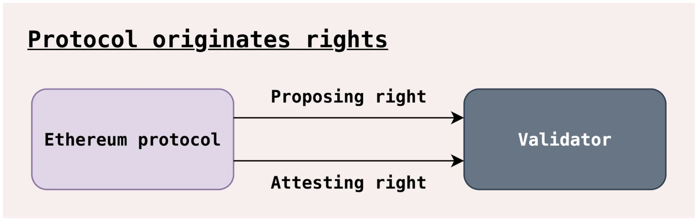
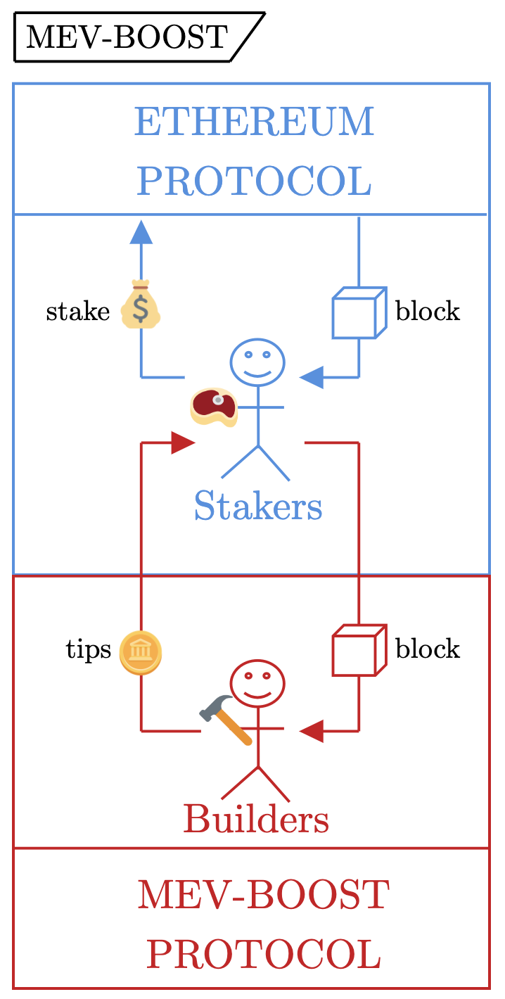
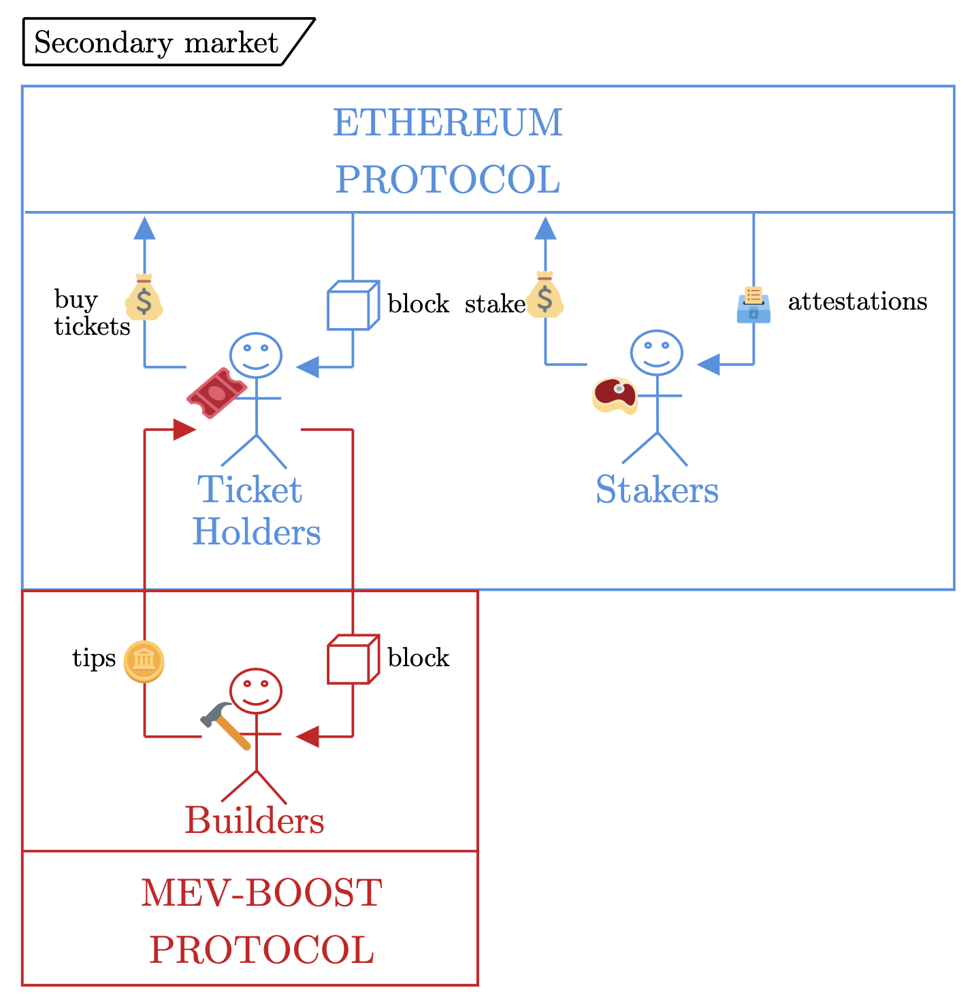
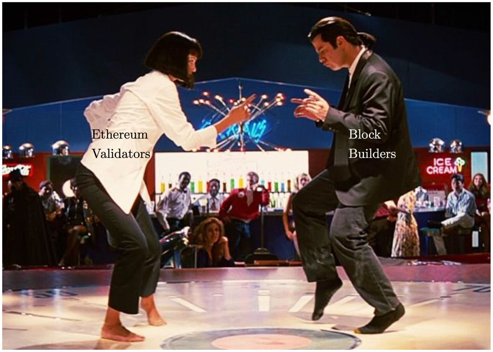

# On block-space distribution mechanisms

**^p.s. yes, we anthropomorphize the protocol as a ghost because [Casper](https://arxiv.org/pdf/1710.09437.pdf).**
**^^p.p.s. not sure why the auctioneer ghost looks like he is conducting an orchestra, but here we are ¯\\\_(ツ)_/¯.**
**^^^ p.p.p.s. by the way, if you haven't seen [Maestro](https://en.wikipedia.org/wiki/Maestro_(2023_film)), it's great.**

$\cdot$
*by [Mike](https://x.com/mikeneuder), [Pranav](https://x.com/PGarimidi), & [Dr. Tim Roughgarden](https://x.com/Tim_Roughgarden) – June 8, 2024.*
$\cdot$
**Acknowledgements**
*Special thanks to [Barnabé](https://x.com/barnabemonnot), [Julian](https://x.com/_julianma), [Jonah](https://x.com/_JonahB_), [Davide](https://x.com/DavideCrapis), [Thomas](https://x.com/soispoke), [Terence](https://x.com/terencechain), [Potuz](https://x.com/potuz_eth), & [Nate](https://www.nano210.blog/) for comments and discussions.*
$\cdot$
**tl;dr;** *Block space, the capacity for transaction inclusion, is the principal resource exported by blockchains. As the crypto ecosystem scales up and professionalizes, the value produced by efficient usage of block space ([MEV](https://arxiv.org/abs/1904.05234)) has come to play a significant role in the economics of permissionless consensus mechanisms. An immense amount of ink has been spilled by the research community considering what, if anything, protocols should enshrine in response to MEV (see [Related Work](#related-work-2)). Indeed, the past few years resemble a [Blind Men and the Elephant](https://en.wikipedia.org/wiki/Blind_men_and_an_elephant) narrative arc, where many different perspectives, solutions, and theories have been propounded, but each angle can feel disjoint and difficult to compare. The first half of this article aims to present a broad-strokes painting of the "MEV-ephant" by distilling the design space into a core set of questions and exploring how existing proposals answer them. The second half hones in specifically on allocation mechanisms enabled by execution tickets, demonstrating an important new insight – there is a trade-off between the quality of the in-protocol MEV oracle and the fairness of the mechanism.* 

**Organization:** [Section 1](#h-1-motivation-3) <u>motivates</u> the need for an in-protocol mechanism to handle block-space distribution as part of the "endgame" for Proof-of-Stake. [Section 2](#h-2-enumeration-6) <u>enumerates</u> five axes along which block-space distribution mechanisms may be measured, using a familiar set of questions: *who, what, when, where, how* (abbr. the `W^4H questions`). [Section 3](#h-3-interrogation-11) <u>interrogates</u> how the block builder is selected, focusing on the execution tickets model. [Section 4](#h-4-extrapolation-18) <u>extrapolates</u> by concluding and raising open questions that follow from the framework established.

**Structural note:** This article is rather long for this format and has some technical elements. We encourage the reader to focus on the portion of the article they are most interested in:

- Sections [1](#h-1-motivation-3), [2](#h-2-enumeration-6), & [4](#h-4-extrapolation-18) provide a broader perspective on the existing proposals and our proposed methodology for analyzing them.
- [Section 3](#h-3-interrogation-11) (which is $\approx 44\%$ of the content, but [$100\%$](https://youtu.be/VDvr08sCPOc?t=111) of the math) provides a detailed analysis of allocation mechanisms enabled by the execution tickets design. This section can be read in sequence, in isolation, or skipped altogether – up to you!

$\cdot$
**Contents**
1. [**Motivation**](#h-1-motivation-3)
[*1) What*](#h-1-what-4)
[*Block-space distribution today through `mev-boost`*](#Block-space-distribution-today)
2. [**Enumeration**](#h-2-enumeration-6)
[*The elements of block-space distribution*](#the-elementshttpsenwikipediaorgwikieuclid27s_elements-of-block-space-distribution-7)
[*Execution tickets and other animals*](#execution-tickets-and-other-animals-8)
[*Applying W^4H: a comparative analysis*](#applying-w4h-a-comparative-analysis-9)
[*Motivational interlude*](#motivational-interlude-10)
3. [**Interrogation**](#h-3-interrogation-11)
[*Preliminaries*](#preliminaries-12)
[*Model*](#model-13)
[*Familiar allocation mechanisms*](#familiar-allocation-mechanisms-14)
[*Comparing the outcomes*](#comparing-the-outcomes-15)
[*Aside #1: Calculating equilibrium bids*](#aside-1-calculating-equilibrium-bids-16)
[*Aside #2: Tullock Contests*](#aside-2-tullock-contests-17)
4. [**Extrapolation**](#h-4-extrapolation-18)

$\cdot$
#### **Related work**
1. *mev-boost & relays*
    - [*MEV-Boost: Merge ready Flashbots Architecture*](https://ethresear.ch/t/mev-boost-merge-ready-flashbots-architecture/11177); Flashbots team
    - [*Relays in a post-ePBS world*](https://ethresear.ch/t/relays-in-a-post-epbs-world/16278); Mike, Jon, Hasu, Tomasz, Chris, Toni
3. *mev-burn / mev-smoothing*
    - [*Burning MEV through block proposer auctions*](https://ethresear.ch/t/burning-mev-through-block-proposer-auctions/14029); Domothy
    - [*MEV burn – a simple design*](https://ethresear.ch/t/mev-burn-a-simple-design/15590); Justin
    - [*Committee-driven MEV smoothing*](https://ethresear.ch/t/committee-driven-mev-smoothing/10408); Francesco
    - [*Dr. changestuff or: how I learned to stop worrying and love mev-burn*](https://ethresear.ch/t/dr-changestuff-or-how-i-learned-to-stop-worrying-and-love-mev-burn/17384); Mike, Toni, Justin
5. *enshrined Proposer-Builder Separation (ePBS)*
    - [*Two-slot proposer/builder separation*](https://ethresear.ch/t/two-slot-proposer-builder-separation/10980); Vitalik
    - [*Unbundling PBS: towards protocol-enforced proposer commitments (PEPC)*](https://ethresear.ch/t/unbundling-pbs-towards-protocol-enforced-proposer-commitments-pepc/13879); Barnabé
    - [*Notes on Proposer-Builder Separation*](https://barnabe.substack.com/p/pbs); Barnabé
    - [*More pictures about proposers and builders*](https://mirror.xyz/barnabe.eth/QJ6W0mmyOwjec-2zuH6lZb0iEI2aYFB9gE-LHWIMzjQ); Barnabé
    - [*Why enshrine Proposer-Builder Separation?*](https://ethresear.ch/t/why-enshrine-proposer-builder-separation-a-viable-path-to-epbs/15710); Mike, Justin
    - [*ePBS design constraints*](https://ethresear.ch/t/epbs-design-constraints/18728); Potuz
    - [*Reconsidering the market structure of PBS*](https://mirror.xyz/barnabe.eth/LJUb_TpANS0VWi3TOwGx_fgomBvqPaQ39anVj3mnCOg); Barnabé
7. *block-space futures*
    - [*Block vs. Slot Auction PBS*](https://mirror.xyz/0x03c29504CEcCa30B93FF5774183a1358D41fbeB1/CPYI91s98cp9zKFkanKs_qotYzw09kWvouaAa9GXBrQ); Julian
    - [*Opportunities and Considerations of Ethereum’s Blockspace Future*](https://frontier.tech/ethereums-blockspace-future); Drew, Ankit
    - [*When to sell your blocks*](https://collective.flashbots.net/t/when-to-sell-your-blocks/2814); Quintus, Conor
4. *execution tickets*
    - [*Attester-proposer separation*](https://www.youtube.com/watch?v=MtvbGuBbNqI); Justin
    - [*Execution tickets*](https://ethresear.ch/t/execution-tickets/17944); Justin, Mike
    - [*Economic Analysis of Execution Tickets*](https://ethresear.ch/t/economic-analysis-of-execution-tickets/18894); Jonah, Davide
    - [*Block-auction ePBS versus Execution Ticket*](https://ethresear.ch/t/block-auction-epbs-versus-execution-ticket/19232); Terence

--- 

### (1) – Motivation

Before descending into this murky rabbit hole, let's start by simply motivating the necessity of a block-space distribution mechanism. Validators in Proof-of-Stake protocols are tasked with producing and voting on blocks. The figure below, from Barnabé's excellent "[*More pictures about proposers and builders*](https://mirror.xyz/barnabe.eth/QJ6W0mmyOwjec-2zuH6lZb0iEI2aYFB9gE-LHWIMzjQ)," describes these as "proposing" and "attesting" rights, respectively. 

#### 1) What
($\uparrow$ [important cultural ref](https://twitter.com/SBF_FTX/status/1591989554881658880?lang=en).)

A <u>block-space distribution mechanism</u> is the process by which the protocol determines the owner of the "proposing" or "block construction" rights. Proof-of-Stake protocols typically use some version of the following rules:
- **block-space (proposing) rights** – A random validator is elected as the leader and permitted to create the next block.
- **voting (attesting) rights** – All validators vote during some time window for the block they see as the canonical head.

Validators perform these tasks because they receive rewards for doing so. We categorize the rewards according to their origin in either the consensus layer (the issuance from the protocol – e.g., newly minted `ETH`) or the execution layer (transaction fees and MEV):
1. **Consensus layer**
    a. *Attestation rewards* – see [attestation deltas](https://github.com/ethereum/annotated-spec/blob/160764ac180eca2cea3581f731ee96ac7098f9f7/phase0/beacon-chain.md#components-of-attestation-deltas).
    b. *Block rewards* – see [`get_proposer_reward`](https://github.com/ethereum/annotated-spec/blob/160764ac180eca2cea3581f731ee96ac7098f9f7/phase0/beacon-chain.md#rewards-and-penalties-1).
2. **Execution layer**
    a. *Transaction fees* – see [gas tracker](https://etherscan.io/gastracker).
    b. *MEV (transaction ordering)* – see [mevboost.pics](https://mevboost.pics/).

Rewards `1a`, `1b`, & `2a` are well understood and "[in the view](https://barnabe.substack.com/p/seeing-like-a-protocol)" of the protocol. MEV rewards present a more serious challenge because fully capturing the value realized by transaction ordering is difficult. Unlike the other rewards, even the amount of MEV in a block is unknowable for all intents and purposes (as a permissionless and pseudonymous system, it's impossible to trace who controls each account and any corresponding offchain activity that may be profitable in tandem). MEV also changes dramatically over time (e.g., as a function of price volatility), resulting in execution layer rewards having a much higher variance than the consensus layer rewards. Further, the Ethereum protocol, as implemented, has no insight into the MEV being produced and extracted by its transactions. To improve protocol visibility into MEV, many mechanisms try to approximate the MEV in a given block; we refer to these as *MEV oracles*. Block-space distribution mechanisms generally have the potential to produce such an oracle, making the protocol "MEV-aware."

This suggests the question, *why does the protocol care about being MEV-aware?* One answer: **MEV awareness may increase the protocol's ability to preserve the homogeneity of validator rewards, even if validators have varying degrees of sophistication.** For example, if the protocol could accurately burn all MEV, then the validator incentives would be fully in the protocol's view (just like `1a`, `1b`, & `2a` above). Alternatively, a mechanism that shares all MEV among validators regardless of their sophistication (e.g., [mev-smoothing](https://ethresear.ch/t/committee-driven-mev-smoothing/10408)) would seem to promote a larger, more diverse and decentralized validator set, while keeping the MEV rewards as an extra incentivization to stake. Without MEV awareness, the validators best equipped to extract or smooth MEV (e.g., due to relationships with block builders, proprietary algorithms/software, access to exclusive order flow, & economies of scale) may earn disproportionately high rewards and exert significant centralization pressures on the protocol.

Ethereum protocol design strives to keep a decentralized validator set at all costs. It probably goes without saying, but for completeness: **the protocol's credible neutrality, censorship resistance, and permissionlessness are directly downstream of a decentralized validator set.**

#### Block-space distribution today

In Ethereum today, [`mev-boost`](https://mevboost.pics/) accounts for $\approx 90\%$ of all blocks. Using `mev-boost`, proposers (the validator randomly selected as the leader) sell their block-building rights to the highest paying bidder through an auction. The figure below demonstrates this flow (we exclude the [relays](https://www.relayscan.io/) because they functionally serve as an extension of the builders).

.
Proposers are incentivized to outsource their block building because builders (the canonical name for MEV-extracting agents specializing in sequencing transactions) pay them more than they would have earned had they built the block themselves. Circling back to our goal of "**preserving the homogeneity of validator rewards in the presence of MEV**," we see that `mev-boost` allows access to the builder market for *all validators*, effectively preserving near-equivalent MEV rewards among solo stakers and professional staking service providers – great! But... 

Of course, there is a but... `mev-boost` has issues that continue to rankle some of the Ethereum community. Without being exhaustive, a few of the negative side-effects of taking the `mev-boost` medicine are:
- **Relays** – These [trusted-third parties](https://www.relayscan.io/) broker the sale of blocks between proposers and builders. The immense reliance on relays increases the fragility of the protocol as a whole, as demonstrated through [repeated](https://collective.flashbots.net/t/disclosure-mitigation-of-block-equivocation-strategy-with-early-getpayload-calls-for-proposers/1705), [incidents](https://research.lido.fi/t/bloxroute-feb-6th-post-mortem/6586), [involving](https://gist.github.com/benhenryhunter/5c397db3985a59d14a52816305a6c1b8), [relays](https://gist.github.com/benhenryhunter/7b7d9c9e3218aad52f75e3647b83a6cc). Further, since relays have no inherent revenue stream, more exotic (and closed-source) methods of capturing margins (e.g., [timing games as a service](https://bloxroute.com/pulse/introducing-the-validator-gateway-boost-your-ethereum-validator-rewards/) and [bid adjustments](https://twitter.com/sui414/status/1778708084510302445)) are being implemented.
- **Out-of-protocol software is brittle** – Beyond the relays, participation in the `mev-boost` market requires validators to run additional software. The standard suite for solo staking now involves running four binaries: (i) the consensus beacon node, (ii) the consensus validator client, (iii) the execution client, and (iv) mev-boost. Beyond the significant overhead for solo stakers, reliance on this software also provides another potential point of failure during hard forks. See the [Shapella incident](https://collective.flashbots.net/t/impact-of-the-prysm-invalid-signature-bug-on-the-mev-boost-ecosystem-at-the-shapella-fork/1623) and the [Dencun upgrade](https://writings.flashbots.net/preparing-for-dencun) for an example of the complexity induced by having more out-of-protocol software.
- **Builder centralization and censorship** – While this is likely [inevitable](https://vitalik.eth.limo/general/2021/12/06/endgame.html), builder centralization was accelerated by the mass adoption of `mev-boost`. [Three builders](https://www.relayscan.io/) account for $\approx 95\%$ of `mev-boost` blocks ($85\%$ of all Ethereum blocks). `mev-boost` implements an open-outcry, first-price, winner-takes-all auction, leading to high levels of builder concentration and [strategic](https://ethresear.ch/t/game-theoretic-model-for-mev-boost-auctions-mma/16206), [bidding](https://ethresear.ch/t/bid-cancellations-considered-harmful/15500). Without [inclusion lists](https://ethresear.ch/t/no-free-lunch-a-new-inclusion-list-design/16389) or another censorship-resistance gadget, builders have extreme influence over transaction inclusion and exclusion – see [censorship.pics](https://censorship.pics/).
- **Timing games** – While [timing games](https://arxiv.org/abs/2305.09032) are known to be a fundamental issue in Proof-of-Stake protocols, `mev-boost` pushes staking service providers to compete on thin margins. Additionally, relays (who conduct `mev-boost` auctions on the proposer's behalf) serve as sophisticated middlemen facilitating timing games. Thus, we have seen [marketing](https://p2p.org/economy/unlock-p2p-orgs-mev-enhancement-feature/) endorsing playing timing games to boost the yield from staking with a specific provider. 

*"OK, OK ... blah blah ... we have heard this story before ... [tell me something I don't know](https://youtu.be/q8wJqMbr6eY?si=LVryerWbrw3_ge-I)." ($\leftarrow$ h/t Barnabé for the aptly-named, 14k-views on youtube, musical reference.)* 

### (2) – Enumeration

Obligatory 'stage-setting' out of the way, let's look a little more carefully at the \~essence\~ of a block-space distribution mechanism. 

**^ "[*Is that what I think it is?*](https://youtu.be/mvy4YH9--Vw?t=108)"**

#### The [elements](https://en.wikipedia.org/wiki/Euclid%27s_Elements) of block-space distribution

Consider the game of acquiring block space; MEV incentivizes agents to participate, while the combination of in-protocol and out-of-protocol software defines the rules. When designing this game, what elements should be considered? To answer this question, we use a familiar rhetorical pattern of "who, what, when, where, & how" (hopefully [Section 1](#h-1-motivation-3) sufficiently answered "why"), which we refer to as the `W^4H questions`. ($\leftarrow$ h/t Barnabé pt. 2 for the connection to "[*Who Gets What – and Why*](https://www.goodreads.com/book/show/22749723-who-gets-what-and-why)").

- ***Who** controls the outcome of the game?* 
- ***What** is the good that players are competing for?* 
- ***When** does the game take place?*
- ***Where** does the MEV oracle come from?*
- ***How** is the block builder chosen?*

These questions might seem overly simplistic, but when considered in isolation, each can be viewed as an axis in the design space to measure mechanisms. To demonstrate this, we highlight a few different species from the block-space distribution mechanism [genus](https://en.wikipedia.org/wiki/Genus) that have been explored in the past. While they may feel disjointed and unrelated, their relationship is clarified by understanding how they answer the `W^4H questions`.

#### Execution tickets and other animals 

**^ fantastic book.**

We present a compendium of many different proposed mechanisms. Note that this is only a subset of the rather substantial literature around these designs – cf. [infinite buffet](https://notes.ethereum.org/@mikeneuder/infinite-buffet). For each of the following, we summarize only the key ideas (see [related work](#related-work-2) for more).

- <u>Execution tickets</u>
    - **Key ideas** – Block building and proposing rights are sold directly through "tickets" issued by the protocol. Ticket holders are randomly sampled to become block builders with a fixed lookahead. The ticket holder has the authority to produce a block at the assigned slot. 
- <u>Block-auction PBS</u>
    - **Key ideas** – The protocol bestows block production rights through a random leader-election process. The selected validator can sell their block outright to the builder market or build it locally. The builder must \~commit to a specific block\~ when bidding in the auction. `mev-boost` is an out-of-protocol instantiation of block-auction PBS; enshrined PBS (ePBS), as [originally presented](https://ethresear.ch/t/two-slot-proposer-builder-separation/10980), is the in-protocol equivalent.
- <u>MEV-burn/mev-smoothing</u>
    - **Key ideas** – A committee is tasked with enforcing a minimum value over the bid the proposer selects in an auction. By requiring the proposer to choose a "large enough" bid, an MEV oracle is created. The MEV is either *smoothed* between committee members or *burned* (smoothed over all `ETH` holders).
- <u>Slot-auction PBS</u>
    - **Key ideas** – Similar to block-auction PBS but instead sells the [slot](https://mirror.xyz/0x03c29504CEcCa30B93FF5774183a1358D41fbeB1/CPYI91s98cp9zKFkanKs_qotYzw09kWvouaAa9GXBrQ) to the builder market \~without\~ requiring a commitment to a specific block – sometimes referred to as block space futures. By not requiring the builders to commit to a particular block, future slots may be auctioned off ahead of time rather than waiting until the slot itself.
- <u>Partial-block auction</u>
    - **Key ideas** – Allows a more flexible unit for selling block-space. Instead of selling the full block or slot, allow proposers to sell *some* of their block, e.g., the top-of-block (which is the most valuable for arbitrageurs), while retaining the rest-of-block construction. Live in other Proof-of-Stake networks, e.g., Jito's [block engine](https://jito-labs.gitbook.io/mev/searcher-resources/block-engine) and Skip [MEV lane](https://docs.skip.money/blocksdk/lanes/existing-lanes/mev).
- <u>APS-burn a.k.a. Execution Auction (nomenclature in flux & the EA acronym has a bit of ... [baggage](https://en.wikipedia.org/wiki/Effective_altruism))</u> 
    - **Key ideas** – A brand new proposal from [Barnabé](https://mirror.xyz/barnabe.eth/QJ6W0mmyOwjec-2zuH6lZb0iEI2aYFB9gE-LHWIMzjQ) which compels a proposer to auction off the block building and proposing rights ahead of time. The slot is sold ex-ante (a fixed amount of time in advance) without requiring a commitment to a specific block; a committee (à la mev-burn/smoothing) enforces the winning bid is sufficiently large.

We know, we know – it's a lot to keep track of; it's nearly a full-time job just to stay abreast of all these acronyms. But by comparing these proposals along the axes laid out by the `W^4H questions`, we can see how they all fit together as different parts of the same design space.

#### Applying W^4H: a comparative analysis

For each of the five `W^4H questions`, we describe different trade-offs made by the aforementioned proposals. For brevity, we don't analyze each question for each proposal; we instead focus on highlighting key differences arising from each line of questioning.

- ***Who** controls the outcome of the game?*
    - With <u>execution tickets</u>, the protocol dictates the winner of the game by randomly choosing from the set of ticket holders.
    - With <u>block-auction PBS</u>, the proposer (protocol-elected leader) unilaterally chooses the winner of the game. 
    - With <u>mev-burn</u>, the proposer still chooses the winner, but the winning bid is constrained by the committee, reducing the proposer's agency. 
- ***What** is the good that players are competing for?*
    - With <u>block-auction PBS</u>, the entire block is sold, but bids must commit to the block contents.
    - With <u>slot-auction PBS</u>, the entire block is sold, but without any specific block commitment. 
    - With <u>partial-block PBS</u>, a portion of the block is sold.
- ***When** does the game take place?*
    - With <u>block-auction PBS</u>, the auction takes place during the slot.
    - With <u>slot-auction PBS</u>, the auction may take place many slots (e.g., 32) ahead of time because there is no block-content commitment. 
    - With <u>execution tickets</u>, the tickets are assigned to slots at a fixed lookahead after being sold ex-ante by the protocol (more on the ticket-selling model we use below).
- ***Where** does the MEV oracle come from?*
    - With <u>mev-burn/smoothing</u>, a committee enforces that a sufficiently large bid is selected as the winner; this bid size is the oracle.
    - With <u>execution tickets</u>, the total money spent on tickets serves as the oracle.
- ***How** is the block builder chosen?*
    - In <u>block-auction PBS</u>, any outsourced block production has a winner-take-all allocation, with the highest bidder granted the block-building rights.
    - Within <u>execution tickets</u>, many different allocation mechanisms can be implemented. In the original proposal, for example, where a random ticket is selected, the mechanism is 'proportional-to-ticket-count'; in this case, the highest paying bidder (whoever holds the most tickets) merely has the highest probability of being selected, meaning they are not guaranteed the block building rights.
    - If that (^) seems opaque, don't worry. The entire following section is a deep dive into these different allocations. 

#### Motivational interlude

Before continuing, let's review our original motivation for block-space distribution mechanisms:

> **Block-space distribution mechanisms aim to preserve the homogeneity of validator rewards in the presence of MEV.**

This is a great grounding, but if that is our only goal, why not just continue using `mev-boost`? Well, remember that `mev-boost` has some negative side effects that we probably want the endgame protocol to be resilient against. We highlight four other potential design goals of a block-space distribution mechanism:
1. *Encouraging a wider set of builders to be competitive.*
2. *Allow validators and builders to interact trustlessly.*
3. *Incorporating MEV-awareness into the base layer protocol.*
4. *Removing MEV from validator rewards altogether.*
    
Note that while (1, 2, & 3) appear relatively uncontroversial (\*knock on wood\*), (4) is more opinionated (and requires (3) as a pre-condition). The protocol may hope to eliminate MEV rewards from validator rewards as a means to ensure that the consensus layer rewards (what the protocol controls) more accurately reflect the full incentives of the system. This also ties into questions around staking macro-economics and the idea of [protocol](https://ethresear.ch/t/endgame-staking-economics-a-case-for-targeting/18751), [issuance](https://notes.ethereum.org/@mikeneuder/iiii) – a much more politically-charged discussion. On the other hand, MEV rewards are a byproduct of network usage; MEV could instead be seen as a [value capture](https://www.nano210.blog/infinite-blockspace-equilibrium/) mechanism for the native token. We aren't trying to address these questions here but rather explore how different answers to them would shape the design of the mechanism.

What can we do at the protocol-design level to align with these desiderata? As laid out above, there are many trade-offs to consider, but in the following section, we examine "*How is the block builder chosen?*" to improve on some of these dimensions.

### (3) – Interrogation

**Editorial note:** As mentioned earlier, this section is longer and more technical than the others – feel free to skip to [Section 4](#h-4-extrapolation-18) if you are time (or interest) constrained!

**Section goal:** *To demonstrate the quantitative trade-off between MEV-oracle quality and the "fairness" of the two most familiar approaches to allocating block proposer rights, which we call `Proportional-all-pay` and `Winner-take-all`.*

We aim to accomplish this with the following subsections:
- [*Preliminaries*](#preliminaries-12) – Motivate the fixed-price, unlimited-quantity execution ticket sale mechanism we use.
- [*Model*](#model-13) - Introduce the notation needed to analyze the model.
- [*Familiar allocation mechanisms*](#familiar-allocation-mechanisms-14) - Describe the `Proportional-all-pay` and `Winner-take-all` mechanisms using the established framework.
- [*Comparing the outcomes*](#comparing-the-outcomes-15) - Calculate the resulting equilibria in a two-player example.
- [*Aside #1: Calculating equilibrium bids*](#aside-1-calculating-equilibrium-bids-16) - Derive the equilibria in the general case.
- [*Aside #2: Tullock Contests*](#aside-2-tullock-contests-17) - Contextualize the model as a Tullock Contest and draw connections to the existing literature.

Let's [dig](https://youtu.be/GLsCR2RMBak?t=119) in.

#### Preliminaries

Before diving into the space of allocation mechanisms made possible with execution tickets, we must first set up the model. Consider a protocol that sells execution tickets with the following rules:
1. the price is fixed at `1 WEI`, and
2. unlimited tickets can be bought and sold from the protocol.

**Note:** *this version of execution tickets is effectively equivalent to creating two disjoint staking mechanisms – one each for attesting and proposing. Small changes in the design, e.g., not allowing tickets to be resold to the protocol, may have massive implications for how the market plays out, but that isn't the focus of this article. Instead, we narrowly explore the question of block-space allocation, given an existing ticket holder set.*

Notably, the set of block producers is disjoint (from the protocol's perspective) from the set of attesters – individuals must select which part of the protocol they participate in by deciding whether to stake or buy tickets. The secondary ticket market may evolve as a venue for selling the building rights just in time to the builder market (as is done in `mev-boost` today).

$\cdot$
Separately, builders may choose to interact directly with the protocol by buying execution tickets themselves, but their capital may be better utilized as active liquidity, capturing arbitrage across trading venues. Thus, they may prefer buying block space on the secondary market during the just-in-time auction instead. 

Why restrict ourselves to this posted-price-unlimited-supply mechanism? Two reasons:

1. *It's not clear that a sophisticated market could even be implemented in the consensus layer.* The clients are optimized to allow any validator with consumer-grade hardware to participate in the network. This desideratum may be incompatible with fast auctions, bonding curves, or other possible ticket-selling mechanisms. Questions around how many tickets are sold, the MEV around onchain ticket-sale inclusion (meta-MEV?!), and the timing (and timing games) of ticket sales seem closer to execution layer concerns than something that could reasonably be implemented by Ethereum consensus while keeping hardware requirements limited.
>"*One may imagine the inclusion of ET market-related transactions to possibly induce MEV, whether these transactions are included in the beacon block or the execution payload.*" – **Barnabé in** "[*More pictures about proposers and builders*](https://mirror.xyz/barnabe.eth/QJ6W0mmyOwjec-2zuH6lZb0iEI2aYFB9gE-LHWIMzjQ)."
2. *Even if (a big if) the protocol \~could\~ implement a more rigid ticket-selling market, the design space for such a mechanism is immense.* Many potential pricing mechanisms have been discussed, e.g., bonding curves, 1559-style dynamic pricing, auctions, etc.; making general claims about these remains outside the scope of this post.

Therefore, we focus on the "unlimited, 1 `WEI` posted-price" version of execution tickets, where the protocol internalizes minimal complexity. With this framing, we can ask the question that is probably [burning](https://youtu.be/5KNEZJ6KkLI?t=53) you up inside, "*given a set of execution ticket holders, how should the winner be selected?*" ... sounds easy enough, right? Turns out there is a good deal we can say, even with such a seemingly simple question; let's explore a few different options.

#### Model

Consider the repeated game of buying execution tickets to earn MEV rewards for your investment. 

- During each period, each player effectively submits a <u>bid</u>, which is the number of tickets they buy. Denote the vector of bids by $\mathbf{b}$, where $b_i$ is the bid of the $i^{th}$ player.
- Each player has a <u>valuation</u> for winning the block production rights. Denote the vector of valuations by $\mathbf{v}$, where $v_i$ is the value of the $i^{th}$ player.
- At each time step, an <u>allocation mechanism</u> determines each player's allocation based on the vector of bids. Assuming bidders are risk-neutral (i.e., don't care between winning 2 `ETH` with probability $0.5$ vs. 1 `ETH` with probability $1$), we can equivalently say that they are each allocated "some portion" of the block, which can be alternatively be interpreted as "the probability that they win a given block." In an $n$ player game, let $x: \mathbf{b} \rightarrow [0,1]^n$ denote the map implementing an allocation mechanism, where $x_i(\mathbf{b})$ is the allocation of the $i^{th}$ player, under the constraint that $\sum_i x_i(\mathbf{b}) =1$ (i.e., the mechanism fully allocates).
- Each player's payment is collected at each round. Let $p: \mathbf{b} \rightarrow \mathbb{R}_{\geq 0}^n$ denote the <u>payment rule</u> determined by the set of bids, where $p_i(\mathbf{b})$ is the payment of the $i^{th}$ player. 
- The <u>utility function</u> of each player in the game is, $U_i(\mathbf{b}) = v_i x_i(\mathbf{b}) - p_i(\mathbf{b})$. The intuition is that "a player's utility is their value for winning multiplied by the amount they won, less their payment."

#### Familiar allocation mechanisms

Consider two (quite different) possible mechanisms.

<u>`Proportional-all-pay` (a slight modification to the [original](https://ethresear.ch/t/execution-tickets/17944) execution tickets proposal)</u>
- During each round, all players submit a bid. Denote the vector of bids by $\mathbf{b}$.
- The probability that a bid wins the game is the value of the bid divided by the sum of all the values of the bids,
$$
x_i(\mathbf{b}) = \frac{b_i}{\sum_j b_j}.
$$
- Each player pays their bid, no matter the outcome of the game (hence "all-pay"), $p_i(\mathbf{b}) = b_i.$[$^{[1]}$](#fn1dst)

<u>`Winner-take-all` (the current implementation of PBS)</u>
- During each round, all players submit a bid. Denote the vector of bids by $\mathbf{b}$.
- The highest bidder wins the game, so $x_i(\mathbf{b}) = 1$ if $\max(\mathbf{b}) = b_i$ and $x_i(\mathbf{b}) = 0$ otherwise (where ties are broken in favor of the lower index bidder, say).
- Only the winning player pays the value of their bid, so $p_i(\mathbf{b}) = b_i$ if $\max(\mathbf{b}) = b_i$ and $p_i(\mathbf{b}) = 0$ otherwise (same tie-breaking as above).[$^{[2]}$](#fn2dst)

#### Comparing the outcomes

To demonstrate the different outcomes from these two mechanisms, consider the two-player game where `Player 1` has a valuation of $v_1 = 4$ and `Player 2` has a valuation of $v_2 = 2.$ (We consider a complete information setting in which the individual values are common knowledge. To see how the equilibria bid is calculated and for extended discussion, see [Aside 1](#aside-1-calculating-equilibrium-bids-16).)

- **`Proportional-all-pay` outcome:** 
    - Equilibrium Bids: $\qquad\,\,\,\;\;\; b_1 = 8/9$, $\,b_2 = 4/9$
    - Equilibrium Allocations: $\;\;\; x_1 = 2/3$, $x_2 = 1/3$
    - Equilibrium Payments: $\;\;\;\; p_1 = 8/9$, $\,p_2 = 4/9$

This all should feel intuitively correct; with $v_1 = 2 \cdot v_2$ (`Player 1` has `2x` the value for the block), `Player 1` bids, receives and pays twice as much as `Player 2`.

- **`Winner-take-all` outcome:**
    - Equilibrium Bids: $\qquad\,\,\,\;\;\; b_1 = 2+\epsilon$, $b_2 = 2$
    - Equilibrium Allocations: $\;\;\; x_1 = 1$, $\quad\;\; x_2 = 0$
    - Equilibrium Payments: $\;\;\;\,\, p_1 = 2+\epsilon$, $p_2 = 0$
    
This is pretty different. `Player 1` bids and pays just over `Player 2`'s value (we use $\epsilon$ to denote a small amount), receiving the entire allocation. `Player 2` receives nothing and pays nothing.[$^{[3]}$](#fn3dst)

Now consider the "revenue" (or the sum of the bids collected by the mechanism) generated from each case:

- **`Proportional-all-pay` revenue:** $b_1 + b_2 = 4/3$
- **`Winner-take-all` revenue:** $\qquad\quad\,\,\,\;\;\;\; b_1 = 2+\epsilon$

`Winner-take-all` has better revenue, corresponding to a more accurate MEV oracle (and thus more MEV burned or smoothed by the protocol) than `Proportional-all-pay`. Intuitively, by allocating block-production rights to players with lower values (as `Proportional-all-pay` does), we forgo revenue we would have received had we simply allocated the entire rights to the player with the highest value. We point the interested reader to [Aside 1](#aside-1-calculating-equilibrium-bids-16) for a more complete treatment.

Another factor to consider is the "fairness" or "distribution" of the allocation mechanism. For example, suppose we agree on the metric: $\text{fairness} = \sqrt{x_1 \cdot x_2}$ (we use the geometric mean because if $x_1 + x_2$ has a fixed sum, the geometric mean is maximized at $x_1 = x_2$ and zero if either $x_1,x_2$ is zero). Now, let's look at the fairness outcomes of the two candidate mechanisms:

- **`Proportional-all-pay` fairness:** $\sqrt{1/3 \cdot 2/3} \approx 0.471$
- **`Winner-take-all` fairness:** $\qquad\qquad\;\,\;\sqrt{1 \cdot 0} = 0$

Here, the "performance" of the two mechanisms flips – the `Winner-take-all` is *less fair* because `Player 2` has no chance of winning the game with a lower value. In the `Proportional-all-pay`, `Player 2` can hope to win some blocks despite bidding a lower value. As another example, consider the case where $v_1=v_2+\epsilon$. The `Winner-take-all` mechanism allocates all the rights to `Player 1`, while the `Proportional-all-pay` splits the rights approximately in half. 

> <u>Brief note: why might the protocol care about fairness?</u> In a decentralized protocol, a single actor having too much power undermines the credible neutrality of the system. As such, the protocol may be willing to "pay" (in the form of reduced revenue) to ensure that a resource is more evenly distributed among players. Alternatively, we could consider this a measure of "entropy" or even simply randomness being injected into the outcome of the game to try to reduce the influence the most dominant player can have.

This leads to the punchline from this small example: **a fundamental trade-off exists between MEV-oracle quality and fairness.** The `Proportional-all-pay` mechanism (and hence the original execution tickets proposal) is fairer because both players win the game with some probability, incentivizing them each (but more importantly, the higher value player) to [shade](https://en.wikipedia.org/wiki/Bid_shading) their bid accordingly, lowering the revenue, and thus the MEV-oracle accuracy, of the mechanism. The first price mechanism elicits higher bids since bidders only pay if they win the entire block production rights, increasing the revenue, but this `Winner-take-all` dynamic makes the allocation less fair.

*Open question: is `Proportional-all-pay` an "optimal" Sybil-proof mechanism?* In the permissionless setting, we only consider Sybil-proof mechanisms, where a player doesn't benefit from splitting their bid into multiple identities. We posit that the `Proportional-all-pay` mechanism sits in the [Goldilock's Zone](https://en.wikipedia.org/wiki/Habitable_zone) of a Sybil-proof mechanism that gets both good revenue/MEV-oracle accuracy and fairness. We leave as an interesting open problem to determine the extent to which the `Proportional-all-pay` mechanism's "optimality" (e.g., we were unable to find another Sybil-proof mechanism that dominates it in both revenue and fairness).

#### Aside #1 – Calculating equilibrium bids

[Convenience link](#h-4-extrapolation-18) to skip to the conclusion for the less-keen reader ;)

In the numerical example above, we provide the equilibrium bids for the `Winner-take-all` and `Proportional-all-pay` mechanisms without proof. How can these be determined generally (e.g., continuing to assume that bidders' values are common knowledge)?[$^{[4]}$](#fn4dst)

The `Winner-take-all` is the familiar [First Price Auction](https://www.econport.org/econport/request?page=man_auctions_firstpricesealed) setting. In such auctions, the complete information Pure-Nash equilibrium has the two highest-value bidders, each bidding the second-highest bidder's value, with every other agent bidding below this. In effect, we expect that the highest-value bidder always wins while paying the second highest bidder's value (we represent this simply as $b_1=b_2+\epsilon$, though you could equivalently tie-break in favor of the higher-value player).

In the `Proportional-all-pay` setting, each player has the utility,
$$
\begin{align}
U_i (\mathbf{b}) &= v_i \cdot x_i(\mathbf{b}) - b_i \\
&= v_i \cdot \frac{b_i}{\sum_j b_j} - b_i.
\end{align}
$$
    
To determine the existence of a [Pure Nash Equilibrium](https://en.wikipedia.org/wiki/Nash_equilibrium), we consider each player's first- and second-order conditions. Let $\mathbf{b}^*$ denote the candidate equilibrium set of bids.
1. **First-order condition**: $\partial U_i / \partial b_i (\mathbf{b^*}) = 0$ (or $\partial U_i / \partial b_i (\mathbf{b^*}) \leq 0, \;\forall i \text{ s.t. } b^*_i=0$.)
    - Intuitively, this condition checks a non-zero-bidding player is (to first order) locally indifferent to small changes in its bid.
2. **Second-order condition**: $\partial^2 U_i / \partial b_i^2 < 0$
    - Intuitively, this condition ensures that the utility function is concave, implying that locally best responses are globally best for all players.

In our simple two-player example in the `Proportional-all-pay` setting, we have the following. 
$$
\begin{align}
\frac{\partial U_1}{\partial b_1}(\mathbf{b}) = \frac{v_1 b_2}{(b_1 + b_2)^2} - 1 = 0 \; , \quad \frac{\partial U_2}{\partial b_2}(\mathbf{b}) = \frac{v_2 b_1}{(b_1 + b_2)^2} - 1 = 0
\end{align}
$$

This system can be solved to find the equilibrium bids, $\mathbf{b}^*$,
$$
\begin{align}
b^*_1 = \frac{v_1^2 v_2}{(v_1 + v_2)^2}\; , \quad b^*_2 = \frac{v_2^2 v_1}{(v_1 + v_2)^2}.
\end{align}
$$

For our toy example, we have $v_1=4, \; v_2=2 \implies b_1^* = 32/36, \; b_2^* = 16/36$. We can verify our first-order conditions 
$$
\begin{align}
\frac{4 \cdot 16/36}{16/9} - 1 = 0 \; , \quad \frac{2 \cdot 32/36}{16/9} - 1 = 0 \quad \checkmark
\end{align}
$$

The second-order conditions can also be verified – this is left as an exercise for the reader ;)                             

#### Aside #2 – Tullock Contests

[Last chance](https://youtu.be/lL2ZwXj1tXM?t=60) to [skip to the conclusion](#h-4-extrapolation-18). (If you continue, by definition, you are the "interested reader" – [congrats](https://www.youtube.com/watch?v=SC4xMk98Pdc&t=35s).)

The model described above is established in the algorithmic game theory literature as a [Tullock Contest](https://www.chapman.edu/ESI/wp/GeneralizedTullockContest-Sheremeta.pdf) – named for Gordon Tullock, who explored the idea in his seminal work, "[*Efficient Rent Seeking*](https://link.springer.com/chapter/10.1007/978-3-540-79182-9_6)." He motivates this study by considering situations where investment is made before the outcome is known and where the investments might not transfer easily between participants, e.g., political spending.

> "*Suppose, for example, that we organize a lobby in Washington for the purpose of raising the price of milk and are unsuccessful. We cannot simply transfer our collection of contacts, influences, past bribes, and so forth to the steel manufacturers' lobby. In general, our investments are too specialized, and, in many cases, they are matters of very particular and detailed goodwill to a specific organization. It is true that we could sell the steel lobby our lobbyists with their connections and perhaps our mailing list. But presumably, all these things have been bought by us at their proper cost. Our investment has not paid, but there is nothing left to transfer.*" – **Gordon Tullock (1980)**

This allocation mechanism has been applied in the previous crypto literature as well. Back in 2018 (ancient history in crypto-terms), Arnosti and Weinberg wrote "[*Bitcoin: A natural oligopoly*](https://arxiv.org/abs/1811.08572)," which demonstrates that even small operating cost advantages among miners in a Proof-of-Work system lead to surprisingly concentrated equilibria. Similarly, Bahrani, Garimidi, and Roughgarden (these names sound familiar :D) explored the centralization effects of heterogeneity in block building skill in "[*Centralization in Block Building and Proposer-Builder Separation*](https://arxiv.org/abs/2401.12120)." There appears to be a deep relationship between permissionless crypto-economic systems, where anti-Sybil mechanisms typically require financial investment for participation, and Tullock Contests – more on this `Soon™` (maybe).

### (4) – Extrapolation

Phew, thanks for hanging in there; let's take stock of what we learned. **[Section 3](#h-3-interrogation-11) demonstrates the fundamental trade-off between MEV-oracle accuracy and fairness of an instantiation of an execution ticket mechanism.** A protocol may be willing to \*pay\* (in the form of reduced revenue) for more distribution and entropy with the goal of improving and maintaining the protocol's credible neutrality. Further, using the model to derive equilibrium bids helps inform how we may expect agents to respond to various allocation and payment rules. [Neat](https://youtu.be/Hm3JodBR-vs?t=21) – our framework led to some interesting and hopefully helpful insights! Maybe we can extend it to other problems in the space as well?

Further questions that this specific model may help answer (returning to three of our `W^4 questions`):

- ***What** is the good that players are competing for?* 
    - Can we extend the model dimensionality, allowing different players to have different values for portions of the block (e.g., an arbitrageur may disproportionately value the top of a block but have zero value for the remainder)?
- ***When** does the game take place?*
    - How does the MEV-oracle accuracy change if the game takes place far ahead of time versus during the slot itself (e.g., pricing future expected MEV versus present realizable MEV)? 
- ***How** is the block builder chosen?*
    - Are there other Sybil-proof mechanisms that dominate `Proportional-all-pay` in both revenue and fairness?
    - Can we more formally characterize the fundamental trade-offs between revenue and fairness?
    - Given the Sybil-proofness constraint, what alternative allocation and payment rules should be explored (e.g., Tullock contests where the allocation rule is parameterized by $\alpha>1$ where $x_i = b_i^\alpha / \sum_j b_j^\alpha$), and can we identify the optimal choice? 

Zooming back out, other versions of the `W^4H questions` may require different models to reason about.

- ***Who** controls the outcome of the game?* 
    - In the committee-enforced version of these mechanisms, how could collusive behavior emerge?
    - If the just-in-time block auction continues to take place out-of-protocol, should we explicitly describe the secondary market?
- ***When** does the game take place?*
    - How critical is network latency when considering lookahead block-space sales versus same-slot? Is it worth modeling the [partially-synchronous](https://dl.acm.org/doi/pdf/10.1145/42282.42283) setting?
    - How do block builder valuations change if multi-slot MEV is feasible?
- ***Where** does the MEV oracle come from?*
    - If it comes from the committee, are there incentives for committee members to behave dishonestly? 
    - Do such incentives depend on whether protocol-captured MEV is burned or smoothed?

As per usual, open questions abound, but we hope (a) `W^4H questions` help expand the understanding of block-space distribution mechanisms and (b) the deep dive into allocation mechanisms helps inform the potential design space of execution tickets.

**^ [The world once we figure out MEV.](https://youtu.be/WSLMN6g_Od4?t=92)**

Excited to be here with y'all.

*— made with ♥ by mike, pranav, & dr. tim roughgarden.*

---

### footnotes

$^{[1]}$: The "all-pay" feature is made possible by burning the price paid for each ticket. [↩︎](#fn1)

$^{[2]}$: The "winner-pay" version could be done by refunding all non-winning ticket holders their payment at the end of each round. [↩︎](#fn2)

$^{[3]}$: As mentioned earlier, simply refunding the non-winning tickets instantiates the "winner-pays" property. [↩︎](#fn3)

$^{[4]}$: This is primarily for tractability in calculating equilibria analytically. Although a strong assumption, it's not unreasonable in the context of lookahead auctions where bidders might have established prior distributions on their competitor's valuations. We also view the insights from studying the complete-information equilibria as valuable heuristics for how we may expect these mechanisms to behave in practice. [↩︎](#fn4)