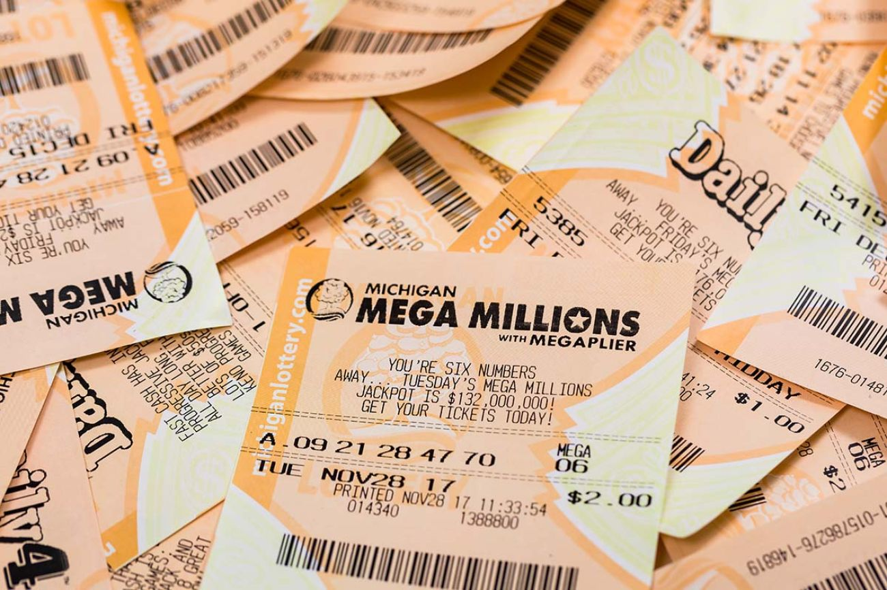
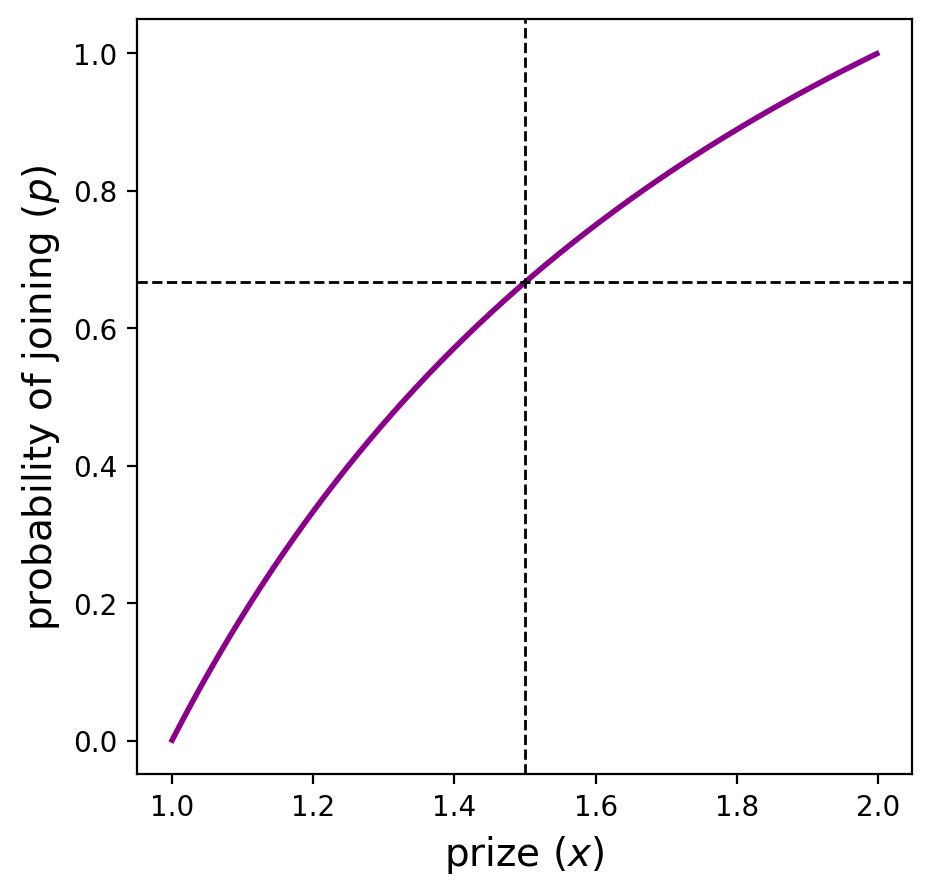
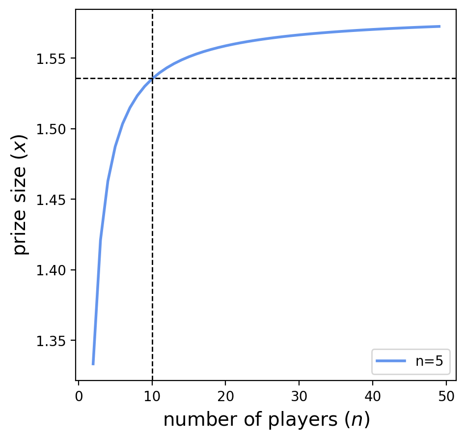
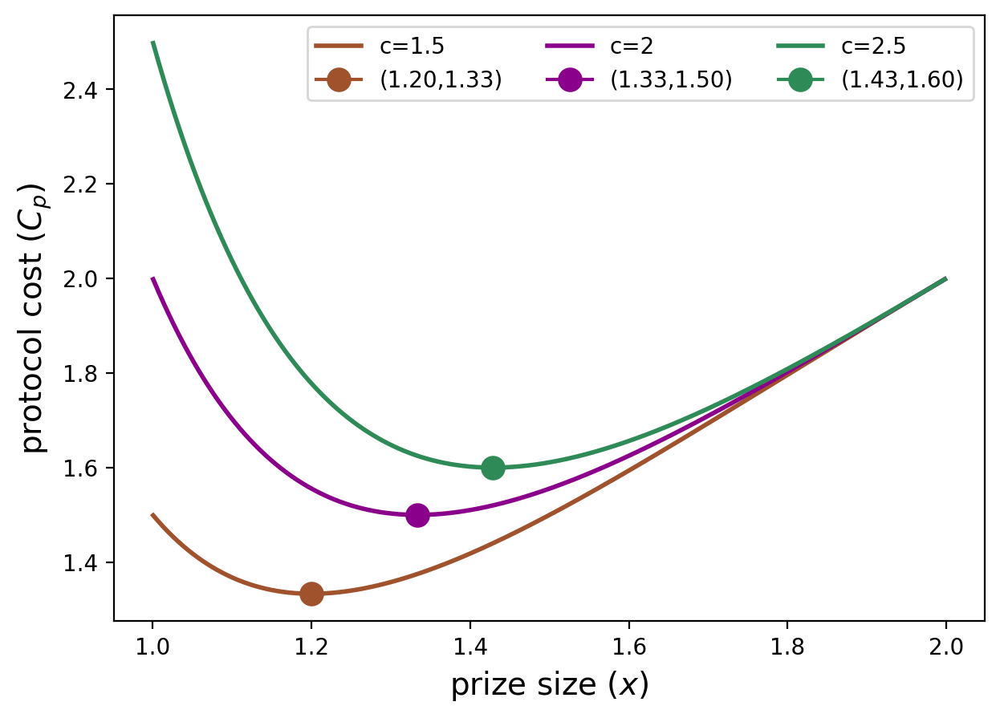
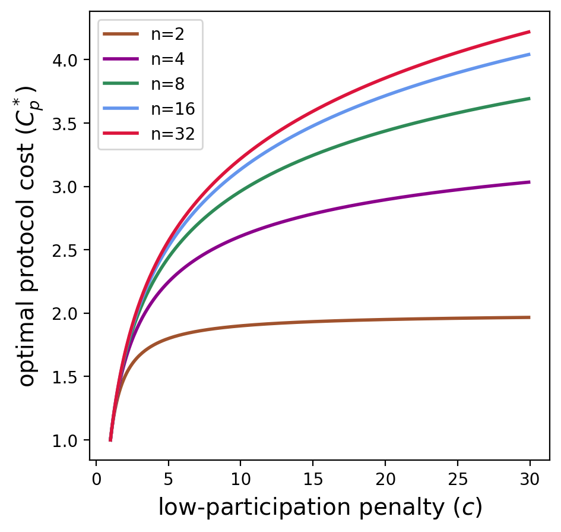
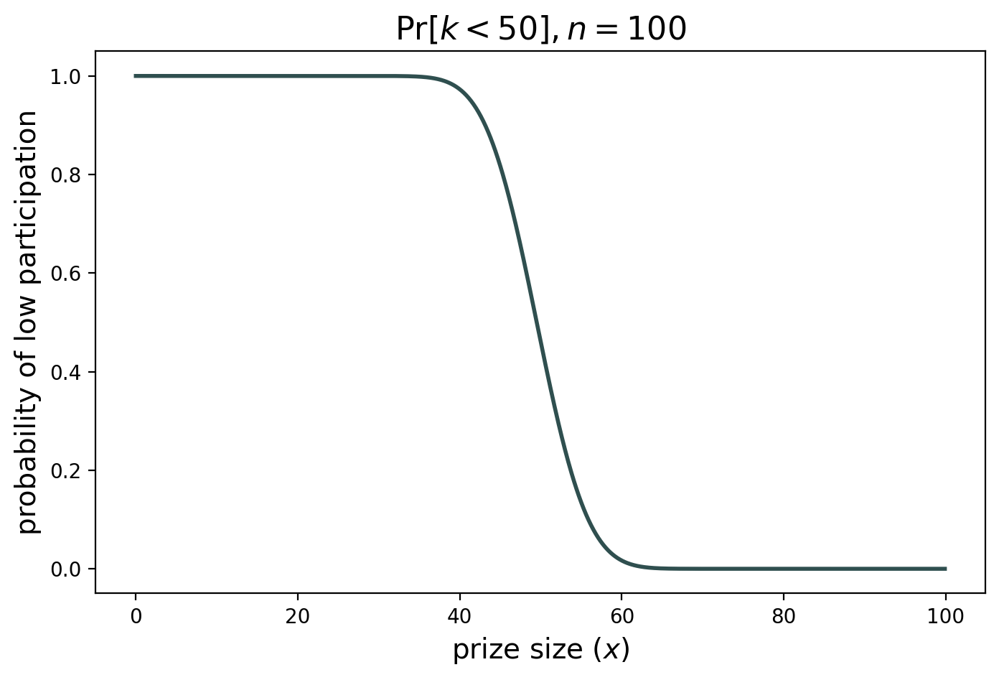
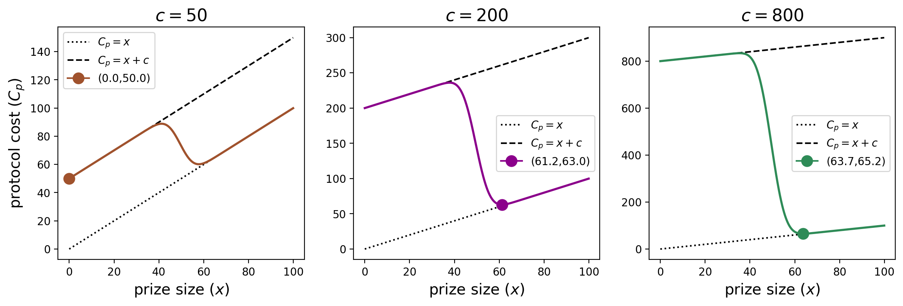
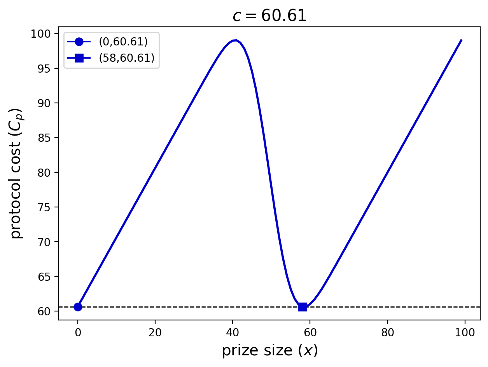
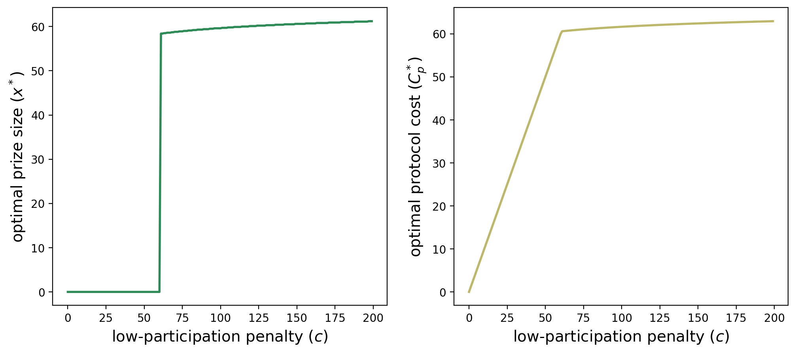

## On incentivizing anonymous participation
$\cdot$

$\cdot$
**tl;dr;** Blockchain activity is facilitated through independent actors participating in shared protocols. Incentivizing this participation is a critical design consideration, especially in permissionless, adversarial, and pseudonymous environments. We present a model and motivate the participation game in [Section 1](#p-54693-h-1-motivation-model-3). In [Section 2](#p-54693-h-2-symmetric-equilibrium-of-the-lottery-payment-rule-7), we analyze this game's symmetric, anonymous equilibria. We then apply this framework in two settings. [Section 3](#p-54693-h-3-prover-market-cost-minimization-9) details prover markets, which aim to incentivize the generation of *at least one proof*. [Section 4](#p-54693-h-4-a-proof-of-work-objective-function-13) turns to Proof-of-Work protocols, which aim to incentivize *at least 50% participation* (motivated by the goal of avoiding a 51% attack). In both cases, we derive the optimal incentive structure for the protocol to minimize its cost. We conclude in [Section 5](#p-54693-h-5-conclusion-and-future-work-15) by discussing how the model can be extended and other blockchain-specific techniques used for bootstrapping participation. 
$\cdot$
by [maryam](https://x.com/bahrani_maryam) & [mike](https://x.com/mikeneuder) – *may 26, 2025.*
$\cdot$
*Thanks to [Akilesh](https://x.com/akileshpotti), [Noam](https://x.com/noamnisan), [Matt](https://www.cs.princeton.edu/~smattw/), and [Barnabé](https://x.com/barnabemonnot) for review and discussion on this post!*

---
### Contents
[(1). Motivation & Model](#p-54693-h-1-motivation-model-3)  
&nbsp;&nbsp;[(1.1). Participation game model](#p-54693-h-11-participation-game-model-4)  
&nbsp;&nbsp;[(1.2). A trivial, non-anonymous solution](#p-54693-h-12-a-trivial-non-anonymous-solution-5)  
&nbsp;&nbsp;[(1.3). A non-symmetric equilibrium](#p-54693-h-13-a-non-symmetric-equilibrium-6)  
[(2). Symmetric equilibrium of the lottery payment rule](#p-54693-h-2-symmetric-equilibrium-of-the-lottery-payment-rule-7)  
&nbsp;&nbsp;[(2.1). Considering large $n$](#p-54693-h-21-considering-large-n-8)  
[(3). Prover market cost minimization](#p-54693-h-3-prover-market-cost-minimization-9)  
&nbsp;&nbsp;[(3.1). Optimizing for at least one participant](#p-54693-h-31-optimizing-for-at-least-one-participant-10)  
&nbsp;&nbsp;[(3.2). Asymptotics](#p-54693-h-32-asymptotics-11)  
&nbsp;&nbsp;[(3.3). The $1 + \ln c$ bound is tight](#p-54693-h-33-the-1ln-c-bound-is-tight-12)  
[(4). A Proof-of-Work objective function](#p-54693-h-4-a-proof-of-work-objective-function-13)  
&nbsp;&nbsp;[(4.1). Asymptotics](#p-54693-h-41-asymptotics-14)  
[(5). Conclusion and future work](#p-54693-h-5-conclusion-and-future-work-15)  
&nbsp;&nbsp;[(5.1). Alternative cost functions](#p-54693-h-51-alternative-cost-functions-16)  
&nbsp;&nbsp;[(5.2). Heterogeneous agents and information asymmetry](#p-54693-h-52-heterogeneous-agents-and-information-asymmetry-17)  
&nbsp;&nbsp;[(5.3). Tokens, airdrops, and blockchain applications](#p-54693-h-53-tokens-airdrops-and-blockchain-applications-18)

---

### 1. Motivation & Model

> **Opening vignette –** You are at your local sports bar and have a table to watch an NBA playoff game. You don't want to watch alone, so you plan on letting the group chat know you are there. To make people more likely to come, you offer to buy the first round of wings, but you first need to decide how many to order. If you order too few, there is a chance no one shows up, thinking that someone else will go and there won't be enough to go around. If you order too many, there won't be room at the table if everyone comes. What is the optimal amount of wings to buy so that some, but not all, of your friends come?<a id="fnref1" href="#fn1">$^1$</a>

This story often comes up in blockchain protocol design. Protocols want to attract participation in some form and use incentives to elicit it:
- Proof-of-Work offers block rewards to incentivize miners to solve cryptographic puzzles.
- Proof-of-Stake offers consensus rewards for staking and voting correctly on blocks.
- Prover [markets](https://docs.succinct.xyz/docs/network/market-structure#proof-contests-incentivize-global-scale-competition) coordinate the production of computationally intensive ZK proofs. 

Crucially, blockchains also want to allow **permissionless participation**. This makes the coordination problem much more difficult. This post presents a model for incentivizing participation and analyzes the symmetric equilibria of anonymous, common-value payment rules. In particular, we study the equilibrium where each player plays the mixed strategy of purchasing a lottery ticket with probability $p$. 

#### 1.1. Participation game model

We model the participation game as follows:

- **player** – A player is a strategic agent who, based on the mechanism, can choose to purchase an entry ticket.
- **participant** – A participant is a player who purchases an entry ticket.
- **protocol** – The protocol is an agent with a cost function (or, equivalently, a positive valuation function) for inducing participation.
- **payment rule** – A function implemented by the protocol that maps the set of participants to their respective payments.

Let there be $n$ players in the participation game. Each faces the same entry fee, $q$ and for simplicity, we use $q=1$ for the remainder of this post. Each participant can deterministically decide to join or not; they can also choose to play a randomized strategy where they join with some probability $p$. Before deciding whether to join, the participants observe a protocol-specified payment rule. The payment rule can depend on the realized set of participants and may be randomized. Each participant chooses an action to maximize their *expected utility*, meaning the expected payment they receive minus the entry fee (if they choose to participate).

The following two sections introduce the notions of anonymity and symmetry.

#### 1.2. A trivial, non-anonymous solution

Suppose the protocol aims to attract at least one participant and assume players tie-break in favor of participation. A straightforward mechanism follows: "Choose a specific player, denoted `WINNER`, and tell them you will pay them $1 if they participate." This trivial solution has many desirable properties:
1. **individual rationality** for everyone (because each player can get utility zero by not participating), and
2. **satisfactory participation** in equilibrium (`WINNER` will participate, and no one else will), and
3. **payment minimization** for the protocol (because $1 is the ticket fee, and thus the smallest possible cost for getting a participant). 

If the protocol designer is OK with choosing a winner, then this solution is sufficient.<a id="fnref2" href="#fn2">$^2$</a> Instead of stopping here, we focus on a set of solutions that are *anonymous.*

> **Definition (informal):** *An <u>anonymous</u> payment rule cannot depend on the identity of the player.*

We formalize this property in [Section 3.3](#p-54693-h-33-the-1ln-c-bound-is-tight-12), but hopefully, it should be intuitive. These payment rules *must* treat every player equally. The rules can depend on the players' actions (e.g., by dividing the prize evenly among all participants that enter) and can be randomized (e.g., by giving the prize to a single participant randomly). However, the mechanism above relies on the player's identity and is not anonymous.

#### 1.3. A non-symmetric equilibrium 

Separately, consider the following scenario: "A single player, denoted `COMMITTER`, makes a public commitment to purchasing a ticket and becoming a participant." Depending on the payment rule, this commitment may disincentivize other players from participating. For example, suppose the payment rule evenly divides a prize of $1 between all participants. In that case, a second player considering joining is guaranteed negative utility because they pay $1 and earn $1/2. This leads to no one else joining the protocol and `COMMITTER` earning the full prize. This equilibrium is **payment minimizing** for the protocol but requires participants to pick `COMMITTER`, pushing the coordination complexity to the players. We use this example as motivation to restrict our attention to [*symmetric* equilibria](https://en.wikipedia.org/wiki/Symmetric_equilibrium).

> **Definition:** *In a <u>symmetric</u> equlibirium each player use the same strategy.*

This strategy can be deterministic (e.g., always buy a ticket and participate) or mixed (e.g., buy a ticket with probability $p$). Since these deterministic strategies can be thought of as $p=0$ or $p=1$ respectively, any symmetric equilibrium is fully specified by a single value $p\in[0,1]$. In such an equilibrium, the number of participants is drawn from $\text{Binomial}(n,p)$, where $n$ is the number of players.

### 2. Symmetric equilibrium of the lottery payment rule

With our attention restricted to symmetric equilibria, there are only three outcomes for the players' strategies:
1. no one joins ($p=0$),
2. everyone joins ($p=1$),
3. everyone joins with probability $p\in (0,1)$.

Depending on the payment rule, any of these outcomes is possible. This section studies the lottery payment rule.

> **Definition:** *A lottery payment rule pays a single player a prize of magnitude $x$ by uniformly randomly selecting a winner from the set of participants.*

The lottery payment rule is anonymous and induces a symmetric equilibrium $p$ depending on the size of $x$. The protocol sets the value of $x$, the players decide whether or not to join, and the prize is given in full to one of the participants. If $x<1$, we are in case (1); no one will join because the prize is less than the entry fee. If $x\geq n$, then we are in case (2); everyone will participate because they are guaranteed (in expectation) to be paid more than their entry fee. For other values of $x$, the number of participants will be a random variable drawn from $\text{Binomial}(n,p)$ with $p\in (0,1)$. The protocol can shift the mean, $np$, by tweaking $x$.

We can characterize the symmetric equilibrium under case (3) above, where each player mixes their strategy and joins with probability $p$. (There are many approaches to it; we show the explicit one here using differentiation; see Aside \#1 for an alternative.) We consider player $ i$'s decision by fixing the other players' strategies at $p$. $i$ chooses its joining probability $p'$ to maximize its expected utility,
$$
\begin{align}
U_i(p') &= \bigg[ \underbrace{\mathbb{E}\left[\frac{x}{1+Y}\right]}_{\text{expected winnings}} - \underbrace{1}_{\text{ticket price}}\bigg] p', \; \text{where } Y \sim \text{Binomial}(n-1,p) \\
&= \left[x\cdot \frac{1-(1-p)^n}{np} -1\right]p'
\end{align}
$$

In other words, player $i$ receives a payment of $x$ if she joins and wins the lottery among participants. In particular, since each of the other $n-1$ players joins independently with probability $p$, the number of participants beside $i$ is drawn from $\text{Binomial}(n-1,p)$. $i$'s utility from joining is that payout minus the ticket price. $i$'s utility from joining *with probability $p'$* is her utility from joining times $p'$, since $i$ gets 0 utility from not joining.

For the symmetric strategy $p$ to be an equilibrium, $p'=p$ must maximize this expression among all $p'\in[0,1]$. The first order condition is
$$
\begin{align}
\frac{\partial U_i}{\partial p'} = x\cdot \frac{1-(1-p)^n}{np} -1.
\end{align}
$$

Setting this to zero, we get an analytical solution for the relationship between $x$ and $p$,
$$
x\cdot \frac{1-(1-p)^n}{np} -1 = 0\implies  \boxed{x = \frac{np}{1-(1-p)^n}}
$$

This tells us: "given a prize of size $x$, what probability $p$ creates a symmetric equilibrium" or equivalently, "if the protocol designer desires the participant count to come from $\text{Binomial}(n,p)$, they set a prize of size $x$." The plot below shows the relationship between these variables for $n=2$.

The dashed lines are interpreted as, "if the protocol sets the prize $x=1.5$, then the strategy $p=2/3$ is a symmetric equilibrium." Also, notice that if the prize is $<1$ or $>2$, the players join with probability 0 or 1, respectively. These are the "no one joins" and "everyone joins" outcomes described at the beginning of this section. For the interior region, $x \in (1,2)$, a unique $p$ is induced by each $x$. 

> **Aside #1** A different way of deriving the same equation is by considering the aggregate cash flow for the set of all players. For a given $p$, the set of players pays $np$ in expected entry fees. Thus, the protocol will need to pay $np$ in expectation as reimbursement (because this is a competitive equilibrium, any excess value will be competed away). When the protocol chooses a prize $x$, the set of players receives this prize *as long as at least one player participates*. This occurs with probability $1-(1-p)^n$, meaning the set of players earn $x \cdot (1-(1-p)^n)$ in rewards.

> **Aside #2:** One interesting property of mixed-strategy equilibria is that the player is indifferent to either action (which is why they randomize their behavior in the first place). In the above example, if everyone else joins with probability $p$, player $i$ receives zero utility from any action. You can see this by plugging in $x$ to her utility function,
> $$
 \begin{align}
 U_i(p') &= \bigg[ x \cdot \frac{1-(1-p)^n}{np} -1\bigg] \cdot p' \\ 
 &= \bigg[\frac{np}{1-(1-p)^n}\cdot \frac{1-(1-p)^n}{np} -1\bigg] p' \\
 &= (1-1)p'\\
 &= 0.
 \end{align}
> $$
> 
> Another way of interpreting this is that the equilibrium is fully competitive. This induces the indifference between outcomes and the resulting mixed strategy.

#### 2.1 Considering large $n$
Recall the relationship
$$
x = \frac{np}{1-(1-p)^n}.
$$

An interesting observation about this equation is that, for large $n$, we can rewrite $x$ as a function of $\mu=np$ (expected number of participants), using $(1-x) \rightarrow e^{-x}$ for small $x$ as
$$
x(\mu) \approx \frac{\mu}{1-e^{-\mu}}.
$$

The protocol can target a desired mean participation count $\mu$ using this simple formula, *without knowing $n$*. For example, if the protocol wants a single participant in expectation, it should set a prize of $1/(1-1/e)\approx 1.582$. That is, the protocol pays a $58\%$ premium over the entry fee of $1$ to attract one participant in expectation. This approximation improves as $n$ grows. The plot below shows the necessary protocol prize to attract one participant on average. It also shows the limit as $n \to \infty$ approaches $x(1)=1/(1-1/e)$.

The dashed lines can be interpreted as: "if $n=10$, then the protocol designer needs to set a prize of at least $x=1.535$ to attract one participant in expectation." Of course, the protocol designer may choose a higher prize to reduce the risk of no participants. The following section describes this tradeoff formally.

### 3. Prover market cost minimization

So far, we have shown how the protocol can target a specific expected participation count, $\mu$, by varying $x$. We now consider protocols that are particularly averse to low participation. We formalize this by introducing a "low-participation penalty." In this section, we start by examining prover markets. In [Section 4](#p-54693-h-4-a-proof-of-work-objective-function-13), we will look at a different low participation penalty motivated by Proof-of-Work consensus.

We consider a ZK rollup that wants to incentivize the costly production of proofs. The market designer may only care that *at least 1* prover participates (and pays the entry fee, which is the cost of generating the proof).<a id="fnref3" href="#fn3">$^3$</a> Further, say that if there is no participation at all, the protocol can generate the proof itself for a cost of $c$ (you can think of $c$ as the "outside option"). This allows us to write the low-participation penalty as a function of the number of participants, $k$, as

$$
\begin{align}
\text{low-participation penalty}(k) = 
\begin{cases}
c & \text{if } k = 0 \\
0 &\text{otherwise}.
\end{cases}
\end{align}
$$

Naturally, a protocol designer wants to choose the payment rule that minimizes its total cost (the prize size plus any penalty). 

#### 3.1. Optimizing for at least one participant

The analysis above allows the protocol designer to choose the magnitude of the prize to target a certain amount of participation under the symmetric equilibrium induced by the relationship between $x$ and $p$. With the low-participation penalty, the protocol's cost function, which we denote by $C_p$, is
$$
C_p = c \cdot \Pr[\text{no participation}] + x \cdot \Pr[\text{participation}].
$$

This cost is what the protocol seeks to minimize, and the protocol faces a tradeoff when choosing $x$ when given $c$. Too low of a value of $x$ results in the protocol incurring the penalty $c$ with high probability; higher values of $x$ are directly costly because the protocol has to pay a larger prize. Using the fact that in the symmetric equilibrium, each player participates with probability $p$, we can write,
$$
C_p = c \cdot (1-p)^n + x \cdot (1-(1-p)^n).
$$

With $x = \frac{np}{1-(1-p)^n}$ (the relationship we derived above), this simplifies to
$$
C_p = c \cdot (1-p)^n + np.
$$

This is the protocol cost, which it seeks to minimize over $p \in [0,1]$. With the optimal probability $p^*$, the protocol can directly calculate the prize size needed to induce the symmetric equilibrium at $p^*$. We minimize the protocol's cost using the first-order condition,

$$
\begin{align}
    \frac{\partial C_p}{\partial p} &= -cn(1-p)^{n-1} + n =0 \\
    &\implies p^* = 1-c^{-\frac{1}{n-1}}
\end{align}
$$

The second derivative is always negative over $p \in [0,1]$, so $p^*$ is indeed a unique local minimizer of the protocol cost. The following plot shows the protocol cost as a function of $x$ (which has a bijection with $p\in(0,1)$) for $n=2$ and $c=1.5,2,2.5$, respectively. 

The $x^*$ values (denoted as dots in the plot) are increasing in $c$ because as the protocol faces a higher penalty for no participation, it chooses higher $x^*$ (which results in a higher $p^*$) to be very confident that at least one player will participate. From $p^*$, we calculate the optimal prize size in closed form as
$$
\begin{align}
x^* &= \frac{np^*}{1-(1-p^*)^n} \\ 
&= \frac{n(1-c^{-1/(n-1)})}{1-c^{-n/(n-1)}}
\end{align}
$$

We also calculate the optimal protocol cost of 
$$
\begin{align}
C_p^* &= c \cdot (1-p^*)^n + np^* \\ 
&= n-(n-1) c^{-1/(n-1)} 
\end{align}
$$

The plot below helps visualize this cost as a function of $n,c$.

We see that as the low-participation penalty increases, the protocol cost seems to scale logarithmically. The next section formalizes this relationship by looking at the asymptotic behavior of the protocol cost.

#### 3.2 Asymptotics

A natural question arises about how the values of $p^*, x^*, C_p^*$ scale as a function of $c$. In particular, a protocol designer may want to know how their utility scales as a function of $c$ assuming a large number of players in the game, $n$. Expanding (see footnote<a id="fnref4" href="#fn4">$^4$</a> for derivation), we get
$$
\begin{align}
p^* &= \frac{\ln c}{n-1} + O\left(\frac{(\ln c)^2}{n^2}\right).
\end{align}
$$

Similarly, we can examine the asymptotic behavior of $x^*$ (see footnote<a id="fnref5" href="#fn5">$^5$</a> for derivation), which is the optimal prize for the cost-minimizing protocol:

$$
\begin{align}
x^* = \frac{\ln c}{1 - 1/c} + O\left(\frac{(\ln c)^2}{n}\right).
\end{align}
$$

Finally, we examine the asymptotic behavior of the optimal cost paid by the protocol, $C_p^*$ (see footnote<a id="fnref6" href="#fn6">$^6$</a> for derivation):
$$
\begin{align}
C_p^* &=1 + \ln c + O\left(\frac{(\ln c)^2}{n}\right).
\end{align}
$$

Critically, we see that as $n\to\infty$, the total cost of the protocol scales as $1+ \ln c$. This is great for the protocol because it provides a logarithmic bound on the cost as a function of the outside option. Further, *the optimal cost doesn't depend on $n$.* This is nifty in a permissionless setting because the protocol can set an optimal prize just based on the quality of the outside option (i.e., the low-participation penalty) without knowing how many players there are! It also means the protocol can be sure their costs are bounded even if the number of players in the game is very large.<a id="fnref7" href="#fn7">$^7$</a>

The next section answers the question, "can we beat this logarithmic bound?" More formally, *does an anonymous payment rule exist such that the resulting symmetric equilibrium has a protocol cost $C_p < 1+\ln c$?* We show in the following section that the answer is *no!* The protocol cost is tightly bounded by $1+\ln c$. 

#### 3.3 The $1+\ln c$ bound is tight

<code style="color : orangered">Note for the math/formalism-averse crowd: this section can be safely skipped!</code>

We know that each player joins with probability $p$ in the symmetric equilibrium. We need to formalize the anonymity property we sketched in [Section 1.2](#p-54693-h-12-a-trivial-non-anonymous-solution-5) to compare our mechanism with other anonymous payment rules. A payment rule $\pi(S,r)$ takes as input the set $S\subseteq [n]$ of participants that joined and a random seed $r$, and outputs a payment to each participant. The mechanism in the previous section pays a random participant the lottery prize $x$ with probability $1/|S|$ if $S$ is non-empty and pays no one otherwise. We say a mechanism  $\pi(S,r)$ is *(ex-post) anonymous* if it's pointwise symmetric with respect to the agent's actions. Formally, $\pi$ is *ex-post anonymous* if for all $r$ and $S$ and all permutations $\sigma$, $\pi(S,r)=\pi(\sigma(S),r)$. When a mechanism is anonymous, we can rewrite its payment rule as $\pi(S,r)=\pi(k,r)$ where $k=|S|$ and is drawn from $\text{Binom}(n,p)$. We now only care about the number of participants rather than the specific set.

Let $\pi(k,r)$ be an anonymous mechanism with a symmetric equilibrium $p$. Then, the expected cost to the auctioneer is
$$
    C_p = \underbrace{c \cdot (1-p)^n}_{\text{no participation}} + \underbrace{\mathbb{E}_{k,r}[\pi(k,r)]}_{\text{participation}}.
$$

This expectation is taken over the randomness realization, $r$, and each possible number of participants, $k$. In expectation, we know that each of the $k$ participants must be individually rational to join the lottery. In aggregate, any protocol must pay *at least* each participant's entry fee in expectation. Formally, $\mathbb{E}_{k,r}[\pi(k,r)] \geq np.$ Plugging this in, we again arrive at the form
$$
    C_p \geq c \cdot (1-p)^n + np.
$$

At equality, this is exactly the protocol cost for the lottery mechanism. So it has the same optimal protocol cost of $C_p^* = n-(n-1) c^{-1/(n-1)}$ and asymptotic behavior of $1+\ln c$ as $n \to \infty$ apply. **The lottery mechanism is optimal among anonymous and individually rational mechanisms in minimizing the "at least one player" objective!**

### 4. A Proof-of-Work objective function

In the previous section, the protocol incurred the cost $c$ only if there was *no participation*, corresponding to the following step function in the number of participants, $k$,

$$
\begin{align}
\text{low-participation penalty}(k) = 
\begin{cases}
c & \text{if } k = 0 \\
0 &\text{otherwise}.
\end{cases}
\end{align}
$$

This cost function makes sense for the prover market example, where a single participant is necessary because only a single proof will suffice to satisfy the protocol. In other blockchain contexts, different low-participation penalties (or general participation valuation functions) may make sense; for example, Proof-of-Work requires participation from many miners. Our participation framework can be applied to these more general contexts as well. Intuitively, we split the protocol cost in the following way
$$
C_p : \text{low-participation penalty} + \text{prize used to induce participation}.
$$

Different participation requirements in various settings will correspond to different first terms. The second term is always $np$ in a lottery prize mechanism (i.e., the payment rule we use here, which is optimal by a similar argument to the one in [Section 3.3](#p-54693-h-33-the-1ln-c-bound-is-tight-12)).

To demonstrate generality, we chose another penalty function that captures the spirit of Proof-of-Work mining: the protocol incurs a penalty if less than 50% of the players participate. Again, this can be written as a step function, where the threshold for incurring a penalty is raised from 0 participants to fewer than $n/2$ participants,
$$
\begin{align}
\text{PoW low-participation penalty}(k) = 
\begin{cases}
c & \text{if } k < n/2 \\
0 &\text{otherwise}.
\end{cases}
\end{align}
$$

If at least 50% of the players choose to participate, then the protocol can be sure that no malicious actor could acquire enough hash power to 51% attack the network. This is one way to represent the type of participation that Proof-of-Work protocols may seek to induce.<a id="fnref8" href="#fn8">$^8$</a> As before, to attract participation, the protocol specifies a lottery prize that results in the symmetric equilibrium where every player mixes with probability $p$, and we have the familiar relationship, $x = \frac{np}{1-(1-p)^n}$. Thus, the total protocol cost can be written as,
$$
\begin{align}
C_p = c \cdot \Pr[k < n/2] + np, \quad k \sim \text{Binom}(n,p).
\end{align}
$$

We can expand this to 
$$
\begin{align}
C_p = c \cdot \sum_{k=0}^{n/2} \binom{n}{k}p^{k}(1-p)^{n-k} + np.
\end{align}
$$

For $n=100$ players, the figure below shows the probability that the number of participants $k<50$ (and thus the protocol incurs the PoW low-participation penalty) for various prize sizes, $x$. 

There are three regimes:
1. **Small prize:** When the prize is $x\in[0,40]$, the resulting equilibrium value of $p$ will be low and thus $k < 50$ almost surely.
2. **Medium prize:** When the prize is $x\in (40,60)$, the resulting equilibrium value of $p$ is large enough that there is significant probability mass on both events $k<50$ and $k>50$. 
3. **Large prize:** When the prize is $x\in[60,100]$, the resulting equilibrium value of $p$ will be high and thus $k<50$ almost never.

These three regimes shape the total cost that the protocol faces. The plots below show the protocol costs as a function of $x \in [0,100]$ for various values of $c$ when $n=100$. 

We see that the protocol cost is non-monotonic in $x$:
- From $x= 0 \nearrow 40$ we see $C_p$ increasing. When $x=0$, no one participates ($p=0$), and the protocol cost is $c$. As $x$ increases to 40, $p$ is still very small, meaning $\Pr[k < n/2] \approx 1$, and the protocol will almost surely have to pay the $c$ penalty in addition to $x$. This is approximated with the line $x+c$ (dashed in the figure above).
- From $x \approx 40 \nearrow 60$ we see $C_p$ decreasing. The protocol is still paying an increasing prize $x$, but now there is a significant decrease in probability mass on $\Pr[k < n/2]$, so in expectation, the protocol has to pay $c$ less often. 
- From $x \approx 60 \nearrow 100$ we see $C_p$ increasing again. At these values of $x$, $\Pr[k < n/2] \approx 0$, the protocol almost never has to pay the cost $c$. Continuing to increase $p$ is no longer marginally worth the cost of increasing $x$. The cost in this regime is approximated with the line $x$ (dotted in the figure above) because the protocol cost is linearly increasing in the prize size. 

As demonstrated in the plots above, the shape of the curves stays the same, but the endpoint behavior and the local minima depend on the value of $c$. The circle markers show $x^*$ that minimizes protocol cost for $c=50,200,800$, respectively. For $c=50$, the optimal prize size is $x^*=0$, meaning no participation is incentivized, and the protocol simply pays the low-participation penalty. Conversely, for $c=200,800$, the optimal prize size is in the interior of $(0,100)$, meaning the protocol induces **some, but not full,** participation.

The figure below shows an interesting value of $c$, where the protocol is indifferent between paying the low-participation penalty or inducing participation by setting $x^*=58.$

In either case, the optimal protocol cost is $C_p^*=60.61$ as there are minima at both $x^*=0,58$. This is where the protocol begins incentivizing participation (by switching from $x=0$ to a value of $x>0$). The figure below shows the optimal prize and protocol cost as a function of $c$.

We see the distinct regimes with a critical value at $c= 60.61$. The protocol cost increases linearly for $c < 60.61$ because the optimal $x$ through this entire regime is $x^*=0$; the protocol always chooses not to incentivize participation and pays the penalty $c$. For $c>60.61$, the protocol cost increases much more slowly because the optimal $x$ induces a large amount of participation, meaning the low-participation penalty of $c$ is paid almost never. For larger values of $c$, we see a new regime where $C_p^*$ seems to scale extremely slowly. We don't have a closed form for the optimal $x^*$ (because it is the solution to a degree-n polynomial), but we can approximate the asymptotic behavior as $c$ increases.

#### 4.1 Asymptotics

Before jumping into the asymptotics, it is worth noting that we chose the 50% value just by the motivation of Proof-of-Work. A more general form of the cost function could depend on any (constant) $\alpha \in [0,1]$, where the protocol seeks to incentivize participation by at least $\alpha$ fraction of candidates:

$$
\begin{align}
\text{low-participation penalty}(k,\alpha) = 
\begin{cases}
c & \text{if } k < n \alpha \\
0 &\text{otherwise}.
\end{cases}
\end{align}
$$

We want to study the behavior of the optimal protocol cost under the general $\alpha$ participation cost function, which is achieved at the $p^*$ that solves the following:

$$
\begin{align}
\min_{p \in [0,1]} C_p = c \cdot \Pr[k < n \alpha] + np, \quad k \sim \text{Binom}(n,p).
\end{align}
$$

We can't explicitly solve for $p^*$ (and thus $C_p^*$); instead, we give an upper bound on the protocol cost by choosing a suboptimal $p$ and bounding the cost using that $p$. 

First, we give some intuition. Imagine the protocol sets $p=\alpha$. Then, $\Pr[k < n \alpha] =1/2$, so the protocol pays the penalty $c/2$ in expectation. Further, the protocol pays an expected prize of size of $\alpha n$ (assuming at least one participant). Overall, the protocol cost would be $C_p\approx c/2+np$. This cost scales linearly in $c$, but the protocol could do better by reducing the penalty term in expectation by choosing $p > \alpha$. By selecting a higher $p$, the protocol reduces its expenditure on the penalty but increases its expenditures on the prize. We will choose a $p$ that makes the expected penalty constant and use that $p$ to bound the overall cost.

Using a Chernoff Bound on the probability of $k < \alpha n$,
$$
\begin{align}
\Pr[k < n \alpha] \leq e^{-n(p-\alpha)^2/(2p)}.
\end{align}
$$

We can choose $p$ to make the low-participation penalty constant in expectation by setting the right-hand-side to $1/c$:
$$
p' := \alpha + \frac{\ln c}{n} \left(1 + \sqrt{1+ \frac{2\alpha n}{\ln c}}\right)
$$

We then have the full protocol cost as
$$
\begin{align}
C_p^* = \min_{p\in[0,1]}C_p &\leq c \cdot\Pr[k < \alpha n] + np' \\ 
&\leq 1+ n\left(\alpha + \frac{\ln c}{n} + O(\sqrt{\alpha\ln c /n})\right) \\
&= 1 + \alpha n + \ln c + O(\sqrt{\alpha n \ln c}).
\end{align}
$$

We can think of this bound intuitively as follows. The first term (1) is the expected, constant low-participation penalty (by construction). The rest of the expression is the expected payment to participants. The $\alpha n$ term is inevitable for any protocol that attracts at least $\alpha n$ participation (to compensate for the entry fees). The remaining terms are the additional payments the protocol incurs to avoid paying the low participation penalty. 

Let's compare this to the prover market setting, where the low-participation threshold of 1 corresponds to $\alpha=1/n$ here. Recall that the optimal cost scales as $1+ \ln c + O((\ln c)^2/n).$ Plugging $\alpha=1/n$ into our new bound, we get a looser bound of $2+\ln c + O(\sqrt{\ln c})$ on the protocol cost. These match asymptotically but differ in the error terms. We suspect that this asymptotic bound is tight for any $\alpha > 1/n$ (e.g., via the right anti-concentration inequality or using the Normal approximation to the Binomial). Similarly, we suspect similar reasoning as was used in [Section 3.3](#p-54693-h-33-the-1ln-c-bound-is-tight-12) could show the optimality of the lottery payment rule for the Proof-of-Work protocol cost. We elide these technical details in this post.

### 5. Conclusion and future work

What have we learned thus far? We opened with a question about how to incentivize permissionless participation, and we limited our scope to the symmetric, anonymous equilibria of the participation game with the lottery payment rule. [Section 2](#p-54693-h-2-symmetric-equilibrium-of-the-lottery-payment-rule-7) explored the relationship between the prize size, $x$, and the resulting equilibrium probability, $p$, that each player uses as their mixed strategy. [Section 3](#p-54693-h-3-prover-market-cost-minimization-9) introduces the idea of a low-participation penalty motivated by prover markets, where the protocol needs at least one participant to avoid paying an outside option cost. We derived the optimal lottery prize under this objective and showed that the lottery mechanism is the optimal payment rule. [Section 4](#p-54693-h-4-a-proof-of-work-objective-function-13) explores a different protocol participation objective motivated by Proof-of-Work, where the protocol needs participation by 50% of the players. Before we go, it is worth highlighting how this model could be expanded to cover more realistic settings. 

#### 5.1 Alternative cost functions

In this post, we have examined cost functions that optimize for 
- at least one participant, and
- at least $\alpha n$ participants (for constant $\alpha$).

Both of these stylized protocol objective functions are specific instances of a much more general phenomenon. Imagine an even more expressive set of "participation valuation functions" that are not in the step function family we have been using throughout. For example, the protocol could express a preference of $c\cdot e^{-k}$ for $k$ participants (or any other functional form with diminishing marginal returns on increased participation). In this case, the protocol needs some participation (e.g., incurs a penalty of $c$ if no one participates), but the marginal value of the $k+1^{st}$ participant joining is exponentially decaying.

Regardless of the exact protocol objectives, this framework allows us to quantify the optimal size of the lottery prize needed to achieve the best outcome for the protocol. We return to the original set of motivating examples and describe candidate alternative protocol objectives for each. First, the two we discussed:

- **Prover markets (à la Section 2)** – Ensure at least one participant submits a proof to avoid a considerable outside cost (e.g., a liveness fault or the team running a prover themselves). **Alternatively**, a prover market designer may explicitly target multiple participants for robustness or competition (e.g., Succinct's [proof contests](https://docs.succinct.xyz/docs/network/market-structure#proof-contests-incentivize-global-scale-competition)).
- **Proof-of-Work (à la Section 3)** – Ensure 50% participation in expectation to avoid the ability for an outside actor to perform a 51% attack. **Alternatively**, one could target a lower threshold that is tuned to a specific dollar amount of economic security by estimating the supply curve of global compute.

Of course, some protocols might also want to bias *against too much participation*.
- **Proof-of-Stake** – Ensure that between 10% and 50% of the token supply is staked. *This objective can explicitly discourage participation beyond some threshold.* Staking protocols may desire lower stake rates to ensure the native token retains its utility and the inflation rate remains low.

Hopefully, these case studies demonstrate how a protocol designer can specifically target specific types of permissionless participation.

#### 5.2 Heterogeneous agents and information asymmetry
Another angle of future work is expanding the model of the players in the game. We assumed each player has the same entry cost of exactly $1. In many real-world contexts, however, different players have very different values and costs for participation. Electricity costs may make Proof-of-Work mining profitable in Texas and unprofitable in New York City. Staking pools may have differing capital costs or trading strategies, resulting in disparate yields for Proof-of-Stake participation. Future work could model this heterogeneity by considering a different entry fee per player. Beyond the participation costs and rewards, the agents might have different risk preferences. We model the risk-neutral participant (who is indifferent between joining and not if the prize is big enough even if their payout is uncertain). In contrast, risk aversion might be more accurate, especially considering the volatile nature of crypto-assets.

The heterogeneity of players comes hand-in-hand with information asymmetry since players are better positioned to know their costs than the protocol designer is. In a prover market, for example, proving capabilities vary based on the hardware available to each prover, which is difficult for the protocol to audit directly. This motivates extending our model to a private value setting where the protocol elicits bids from each player, moving us from a lottery to an auction. Under the auction framework, questions about incentive compatibility, revenue maximization, welfare maximization, efficiency, etc., can be asked and answered using much of the auction theory literature. For example, [Tullock Contests](https://link.springer.com/chapter/10.1007/978-1-4757-5055-3_2) characterize the equilibria of forward, private-valuation, all-pay auctions.

Beyond the standard auction framing, the protocol can reduce information asymmetry by subsidizing supply through demand augmentation. For example, [Aleo issues](https://aleo.org/post/decentralized-proving-advantages/) proving rewards to participants who solve puzzles created by Aleo itself. These puzzles serve as a credible signal of the availability of proving capacity, which would be necessary to handle demand spikes. While Aleo's puzzles are artificially generated, a more efficient design could make use of real user demand. For example, Ritual enables [scheduled transactions](https://www.ritualfoundation.org/docs/architecture/scheduled-transactions) with a predictable cadence, making them a good candidate as a continued demand source. The facilitation of these continuous flows of demand can serve as an "availability oracle" of the hardware supporting the network. 

#### 5.3 Tokens, airdrops, and blockchain applications

We spent the post examining how protocol designers can incentivize participation by providing a prize. Of course, this prize could be denominated in dollars and effectively subsidize the suppliers' cost. Uber established its platform by bootstrapping supplier participation in the network through direct subsidization (e.g., paying the driver more than the rider was charged). In blockchain contexts, this reward is often denominated in the protocol-specific token; this would be akin to Uber subsidizing rides by granting equity to drivers. Again, the goal is bootstrapping, and the token subsidies pull forward demand to induce supply while diluting the token pool. 

Airdrops are another form of subsidization focused instead on the demand side. The airdrop mechanism also pulls forward the demand to facilitate platform growth by rewarding people for using the protocol. In effect, the token issuers dilute themselves in hopes that the platform growth will make their tokens more valuable than if the user subsidization had not occurred.

Incentivizing permissionless participation is critical to blockchains functioning as intended. We hope this post serves as a starting point for studying this class of problems and presents a valuable model to extend.

---
*▓▒░ made with ♥ and markdown ◉ thanks for reading!  – maryam & mike ░▒▓*

---
$^1$ See the [El Farol Bar problem](https://en.wikipedia.org/wiki/El_Farol_Bar_problem) for one variant of this problem. <a href="#fnref1">↩︎</a>

$^2$ Note that above, the protocol just wanted a single participant. Similarly, if the protocol wanted *k* participants, it could specify an appropriately sized subset of the total player pool and pay their entry fee. More generally, the protocol can optimize any objective function by finding the subset of players whose participation would minimize the protocol's cost and promise to reimburse the entry fees of those players (and only those players) if they all join. <a href="#fnref2">↩︎</a>

$^3$ We assume players have homogenous proving costs; the protocol designer knows this cost exactly. Generalizing this to heterogeneous provers with unknown costs will be the subject of a future post. <a href="#fnref3">↩︎</a>

$^4$ Starting with $p^*$ we rewrite,

$$
p^* = 1-c^{-1/(n-1)} = 1-e^{-\ln c / (n-1)}.
$$

Using the Taylor expansion of $e^{-y}$ at $0$ with $y=\ln c / (n-1)$, we have,
$$
    \begin{align}
    p^* &= 1 - \Big[\underbrace{1- y + \frac{y^2}{2} - \frac{y^3}{6} + \frac{y^4}{24} - \ldots}_{\text{expansion of $e^{-y}$}}\Big] \\
    &= \frac{\ln c}{n-1} - \frac{(\ln c)^2}{2(n-1)^2} + \frac{(\ln c)^3}{6(n-1)^3} - \frac{(\ln c)^4}{24(n-1)^4} - \ldots \\
    &= \frac{\ln c}{n-1} + O\left(\frac{(\ln c)^2}{n^2}\right).
    \end{align}
$$
<a href="#fnref4">↩︎</a>

$^5$ We first rewrite

$$
\begin{align}
x^* &= \frac{n(1-c^{-1/(n-1)})}{1-c^{-n/(n-1)}} =\frac{n\bigl(1 - e^{-\ln c/(n-1)}\bigr)}{1 - e^{-n\ln c/(n-1)}}.
\end{align}
$$

Using the Taylor expansion of $e^{-y}$ at $0$ with $y=\ln c / (n-1)$, we have

$$
\begin{align}
x^* = \frac{n\bigl(1 - e^{-y}\bigr)}{1 - e^{-n y}} &= \frac{n(1-e^{-y})}{1-c^{-1}e^{-y}}\\
&= \frac{n\displaystyle{y - \tfrac{y^2}{2} + \tfrac{y^3}{6} - \tfrac{y^4}{24} + \cdots}}
{\displaystyle{1-\tfrac1c (1-y+\tfrac{y^2}{2} - \tfrac{y^3}{6} + \tfrac{y^4}{24}+ \cdots)}} \\
&= \frac{\displaystyle{ny + O\left(ny^2/2\right)}}
{\displaystyle{1-\tfrac1c +O(y/c)}}\\[6pt]
&= \frac{\displaystyle \ln c + O\left(\frac{(\ln c)^2}{n}\right)}
{\displaystyle 1 -\frac1c+O\left(\frac{\ln c}{cn}\right)} = \frac{\ln c}{1 - 1/c} + O\left(\frac{(\ln c)^2}{n}\right).
\end{align}
$$    
<a href="#fnref5">↩︎</a>

$^6$
$$
\begin{align}
C_p^* &= n-(n-1) c^{-1/(n-1)} \\
&= n- (n-1) e^{-\ln c / (n-1)}
\end{align}
$$    

Letting $y=\ln c / (n-1)$ and again using the $e^{-y}$ expansion, we have
$$
\begin{align}
C_p^*
&= n - (n-1)\Big[1 - \frac{\ln c}{n-1} + \frac{(\ln c)^2}{2(n-1)^2} - \frac{(\ln c)^3}{6(n-1)^3} + \frac{(\ln c)^4}{24(n-1)^4} - \ldots\Big] \\ 
&= n - (n-1) + \ln c +O \left(\frac{(\ln c)^2}{n}\right) \\ 
&=1 + \ln c + O\left(\frac{(\ln c)^2}{n}\right).
\end{align}
$$
<a href="#fnref6">↩︎</a>

$^7$ This analysis extends to the case where the protocol wishes to attract not just one but up to $\log c$ participants. See [Section 4](#p-54693-h-4-a-proof-of-work-objective-function-13) for larger participation requirements. <a href="#fnref7">↩︎</a>

$^8$ Depending on how we define the set of players in the participation game, this description may not make as much intuitive sense. For example, if we consider the player set as the total available global compute that could be used to solve PoW puzzles, inducing 50 % participation is probably a bit overkill. We use this example because it is tidy, but more modeling of the specifics of the players would be necessary to make these results practical. <a href="#fnref8">↩︎</a>