# On Increasing the Block Gas Limit

*by [Toni](https://twitter.com/nero_eth) and [Vitalik](https://twitter.com/VitalikButerin).*
*special thanks to the Starkware team for feedback and data!*

## The TL;DR
* By **increasing the block gas limit and the price for nonzero calldata bytes**, a smaller and less variable block size can be achieved, making space to add more blobs in the future.
* **Increasing** the price for nonzero calldata reduces the maximum possible block size. At the same time, the block gas limit could be raised to make more space for regular transactions. 
* This further **incentivizes the transition to using blobs for data availability**, strengthening the multidimensional fee market by reducing competition between calldata and blobs.
* It **slows down history growth**, which might be preferable in preparing for the Verkle upgrades.

## Rollup-Centric Block Size

Ethereum's block size hasn't been changed since [EIP-1559](https://eips.ethereum.org/EIPS/eip-1559).
With a focus on the [rollup-centric roadmap](https://ethereum-magicians.org/t/a-rollup-centric-ethereum-roadmap/4698) in the medium, or possible long term future one might argue that the way block space is used hasn't been optimized for rollups yet. With the introduction of [EIP-4844](https://www.eip4844.com/), we're taking a big step towards making Ethereum more rollup-friendly. However, the capacity of Beacon blocks and the size of their individual parts have remained mostly unchanged.

[Over the past 12 months](https://etherscan.io/chart/blocksize), the effective block size measured in bytes essentially doubled. This might be a result of more and more rollups starting to use Ethereum for DA and trends like [Inscriptions](https://blockworks.co/news/inscriptions-craze-proves-stark-contrast-between-ethereum-rollups). 
See [Appendix 1](#Current-Situation) for the numbers.

**By reducing the maximum size of the EL parts of Beacon blocks, one can make room for more blobs while maintaining the current security levels:**

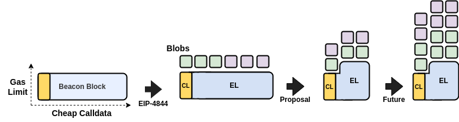

## The Goals
 * **Better separate data from execution.** Blobs are designated to serve one specific thing - data. On the other hand, calldata is used for execution and data. Cheap calldata was important to accelerate the adoption of rollups, but its price must be reconsidered under EIP-4844.
 * **Reduce Beacon block variance and size.** The size of Beacon blocks is heavily dependent on the EL payload, which can be maximized in size using calldata. For large Beacon blocks, the EL payload accounts for 99% of their size (see [Appendix 2](#EL-Payload-Share---Large-blocks)). It's important to note that it's not the average block size that is problematic. With 125 KB the median block size is 14.5 times smaller than maximally possible. The aim is to decrease this gap and reduce the avg/max ratio in block sizes.
 * **Make sure not to harm a specific set of users/applications disproportionally.** While data-availability oriented apps can start using blobs, apps that handle big on-chain proofs, which are not just simply data, might be affected more.
 * **Reduce number of reorged blocks**.

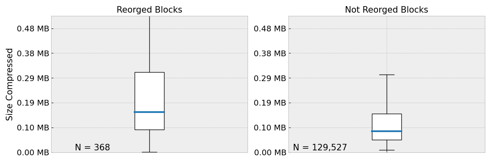

> Notable, there were significantly less data points for reorged blocks (368 vs ~129k).

The chart shows the size of reorged vs not-reorged blocks of the last ~16 days (19 Jan - 4 Feb 2024). 
* In the **last 16 days**, blocks that were eventually reorged were ~93% larger (median) than blocks that were eventually finalized. 
* The avg. block size of the reorged blocks was 0.155 MB while blocks making it into the canonical chain had around 0.08 MB.

&nbsp;

# Design Considerations

As of today, we have been focusing on 5 different designs and want to quickly outline the pros and cons of each of them.

## (1) Increase Calldata to 42

By simply increasing calldata costs to 42.0 gas, we can reduce the maximum possible block size from ~1.78 MB to ~0.68 MB. This makes room to increase the block gas limit, for example to 45 million, giving us a max block size of ~1.02 MB.

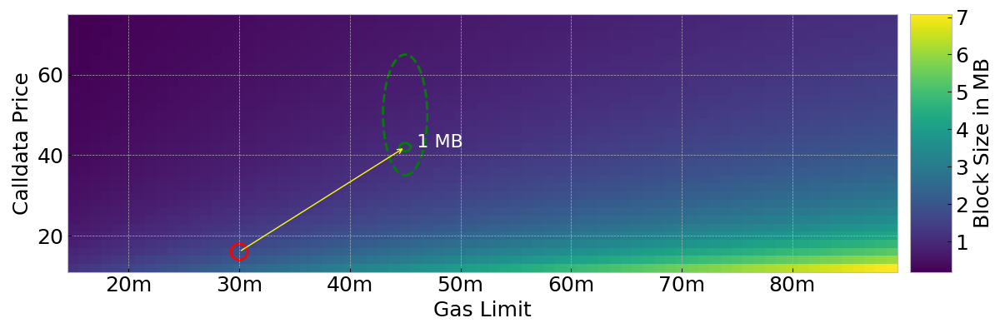

> The area inside the green circle might potentially represent a sweet spot.
> 

### Pros
* **Reduces the maximum block size** and its variance and makes room for more blobs in the future.
* **Increases costs of using calldata for data availability**, thus strengthens the multidimensional fee market.
* **It's simple.**

### Cons
* **Affects apps that are dependent on much calldata, not just for data availability.** On-chain STARK proof verification, which is super important to have, could become substantially more expensive for large proofs.

&nbsp;

## (2) Increase Calldata to 42 and Decrease Other Costs

Like in the previous example (1), we could make it more expensive to use calldata but cheaper to perform certain arithmetic operations that are common in calldata-heavy proof verification, and that are not on the frontier of "causes of worst-case block time". This approach is designed to balance out the higher expenses for applications that use a lot of calldata and are unable to switch to using blobs.

Taking Starknet as an example, the main cost drivers are the opcodes `JUMPI`, `PUSH1`, `ADD`, followed by `DUP2`, `PUSH2` and `JUMP`. 

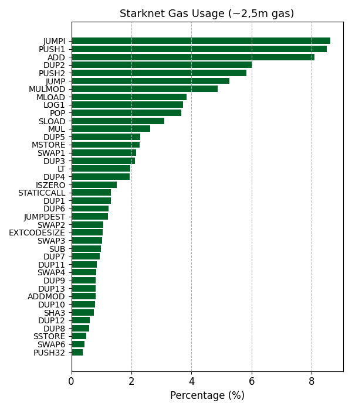

This leads to a question for client developers: "*Which opcode's cost could be lowered to save on gas for calldata heavy proof verification?*"

> It is very likely that one will not be able to fully "compensate" affected applications through lowering the costs of specific operations. For example, even if we set `ADD`, `SUB`, `MUL`, `MULMOD`, which are all part of a STARK proof verification, to 1 gas, we'd only save around 322,624 of a total ~2,596,128 gas spent on EVM operations.

### Pros
* **Increases costs of using calldata for data availability** which leads to a lower block size variance.
* **Reduces the maximum block size.**
* **Still simple to implement.**

### Cons
* **Slightly more complex and requires further analysis on potential side-effects.**
* **Might not fully offset the increase in calldata costs.**

&nbsp;

## (3) Simple 2D Pricing for Calldata

As proposed in [EIP-4488](https://github.com/ethereum/EIPs/blob/017fa2524e5aeb0bce201777cb31b1c0c1b14d4c/EIPS/eip-4488.md), we could introduce a 2D price mechanism by capping the calldata per block. This reduces the supply of calldata per block, making it a more scarce resource. 
EIP-4488 introduces a `BASE_MAX_CALLDATA_PER_BLOCK` and a `CALLDATA_PER_TX_STIPEND`. 
* The `BASE_MAX_CALLDATA_PER_BLOCK` determines the maximum calldata that can be used (in an empty block). For each transaction, the available calldata increases. A transaction's maximum calldata is the full `BASE_MAX_CALLDATA_PER_BLOCK` plus its stipend.
* The `CALLDATA_PER_TX_STIPEND` acts as an additional calldata-usage-bonus per transaction. 

Using the values proposed in the EIP, except keeping the calldata costs at 16 gas, the maximum block size would be ~1.332 MB.

### Pros
* **Disincentivizes calldata usage for data availability**.
* **Doesn't affect standard transactions or token transfers.** 
* **Reduces the maximum block size**.

### Cons
* **Affects apps that are dependent on much calldata, not just for data availability.**
* **Increased complexity in analysis and implementation.**
* **Multi-dimensional resource limit rules for block building.**

&nbsp;

## (4) Full 2D Pricing for Calldata

By creating a market [similar to EIP-1559](https://ethresear.ch/t/multidimensional-eip-1559/11651) but specifically for calldata, we could completely separate it from other operations, [much like we do with blobs](https://notes.ethereum.org/@vbuterin/proto_danksharding_faq#What-does-the-proto-danksharding-multidimensional-fee-market-look-like). We could set an initial target for calldata usage, for example 125 KB, and then allow it to have up to 1 MB if needed. The price for using calldata would automatically adjust based on how much demand there is. In addition to data used for data availability (blobs), we would introduce a new type of 'container' specifically for calldata required for execution.

### Pros
* **Disincentivices calldata usage for data availability**.
* **Clean separation of calldata used for execution and data.**

### Cons
* **Increased complexity in analysis and implementation.**
* **Multi-dimensional resource limit rules for block building.**

&nbsp;

## (5) Increase Calldata With 'EVM Execution Discount'

Imagine we could provide those that are still requiring large calldata for on-chain computation (e.g. proof verification) with a bonus that compensates them for increased calldata costs.

By introducing a formula like the following, we can reduce block sizes while not disproportionally hurting calldata dependent apps.

`tx.gasused = max(21000 + 42 * calldata, 21000 + 16 * calldata + evm_gas_used)`

* The calldata is *high* (42 gas) for those that rely more on data availability.
* The calldata is *low* (16 gas) for those that additionally spend gas on evm computation.
* Spending 26 gas per calldata byte on `evm_gas_used` enables access to 16 gas calldata.

**This can be visualized as follows:**

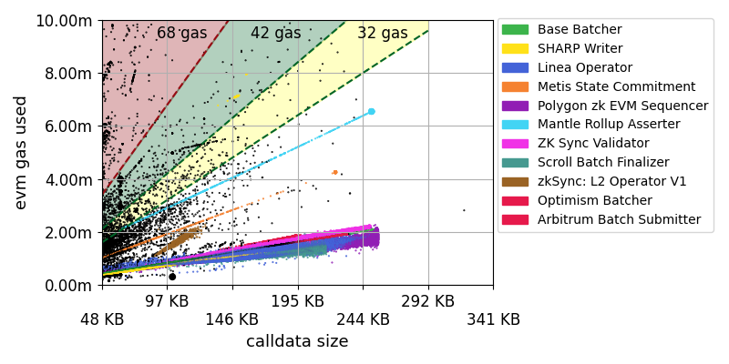

* The chart shows all transactions from 01.01.2024 to 31.01.2024. 
* The colored areas indicate the minimum evm gas (y-axis) a transaction must spend for every calldata byte (x-axis) to reach the 16 calldata price for different '*high*' calldata prices of 32, 42 and 68 gas.
* We can see some colored points forming bars at the bottom. These apps are using much calldata but pay relatively low amounts of gas. This can be attributed to DA leveraged through calldata.
* For example, an application that uses 146 KB transactions spending 7 million gas in `evm_gas_used` will profit from the formula, `21000 + 16 * calldata + evm_gas_used` and eventually pay 16 gas per calldata.
* An application that has 200 KB calldata transactions costing 9 million evm gas will pay `21_000 + (16*200*1024) + 9_000_000 = 12_297_800` instead of `21_000 + (42*200*1024) + 9_000_000 = 17_622_600`.
* The pure DA consumers would not reach the green area and therefore pay 42 gas per calldata byte.

For the *'16 vs 42 gas'* variant, the maximum EL block size decreases by 62% to ~0.68 MB.

The area in which the evm gas used "compensates" for the calldata price increase requires to use at least 26 gas for evm operations per calldata byte.

**The interplay between the evm gas usage and its impact on the calldata price and be visualized as follows:**

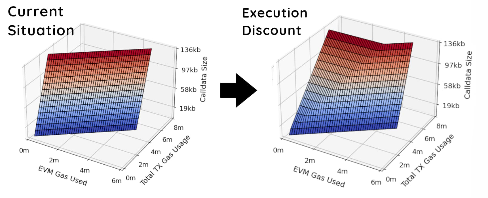

**Current Situation:**

* There is no special interaction between the evm gas used and a transaction's gas usage.

**Execution Discount:**

* *Constant Before Threshold:* The observed constant total gas usage for lower EVM gas usages in the plot indicates transactions where the EVM operations do not yet contribute sufficiently to reach the cheaper calldata rate. In this phase, the total gas cost is primarily determined by the calldata size, priced at the higher rate.
* *Increase Beyond Threshold:* The increase in total gas usage at higher EVM gas usages reflects transactions crossing the threshold where their EVM operations' gas cost is sufficient to leverage the cheaper calldata rate. However, because this now includes significant EVM gas usage in the total cost, the overall gas expense rises proportionally to the additional EVM operations conducted.

This means, we reach the 16 gas calldata price by using 26 gas per calldata byte on evm operation. For large calldata users this settles at a ~61% ratio of exec/data. The chart shows this threshold over a range of calldata sizes.

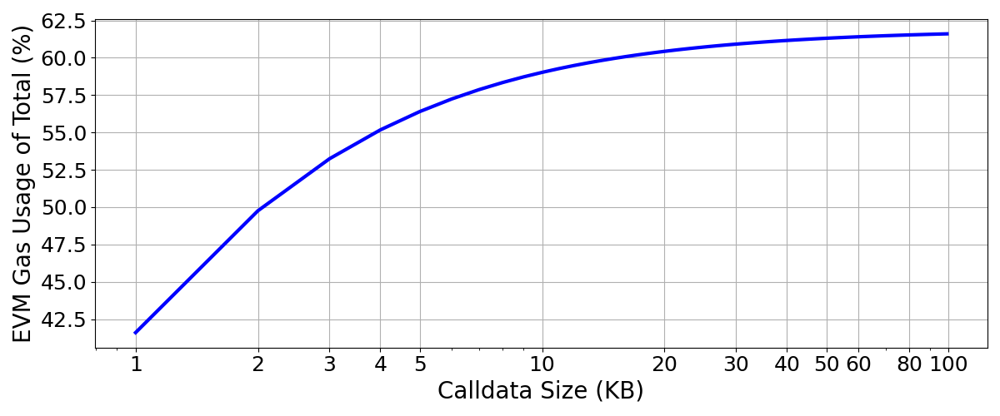

**As long as $evm\_gas\_used > 26 \times calldata\_size$, one profits from the execution discount formula.**

### Pros
* **Disincentivices calldata usage for data availability**.
* **Reduces blocksize to 0.68 MB, making space for gas limit increases and/or raising the number of blobs.**
* **Reduces block variance.**
* **Token transfers or approvals would qualify for the 16 gas calldata. So no effects on regular users.**

### Cons
* **Slightly increases complexity.**
* **Introduces some interplay (and potentially side-effects) between calldata size and gas spent on evm gas.**

&nbsp;

## Summarizing

It makes sense to think about ways to decrease the maximum possible size of Beacon blocks to make room for 4844 blobs, prepare for [Verkle](https://verkle.info/) and reduce the variance in block size. Increasing the calldata price will act as a disincentive to continue using calldata for data availability. Scaling through increasing the blob count comes with less variance in max. size data to handle.

Simply raising the calldata cost to 42 might be too blunt an approach, while creating separate fee markets could add too much complexity. A balanced solution could be to increase the cost of calldata while reducing the cost of some operations, or perhaps moving towards a model that offers incentives for using calldata inside the EVM.

Ultimately, these changes would reduce competition in the traditional fee market and strengthen the multidimensional fee market.

---

# Appendix

## Current Situation

The use of calldata has rapidly increased in the past year - it essentially doubled - which might be attributable to rollups using Ethereum for DA and [Inscriptions](https://blockworks.co/news/inscriptions-craze-proves-stark-contrast-between-ethereum-rollups).

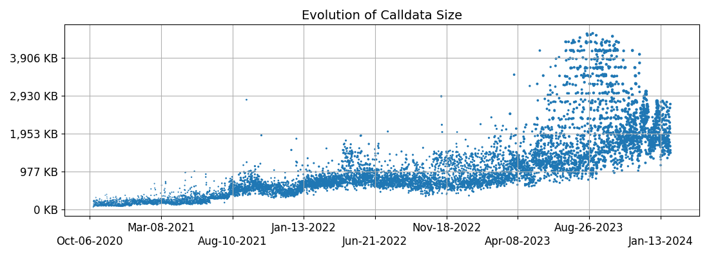

The above chart shows the maximum block size observed every 1,000 blocks (to reduce the number of datapoints). We can clearly see a continuous increase with a rising number of positive outliers since April 2023.

The maximum share in size of the EL payload is currently at 69.3% of the total Beacon block + the blobs. By increasing the calldata costs to 42 gas while increasing the block gas limit to ~45 million would effectively reduce the blocksize by 58% while decreasing the share of the maximum possible EL payload to 56 of the total Beacon block incl. blobs.

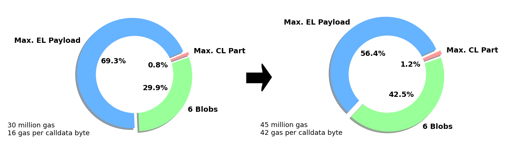

* Reducing the EL payload size opens up the potential to add more blobs without surpassing the current maximum block size (`30m limit / 16 gas calldata`). 
* 6 blobs have a size of 0.75 MB. 
* The proposed change would reduce the max. possible block size by 0.76 MB ($1.78 - 1.02$).

As of today, we see block sizes of up to ~1 MB on a daily basis, with a potential maximum of ~1.78 MB per block.

#### Max Block Size per Day
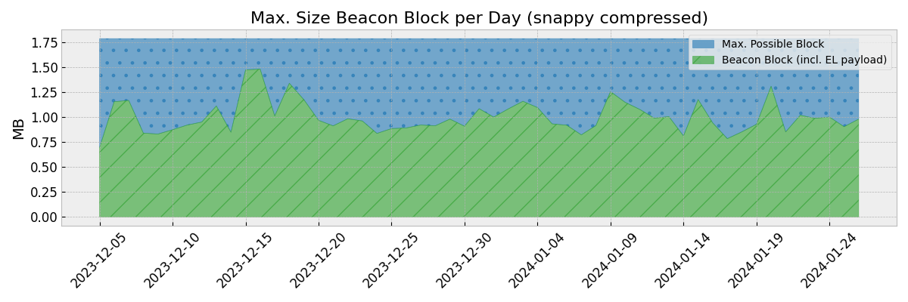

---

#### EL Payload Share - Average block
* On average, the EL payload accounts for ~20% of the total size of the Beacon block. 

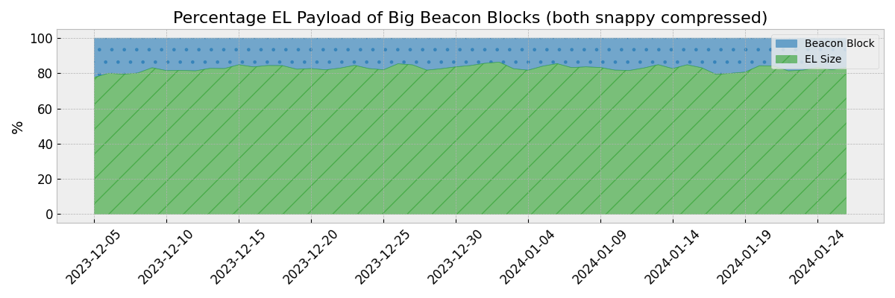

#### EL Payload Share - Large blocks
* For larger blocks, this share increases to ~99%. Thus, the EL payload is the main contributor to large blocks.
* This chart shows the share of the EL payload compared to the complete Beacon block for big (0.99% quantile) blocks.

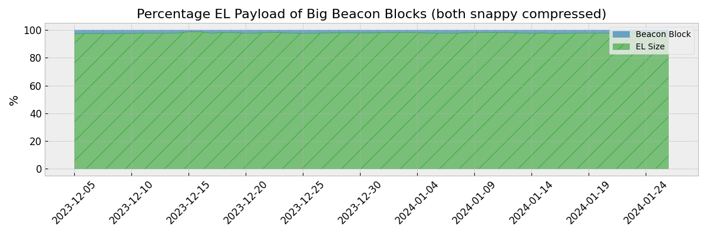

#### Related links
* [EIP-4488](https://eips.ethereum.org/EIPS/eip-4488) by Vitalik and Ansgar
* [On Block Sizes, Gas Limits and Scalability](https://ethresear.ch/t/on-block-sizes-gas-limits-and-scalability/18444) by Toni
* [Block size over time](https://etherscan.io/chart/blocksize) by Etherscan
* [Rollup Calldata Usage](https://dune.com/queries/3219749/5382758) over Time by [@niftytable](https://twitter.com/0xKofi/status/1380212225227558915)