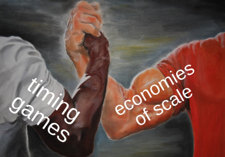
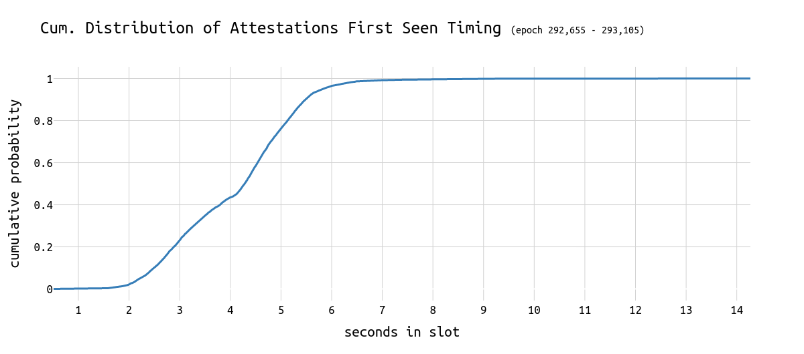
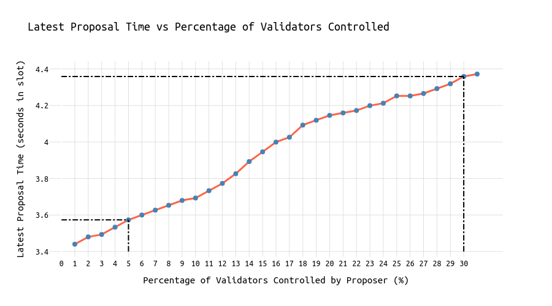

# On Proposer Timing Games and Economies of Scale

[Timing games](https://timing.pics) are a known phenomenon ([[1]](https://eprint.iacr.org/2023/760), [[2]](https://arxiv.org/abs/2305.09032) and [[3]](https://ethresear.ch/t/deep-diving-attestations-a-quantitative-analysis/20020)). The concern is that proposer timing games come with a negative impact on the network. 

In the following, I want to show how the success of playing proposer timing games is also a function of economies of scale.

**The main finding is:**
***-> An entity with 30% market share can delay 0.8s longer than a 5% entity.***
***-> For every 1% increase in validator market share, the delay in block proposals can increase by 0.03 seconds without facing additional reorg risk.***





*Special thanks to [Anders](https://x.com/weboftrees), [Mike](https://x.com/mikeneuder) and [Caspar](https://x.com/casparschwa) for feedback!*


## Introduction

A proposer must gather at least 40% of these votes to ensure their block is accepted and not reorged by the following proposer. It's 40% because that's the proposer boost threshold. Blocks with less than 40% attestations can be reorged by the next proposer leveraging proposer boost. The challenge for a timing-gamer lies in determining the optimal time to propose (or call getHeader). An economically rational validator would want to wait as long as possible (providing the builder with the longest possible time window) without risking a reorg.

First, let's revisit the following chart from [this analysis](https://ethresear.ch/t/deep-diving-attestations-a-quantitative-analysis/20020):


**~80% of all attestations are seen until second 5 in the slot**. The **40% threshold is reached somewhere around second 3.8**. Thus, assuming zero latency, a block published at second 3.8 should still be able to receive 60% of attestations.

**In the following, we refer to this curve as $C(t)$.**

## Initial Setup

The core idea is to determine how the cumulative votes cast by validators evolve over a slot and how a proposer's control over a portion of these validators may influence the optimal timing of their block proposal.


Given that $C(t)$ represents the cumulative percentage of votes cast by time $t$, the proposer controls $x\%$ of validators, and needs to ensure that they can still reach at least 40% by the time they propose, we start with the following condition:

$$
x + (1 - C(t)) \times (1 - x) \geq 0.4
$$

In this equation:

- **$(1 - C(t)) \times (1 - x)$:** The remaining uncast votes from validators not controlled by the proposer, which could support the proposer’s block.

> Note that **$x \times C(t)$** would be the portion of votes from the proposer's validators already included in $C(t).$
 
Two assumptions are important to stress:
* **Coordination**: It is assumed that validators coordinate when attesting, e.g. using a central oracle that provides the commands.
* **Honest Validators**: All validators who have not yet voted at the time of the block proposal will vote for the proposed block (and not the parent block). See [honest validator specs](https://github.com/ethereum/consensus-specs/blob/b2f2102dad0cd8b28a657244e645e0df1c0d246a/specs/phase0/validator.md#phase-0----honest-validator).


### Simplifying the Equation

We rearrange the initial equation to find the threshold for $C(t)$, the cumulative percentage of votes that can be cast before the proposer must act:

$$
x + (1 - C(t)) \times (1 - x) \geq 0.4
$$

Expanding and simplifying:

$$
(1−C(t))×(1−x) = 1 - x - C(t) + C(t) \times x 
$$

$$
1 - C(t) + C(t) \times x \geq 0.4
$$

Finally, solving for $C(t)$:

$$
C(t) \leq \frac{0.6}{1 - x}
$$

Find the complete derivation [here](https://hackmd.io/L0A6zeBZSzGew2Ni0AzFVQ).

### Interpretation

This simplified equation $C(t) \leq \frac{0.6}{1 - x}$ means that the proposer can safely propose as long as the cumulative attestations $C(t)$ remain below the threshold defined by $\frac{0.6}{1 - x}$.

- **$C(t)$:** The cumulative percentage of votes cast by time $t$.
- **$x \%$:** The percentage of total validators controlled by the proposer.
- **$0.4$:** The 40% threshold needed to secure a majority ($1-0.4=0.6)$.

The equation ensures that the proposer, with their share of validators, can still influence the outcome favorably by proposing before the cumulative attestations exceed this threshold.

A node operator with many validators can risk a few seconds more than a small-size operator, knowing that their own validators will never vote against them. 


**The following chart shows the effects of economies of scale and answers the question of *how long a node operator with *x%* market share can maximally wait until the point it won't be able to receive at least 40% of all attestations anymore*.**



The "*seconds in slot*" values on the y-axis are `attestation_seen` timestamps that are not corrected by the time required for block propagation and verification. Since those numbers are just constants impacting the absolute values on the y-axis, this doesn't matter in making the relative impact of market share on the limits of timing games visible.

**We can see that a node operator with 30% of the market share can potentially wait 0.8 seconds longer than a node operator with 5% market share while risking the same.**


## In Python

Using Python, we can calculate the latest "safe" proposal time for different percentages of validator control. Here's the key part of the implementation:

```python
import numpy as np
from scipy.interpolate import interp1d

# Provided cumulative attestation data (seconds, % of casted attestations)
data = [
     (0.791, 0.0005390835579514825),
     # (additional data points omitted for brevity)
     (2.228, 0.05444743935309973),
     (2.464, 0.10835579514824797),
     (2.639, 0.16226415094339622),
     (2.777, 0.21617250673854446),
     (2.932, 0.27008086253369273),
     (3.104, 0.323989218328841),
     (3.308, 0.3778975741239892),
     (3.627, 0.43180592991913747),
     (4.069, 0.4857142857142857),
     (4.25, 0.539622641509434),
     (4.407, 0.5935309973045823),
     (4.576, 0.6474393530997304),
     (4.723, 0.7013477088948787),
     (4.898, 0.7552560646900269),
     (5.039, 0.8091644204851752),
     (5.245, 0.8630727762803234),
     (5.521, 0.9169811320754717),
     (6.187, 0.9708894878706199)
]

# Extracting the times and cumulative attestation percentages
times = np.array([point[0] for point in data])
cumulative_attestations = np.array([point[1] for point in data])

# Interpolating the cumulative attestation function
cumulative_attestation_func = interp1d(times, cumulative_attestations, kind='linear', fill_value="extrapolate")

# Function to calculate the latest time a proposer with x% control can safely propose a block
def calculate_latest_proposal_time(x):
    threshold = 0.5 / (1 - x)
    
    for t in np.linspace(times[0], times[-1], 1000):
        if cumulative_attestation_func(t) > threshold:
            return t
    return None

```

# Conclusion

By understanding and calculating the relationship between validator market share and cumulative attestations, proposers can optimize their proposal timing to minimize the likelihood of reorgs while maximizing profits. 

Such strategies could be improved by checking which CL client the subsequent validator runs, or, even simpler, the slot index in an epoch. Based on that information one can better estimate the chances of getting reorged (e.g. if it's Teku, Nimbus, Lodestar, or the last slot in an epoch, then the reorg probability is significantly lower because no honest reorg strategy is implemented).

Pushing proposer timing games to their limits has a [negative impact on attesters](https://ethresear.ch/t/on-attestations-block-propagation-and-timing-games/20272) and can have cascading effects: If validators realize they miss out on profits because they vote for the wrong block too often, they might start delaying their attestation.

**Ultimately, pushing timing games to their limits can have a detrimental impact on the network. Furthermore, validator coordination that goes beyond running multiple validators from a single node shouldn't be tolerated/supported. Now, it is important to follow/contribute to block construction research and find ways to [reduce the profitability of timing games](https://eips.ethereum.org/EIPS/eip-7716) or prevent them entirely.**