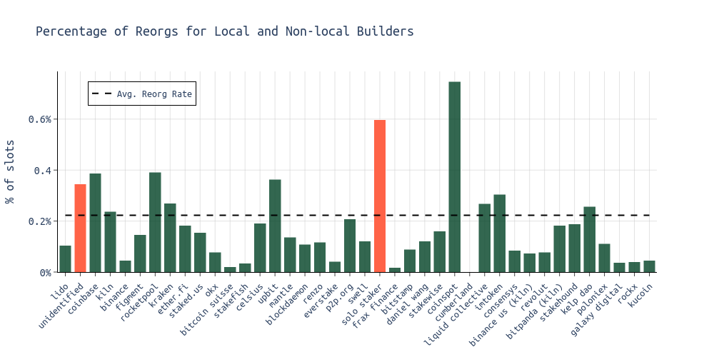
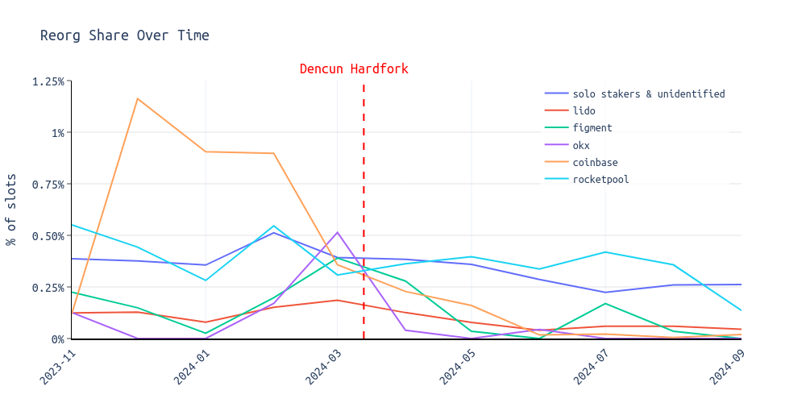
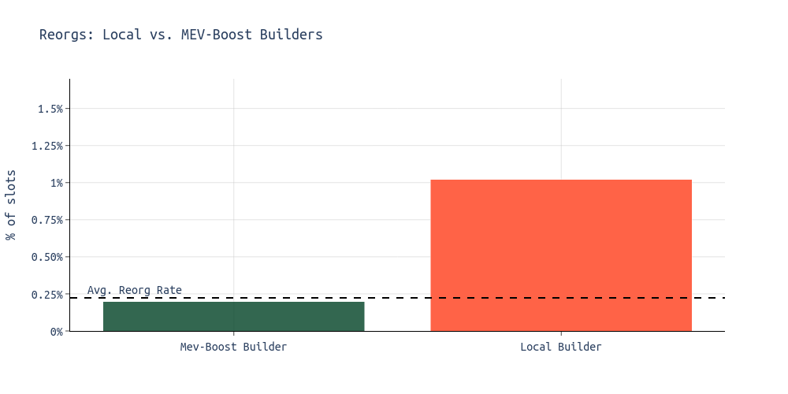
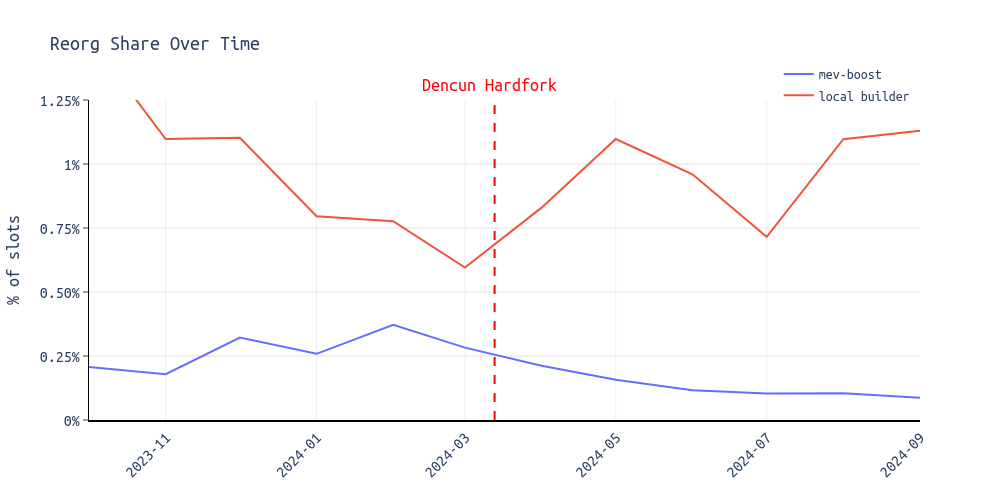
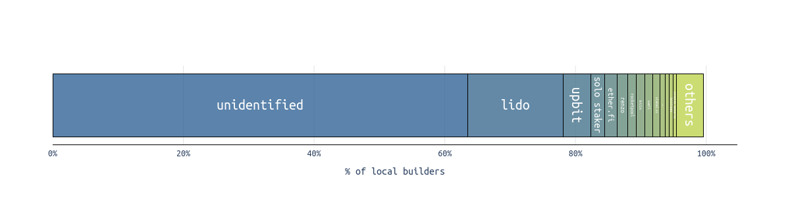

# On solo staking, local block building and blobs

In recent weeks, discussions about a potential increase in blob throughput in Pectra have intensified, with two distinct groups emerging. One advocates for the increase, while the other is hesitant, preferring to wait for clear data supporting such a change.

From my perspective, one sentiment is overwhelmingly clear within the community:

$$
\textbf{Solo stakers are at the heart of Ethereum.}
$$

While there hasn't been a consensus on the minimum requirements for validators (see [sassal.eth's tweet](https://x.com/sassal0x/status/1839684947864322320) on that), the Ethereum community has made one thing clear: 

$$
\textbf{We do not want to sacrifice solo/home stakers for additional linear scaling.}
$$

In my view, this reflects a healthy direction for Ethereum and underscores the community's view on the importance of viable solo staking. 

However, it raises an important question: "***Where is the line?***" 

***Specifically, at what point does the contribution of a weaker, lower-bandwidth staker to decentralization no longer justify the limitations it imposes on Ethereum's ability to scale?***

In this piece, I aim to provide additional data points to help the community make an informed decision on whether we want to pursue a blob throughput increase in Pectra.

> As [Potuz](https://x.com/potuz_eth), a core developer from Prysm, aptly stated, the real question is not "Do we want to scale, and how?" but rather, "Are we ready to do so now?"

## Who is being reorged today?  (Oct 2023 - Oct 2024)

* On average ~0.2% of blocks are reorged (=reorged ⊆ missed).
* Professional node operators (NOs) such as Lido, Kiln, Figment, and EtherFi are reorged less often than the average.
* Less professional NOs such as solo stakers, Rocketpool operators, or the unidentified category which likely includes many solo stakers that couldn't be identified, are more frequently reorged.

 

As shown in [an earlier analysis](https://ethresear.ch/t/steelmanning-a-blob-throughput-increase-for-pectra/20499), the reorg rate has been trending down since the Dencun hardfork.
In the following chart, we can see that this effect was different for different entities:

* The reorg rate decreased for solo stakers and `unidentified` since Dencun.
* The same applies to Rocketpool operators, as well as larger operators such as Lido, Coinbase, Figment, and OKX. 

## What about local block building? (Oct 2023 - Oct 2024)

* Local builders have a reorg rate of approximately 1.02%.
* MEV-Boost builders have a reorg rate of approximately 0.20%.
* Local builders are approximately 5 times more likely to be reorged than MEV-Boost builders.
 

* The reorg share for local block builders seems to have remained constant or even increased after the Dencun hardfork.
* For MEV-Boost users, reorgs have been trending down since Dencun.
* Notably, [previous analysis](https://ethresear.ch/t/blobs-reorgs-and-the-role-of-mev-boost/19783) showed that local builders included on average more blobs into their blocks. Furthermore [we have seen](https://ethresear.ch/t/big-blocks-blobs-and-reorgs/19674) that right after the Dencun hardfork blocks with 6 blobs struggled a bit, but this eventually stabilized again. This might explain why the reorg rate didn't decrease for local builders.

## Who are the local builders? (Oct 2023 - Oct 2024)

* Solo stakers (here labeled as "solo staker" but with many solo stakers in the `unidentified` category) are the largest entity within the "local builder" category.
* Furthermore there are Lido NOs that are not using MEV-Boost at all or use the min-bid flag.

# Key Insights

* Solo stakers tend to miss more slots compared to professional validators.
* Solo stakers often build their blocks locally rather than using MEV-Boost.
* Local block builders don't benefit from the fast propagation offered by MEV-Boost relays.
* Relays engage in timing strategies (e.g., relay delays, allowing time to wait for even more profitable blocks).
* Epoch boundaries contribute to an increase in reorgs.

Multiple factors can lead to reorgs, making it challenging to pinpoint exactly why certain validators, like solo stakers, experience them more frequently than others.