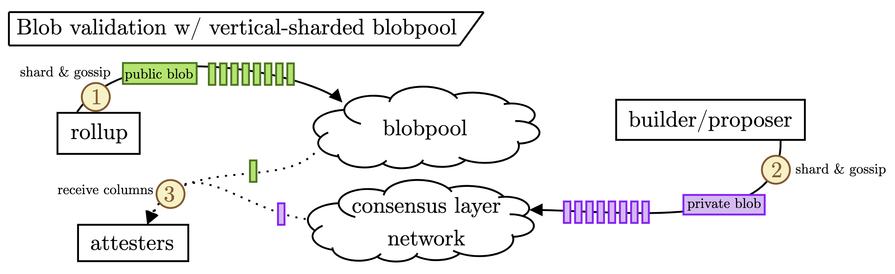
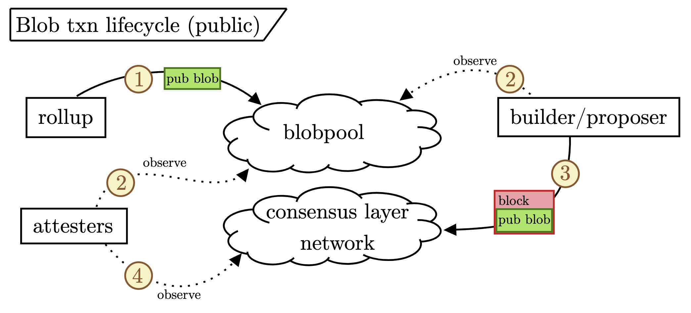
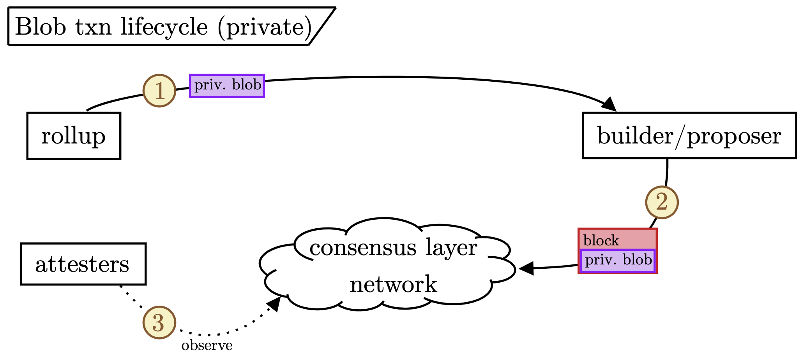

# On the future of the blob mempool

by [Mike](https://x.com/mikeneuder) and [Julian](https://x.com/_julianma) in discussion with [Francesco](https://x.com/fradamt)

### Contents
[1. The blobpool today](#p-54994-h-1-the-blobpool-today-3)
&nbsp;&nbsp;[1.1. What happens in Fusaka?](#p-54994-h-11-what-happens-in-fusaka-4)
&nbsp;&nbsp;[1.2. Why should we do something by Glamsterdam?](#p-54994-h-12-why-should-we-do-something-by-glamsterdam-5)
[2. Auctions with refunds: a market-based mechanism for vertical sharding](#p-54994-h-2-auctions-with-refunds-a-market-based-mechanism-for-vertical-sharding-6)
[3. Broader considerations](#p-54994-h-3-broader-considerations-7)
&nbsp;&nbsp;[3.1. Main outstanding questions](#p-54994-h-31-main-outstanding-questions-8)

### 1. The blobpool today

The blob mempool, which we refer to as the "blobpool" for the remainder of this article, is the set of pending blob transactions not yet included in a block. Each node maintains a view of the blobpool and updates its view by pulling any announced blob transactions that they have not yet received (see [here](https://hackmd.io/@mikeneuder/blob-gossip-and-validation#21-Blob-gossip-and-the-mempool) for more). Because of the pull model, each node should download each blobpool transaction once. The blobpool is maintained by the execution layer (abbr. EL), and by default, nodes **download every blob in the blobpool**.

On the consensus layer (abbr. CL), validators must determine the availability of the blob transactions included in a block before attesting to its validity (see [here](https://hackmd.io/@mikeneuder/blob-gossip-and-validation#22-Block-validation-and-blobs) for more on blob downloading paths for the CL). Currently, the data availability check verifies the **availability of the full blob data for each blob transaction included in the block**. As such, there is a synergy between the blobpool (EL) and the data availability check (CL); both download all blobs.

#### 1.1 What happens in Fusaka?

Fusaka includes PeerDAS, which changes the data availability check performed by the CL. Instead of downloading the complete blob data, the CL only checks the **availability of a subset of columns for each blob transaction included in a block**. This "vertical" sharding is *the core unlock* that allows for dramatically increasing the number of blobs per block because the bandwidth requirements of downloading 1/8 of the columns of 48 blobs are equivalent to downloading six full blobs. However, without changes to the blobpool, **PeerDAS introduces a fundamental asymmetry between the EL and the CL**. The EL still aims to download all available blobs; the CL only needs to check the availability of some columns of each blob.

With today's 6/9 (target/max) blob count, the blobpool consumes a target of 64 kB/s and a max of 96 kB/s of bandwidth. With a 48/72 blob count, the blobpool bandwidth would jump to 512/768 kB/s. While this bandwidth is reasonable for a majority of nodes, it will force some lower-resourced nodes to limit their blobpool view. Further, having each node download each blob **nullifies the benefits of vertically sharding the CL data availability check** in the first place. We need a more precise understanding and description of how blob data will be gossiped and verified moving forward.

#### 1.2 Why should we do something by Glamsterdam?

The scope for Fusaka is set; PeerDAS will be implemented *without* an in-protocol mechanism to minimize the bandwidth impact of a significant increase in blobs to the blobpool. Still, implementing a solution in Glamsterdam seems necessary for the following reasons:

1. *We hope to maintain the public blobpool*. As of today, [80% of blob transactions](https://dune.com/queries/4266705/7172423) go through the public blobpool. Centrally-sequencer rollups result in [patient blob transactions](https://hackmd.io/@mikeneuder/blob-gossip-and-validation#11-Centralized-sequencers-implies-patient-blobs). Thus, we expect the public blobpool to remain a common path for blob publication as long as those rollups are the dominant blob consumers and the public blobpool continues to offer sufficiently good inclusion guarantees. 
2. *Continuing to scale DA would continue to scale the blobpool bandwidth requirements*. This directly follows from the fact that the DA check is sharded, but the blobpool isn't. As long as we keep increasing blobs, if there is no change to the blobpool, it will also linearly scale in bandwidth usage. This bandwidth increase might be OK, so long as low-resourced nodes are still able to attest – more on this in [Section 3](#p-54994-h-3-broader-considerations-7). 

The obviously "correct" solution is to shard the blobpool vertically, mirroring the vertical sharding of the DA check (as described [here](https://hackmd.io/@fradamt/blob-mempool-tickets#What)). In other words, we need a blobpool-native way to gossip *blob columns* instead of only *full blobs* to allow nodes to download the data they are responsible for in their DA check. The figure below demonstrates this.

We split blobs into two categories: public (green) and private (purple). Public blobs are vertically sharded and gossiped to the blobpool by the blob originator. Private blobs are vertically sharded and gossiped directly to the CL network by the builder (who receives the private blobs from a rollup and doesn't gossip them before they are committed to in a block). Either way, the attester only downloads their assigned columns to perform their DA check. Without a vertically-sharded blobpool, the attesters would be stuck downloading *the full public blobpool* blobs.

The *how* of vertical blobpool sharding is more nuanced. [Section 2](#p-54994-h-2-auctions-with-refunds-a-market-based-mechanism-for-vertical-sharding-6) sketches a potential mechanism to enable vertical sharding of the blobpool, while [Section 3](#p-54994-h-3-broader-considerations-7) zooms out and considers the situation more broadly. 

### 2. Auctions with refunds: a market-based mechanism for vertical sharding

DoS attacks are the limiting factor when considering the vertically sharded blobpool. How can we be sure that the columns gossiped belong to a fee-paying transaction? We aim to use the simplest market mechanism to allocate write access to the blobpool. Under this model, any column that is gossiped must come from an identity that has paid for the ability to write that data to the blobpool during that slot. We focus on mechanisms that enforce a hard cap on the number of blobs that can be propagated per slot, as this prevents DoS attacks and allows the system to operate at its maximum capacity. Finally, we aim to provide blobpool access free of charge and offer a good user experience for rollups.

The central part of our proposal is a simple first-price auction with a reserve in which `k` blobpool tickets for slot `n` are sold. `k` is equal to the blob limit. 

- **Bidding:** Bids in the form of `(bid_per_blob, number_of_blobs)` are submitted during slot `n-2`. Bids are execution layer transactions.
- **Auction:** Bids are included in a system contract in block `n-1`. The system contract picks the bids that maximize the auction revenue as long as the total number of blobs does not exceed `k` (i.e., by greedily selecting the `k` highest bids if each bid is for a single blob) and each bid exceeds the `reserve_price`.
- **Blob Propagation:** Blobpool ticket holders may propagate their blobs in the vertically sharded blobpool in slot `n`. Honest builders include the blobs in their block, and honest nodes sample the blobs as soon as they land in the blobpool.
- **Refund:** In slot `n+1`, each blobpool ticket holder whose blob was included in slot `n` receives a refund of the `reserve_price`.

It's important to note that usually, the demand for blobpool tickets will be lower than `k` because the blob base fee adjusts using the 1559 controller such that there is only demand for the blob target, which is lower than the limit. Currently, the target is six blobs per slot, and the limit is nine. That means that bidders usually only have to pay the `reserve_price`, which they will get refunded if they do use the vertically sharded blobpool, and the builder included all gossiped blobs. **You can see blobpool tickets as usually requiring just a deposit from blob submitters, which they receive back in 2 slots, making the mechanism free of charge.**

For the exceptional case where there is more demand for blobs than the blob limit allows, we need to implement the proposed auction. We cannot refund bids higher than the `reserve_price` because then the auction would not allow bidders to express how much they value the blobpool ticket in this exceptional case.

The reserve price should be set high enough to imply real-world costs for an attacker who wants to prevent blobpool access for other bidders. We propose using the `reserve_price` of the base fee of the blob from [EIP-7918](https://ethereum-magicians.org/t/eip-7918-blob-base-fee-bounded-by-execution-cost/23271).

### 3. Broader considerations 

There are many nuances to the interactions between the builders, attesters, and rollups that are important to consider in the context of the blobpool's future.

- **Blobs transitioning to private-order flow is highly possible but not inevitable because it is worse for builders.** As of now, the viability of the blobpool relies on (i) blobs being "patient" by nature of coming from centralized sequencers and thus not carrying MEV and (ii) the blobpool offering a good enough "inclusion service" for rollups. As long as blobs sent to the blobpool continue getting timely inclusion, we expect the public flow of blobs to remain. However, the moment the inclusion service of the blobpool degrades, we expect blobs to begin flowing directly to builders. One important factor working in the blobpool's favor is that **blobs originating from the blobpool are less risky for builders to include.** This results from the fact that when builders include a public blob in the block, they can be confident that a majority of the attesting nodes have already seen it and thus will accurately vote on the block being valid.[^1] The figure below shows this.

Notice that the attesters can get the public blobs from either the blobpool or the CL network. In contrast, the figure below shows the private blob flow.

In this case, the only source of blobs for the attesters is the CL network. $\quad$ Another way of looking at this is that the blobpool offers a "blob-distribution service" to the builders, who no longer need to worry about disseminating blobs just in time after building the block, which is required for any private blobs. This is especially important considering the reality of timing games, where builders are eager to delay the publication of their block (and thus the private blob data) as long as possible. In our opinion, this is all the more reason to work to preserve the blobpool and why we don't have to expect all blobs flowing directly through builders to be the only stable outcome.
- **Other types of blobpool sharding are possible and straightforward to implement, but they inevitably degrade the services of the blobpool.** As discussed [here](https://notes.ethereum.org/@dankrad/BkJMU8d0R#Horizontally-sharded-mempool), [here](https://hackmd.io/@mikeneuder/blob-gossip-and-validation#321-Horizontally-shard-the-EL-mempool), [here](https://ethresear.ch/t/a-new-design-for-das-and-sharded-blob-mempools/22537), and probably elsewhere, horizontally sharding the blobpool is a relatively simple way to reduce the bandwidth footprint of the blobpool. There are many ways to limit the number of blobs a node downloads (e.g., by accepting the first 10 that arrive during a slot or by downloading a random subset based on the sender ID). Still, they all result in the same outcome – each node only retrieves a subset of the blobs in the blobpool. All else being equal, **horizontal sharding must degrade the inclusion service of the blobpool, as the probability that a given proposer has any given blob during their slot decreases.** This seems like a non-starter for horizontal sharding because, as discussed in the previous bullet, any degradation of the blobpool inclusion service probably pushes the blobs to flow through private channels, thus killing the blobpool. There are two important caveats to consider here, however.  $\quad$ First, many nodes may choose *not* to horizontally shard and thus will continue downloading all blobs. With estimates of around 90+% of the stake being professionally managed, this could mean that the majority of proposers still have access to all blobs, and the blob inclusion guarantees remain essentially unchanged. In this idealized outcome, we could get the best of both worlds as at-home operators can limit the bandwidth impact of the blobpool, and the blobpool continues providing a good service to rollups and builders. Second, since proposing is such a rare task for an at-home operator, they could handle the brief spike in bandwidth by downloading all blobs *only when they are selected as the proposer*; in this way, their bandwidth spike would only take place a couple of times per year. Of course, this still relies on their connection being sufficient to handle the peak load, which, in some geographies, might not be possible.  $\quad$ Either way, there may be some hope that these simple horizontal sharding approaches to the blobpool are viable.
- **There are alternative ways to provision blobpool write access in a DoS-resistant way.** Preventing DoS attacks is the leading blocker of vertically sharding the blobpool. [Section 2](#p-54994-h-2-auctions-with-refunds-a-market-based-mechanism-for-vertical-sharding-6) outlined a market-based approach, where access to the blobpool is auctioned off. There are alternative, potentially simpler ways to ensure that the vertically sharded blobpool is spam-resistant. Dankrad [proposed](https://notes.ethereum.org/@dankrad/BkJMU8d0R#Vertically-sharded-mempool) a data-based approach, where the blobpool write access is limited to addresses that have recently landed blobs or have burnt some ETH. This identity-based approach is an instance of a reputation system. Many other heuristics and methods could be implemented (either in or out of protocol) to limit the DoS risk. If we go for a market-based solution, we should be confident that the benefits outweigh the increased complexity compared to these relatively more straightforward, engineering-driven approaches.
- **The design space for the blobpool ticket auction needs to be considered.** [Section 2](#p-54994-h-2-auctions-with-refunds-a-market-based-mechanism-for-vertical-sharding-6) sketches a simple version of the blobpool ticket auction, but there remain many potential tweaks. For example, should blobpool access be sold at a per-slot granularity or over a longer time horizon? How should refunds be tracked and handled? How should the reserve price of the ticket be set and updated? These are all relatively small differences in the auction itself but may result in very different bidding strategies and equilibria. If we move forward with the auction design problem, we must consider these axes carefully in discussion with rollups to ensure that they will find it valuable and easy to participate. Again, circling back to bullet one, the auction is only worth doing if it is better than going through private channels directly to the builders.
- **We could consider more wholesale redesign of the blob fee mechanism and lifecycle.** Blobs are different than normal transactions in many ways. The fact that they are patient, for example, may make the 1559 controller for the base fee less ideal. When considering the future of the blobpool, we may also consider bigger changes. For example, we could bundle blobpool tickets with an enforcement guarantee through FOCIL. In this way, the ticket price effectively supplants the priority fee (because the blob will be sure to be included so long as it is gossiped on time). We should ensure that any changes made to the blobpool are either future-compatible or bundled with broader blob changes.
- **The auction should not put too much load on the L1.** The auction may use a system contract with execution layer transactions. The number of transactions used in the average and worst-case scenarios should be minimized to prevent the blobpool ticket system from placing too much load on the L1. The base implementation shown in [Section 2](#p-54994-h-2-auctions-with-refunds-a-market-based-mechanism-for-vertical-sharding-6) may require up to `k` transactions per slot, which could be excessive with scaling goals of `k` equal to 128 or 256 blobs. Ways to decrease the auction load include selling a few small tickets of one blob and the remainder in large tickets of at least six blobs or, by default, allocating tickets to the ticket holders of the parent block. These methods, which result in a more expressive albeit more complex bidding language, need to be reconciled with the user experience of the ticket system.

[^1]: One subtle note here: this benefit for the builders is realized only if partial columns can be gossiped. As discussed [here](https://hackmd.io/@mikeneuder/blob-gossip-and-validation#31-Block-validation-and-blobs), as currently constructed, *a single private blob* results in the builder needing to gossip the full column. Thus, the blobpool benefits of gossip are not present unless we can reconstruct columns by combining the public blobpool data with the just-in-time private blob columns. 

#### 3.1 Main outstanding questions 

Hopefully, this document helps serve as the starting point for a discussion about the future of the blobpool. Critically, there are still many open questions that we must address before making a recommendation. We partition these questions according to the stakeholders that they most closely impact.

1. **Questions for rollup teams**
    a. *Do you plan on continuing to use the blobpool to post your blobs?*
    b. *How much latency (measured in slots) is tolerable between sending a blob and having it land on chain?*
    c. *If we were to run the blobpool ticket auction as described in [Section 2](#p-54994-h-2-auctions-with-refunds-a-market-based-mechanism-for-vertical-sharding-6), how much work would it be to participate? Would you consider going to private channels instead?*
    d. *If we were to run the auction, do you want to participate in a per-slot auction? Or is a longer time horizon preferable?*
    e. *How do you feel about a reputation system approach to sending blobs?*
2. **Questions for block builders**
    a. *How much do you depend on your view of the blobpool when deciding which blobs to include in a block?*
    b. *Do you prefer receiving blobs through private channels? What inclusion guarantees do you offer for private blobs?*
    c. *What are the changes in the infrastructure needed to facilitate an 8x increase in the number of blobs per slot? Does this meaningfully impact how you build and distribute blocks?*
4. **Questions for stakers (professional and at-home)**
    a. *How do you plan on handling the bandwidth increase resulting from an increase in the number of blobs under PeerDAS?*
    b. *How important is the peak versus average bandwidth consumption?*
    c. *Would you plan on continuing to download all blobs in the horizontal sharding world?*