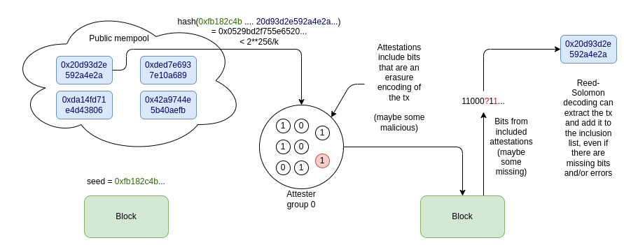

Inclusion lists are a technology for distributing the authority for choosing which transactions to include into the next block. Currently, the best idea for them is to have an actor that is from a set that is likely to be highly decentralized (eg. consensus block proposers) generate the list. This authority is decoupled from the right to _order_ (or _prepend_) transactions, which is an inherently economies-of-scale-demanding and so likely to be highly concentrated in practice.

But what if we could avoid putting the responsibility onto a _single_ actor, and instead put it on a _large set of actors_? In fact, we can even do it in such a way that it's semi-deniable: from each attester's contribution, there is no clear evidence of which transaction they included, because one individual piece of provided data could come from multiple possible transactions.

This post proposes a possible way to do this.

### Mechanism

When the block for slot N is published, let `seed` be the RANDAO_REVEAL of the block. Suppose for convenience that each transaction is under `T` bytes (eg. `T = 500`); we can say in this initial proposal that larger transactions are not supported. We put all attesters for that slot into groups of size `2 * T`, with `k = attesters_per_slot / (2 * T)` groups.

Each attester is chosen to be the j'th attester of the i'th group. They identify the highest-priority-fee-paying valid transaction which was published before the slot N block, and where `hash(seed + tx)` is between `2**256 / k * i` and `2**256 / k * (i+1)`. They erasure-code that transaction to `2T` bits, and publish the j'th bit of the erasure encoding as part of their attestation.

When those attestations are included in the next block, an algorithm such as [Berlekamp-Welch](https://en.wikipedia.org/wiki/Berlekamp%E2%80%93Welch_algorithm) is used to try to extract the transaction from the provided attester bits.

The Reed-Solomon decoding will fail in two cases:

1. If too many attesters are dishonest
2. If attesters have different views about whether a particular transaction was published before or after the block, and so they are split between providing bits for two or more different transactions.

Note that in case (2), if the transactions are sufficiently small, advanced [list decoding algorithms](https://www.cs.cmu.edu/~venkatg/teaching/codingtheory/notes/notes10.pdf) may nevertheless be able to recover several or all of the transactions!

The next block proposer will be able to see which transactions the attestations imply, and so they will be able to block transactions from the list by selectively failing to include attestations. This is an unavoidable limitation of the scheme, though it can be mitigated by having a fork choice rule discount blocks that fail to include enough attestations.

Additionally, the mechanism can be modified so that if a transaction has not been included for 2+ slots, _all_ attesters (or a large fraction thereof) attempt to include it, and so any block that fails to include the transaction would lose the fork choice. One simple way to do this is to score transactions not by `priority_fee`, but by `priority_fee * time_seen`, and at the same time have a rule that a transaction that has been seen for `k` slots is a candidate not just for attester group `i`, but also for attester group `i...i+k-1` (wrapping around if needed).