*Much of the post came together during a week of in-person whiteboarding with [RIG](https://rig.ethereum.org) and wannabe RIGs like myself, Ansgar and Toni. Thanks in particular to [Anders](https://twitter.com/weboftrees), [Ansgar](https://twitter.com/adietrichs), [Barnabé](https://twitter.com/barnabemonnot), [Thomas](https://twitter.com/soispoke) for continued discussions and feedback, again to Anders for most of the ideas around individual incentives, and again to Barnabé for the diagrams about finality. The core idea that the post explores was originally proposed by Vitalik in [this post](https://ethresear.ch/t/sticking-to-8192-signatures-per-slot-post-ssf-how-and-why/17989#approach-3-rotating-participation-ie-committees-but-accountable-5)*.

## Where we are 

The [Single Slot Finality (SSF) roadmap](https://notes.ethereum.org/@vbuterin/single_slot_finality) has [three main components](https://notes.ethereum.org/@vbuterin/single_slot_finality#What-are-the-key-questions-we-need-to-solve-to-implement-single-slot-finality):
- Consensus algorithm
- Signature aggregation
- Validator set economics

Since the previously linked post, there has been a lot of progress on the consensus algorithm side, with [multiple](https://ethresear.ch/t/a-simple-single-slot-finality-protocol/14920) [candidate](https://arxiv.org/abs/2310.11331) [protocols](https://notes.ethereum.org/@fradamt/chained-3sf) and [the beginning of a specification effort](https://github.com/fradamt/ssf/tree/main/high_level). There have also been some effort to explore the design space of signature aggregation, both with a [networking](https://ethresear.ch/t/horn-collecting-signatures-for-faster-finality/14219) [focus](https://ethresear.ch/t/flooding-protocol-for-collecting-attestations-in-a-single-slot/17553) and a [cryptographic focus](https://ethresear.ch/t/signature-merging-for-large-scale-consensus/17386). Still, we are likely not close to being able to reliably aggregate millions of signatures per slot, without increasing the slot time or validator requirements significantly. On the staking economics side, there has been lots of work over the last year, but for the most part focused on understanding [liquid staking](https://mirror.xyz/barnabe.eth/v7W2CsSVYW6I_9bbHFDqvqShQ6gTX3weAtwkaVAzAL4) and [restaking](https://mirror.xyz/barnabe.eth/96MD_A194uXLLjcOWePW3O2N3P-JG-SHtNxU0b40o50), and on *stake* capping, i.e., constraining the amount of ETH staked (if you're reading this, you're probably already at least at a surface level familiar with the issuance conversation, in which case you might want to dig deeper and check out these posts [[1]](https://ethresear.ch/t/properties-of-issuance-level-consensus-incentives-and-variability-across-potential-reward-curves/18448/1) [[2]](https://ethresear.ch/t/endgame-staking-economics-a-case-for-targeting/18751)). Here, we are instead interested in *validator capping*, i.e., constraining the amount of validator identities in the system, or at least the ones actively participating at any given time, to satisfy technical constraints. Some ideas in this direction can be found in this [recent post](https://ethresear.ch/t/sticking-to-8192-signatures-per-slot-post-ssf-how-and-why/17989#what-would-8192-signatures-per-slot-under-ssf-look-like-2), and in fact [approach 3](https://ethresear.ch/t/sticking-to-8192-signatures-per-slot-post-ssf-how-and-why/17989#approach-3-rotating-participation-ie-committees-but-accountable-5) from the post provides the foundation for this post. Moreover, a recent important development is that [EIP-7251 (MaxEB)](https://eips.ethereum.org/EIPS/eip-7251) has been included in the [Electra fork](https://github.com/ethereum/consensus-specs/blob/a3a6c916b236c9e8904090303f0c38ae49db1002/specs/electra/beacon-chain.md). Validator effective balances will be allowed to be as high as 2048 ETH, enabling staking pools to [consolidate their validators](https://notes.ethereum.org/@fradamt/maxeb-consolidation), a new capability which we can leverage in our designs.

<!-- While these look like reasonably self-contained problems, there are important interactions between them, because the progress and design decisions in some aspects can tighten or loosen the constraints on the others. For example, if we were able to quickly aggregate millions of signatures every slot, or were willing to increase the slot time enough to do so, we would not necessarily need to touch the validator economics at all, because we would be able to guarantee that anyone with 32 ETH is able to participate. We would in particular not need to decide on some way to enforce a small active validator set, like some form of active validator set rotation, or a higher minimum balance, or any of the many other possible mechanisms in a fairly large design, and tradeoff, space (unless of course we wanted to further reduce the minimum balance). In turn, not having some rotation mechanism simplifies the design of the consensus algorithm as well.  -->

## Goals 

With the goal of finding a design which can make its way into the protocol in a reasonable timeline, we are here going to focus on solutions that *do not* rely on large improvements in the signature aggregation process. We also do not think it is very realistic to propose significant increases of the slot time, which have many externalities. Given these technical constraints, let's focus on a minimal set of properties that we ideally want to achieve:

- **Validator capping**: at most $N$ *active* validators at a time. For example, $N = 2^{15} \approx 32k$, which we know we can handle because it is the size of a committee today. If we wanted to completely remove attestation aggregation, we would likely need to drop this number to a few thousands.
- **Solo staking viability**: staking with 32 ETH is *guaranteed* to still be possible, *and* the solo staking yield should still not compare unfavorably to delegated staking yields.
- **High eventual economic security**: More than $D_f$ stake provides economic security, at least *eventually*. For example $D_f = 20M$ ETH. Ideally, we also do not have to wait longer than today for it (two epochs).
- **Fast finality**: at least *some* amount of economic security is available shortly after a block is proposed (think: 10 to 30 seconds, not over 10 minutes).
- **Optimally secure consensus protocol**: the consensus protocol is (provably) resilient to ~1/2 adversaries under network synchrony, and 1/3 under partial synchrony.

Without solo staking viability as defined here, we could simply raise the minimum balance, or go with approaches that allow for a low minimum balance but do not *guarantee* it, for example in the face of large stakers intentionally splitting their stake. Such solutions would likely have to lean on [decentralized staking pools](https://ethresear.ch/t/sticking-to-8192-signatures-per-slot-post-ssf-how-and-why/17989#approach-1-go-all-in-on-decentralized-staking-pools-3) or [two-tier staking](https://ethresear.ch/t/sticking-to-8192-signatures-per-slot-post-ssf-how-and-why/17989#approach-2-two-tiered-staking-4) to preserve the accessible nature of staking as it is today, or perhaps even to carve out a more tailored role for smaller stakers, as is suggested by [rainbow staking](https://ethresear.ch/t/unbundling-staking-towards-rainbow-staking/18683). While there is merit to these approaches and we believe they (and more generally the role of solo staking/broad consensus participation) deserve further exploration, we are choosing here to only explore designs that are compatible with this narrow interpretation of solo staking viability.

## Overview of approaches

Validator capping, solo staking viability and high economic security immediately raise an issue: high economic security requires millions of ETH to participate in finalizing and a minimum balance of 32 ETH then implies a worst case of hundreds of thousands or millions of validators (~1M at the time of writing), which seems to conflict with validator capping. There are two main classes of approaches that attempt to deal with this problem:
- **Validator set rotation**: the full validator set is allowed to be large, but only a subset is actively participating at any given time.
- **Economic validator set capping**: the size of the full validator set is constrained through economic incentives. To *guarantee* a small validator set size we can for example [reduce issuance past the target validator count](https://notes.ethereum.org/@vbuterin/single_slot_finality#Economic-capping-of-total-validator-count). However, this leaves all stakers open to a cheap griefing attack, where a small amount of stake can have a disproportionate negative impact on issuance.

In this post we are not going to focus on the latter approach *in isolation*, but we are going to propose a way to combine economic incentives with a form of validator set rotation.

## Validator set rotation

The current protocol also has to deal with the issue we have outlined in the previous section, and the chosen "solution" is precisely validator set rotation: only 1/32 of the validator set votes in any given slot. This design [trades off finality time](https://notes.ethereum.org/@vbuterin/serenity_design_rationale#Why-32-ETH-validator-sizes), and fails to satisfy our desired property of fast finality. 

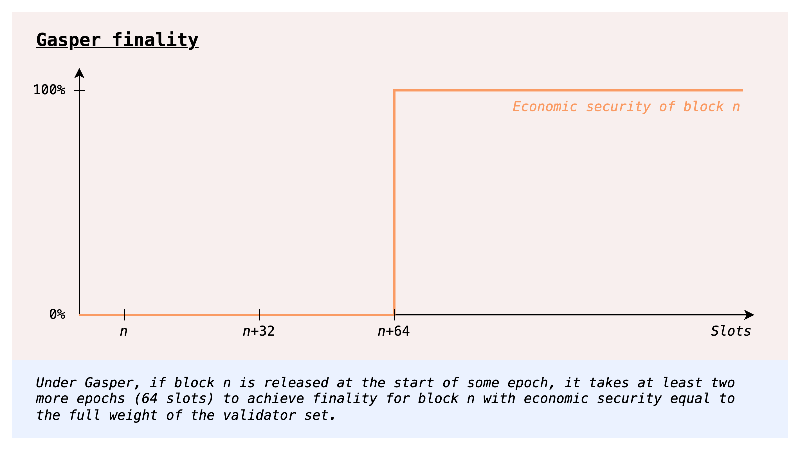

Let's then explore whether we can use validator set rotation without giving up on fast finality or other properties.

### Fast rotation

One way to go about validator set rotation is to have committees which rotate fast, as in the current protocol. In order to avoid a high time-to-finality, we can use a different consensus protocol allowing for [committee-based finality](https://ethresear.ch/t/a-model-for-cumulative-committee-based-finality/10259), i.e., such that even a committee can provide economic security proportional to its stake. In fact, the post linked above deals with *cumulative* committee-based finality, where the consensus protocol even allows for accumulation of economic security over multiple finalizations, such that $k$ committees finalizing in a row results in $k$ times the economic security that a single committee can provide. We get two birds with one stone, getting both fast (partial) finality and full *eventual* economic security. In particular, we could have full finality *in the same time as today* (which gives enough time for each committee to do its own finalization by voting twice), but with the big improvement that economic security accrues every slot, rather than all at once after two epochs. 

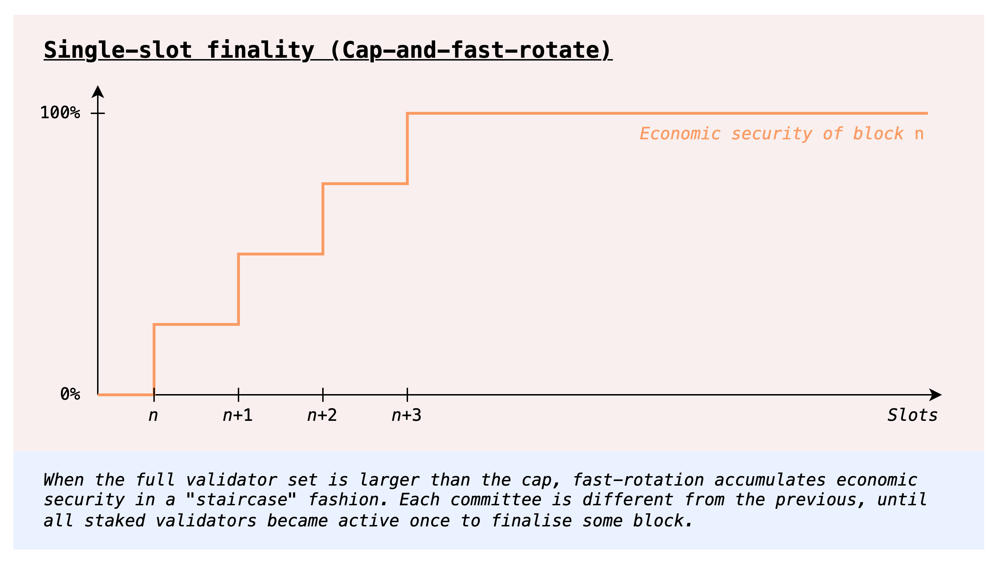

This seems like a clear improvement on today's protocol, so why are we not just doing it? An answer comes from the consensus protocol design space: it is not clear at this point how to have an optimally secure dynamically available protocol with *fast* rotating committees. In fact, much of the problems with the LMD-GHOST component of today's protocol, or at least the [fundamental ones](https://ethresear.ch/t/reorg-resilience-and-security-in-post-ssf-lmd-ghost/14164#introduction-2), come precisely from the interaction of multiple committees. In short, an adversary can accumulate weight across multiple committees, and use it to reorg honest blocks that have a single committee supporting them.

For interested readers, there actually are optimally secure dynamically available consensus protocols that allow for committees ([[1]](https://arxiv.org/abs/2209.03255) [[2]](https://eprint.iacr.org/2022/1448.pdf) for example), but all known ones suffer from catastrophic failures under even short-lived asynchrony ([[1]](https://arxiv.org/abs/2302.11326) [[2]](https://arxiv.org/abs/2309.05347)). It is not known whether this is a fundamental limitation, but at least so far we do not know any protocol that gets around it. 

### Slow rotation 

There is however a simple way to avoid the problem altogether: giving up on *fast* committee rotation, and instead having a committee which rotates out slowly, for example by replacing a small percentage of it every slot. The upshot is that such a committee effectively acts as a full validator set, in the sense that its actions do not interact with those of other committees, as would be the case with fast rotation. We can in principle take any protocol that works when the whole validator set is able to participate at once, and make it work with this mechanism by slowing down the rotation sufficiently.

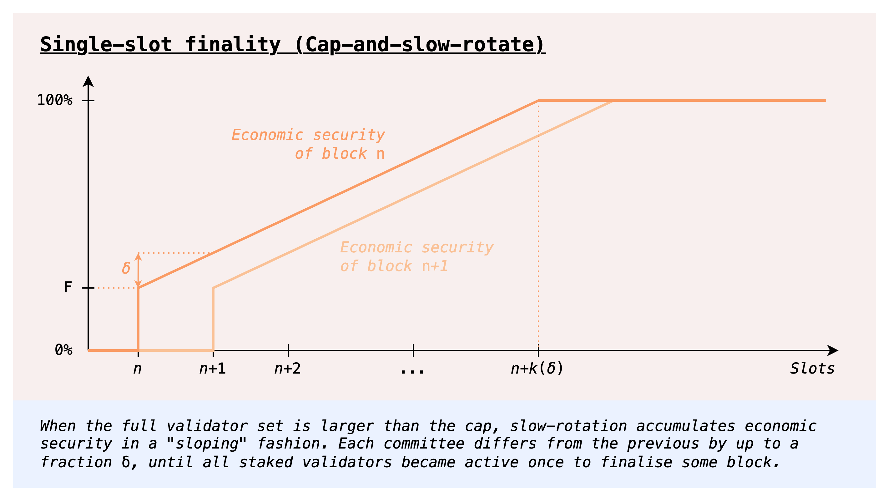

At a first glance, one obvious downside is that a full rotation of the validator set would be much slower than today, and thus so would finality. However, we could do things a bit differently, by decoupling the committee which votes for the available chain (LMD-GHOST votes) from those which vote for finality (Casper FFG votes). Only LMD-GHOST has problems with fast committee rotation, so we could have a slowly rotating committee whose votes count for LMD-GHOST and in parallel also fast rotating committees whose votes accumulate economic security over time, up to full finality in no more than today's two epochs. 

Besides some amount of extra complexity in the consensus protocol, one remaining downside is that we leave a single committee "in charge" of LMD-GHOST for extended periods of time. Moreover, while linearly accumulating finality is a strict improvement over today's step function finality, we do not achieve something even stronger, namely getting a high level of economic security immediately. This is of course impossible to achieve given the constraints we have laid out, *unless we make some assumptions about the stake distribution*, for example that it is [Zipfian](https://notes.ethereum.org/@vbuterin/single_slot_finality#The-good-news-gains-from-enabling-voluntary-validator-balance-consolidation), or anyway such that a large portion of the stake is concentrated in the first few thousand entities. 

<!-- 
- *Fairness of rewards*: expected rewards over time are still proportional to stake.
- *No griefing*: no way for large validators to grief small validators (e.g. by spreading out their stake and kicking them out of the validator set) or viceversa (e.g. by going over some validator set size target and reducing everyone's issuance)
- *Stake capping*: possibility to cap total deposits at some $D^*$, if desired.

Nice to have: 
- *Fast finality*: $\ge D_f$ economic security is guaranteed, or at least economically incentivized, to be provided by *each* finalization, rather than over a possibly long period of time

Proposals failing some of these goals:
- Validator set rotation: rotate (i.e. sample) by validator indices and not by balance. The average weight of a committee of size $C$ is $\frac{C}{|V|}D$, failing the fast finality property
- Validator set rotation with cumulative finality: we do get  -->

## Orbit SSF: Stable core, rotating periphery

Our starting point is [approach 3 from this post](https://ethresear.ch/t/sticking-to-8192-signatures-per-slot-post-ssf-how-and-why/17989#approach-3-rotating-participation-ie-committees-but-accountable-5), where validators are (roughly) sampled by balance, so that validators with a lot of stake are always in the validator set. Contrast this with the previously considered validator set rotation approaches where validators were (implicitly) sampled by indices, as we do today, which results in each committee having small weight regardless of what the stake distribution looks like. 

We then consider adding consolidation incentives, to have stronger guarantees about the level of finality that we can reach with a single committee. The rotating parts of the committee can then rotate slowly, and we do not need to take on the extra consensus complexity of decoupling voting for the available chain and for the finality gadget. Moreover, there is never a small committee (in terms of stake) in charge of a critical consensus component: at all times, we can expect the active validator set to hold a meaningful fraction of the whole stake.

### Active validator set management

 There are two key components here:
- *Active validator set selection*: We set a stake threshold $T$ (in principle it could also be set dynamically), and then define the probability of validator with stake $S$ to be sampled in the active set to be $p(S) = \min(\frac{S}{T}, 1) = 
\begin{cases}
\frac{S}{T} & S \le T \\ 
1 & S \ge T 
\end{cases}$
A validator with stake $S \le T$ is selected with probability $\frac{S}{T}$ proportional to its stake, whereas validators with stake $S \ge T$ are *always* in the validator set. The idea here is of course that it is helpful to have a stable core of large validators always in the active set, because they contribute a lot of economic security but still only add the same load as any other validator. 
- *Reward adjustment*: We adjust attestation rewards so that all validators still get compensated proportionally to their stake, regardless of whether they fall below or above the threshold $T$. To define the reward function, we take as reference the maximum attestation reward $R$ that the protocol gives to a validator with stake $T$, for a single attestation ($R$ can of course vary depending on the overall issuance level). Given $R$, the maximum reward for an attestation by a validator with stake $S$ is $r(S) = R\cdot\max(1, \frac{S}{T}) = 
\begin{cases} 
R & S \le T \\
R \cdot \frac{S}{T} &S \ge T
\end{cases}$
Overall, the *expected* rewards of a validator with stake $S$ are then $p(S)\cdot r(S) = R\cdot\frac{S}{T} = \frac{R}{T} \cdot S$. In other words, $\frac{R}{T}$ per unit of stake, regardless of how it is distributed.  To help visualize this, here's a plot of $p(S)$, $r(S)$ and $p(S)\cdot r(S)$, for $R = 2$ (arbitrary value just for the plot) and $T = 1024$. Validators with less than $T$ stake do have higher variance, because they only participate $\frac{S}{T}$ of the time, but over longer periods of time the variance will still very low, since attestation rewards are constant and very frequent.

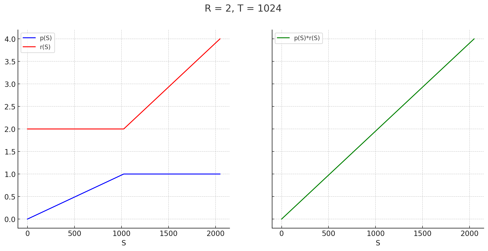

#### Validator capping

We can easily compute the expected size of an active validator set $V_a$ that is sampled this way from a full validator set $V$ whose total deposit size is $D$:
$\mathbb{E}[|V_a|] = \sum_{i \in V} p(S_i) = \sum_{i \in V} \min(\frac{S_i}{T}, 1) = \frac{1}{T}\sum_{i \in V} \min(S_i, T) \le \frac{1}{T}\sum_{i \in V} S_i = \frac{D}{T}$

Basically, any validator with stake $S \le T$ contributes exactly $\frac{S}{T}$ to the expectation. Crucially, these contribution scale linearly in $S$: the only effect of splitting up to $T$ stake into small validators is to increase the variance of the active validator set size, without affecting the expectation. As for validators with stake $S > T$, they even decrease the expectation compared to the worst case, which is $\frac{D}{T}$, equal to the full validator set size if all validators had $T$ stake. 

For example, we can set $T = 4096$ ETH, giving us a *maximum* expected active validator set size of $\frac{120M}{4096} \approx 30k$. If we were to employ stake capping (we will later discuss how to do so in this context) to ensure (or have high assurances) that $D$ is bounded by (for example) $2^{25}M$ ETH, we could even set $T = 1024$ and still have an expected active validator set size of at most ~32k. There can of course be deviations from this expected size, but with high probability the actual active validator set size would always fall within reasonably narrow bounds, so we can have very strong guarantees about the maximum load that we would need to be able to handle. We look at this in more detail [in the appendix](#Validator-capping-active-validator-set-variance).

### Incentivizing consolidation

Let $D_a$ be the active deposit size, i.e., the total stake of the active validator set, contrasted with the total deposit size $D$, the stake of the whole validator set. Optimistically, as long as there is sufficient consolidation, $D_a$ will be high, a clear improvement over the [previous slow rotation approach](#Slow-rotation). Still, we would like this to be more than an optimistic property. The question we are left to answer is then how we can ensure, or at least highly incentivize, a high $\frac{D_a}{D}$ ratio. For example, we want to prevent that all validators keep 32 ETH balances (no one consolidates), which would result in $\mathbb{E}[D_a] = \frac{32}{T} D$, e.g., only $\frac{D}{32}$ with $T = 1024$. With today's $D = 32M$ ETH, the expected active deposit size would only be $1M$ ETH. On the other hand, we do not want to reward consolidated validators disproportionately compared to small validators. 

We explore two complementary approaches:
- **Collective consolidation incentives**, growing the size of the pie for the whole validator set when the set is more consolidated.
- **Individual consolidation incentives**, accounting for the extra risk accruing from further individual consolidation.

#### Collective consolidation incentives

The first approach we explore is to reward *everyone* for consolidation, spreading out the benefits beyond the consolidating validators so as to maintain rewards undifferentiated, while still providing an incentive to consolidate.

A first proposal in this direction is to set the rewards based on $D_a$, rather than $D$. For example, we could use the same issuance curve $I$ we use today, but where the deposit size used as input is $D_a$ instead of $D$: the cumulative issuance would then be $I(D_a)$, and the resulting yield per unit of stake $\frac{I(D_a)}{D}$. Notably, $I$ is monotonically increasing, so, whenever $D_a < D$, the cumulative issuance $I(D_a)$ is less than the maximum issuance $I(D)$ that would be possible at this deposit size, with full consolidation. The yield gap $\frac{I(D) - I(D_a)}{D}$ between the current yield and the yield with full consolidation then acts as a consolidation incentive.

Consolidation incentives aside, another way to think about this proposal is that we simply pay for the economic security we get, at least from a single committee: if today our security budget for $X$ amount of deposits is $Y$, as expressed by $I(X) = Y$, we would now be wiling to pay $Y$ in order to get $X$ amount of *active* deposits. To get an idea of what this looks like in practice, here's a color plot of the yield for $(D, \frac{D_a}{D})$ (starting from $D = 1$ to help the visualization).

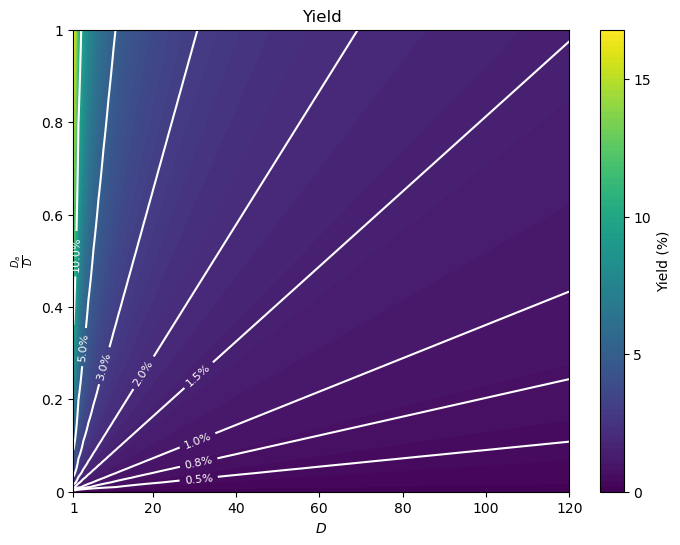

#### Individual consolidation incentives 

*Credit to Anders for raising the issue of differentiated risk and for proposing the kind of individual incentives we explore here*

Though our exploration of collective incentives has found them to be decently strong, there is one factor we have not considered: validators with stake $\ll T$ have a better risk profile than validators with stake $\ge T$. This is because they are in the active only a fraction of the time, which means two things:
- In a staking pool, accidental slashing caused by a bad setup can be caught early with only a fraction of the validators being subject to it
- Tail risk of mass slashing or leaking, for example due to client bugs, is much lower, as in many cases this would only affect the active set. For a staking pool, this effectively caps the pool's slashing exposure to a fraction of the stake, in almost all scenarios.

We might then be unwilling to solely rely on collective incentives, which cannot properly account for the risk differentiation between consolidated and non consolidated validators, itself an individual anti-consolidation incentive. On the other hand, we are hesitant to use individual consolidation incentives, because differentiated rewards threaten our goal of solo staking viability. Faced with this dilemma, a potential approach to mitigate the consequences on solo staking viability is to try to set individual consolidation incentives that just offset the added risk from consolidation. The goal is for risk-adjusted rewards to be roughly equivalent for consolidated and non consolidated validators, so that the available choices of higher risk, higher reward and lower risk, lower rewards are similarly attractive. In particular, it is then at least in principle possible (though not guaranteed) to have a validator set where both setups coexist, so that we can aspire to both have a high consolidation ratio and solo staking viability.

Concretely, here's a way we could go about this. Given the base yield $y(D_a, D) = \frac{I(D_a, D)}{D}$, we can adjust the yield of a validator with $S$ stake to be $y(D_a, D)(1 + \frac{\min(S,T)}{T}g(\frac{D_a}{D}))$, where $g(x)$ is decreasing and $g(1) = 0$. In other words, a validator with $S$ stake gets additional *consolidation yield* $y_c(D_a, D, S) = \frac{\min(S,T)}{T}g(\frac{D_a}{D})y(D_a, D)$, or equivalently its yield increases by a factor of $\frac{\min(S,T)}{T}g(\frac{D_a}{D})$, up to $g(\frac{D_a}{D})$ for fully consolidated validators with $S = T$. This factor decreases as $\frac{D_a}{D}$ grows, because there are diminishing returns to further consolidation (same reason why the staking yield falls as the total deposit size grows). In particular, it falls all the way to $0$ if $\frac{D_a}{D}$ goes to $1$, restoring the base yield $y(D_a, D)$ for everyone, and generally making the rewards less and less differentiated as more consolidation occurs. The idea is that an equilibrium will be reached where $g(\frac{D_a}{D})$ just about compensates for the additional risk from consolidating, and further consolidation is not incentivized. We can even set $g$ to reach $0$ at some lower level of consolidation that we are happy with, leaving more space for staking with non consolidated validators to be economically viable. For example, if $g(0.8) = 0$, then a validator with 32 ETH gets the same yield, and less risk, as a validator with 1024 ETH, even if 20% of the stake is made up of 32 ETH validators.

Let's now look at a specific form of $g$. The simplest possible choice is a linear function, which is fully determined by $g(0)$, the initial yield increase factor when there is no consolidation at all. The function is then simply $g(x) = g(0)(1 - x)$. For example $g(x) = \frac{1-x}{4}$, where the maximum yield increase is 25%. The extra yield of a validator with stake $S$ is: 
$y_c(D_a, D, S) = g(0)\frac{\min(S,T)}{T} \cdot y(D_a, D) \cdot (1 - \frac{D_a}{D})$

Let's see what this looks like in combination with the collective incentives introduced [in the previous section](#Collective-consolidation-incentives), where issuance is based on $D_a$, i.e., $y(D_a, D) = \frac{I(D_a)}{D}$, and $I$ is the current issuance curve $I(x) = c\sqrt{x}$. The maximum consolidation yield, or the yield advantage of a consolidated validator over a regular one, is:

$y_c(D_a, D, S=T) = g(0) \cdot y(D_a, D) (1 - \frac{D_a}{D})  = \\
= g(0) \cdot c \cdot \frac{\sqrt{D_a}}{D}(1 - \frac{D_a}{D}) = \\ g(0) \cdot c \cdot \frac{1}{\sqrt{D_a}} \frac{D_a}{D}(1 - \frac{D_a}{D})$

The next color plot shows $y_c(D_a, D, S=T)$ as a function of $\frac{D_a}{D}$ and $D_a$, for $g(0) = \frac{1}{4}$ (some portion on the upper left corner is infeasible, because $D$ would be $> 120M$). Horizontally, the function looks like $x(1-x)$: the consolidation yield is low at low consolidation levels, when collective incentives are strong, and at high consolidation levels, when we don't have a strong requirement for more consolidation and we are more worried about the economic viability of running non consolidated validators. Vertically it looks like $\frac{1}{\sqrt{y}}$, with the consolidation yield slowly falling off as $D_a$ grows and we have less need for consolidation in general, since the economic security of the active set is determined by $D_a$. 

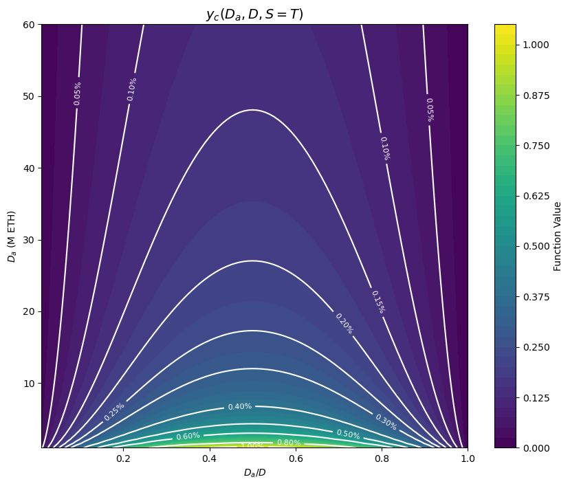

We can of course very easily modify any such function $g$ so that the incentives fall to $0$ after a certain consolidation level $r_0 \in [0,1]$, by replacing $g$ with $\tilde{g}(x) = \max(g(\frac{x}{r_0}), 0)$, which squeezes $g$ in the range $[0,r_0]$ and sets the consolidation yield to $0$ afterwards. For example, this is the consolidation yield with $r_0 = 80\%$, starting from the previous $g(x) = \frac{1-x}{4}$.

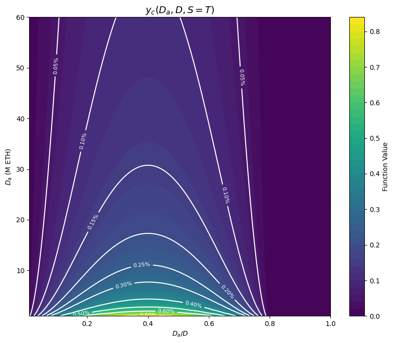

<!-- #### Non-uniform sampling and the viability of global incentives

*Note: We can edit this in as we see fit. Start from your way of framing it and add whatever parts that are relevant.* 

From the perspective of designing a solid consensus mechanism with high proportion of the total stake active for each participation round, slow rotation is beneficial. However, slow rotation leads to uneven activity ratios among stakers. If the expected risks or rewards varies with activity ratio, then it will be beneficial to see the stake either active or inactive. One potential issue is here that slashing risks are higher when being active. It is reasonable to assume that some staking pools may wish to retain 32-ETH validators that are mostly inactive, in order to reduce slashing risks. If only for example 1/5 of the stake in a pool is active at any given moment, then only 1/5 of the stake can be slashed. This provides an implied slashing capping that delegating stakers might find very useful. In line with [recent work](Barnabespenaltiescapping), a two-tier staking mechanism may then evolve among staking pools, wherein some delegated stake is excluded from slashing. These users are presumably willing to supply stake at a lower yield, to the staking pools benefit, because it can attract more capital and spin up even more 32-ETH validators.

The solo stakers running a single validator may not perceive as a big benefit from the reduced risk of slashing. First of all, the [same concerns](https://ethresear.ch/t/increase-the-max-effective-balance-a-modest-proposal/15801/33?u=aelowsson) as when raising the max effective balance are valid (albeit slightly less so), wherein a faulty setup might only get caught once the event takes place. More importantly, while the expected slashed ETH might be reduced equally, catastrophic events where the [entire stake is slahsed](https://dankradfeist.de/ethereum/2022/03/24/run-the-majority-client-at-your-own-peril.html) are not eliminated. Therefore, they might not perceive the benefit as being as strong as the delegating staker. If this discrepancy cannot be mitigated, the protocol could arguably institute a validator fee, seeing that the expected return (accounting for slashing risks) from running a smaller validator would be higher (if staking rewards have been normalized to stay the same across activation ratio). Other mitigations are to reduce the maximum slashing applied to larger validators. To not make the required slashing capping too large, the probability to be included in the active set can be log-scaled: -->

<!-- $$
p(S) = \frac{1}{1+\log_2(T/S)}.
$$
 -->
 
<!-- ##### Consolidation incentives with alternative issuance curves

We repeat the same plots using Anders' curve. The consolidation incentives are then naturally weaker both in relative and absolute terms, since the curve is always both lower and less steep than the current issuance curve. Note that in the percentage yield increase from consolidation is now also dependent on $D$, so we also only plot it for $D = 30M$. 

 -->

## Appendix

### Validator capping: active validator set variance

Let's also get an upper bound on the variance of the active validator set size. $\mathbb{V}[|V_a|] = \mathbb{V}[\sum_{i\in V} \chi_{\{i \in V_a\}}] = \sum_{i\in V} \mathbb{V}[\chi_{\{i \in V_a\}}]$, since each validator is sampled independently. Moreover, $\mathbb{V}[\chi_{\{i \in V_a\}}] = 0$ whenever $S_i \ge T$, since validator $i$ is then always in $V_a$. 
For $S_i < T$, the variance is $\mathbb{V}[\chi_{\{i \in V_a\}}] = p(S_i)(1 - p(S_i)) = \frac{S_i}{T}(1 - \frac{S_i}{T})$, which is maximized when $p(S_i) = \frac{1}{2}$, or equivalently when $S_i = \frac{T}{2}$, in which case $\mathbb{V}[\chi_{\{i \in V_a\}}] = \frac{1}{4}$. Therefore, $\mathbb{V}[|V_a|] \le \frac{1}{4}|V|$. 

Concretely, say we keep a minimum balance of 32 ETH, so that the maximum validator set size $|V|$ is ~4M. The standard deviation of $|V_a|$ is then bounded by $\frac{\sqrt{|V|}}{2} \approx 1000$. The probability of deviations beyond 10k is then vanishingly low. We can then even explicitly cap the active validator set size, say at 40k validators. Doing so introduces only a tiny correlation to the sampling of different validators, because sampling is completely unaffected other than in the exceedingly rare events of massive deviations.

### Collective incentives

#### Quantifying the individual effect of collective consolidation incentives

Let's look into the consolidation incentives a bit more quantitatively. While it is true that there is always some consolidation incentive whenever consolidation is at all possible, we should also consider how strong these incentives are for various stakers. In particular, the strength of the incentives varies based on how large a staker is, because a consolidation increases yield *for everyone*, not just for the party which peforms it. In other words, the gains of a consolidation are socialized, to avoid having a sort of consolidation reward, which would effectively disadvantage smaller validators that cannot access it. Consolidation incentives are therefore stronger the larger a validator is. On the one hand, this means that sufficiently large validators have a strong incentive to consolidate, which means we should expect $D_a$ to always represent at least a meaningful portion of the total stake $D$. On the other hand, it means that small but still meaningfully sized stakers (e.g. 1%) might not be particularly incentivized to consolidate.

To quantify this, let's look at how much of an issuance increase there is in the event of the full consolidation of a staker having a fraction $p$ of the total stake $D$, when $\frac{D_a}{D} = r$. Here we assume that the stake $pD$ in question is initially not consolidated at all, and neglect the small effect it has on $D_a$ (e.g. if $T = 1024$, a minimum balance validator only increases $D_a$ by 1/32 of its stake). Issuance, and thus yield, increases by a factor of $\frac{I(D_a + pD) - I(D_a)}{I(D_a)} = \frac{I((r + p)D)}{I(rD)} - 1$. Plugging in the definition of $I$, we can simplify this to $\sqrt{1 + \frac{p}{r}} - 1$. As expected, the consolidation incentives grow with $p$. It is also expected that they fall with $r$, since the issuance curve $I$ is concave. As it turns out, there's no dependency on $D$ for this particular form of $I$.

We now plot $100(\sqrt{1 + \frac{p}{r}} - 1)$, the *percentage* of yield increase that every validator experiences when a fraction $p$ of the stake is fully consolidated, starting from $D_a = rD$. We restrict $r$ to the range $[0.1, 1]$ for ease of visualization, because the consolidation incentives blow up for $r$ near $0$, as we would wish. Notice that the minimum $r$ is actually $1/32$ for $T = 1024$ and minimum balance 32 ETH.

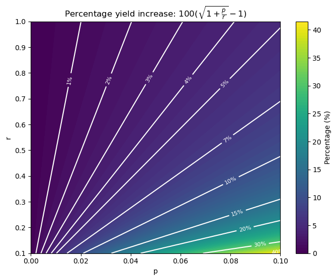

On the other hand, the *absolute* yield increase $100\cdot\frac{I(D_a + pD) - I(D_a)}{D_a}$ is not independent of $D$. We plot it here specifically for $D = 30M$ ETH. For lower values of $D$, the consolidation incentives only get stronger in absolute terms. 

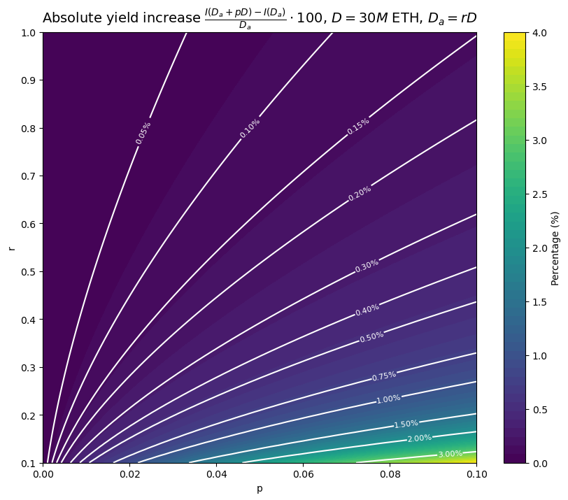

Finally, we also plot the yearly ETH returns from consolidation, $(I(D_a + pD) - I(D_a))\cdot \frac{p}{r}$, again for $D = 30M$ ETH.

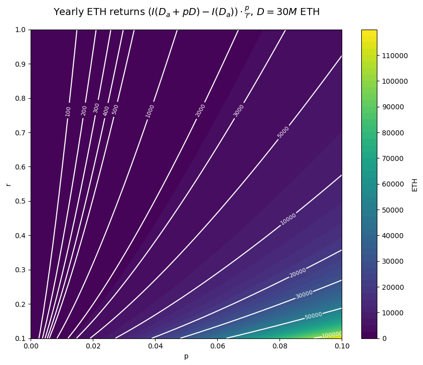

#### Generalizing collective incentives

When $I$ is our current issuance curve, $I(x) = c\sqrt{x}$, we have that $I(D_a) = c\sqrt{D_a} = c \sqrt{D} \sqrt{\frac{D_a}{D}} = I(D)\sqrt{\frac{D_a}{D}}$. In other words, we can think about the previous proposal as incentivizing a high $\frac{D_a}{D}$ ratio by directly a  applying an issuance penalty based on it. More generally, we can let the issuance be $I(D_a, D) = I(D) \cdot \delta(\frac{D_a}{D})$ for any $\delta$ such that $\delta(0) = 0$ and $\delta(1) = 1$. With this, the yield increase from consolidating is exactly $\frac{I(D)}{D} \cdot (\delta(r + p) - \delta(p))$, i.e., a fraction $\delta(r + p) - \delta(r)$ of the maximum yield available at deposit size $D$. The percentage yield increase is instead $\frac{\delta(r + p) - \delta(r)}{\delta(r)}$. The simplest case is $\delta(r) = r$, where $I(D_a, D) = I(D) \cdot \frac{D_a}{D}$, in which case the yield increase is simply $p \frac{I(D)}{D}$, constant in $r$, and the percentage yield increase is $\frac{p}{r}$. 

In this form, we can more clearly separate the design of incentives to stake from that of incentives to consolidate the stake: $I(D)$ provides the *maximum* possible incentive to stake at a given total deposit level $D$, while $\delta$ regulates the incentive to consolidate at a given ratio $\frac{D_a}{D}$. We can for example have $I$ being concave, as it is currently, but $\delta$ linear as in the previous example: the protocol then considers stake deposits to have diminishing returns, while it believes consolidation to be equally valuable regardless of where $\frac{D_a}{D}$ currently sits. 

#### Discouragement attacks

At any point, it is possible to increase $D$ while barely increasing $D_a$, by activating validators with minimum balance. Thus, the issuance $I(D_a)$ is approximately constant, but distributed to more stake. This is the same [discouragement attack](https://ethresear.ch/t/reward-curve-with-tempered-issuance-eip-research-post/19171#h-53-discouragement-attacks-32) that would be possible with a constant issuance curve, or with issuance capped at some maximum value, where the yield also decreases like $\frac{1}{D}$. While worse than today, where it decreases like $\frac{1}{\sqrt{D}}$, this discouragement attack is nothing like the ultra cheap griefing vector that would arise with if we were to [use issuance to target a validator count](https://notes.ethereum.org/@vbuterin/single_slot_finality#Economic-capping-of-total-validator-count). For example, say we started reducing issuance past our ideal target of ~30k validators, and were to go negative at 40k. Then, activating a few thousands minimum balance validators, in the order of 0.01% to 0.1% of the stake, would be enough to make yields go negative. On the other hand, in the context of the discouragement attack we are considering here, reducing yield by a factor of $k$ requires increasing the deposit size by a factor of $k$. For example, halving issuance when $D = $ 20M requires depositing another 20M.

#### Stake capping

If we were to set the issuance based on $D_a$, we would not be able to immediately adopt any issuance curve that reduces issuance past some deposit size, like the ones discussed [here](https://ethresear.ch/t/reward-curve-with-tempered-issuance-eip-research-post/19171/1) and [here](https://ethresear.ch/t/endgame-staking-economics-a-case-for-targeting/18751). The reason for that is simple: if issuance goes down past a certain value of $D_a$, but it turns out that the yield at that point is still attractive, the incentives are such that $D$ would still grow (more stake wants yield at these levels) while $D_a$ would not (growing $D_a$ lowers yield). In fact, instead of consolidation incentives, we end up having incentives for splitting up stake over multiple validators, so as to decrease $D_a$ and keep it at the point of maximum issuance! Meanwhile, stake capping is not achieved, at least not any more than we would already achieve it by capping issuance at the maximum value, rather than having it decrease afterwards.

If we did want to adopt some form of stake capping, we would then need to do things a bit differently. We could let the issuance be $I(D_a, D) = I(D_a) - f(D)$, where $f$ acts to reduce the issuance past some critical *total* deposit size. Intuitively, the goal is to try to ensure two things at once: that we have enough $D_a$, and that we do not have too much $D$. For example:

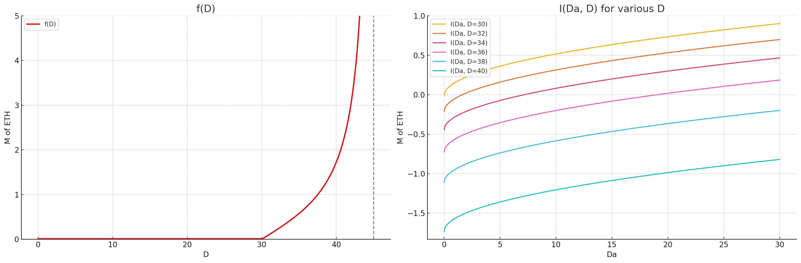

To help visualizing the effect of this further, here are the cumulative issuance and yield while holding $\frac{D_a}{D} = 0.8$. 

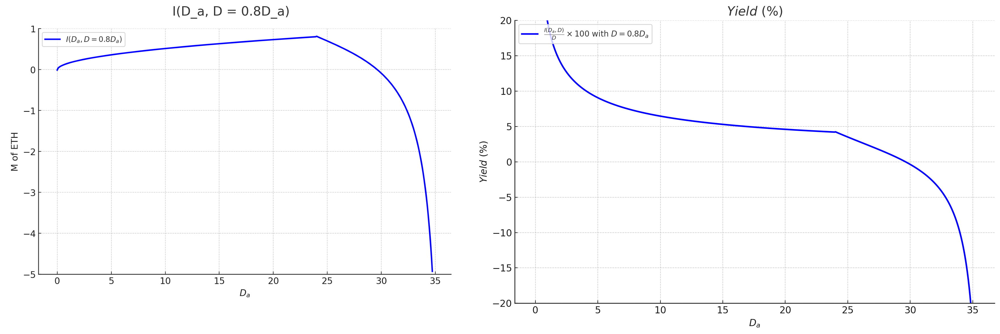

Finally, here is a color plot of the yield in the $(D, \frac{D_a}{D})$ space. $D$ starts at 2 to help the visualization be effective.

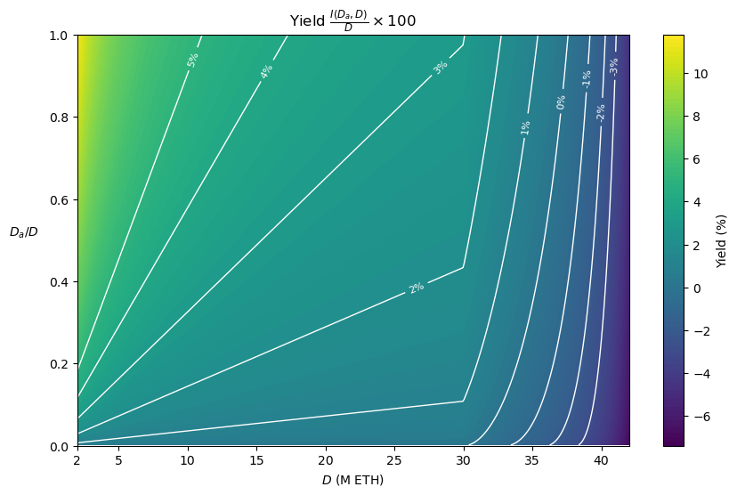

### Individual incentives

#### Total issuance 

The total *extra* issuance is:

$I_c(D_a, D) = \sum_{i \in V} y_c(D_a, D, S_i) S_i = g(0) y(D_a, D)(1 - \frac{D_a}{D}) \sum_{i \in V} p(S_i)S_i = \\ = g(0)y(D_a, D)\cdot D_a(1 - \frac{D_a}{D}) = g(0)I(D_a)\cdot \frac{D_a}{D}(1 - \frac{D_a}{D}) = \\
= g(0) \sqrt{D} \sqrt{\frac{D_a}{D}}\cdot \frac{D_a}{D}(1 - \frac{D_a}{D}) = g(0)I(D) \sqrt{\frac{D_a}{D}}\cdot \frac{D_a}{D}(1 - \frac{D_a}{D})$

The total issuance then is:

$I_T(D_a, D) = I(D_a) + I_c(D_a, D) = I(D_a)(1 + g(0) \frac{D_a}{D}(1 - \frac{D_a}{D})) = \\
= c \sqrt{D} \sqrt{\frac{D_a}{D}}(1 + g(0)\cdot \frac{D_a}{D}(1 - \frac{D_a}{D})) = \\
= I(D) \sqrt{\frac{D_a}{D}} (1 + g(0)\frac{D_a}{D}(1 - \frac{D_a}{D})) = I(D) \cdot h(\frac{D_a}{D})$, where $h(x) = \sqrt{x}(1 + g(0)x(1-x))$. For $g(0) = \frac{1}{4}$, we have that $h(x) \le 1$ for $x \in [0,1]$, so $I(D)$ remains an upper bound on the total issuance.

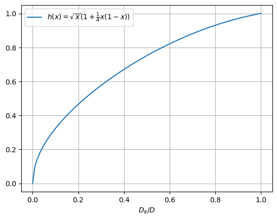

#### Generalizing individual consolidation incentives

More generally, we can choose any consolidation yield curve $y_c(D_a, D, S) = \frac{\min(S,T)}{T} y_c(D_a, D)$, not necessarily depending on $y(D_a, D)$, or even any curve $y_c(D_a, D, S)$ with a different kind of dependency on $S$. An interesting example of the first kind is the curve $y_c(D_a, D, S) = \frac{\min(S,T)}{T} (y(D) - y(D_a, D))$, where $y_c(D_a, D, S)$ essentially interpolates between the yield $y(D) = y(D_a = D, D)$ that would be paid out to a fully consolidated validator set at deposit size $D$, and the base yield $y(D_a, D)$ paid out at the current consolidation level. In other words, a validator with $T$ stake always gets paid the maximum possible yield for deposit size $D$, $y(D)$, regardless of the consolidation level achieved by the whole validator set, while validators with minimum stake get paid closer to the base yield $y(D_a, D)$, and their yield linearly increases to $y(D)$ as they consolidate. In this case, the consolidation incentives are quite a bit stronger at lower consolidation levels. 

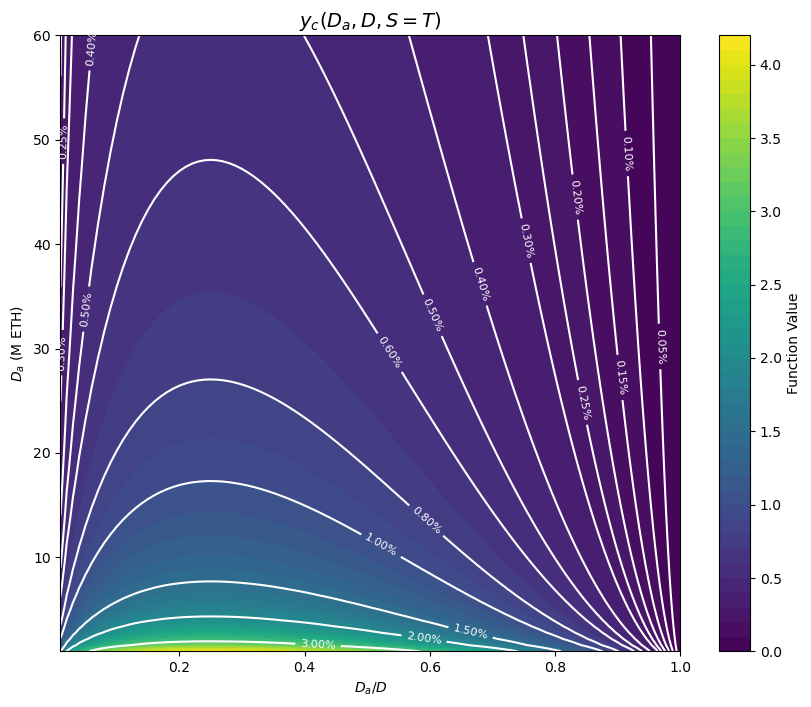

While the absolute yield increase falls with $D_a$, the percentage yield increase from consolidating does not. As it turns out, it only depends on $\frac{D_a}{D}$: 
$\frac{y_c(D_a, D)}{y(D_a, D)} = \frac{y(D) - y(D_a, D)}{y(D_a, D)} =
\frac{y(D)}{y(D_a, D)} - 1 = \sqrt{\frac{D}{D_a}} - 1 $

In other words, this also fits the previous form $y_c(D_a, D, S) = \frac{\min(S,T)}{T} g(\frac{D_a}{D}) y(D_a, D)$, with $g(x) = \sqrt{\frac{1}{x}} - 1$ instead of a linear function.

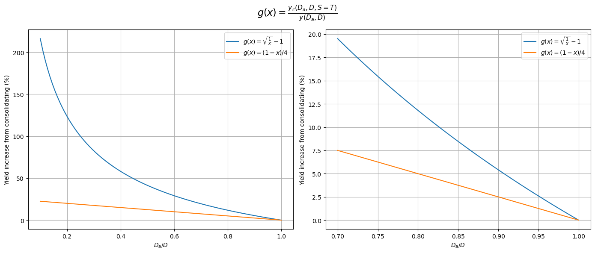

Since $y(D_a, D) + y_c(D_a, D, S) \le y(D)$, it still holds that $I(D)$ is a bound on the total issuance. In fact, the total issuance can be worked out to be $I_T(D_a, D) = I(D_a) + I_c(D_a, D) = I(D) \sqrt{\frac{D_a}{D}}(1 + \sqrt{\frac{D_a}{D}} (1 - \sqrt{\frac{D_a}{D}})) = I(D) h(\frac{D_a}{D})$, with $h(x) = \sqrt{x}(1 + \sqrt{x}(1 - \sqrt{x})))$, which we compare here to the previous example:

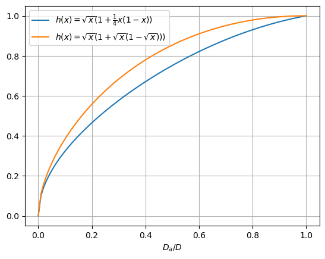