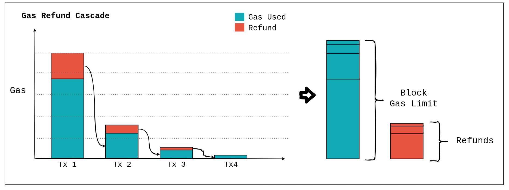
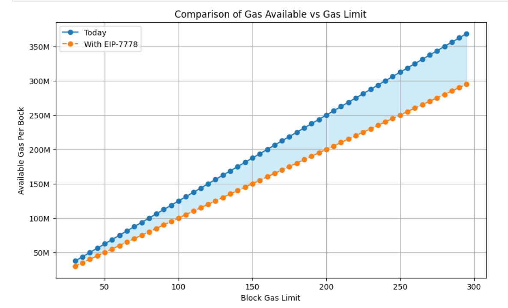

# Overclocking Blocks with Gas Refunds

> **TL;DR**: Storage‐clearing refunds are valuable but can inflate block gas figures - keep them for users, but don’t count them against block gas used. [EIP-7778](https://eips.ethereum.org/EIPS/eip-7778) restores accurate on-chain gas accounting for storage.

Ethereum's gas mechanism aims to reflect computational resource consumption accurately. To encourage users to keep the state clean and manageable, Ethereum grants gas refunds when storage slots are reset to zero. While effective in reducing state bloat, these refunds currently complicate gas accounting, making it appear that blocks consume fewer resources than they actually do.

## How Gas Refunds Work Today

Transactions that clear storage slots via `SSTORE` operations, resetting a slot to zero, qualify for gas refunds (see [EIP-3529](https://eips.ethereum.org/EIPS/eip-3529)). For instance, a transaction consuming 45 million gas with a 20% refund effectively costs the user:

```
tx.gas_used = 45,000,000 - (0.20 × 45,000,000) = 36,000,000 gas
```

Similarly, another transaction consuming 9 million gas with a 20% refund results in:

```
tx.gas_used = 9,000,000 - (0.20 × 9,000,000) = 7,200,000 gas
```

Importantly, the gas refund of *one* transaction can be consumed by *another* transaction.

### What's Problematic About the Current Mechanism?

While gas refunds effectively incentivize storage cleanup, their current implementation reduces the total gas usage counted against the block gas limit. As a result, the block’s gas usage understates the actual computational effort performed. Crucially, long-term incentives against state bloat should not distort short-term feedback controller mechanisms such as EIP-1559’s basefee.





To clearly understand the impact of gas refunds on block gas accounting, let’s formalize this more systematically.

## Formal Model of Gas Smuggling


### Definitions

* **Block Gas Limit**: $G_0$
* **Refund Ratio**: $r = 0.2$ (20%)
* **Minimum Gas Required per Transaction**: $G_{\text{min}} = 21,000$

### Gas Refund at Step $i$

The gas refund at each iterative step $i$ (starting from $i=1$) is given by:

$$
R_i = G_0 \times r^i
$$

For example:

* Step 1: $R_1 = G_0 \times r$
* Step 2: $R_2 = G_0 \times r^2$, etc.

### Stopping Condition

We continue generating transactions that trigger more refunds until the refund at step $n$ falls below the minimum required gas:

$$
R_n < G_{\text{min}}
$$

Isolating $n$:

$$
G_0 \times r^n < G_{\text{min}}
$$

Solving for $n$:

$$
n > \frac{\log\left(\frac{G_{\text{min}}}{G_0}\right)}{\log(r)}
$$

Thus, the stopping step number is:

$$
n = \left\lfloor \frac{\log\left(\frac{G_{\text{min}}}{G_0}\right)}{\log(r)} \right\rfloor + 1
$$

*($\lfloor x \rfloor$ denotes the floor function, giving the largest integer ≤ x.)*

### Total Computational Gas

Summing all computational gas used up to step $n-1$:

$$
G_{\text{total}} = G_0 + G_0 r + G_0 r^2 + \dots + G_0 r^{n-1}
$$

Factoring out $G_0$:

$$
G_{\text{total}} = G_0 (1 + r + r^2 + \dots + r^{n-1})
$$

Using the geometric series formula:

$$
1 + r + r^2 + \dots + r^{n-1} = \frac{1 - r^{n}}{1 - r}
$$

We get:

$$
G_{\text{total}} = G_0 \times \frac{1 - r^{n}}{1 - r}
$$

Substituting our values:

* $G_0 = 45,000,000$
* $r = 0.2$
* $G_{\text{min}} = 21,000$

Compute $n$:

$$
n = \left\lfloor \frac{\log\left(\frac{21,000}{45,000,000}\right)}{\log(0.2)} \right\rfloor + 1 = \lfloor 4.766 \rfloor + 1 = 5
$$

Compute Total Gas:

$$
G_{\text{total}} = 45,000,000 \times \frac{1 - (0.2)^5}{1 - 0.2} = 56,232,000
$$

This demonstrates a ~25% increase from the initial gas limit, highlighting how significantly current refunds distort block gas accounting.

### Example Contract

This is how such contracts might look like:

``` javascript
// SPDX-License-Identifier: MIT
pragma solidity ^0.8.0;

contract Refundooor {
    mapping(uint256 => uint256) private storageSlots;

    /// @notice Pre‑fill `maxSlots` keys starting at `startKey`
    function chargeStorage(uint256 startKey, uint256 maxSlots) external {
        for (uint256 i = 0; i < maxSlots; i++) {
            storageSlots[startKey + i] = startKey + i + 1;
        }
    }

    /// @notice Clears exactly MAX_LOOPS slots unconditionally (no checks)
    fallback() external {
        assembly {
            let base := storageSlots.slot
            mstore(0x20, base)

            // MAX_LOOPS * ~5,109 gas/iter ≈ 45 000 000 gas
            let MAX_LOOPS := 8805

            for { let i := 0 } lt(i, MAX_LOOPS) { i := add(i, 1) } {
                // compute storage slot for key = i
                mstore(0x0, i)
                let s := keccak256(0x0, 0x40)
                // unconditionally write zero
                sstore(s, 0)
            }
        }
    }
}
```

* We first _charge_ the contract by writing to empty storage slots.
* Second, we call the contract's fallback, setting 8805 storage slots to zero.

> Check out this [sample transaction](https://dashboard.tenderly.co/tx/0x30dc53bf88dbeda043c77c6951103a112348dae17eb244648c4ae87c83e9367a) on Holesky which maxes out the number of `SSTORE` operations.


Eventually, the "smuggled" gas scales linearly with the block gas limit. At 100M gas, a block can come with 125M gas of actual work.




---

## Proposed Change: Separate Transaction Refunds from Block Gas Accounting

[EIP-7778](https://eips.ethereum.org/EIPS/eip-7778) proposes retaining user-level refunds to incentivize efficient storage management but removing these refunds from block-level gas accounting. This ensures block gas usage accurately reflects actual resource consumption.


The benefits of implementing the EIP are:

* **Improved Predictability**: Actual work for blocks stays below the intended limit.
* **Increased Network Stability**: Reduced DoS risks from storage-related worst-case scenarios.
* **Preserved User Incentives**: Users maintain their motivation for state cleanup.

[EIP-7778](https://eips.ethereum.org/EIPS/eip-7778) cleanly separates user incentives from block-wide resource constraints, aligning block gas usage more closely with the actual work performed.