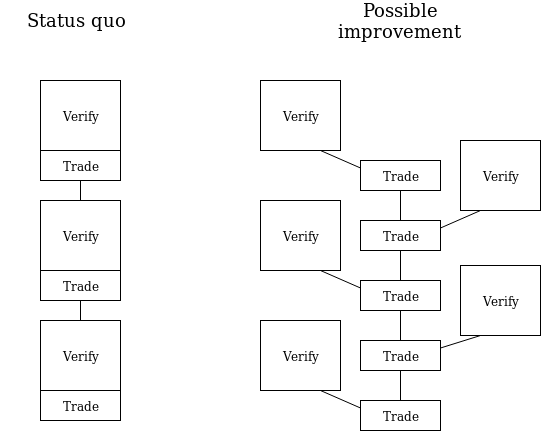
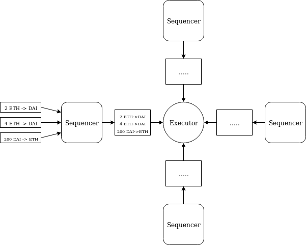

There is a design pattern that we can use to partially shard single-threaded applications, eg. Uniswap, to allow them to gain somewhat higher throughput in an eth2 system. I do not expect this design pattern to be useful in the short term, because we are actually very far away from single-threaded instances of applications (note that a "single threaded instance of an application" would be eg. the specific ETH <-> DAI market on Uniswap, not the Uniswap system as a whole) needing anything close to multi-shard levels of scalability. However, something like this will eventually be necessary for large apps.

The core insight is that while Uniswap-like applications are single-threaded, in that the (N+1)th transaction to the Uniswap contract depends directly on the output of the Nth transaction, so there is no room for total parallelism, the parts of those transactions that are _not_ core Uniswap logic (generally, signature verification) _can_ be parallelized.

 

But how do we do this? The pattern is as follows. We create one contract, an **executor**, on one shard; this is the "core" of the system. We also create N other contracts on other shards, called **sequencers**. When a user wants to make a trade, they would move to a shard that contains a sequencer. They then interact with the sequencer. The sequencer saves a record saying "here is the message and associated token transfer the sender wants to make to the executor". The sequencer aggregates all records made during one block, and at the end it publishes a combined receipt, making a _total_ token transfer, together with the individual token transfer amounts and messages.

 

The receipts get included in the executor shard, and the executor processes them. It then publishes a combined receipt back to the sequencer.

#### Executor-side gas savings

For each operation, the executor shard's marginal costs are very low. The executor need only process a small amount of data (the function arguments), run its internal logic and output the answers. Even the cost of receipts on the executor-side is minimized, because receipts are batched sequencer-side, providing a $log(n)$ factor data savings.

In the case of Uniswap, this could mean < 2000 gas per transaction on the executor shard, out of ~50000 gas total (the other 48000 would be parallelizable).

#### Enhancements

The most obvious problem with this proposal as written above is that it requires receipts from sequencers to be explicitly included, and block proposers on the executor shard could manipulate this for profit. We can resolve this problem by imposing a hard schedule on the order of inclusion of receipts: first we include a receipt from slot N of shard S1, then from slot N of shard S2, then from slot N of shard Sk (where S1...Sk are the shards holding the sequencers), then from slot N+1 of shard S1, and so forth.

Note that receipts do not need to be issued "explicitly". That is, sequencer code does not need to be aware that a given transaction is that last one in the block and so one should gather up the messages and issue a combined receipt. Rather, the receipt could be "implicit": whatever the state entry is at the end of a block _is_ the receipt.

The main challenge with this approach is that it does not handle transferring tokens. However, we can handle this in another way: we have an asynchronous mechanism where the executor tells the sequencers how many tokens to transfer between each other, and the near-synchronous execution of the executor would publish _promises_ for tokens, which in the worst case could become claimable a few blocks later when the tokens arrive (in the best case, liquidity providers would make the experience instant almost-all-the-time in practice).