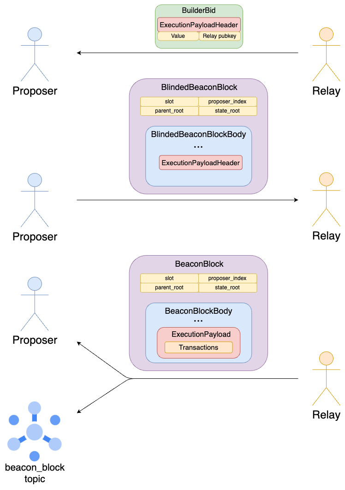
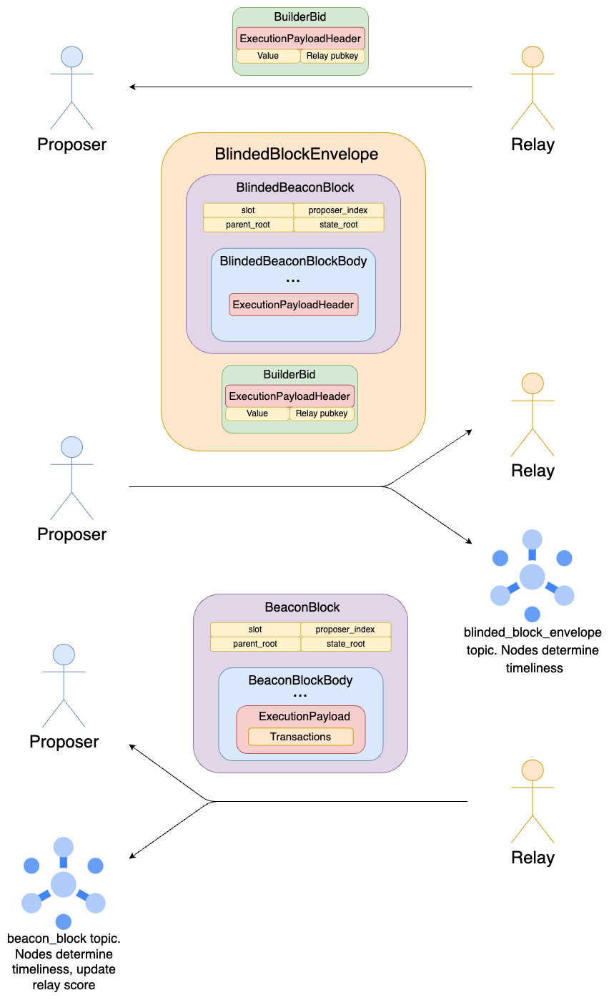
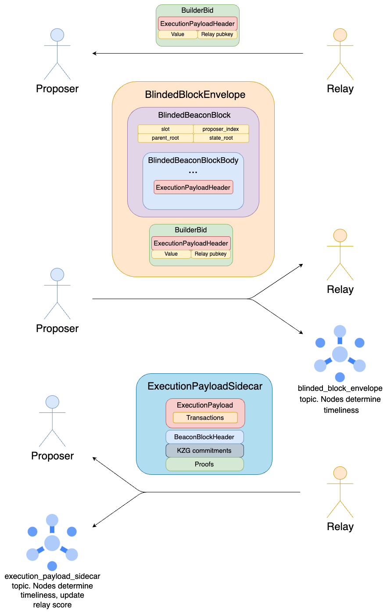
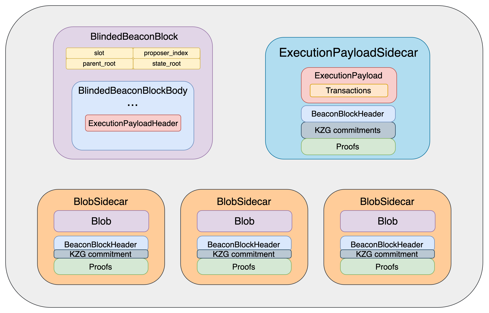
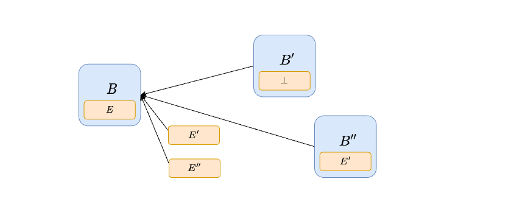
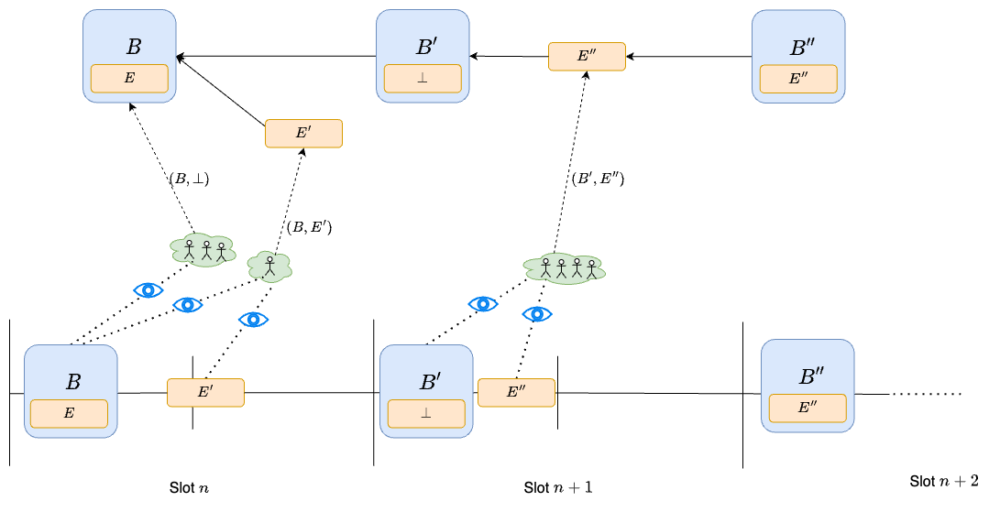
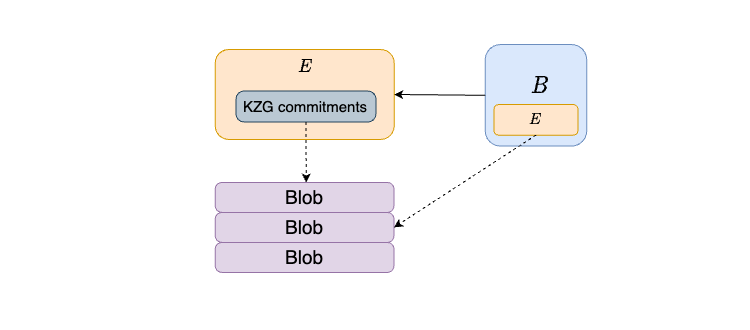

*Thanks to Alex Stokes, Anders Elowsson and Potuz for feedback*

The goal of this post is to explore some ways we can improve the guarantees of PBS as it currently exist in Ethereum, as an alternative to full enshrinement, which risks prematurely committing to a solution that is far from being universally recognized as the right one. 

We first discuss a relatively small change to the status quo, which introduces a gossip topic to observe part of the mev-boost auction, allowing validators to reliably keep track of relay performance and disconnect from specific relays if necessary.
We then discuss some potential deeper changes to the protocol, which still fall short of full epbs enshrinement, with the goal of allowing beacon blocks to exist even without execution payloads, so that a mev-boost failure affects the progress of the EL but not the CL.


## Observing the exchange: hardening mev-boost through gossip

### Basics of the mev-boost exchange


The [builder specs](https://github.com/ethereum/builder-specs/blob/18c435e360192aa39c378584fe14a3158f30dfbf/specs/bellatrix/builder.md) define a bid object to be sent from a relay to a connected validator. It contains a bid value, the pubkey of the relay and the `ExecutionPayloadHeader` corresponding to the `ExecutionPayload` that the builder intends to sell to the validator.

```python
class BuilderBid(Container):
    header: ExecutionPayloadHeader
    value: uint256
    pubkey: BLSPubkey
    
class SignedBuilderBid(Container):
    message: BuilderBid
    signature: BLSSignature
```

The specs also define a blinded version of the `BeaconBlock`, in which the `ExecutionPayload` is substituted with an `ExecutionPayloadHeader`. Most notably, the `transactions` field in the former is replaced by `transactions_root` in the latter, so that transactions are not revealed to the proposer before it commits to a specific payload. After choosing a winning `SignedBuilderBid`, the proposer initiates the exchange by responding with a `SignedBlindedBeaconBlock`.

```python
class BlindedBeaconBlockBody(Container):
    randao_reveal: BLSSignature
    eth1_data: Eth1Data
    graffiti: Bytes32
    proposer_slashings: List[ProposerSlashing, MAX_PROPOSER_SLASHINGS]
    attester_slashings: List[AttesterSlashing, MAX_ATTESTER_SLASHINGS]
    attestations: List[Attestation, MAX_ATTESTATIONS]
    deposits: List[Deposit, MAX_DEPOSITS]
    voluntary_exits: List[SignedVoluntaryExit, MAX_VOLUNTARY_EXITS]
    sync_aggregate: SyncAggregate
    # Replacing full Execution_Payload
    execution_payload_header: ExecutionPayloadHeader 
    
class BlindedBeaconBlock(Container):
    slot: Slot
    proposer_index: ValidatorIndex
    parent_root: Root
    state_root: Root
    # Replacing BeaconBlockBody
    body: BlindedBeaconBlockBody
    
class SignedBlindedBeaconBlock(Container):
    message: BlindedBeaconBlock
    signature: BLSSignature
```

The relay reconstructs the full `SignedBeaconBlock` by substituting the `ExecutionPayloadHeader` with the `ExecutionPayload` in the `SignedBlindedBeaconBlock`, and validates it. If successful, it releases it, completing the exchange.


*The `Signed` containers are omitted in the diagram for ease of exposition, and so are the blob sidecars.*




### Observing the exchange 

Currently, nodes can observe the second part of the exchange, i.e., the publication of the `SignedBeaconBlock`, but not the first part. If they could observe the first part, i.e., the proposer sending the`SignedBlindedBeaconBlock` to the relay, they would have observability into the full exchange between proposer and relay. If a node observes a *unique, valid* `SignedBlindedBeaconBlock` sufficiently in advance of the attestation deadline, it knows that the relay/builder has enough time to receive it, validate it and propagate the full `SignedBeaconBlock`. In other words, the proposer has fulfilled its half of the exchange. Were the slot to be missed, the node can then reasonably attribute the failure to the relay. If instead it does not observe a timely, valid `SignedBlindedBeaconBlock`, or observes multiple, it can attribute any eventual failure to the proposer: it is ok for the relay to withhold the `ExecutionPayload` when it cannot be reasonably sure of the outcome of publishing it, i.e., whether or not the corresponding `BeaconBlock` will become part of the canonical chain.

#### Independent validation of a blinded beacon block

Firstly, we need to clarify what it means for a `SignedBlindedBeaconBlock` to be valid independently of the full `ExecutionPayload` whose header it contains. Currently, the beacon chain state transition involves the execution payload in a few ways:
1. `process_execution_payload` checks that `payload.parent_hash`, `payload.prev_randao`, `payload.timestamp` are correct, and updates `state.latest_execution_payload_header` to the new `ExecutionPayloadHeader`. 
2. `process_withdrawals` checks that `payload.withdrawals == get_expected_withdrawals(state)`, to ensure that the same withdrawals are processed by EL and CL.
3. the EL is called to verify the `ExecutionPayload`

Everything in 1. involves only the `ExecutionPayloadHeader`, because `parent_hash`, `prev_randao` and `timestamp` are fully contained in it as well. While 2. involves the full payload as written in the spec, we can instead use`execution_payload_header.withdrawals_root`, i.e.,`hash_tree_root(payload.withdrawals)`, and check `withdrawals_root = hash_tree_root(get_expected_withdrawals(state))`. Finally, we are not concerned with 3: if we observe a`SignedBlindedBeaconBlock` which satisfies checks 1. and 2. sufficiently in advance of the attestation deadline, we know that whether the builder is able to release a valid `SignedBeaconBlock` entirely depends on whether they have made a valid `ExecutionPayload`.


*Future compatibility*: EIP-7002 and EIP-6110 introduce more message passing from the EL to the CL, i.e., EL-triggered exits and deposits. An `ExecutionPayload` would contain fields `execution_layer_exits` and `deposit_receipts`, which contain operations to be processed by the CL state transition. Clearly, such processing cannot happen in a `BlindedBeaconBlock` as currently constructed, because those fields would be replaced by `execution_layer_exits_roots` and `deposit_receipts_root`. As might happen in the builder specs, the `ExecutionPayloadHeader` in the `BlindedBeaconBlock` could be replaced by a `BlindedExecutionPayload`, where only the `transactions` field is replaced by `transactions_root`, while `withdrawals`, `execution_layer_exits`,`deposit_receipts` (and any other necessary fields that might be added in the future) are kept fully. Note that a `BlindedBeaconBlock` constructed this way still has the same `hash_tree_root` as the full `BeaconBlock`.


#### Gossiping signed blinded beacon blocks

To gain observability into the first part of the exchange, we can create a GossipSub topic, `blinded_block_envelope`, joined by nodes which run mev-boost. Only the current proposer would be able to publish to the topic, and it would publish this signed envelope:

```python
class BlindedBlockEnvelope(Container):
    signed_builder_bid: SignedBuilderBid
    signed_blinded_beacon_block: SignedBlindedBeaconBlock
    
class SignedBlindedBlockEnvelope(Container):
    message: BlindedBlockEnvelope
    signature: BLSSignature
```

Here we include the `SignedBuilderBid` in the envelope, instead of just gossiping a `SignedBlindedBeaconBlock`, to ensure that failures are attributable to the relay which has signed this bid.

#### Relay scoring

Every validator in the topic would then observe the arrival time of this object, as well the outcome of the slot, and use these data points to inform whether or not it should stay connected to the relay with pubkey `signed_builder_bid.message.pubkey`. For example, a client might choose to enact a simple strategy like this one: 
- if a valid `signed_blinded_block_envelope` is received before 2.5s but the slot is missed, downscore the relay by $D$, up until 0, *unless an equivocation from the proposer is detected*. 
- if a relay successfully lands a block on chain, increase the relay score by $D/100$, up until the maximum score $S_{max}$.
- if the relay score is < $S_{min}$, disconnect from the relay.

If a relay is failing to land more than 1% of blocks when the `SignedBlindedBeaconBlock` has been timely propagated, validators will quickly disconnect it, and they will only reconnect either manually or if the relay lands a lot of blocks without accidents. If most validators have initially disconnected from it, landing enough blocks for automatic reconnection would likely need many validators to first manually reconnect. This might for example be the case if a relay experiences a bug or some other non-malicious failure which is sufficiently investigated that validators feel comfortable reconnecting to it. In this case, even the validators that are not plugged in to the off-chain process can eventually reconnect. 

*Again, the `Signed` containers are omitted in the diagram for ease of exposition, and so are the blob sidecars. Note also that we do not need to include the `ExecutionPayloadHeader` twice.*




### Avoiding redundant propagation

In the above, the`SignedBlindedBeaconBlock` and `SignedBeaconBlock` are gossiped separately, though they mostly overlap. This might be ok in practice, since the `SignedBlindedBeaconBlock` has a fairly small maximum size (about 160 KBs according to [this](https://gist.github.com/protolambda/db75c7faa1e94f2464787a480e5d613e), and should not have changed too much since). Still, we could in principle split up the propagation of the `SignedBlindedBeaconBlock` and of the `ExecutionPayload` into two topics to avoid any redundancy:
- We would change the message type of the `beacon_block` topic from`SignedBeaconBlock` to `SignedBlindedBeaconBlockEnvelope`. A proposer who builds locally would set `signed_builder_bid = None` in the `BlindedBeaconBlockEnvelope`, effectively just gossiping a `SignedBlindedBeaconBlock`.
- We add another topic, `execution_payload_sidecar`, whose message type is `ExecutionPayloadSidecar`, which, much like a `BlobSidecar`, comes with a `SignedBeaconBlockHeader` and a merkle inclusion proof against it. Moreover, like a [`DataColumnSidecar`](https://github.com/ethereum/consensus-specs/blob/170dae560962cde49b715aabda9a417599f440e8/specs/_features/eip7594/das-core.md#datacolumnsidecar), it comes with a list of `kzg_commitments`, `kzg_proofs` and a `kzg_commitment_inclusion_proof`. This allows the `versioned_hashes` to be computed, so that a `newPayloadRequest` may be sent to the EL for verification without waiting for the full beacon block. Gossip validation requires verifying all proofs and performing all checks prescribed by the [bellatrix spec](https://github.com/ethereum/consensus-specs/blob/fe8db03f45609e9dd0abeede10294d77ef6fb92c/specs/bellatrix/p2p-interface.md#beacon_block).
```python
class ExecutionPayloadSidecar(Container):
    execution_payload: ExecutionPayload
    signed_block_header: SignedBeaconBlockHeader
    kzg_commitments: List[KZGCommitment, MAX_BLOB_COMMITMENTS_PER_BLOCK]
    kzg_proofs: List[KZGProof, MAX_BLOB_COMMITMENTS_PER_BLOCK]
    kzg_commitments_inclusion_proof: Vector[Bytes32, KZG_COMMITMENTS_INCLUSION_PROOF_DEPTH]
    execution_payload_inclusion_proof: Vector[Bytes32, EXECUTION_PAYLOAD_INCLUSION_PROOF_DEPTH]
```


Since the `ExecutionPayloadSidecar` comes with an inclusion proof, it can be gossiped independently of the `SignedBlindedBeaconBlockEnvelope`. Moreover, the `ExecutionPayload` and the `SignedBlindedBeaconBlock` can be fully verified independently of one another (using the extra information in the sidecar to verify the payload), and successful verification of both guarantees that the final`SignedBeaconBlock` is valid. In other words, both propagation and verification can happen in parallel.





Note that in this diagram we are depicting the flow while using mev-boost, and again ignoring signed containers and blob sidecars. For local block-building, a proposer propagates all objects in parallel, as is already the case for blob sidecars. Alternatively, the could keep the local block-building path unchanged, by still allowing propagation of full beacon blocks.




## Exploration: Insulating Beacon blocks from execution failures

Currently, a relay failure leads to a missed slot, even if the proposer constructs their `BlindedBeaconBlock` correctly. That's still the case in the previous section: a `BlindedBeaconBlock` can be gossiped and validated separately from the`ExecutionPayload` it commits to (by containing a specific `ExecutionPayloadHeader`), but the `ExecutionPayload` must still be available and valid in order for the block to count. Here we begin to explore the space of solutions to this specific problem, while not attempting to solve the many other issues that more complete solutions like epbs or execution tickets concern themselves with. The goal is to see how much we can get with as few changes as possible.

### Delayed payload inclusion

We do not require a `BeaconBlock` to commit to a new `ExecutionPayload` at all. Instead, *a`BeaconBlock` contains and processes the `ExecutionPayload` proposed alongside its parent, if any*. In other words, a payload is included by the first beacon block that comes after it. 

The proposer is free to publish a `BeaconBlock` as soon as it wants (without needing to play any timing games), and to later publish (by itself or through mev-boost) a compatible `ExecutionPayload`, without this affecting the `BeaconBlock` at all. If the`ExecutionPayload` turns out to be late, unavailable or invalid, the next proposer will simply make a `BeaconBlock` without a payload.

#### Attestation and fork-choice changes

We augment attestations with an `execution_payload_root`, allowing attesters to express which (if any) `ExecutionPayload` they have observed:

```python
class AttestationData(Container):
    slot: Slot
    index: CommitteeIndex
    # LMD GHOST vote
    beacon_block_root: Root
    execution_payload_root: Root # New
    # FFG vote
    source: Checkpoint
    target: Checkpoint
```

The attestation and fork-choice behavior is changed as follows:
-  `execution_payload_root` is set to `None` if no payload has been observed, and to `hash_tree_root(execution_payload)` otherwise, where `execution_payload` is the first one received. 
- Given a `BeaconBlock` $B$ and an `ExecutionPayload` $E$ built on $B$, $E$ is considered a child of $B$ in the fork-choice tree, meaning all weight from votes $(B,E)$ accrues to both $E$ and $B$. Here by $(B,E)$ we simply mean an attestation with `beacon_block_root = hash_tree_root(B)` and `execution_payload_root = hash_tree_root(E)`.

- The head of the chain might be a `BeaconBlock`, if there is no associated `ExecutionPayload` extending it. In this case, the next proposer makes a `BeaconBlock` without an `ExecutionPayload` ($\perp$ in the figure above). If there is an `ExecutionPayload` but it does not have much fork-choice weight itself, the proposer can still choose to ignore the `ExecutionPayload` and make a `BeaconBlock` without one, using proposer-boost to convince others to follow its choice. This behavior is exactly the same as late-block reorging today.


In the diagram, $B$ is proposed early, while payload $E'$ very close to the attestation deadline, so that many validators do not see it on time and vote for $(B, \perp)$. Since there are not a lot of votes for $(B,E')$, the next proposer uses proposer-boost to reorg $E'$, by proposing block $B'$ with empty payload. On the other hand, $B'$ extends $B$, since all votes from the previous slot are either for $(B,\perp)$ or $(B,E')$, all contributing weight to $B$. Moreover, payload $E''$ is also proposed on time, and all attesters vote for $(B', E'')$. Therefore, the next proposer (or anyway the first proposer to make a block afterwards) has no choice but to extend $E''$, meaning their beacon block $B''$ contains and processes payload $E''$.




#### Cross-layer interactions

##### Empty payload

When a beacon block does not contain a payload, it simply acts as a pre-merge block, skipping `process_withdrawals`, `process_execution_payload` and other EL <-> CL operations, such `process_execution_layer_exits` and `process_deposit_receipts` (EIP-7002 and EIP-6110). 


##### EL -> CL

When a beacon block contains a payload, EL -> CL operations like `execution_layer_exits` and `deposit_receipts` are handled just as they would today: a beacon block simply executes the operations contained in its payload. In the diagram below, $B'$ would process the exits and deposits contained in $E'$, and $B$ those from $E$.


##### CL -> EL

Handling CL -> EL messages like withdrawals requires a bit more care. We can do it as follows:
- We add to the Beacon State `latest_withdrawals_root`, storing a commitment to the last batch of withdrawals which has already been processed by the CL and must now be processed by the next payload. 
- In a beacon block with a payload, `process_withdrawals` checks that `hash_tree_root(payload.withdrawals) == state.latest_withdrawals_root`, i.e., that the EL is indeed processing the withdrawals it should.
- At this point, both the CL and EL side of the withdrawals which `state.latest_withdrawal_root` commits to has been processed, so the Beacon State can forget about this commitment.`process_withdrawals` moves on to the next batch, by setting `state.latest_withdrawals_root = hash_tree_root(get_expected_withdrawals(state))` and processing the CL side of these withdrawals.

In the situation of the previous diagram, $B$ processes the CL side of the withdrawals determined by its state, i.e., `get_expected_withdrawals(state_B)`, just like today. What changes is that $E$ does not process the EL side of those withdrawals, which instead happens in $E'$. $B'$ ensures that this is the case, by checking that the withdrawals in $E'$ match `state.latest_withdrawals_root`, as set by $B$. 


```python
def process_withdrawals(state: BeaconState, payload: ExecutionPayload) -> None:
    assert hash_tree_root(payload.withdrawals) = state._latest_withdrawals_root

    next_withdrawals = get_expected_withdrawals(state)
    state.latest_withdrawals_root = hash_tree_root(next_withdrawals)

    for withdrawal in next_withdrawals:
        decrease_balance(state, withdrawal.validator_index, withdrawal.amount)

    # Update the next withdrawal index if this block contained withdrawals
    if len(next_withdrawals) != 0:
        state.next_withdrawal_index = WithdrawalIndex(next_withdrawals[-1].index + 1)

    # Update the next validator index to start the next withdrawal sweep
    if len(next_withdrawals) == MAX_WITHDRAWALS_PER_PAYLOAD:
        # Next sweep starts after the latest withdrawal's validator index
        next_validator_index = ValidatorIndex((state.next_withdrawals[-1].validator_index + 1) % len(state.validators))
        state.next_withdrawal_validator_index = next_validator_index
    else:
        # Advance sweep by the max length of the sweep if there was not a full set of withdrawals
        next_index = state.next_withdrawal_validator_index + MAX_VALIDATORS_PER_WITHDRAWALS_SWEEP
        next_validator_index = ValidatorIndex(next_index % len(state.validators))
        state.next_withdrawal_validator_index = next_validator_index

```
 
##### Blobs

We can move the`kzg_commitments` from the `BeaconBlockBody` to the `ExecutionPayload`. Beacon blocks without a payload do not come with any kzg commitments. A payload, and a beacon block extending it (containing it) is only considered in the fork-choice tree if the blobs it commits to are available.




 
#### Pipelining

We can change the slot structure by adding an explicit new phase for propagation of execution payloads:
- 0s: publish beacon block
- 3s: publish execution payload
- 6s: attestation deadline
- 9s: publish aggregates to global topic

The protocol cannot enforce that the payload should be published at 3s, but crucially there is no reason to: 
1. publish the beacon block later: the earlier it is published, the less likely it is to be reorged
1. publish the payload earlier: the later it is published, the more MEV can be collected (see [timing games](https://ethresear.ch/t/timing-games-implications-and-possible-mitigations/17612))

Therefore, we would expect beacon blocks and execution payloads to be published quite far apart from each other, leaving plenty of time for the beacon block to be propagated and processed before the payload needs to be.