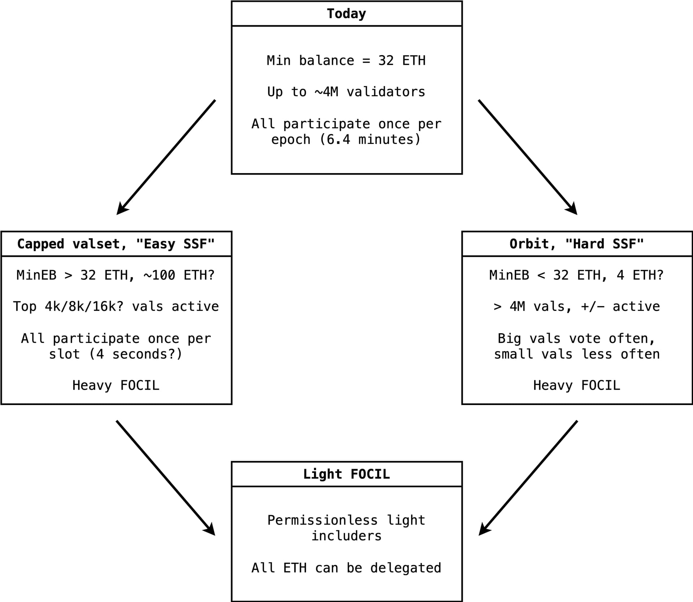

*Many thanks to Alex Stokes, Anders Elowsson, Ansgar Dietrichs, Carl Beekhuizen, Caspar Schwarz-Schilling, Dankrad Feist, Data Always, Drew van der Werff, Eric Siu, Francesco d’Amato, Hasu, Jihoon Song, Julian Ma, Justin Drake, Ladislaus von Daniels, Mike Neuder, Nixo, Oisín Kyne, Parithosh Jayanthi, Potuz, Sacha Saint-Leger, Terence Tsao, Thomas Thiery, Tim Beiko, Toni Wahrstätter for their comments and reviews (these are not endorsements).*

---

[Our previous post revisited local building](https://ethresear.ch/t/decoupling-throughput-from-local-building/22004), questioning its contribution to network goals such as censorship-resistance, scaling or verifiability. Beyond building, our staking nodes bundle many duties, and being clever about assigning the right roles to the right nodes, breaking away from too rigid models of what a “staker” is, seems more and more at hand. In this light, the model of a solo staker building directly their own block from their own machine with their own stake may be worth revisiting, too. This may be the key to obtaining a validator set that works for us towards achieving Single-Slot Finality with shorter slot times on a much faster timeline.

To be clear: This post argues that “home” nodes (non-commercial, permissionless, plentiful) remain critical for the Ethereum network, in particular for their independent and actionable voice, as well as for their role as FOCIL includers. We would not have the opportunity to ask about our options today, had we not optimised for solo stakers to exist on the network. But this path-dependency also means that decisions which were possibly correct to do then, could be less correct moving forward, as the roles, shapes and economic organisation of our nodes evolve.

## Protocol roles and types of nodes, part two

In the previous post on local building, we introduced some ways of talking about protocol roles—*attester*, *builder*, *includer*—as well as node types—**minimal node**, satisfying the basic hardware requirements; **staking node**, controlling a validator; **high resource node**, having access to higher amounts of compute, bandwidth, or order flow.

We’ll have more distinctions in this post, because the world is diverse and different needs are filled by different means. The first distinction is between **home** and **commercial** staking nodes. We bold these two words as they are **types of nodes** on the network. The distinction is not one of performance, or resources: A dedicated home staker could have invested a lot more time, effort and money in their node than some commercial operator. The distinction is one of trust, or credibility. A home node does not come *a priori* with a signal of their honesty, understood here to mean that they would be credibly expected to perform their duties (attesting, building) correctly and timely. A commercial entity is bound by legal contracts and the commercial value of maintaining a good reputation, with many other avenues to signal credibility. While we describe here two archetypes, note that this is not a binary distinction, and home nodes may garner over the course of their operations further signals of their credibility.

The second distinction we need is between *operator* and *staker*. We italicise these two words as they are *roles* adopted by protocol participants.

* An *operator* performs validating duties, mediated by their node, either a home staking node (when they are *a priori* untrusted) or a commercial staking node (when there exists a stronger signal of their credibility).  
* A *staker* provides capital at stake, a resource demanded by the protocol to offer validating services.  
* A *solo staker* is then both its own operator and staker, running their own node and having contributed their own stake.

## Contributions of home nodes to the network

What does the ability for anyone with a home node to participate in network operations buy us? First, if we assume that home nodes are more plentiful than commercial nodes, we broaden massively the operator set. But why do we care about broad participation?

Essentially, the network wants an opinionated enough set of participants to provide maximal independence in its operations. Suppose all nodes followed the whims of a single entity: The network would effectively be captured, if all nodes voted “Left” when told “Left”, and voted “Right” when told “Right”. What we want is for the maximum possible number of nodes to come to their independent, individual conclusions regarding which way to vote.

Unfortunately, we’re not making much use of how wide the base is when it comes to certain protocol services, in particular the finality service. This service outputs finalised checkpoints, making credible commitments such as “if the chain ever finalises a conflicting checkpoint, at least ⅓ of the total active stake currently deposited will be burned”. We may have *many* home nodes, but they do not carry most of the *stake*, and their voice in that service is proportional to their stake.

This is why *solo stakers*, who *stake* and *operate* with their own resources do not carry a huge voice when it comes to the consensus mechanism. According to numbers from September 2024, solo stakers operate [5.4% of the total stake](https://github.com/eth-educators/solo-stakers) on the network. This is not sufficient to even prevent finalisation of a malicious block, which would require at least 33% of the stake.

Still, solo stakers provide a quantity of independent voice to the operations of the network. Should the more centralised parts of the validator set fail or become captured, a set of solo stakers operational on the network can ensure a quick mobilisation to re-establish network stability. The voice of independent nodes today is especially powerful, when solo stakers as local builders do not censor when the external builder market censors, at least until better approaches are deployed such as FOCIL. [FOCIL will largely amplify this voice](https://x.com/barnabemonnot/status/1806814612509049275), multiplying by 16 the opportunities of home nodes on the network to create binding inclusion lists.

## Home nodes: Solo stakers and home operators

As we have seen over the years since Ethereum PoS began, **not all home nodes are operated by solo stakers**. The division of capital and labor applies to staking, in particular to home nodes. We can distinguish between two categories of operators:

* Some home nodes are *solo stakers*, who operate their own hardware and provide services to the network on the basis of their own stake.  
* Some home nodes operate their own hardware, but receive delegated stake and perform validation services on the behalf of their delegators. We may call these nodes *home operators*, a strictly larger subset to solo stakers.

These home operators are not commercial operators, and there does not exist *a priori* a signal of their credibility. Yet, [using cryptoeconomic mechanisms such as bonds](https://arc.net/l/quote/bxxcdmii), home operators can become part of the larger operator set of staking protocols such as Lido or Rocket Pool. Respectively, a node at home can sign up to perform services for Lido using their [Community Staking Module](https://operatorportal.lido.fi/modules/community-staking-module#block-773b0724032e40ad93aa27c7236f64cf) (CSM) or for Rocket Pool by opening a [Minipool](https://docs.rocketpool.net/guides/atlas/lebs). Both options require the home operator to deposit some of its own collateral, after which they are provided with delegated stake from depositors of the LST protocol. The home operator then receives a share of the rewards they obtain on the delegated stake. Besides the 5.4% of stake controlled by solo stakers, [1.58% of stake is currently operated by Rocket Pool operators](https://explorer.rated.network/?network=mainnet&view=pool&timeWindow=1d&page=1&pageSize=15&poolType=all), while [Lido’s CSM now controls 2% of the stake provided to Lido](https://research.lido.fi/t/community-staking-module/5917/90) (i.e., 0.54% of current stake), with plans to increase this share. Home operators can further boost their credibility by opting into Distributed Validator (DV) networks such as [Obol](https://obol.org/home-stakers) or [SSV](https://ssv.network/run-a-node/), where the logical validator controlled by a larger set of operators becomes more credible than the sum of its parts.

Home operators are afforded some agency by the protocols they provide a service to. In particular, operators make their own decisions when it comes to issuing attestations. They may have a more limited choice of PBS relays to connect to, following for instance a whitelist curated by their protocol. In the future, protocols should aim to place maximum agency at the operator level when it comes to issuing FOCIL lists. For instance, a DV network could choose a round-robin mechanism, when one node of the DV network is selected to make the inclusion list, with this role rotating each time.

## Two paths to SSF and shorter slot times

Why does the distinction between solo stakers and home operators matter? It is a deciding factor in a decision that should be made to orient future protocol R\&D of Ethereum, including [Single-Slot Finality](https://ethresear.ch/t/3-slot-finality-ssf-is-not-about-single-slot/20927) and shorter slot times, say, 4 seconds. Essentially, we are faced with the choice between:

1. *The [Orbit](https://ethresear.ch/t/orbit-ssf-solo-staking-friendly-validator-set-management-for-ssf/19928) path:* Embarking on a more costly R\&D programme in order to preserve maximally free entry of solo stakers in the validator set; or  
2. *The [capped validator set path](https://notes.ethereum.org/@vbuterin/single_slot_finality#Idea-2-validator-set-size-capping):* Relying much more heavily on the sufficiency of home operators to guarantee properties such as censorship-resistance.

We quickly provide details of both options, before discussing their relative merits.

1. In the Orbit path, we set a `MIN_EFFECTIVE_BALANCE`, allowing any staker depositing at least `MIN_EFFECTIVE_BALANCE` ETH to enter the validator set. However, we receive inputs from heavier stake-weighted validators more frequently in order to achieve higher magnitudes of finality faster, while providing incentives for validators to consolidate their stake as much as possible and increase their stake-weight.  
2. In the capped validator set path, validators are ranked by the amount of stake controlled by each. We set a threshold, `VALIDATOR_SEATS`, such that the top `VALIDATOR_SEATS` by stake are active validators, while validators who did not make the cut are inactive. This threshold is set to achieve a certain target slot time, as well as fast finality *with all validators voting at once*, instead of committee-after-committee.

Following [Vitalik's "Paths to SSF" post in December 2023](https://ethresear.ch/t/sticking-to-8192-signatures-per-slot-post-ssf-how-and-why/17989), EF Research has spent the past year exploring in detail both paths, and we come now to a choice which must guide our future R\&D. We understand that developing a version of SSF consistent with Orbit (namely, committee-based SSF), will likely add much more delay to obtaining SSF, first because Orbit itself is a new mechanism with [subtle economics to get right](https://ethresear.ch/t/consolidation-incentives-in-orbit-vorbit-ssf/21593), and second because we do not yet have a committee-based SSF version that is ready to be specified.

On the other hand, the capped validator set path is one of maximum protocol simplicity, relying on better-understood primitives such as non-committee-based SSF and mechanisms similar to classic delegated Proof-of-Stake. Its timeline could even be accelerated further via the ongoing [beam chain](https://x.com/drakefjustin/status/1891756928801354030) project, which could start specifications work in the next few months for a new consensus mechanism delivering SSF (e.g., using [3-slot-finality](https://arxiv.org/abs/2411.00558) or a variant) and shorter slot times in a couple of years with a “beam fork”, in parallel to iterative upgrades in the meantime. An early commitment to the capped validator set path would bring forward significantly some of these timelines.

There is no free lunch. The major risk of capping the validator set is effectively preventing access to entities controlling an insufficient amount of stake, who cannot make it to the top `VALIDATOR_SEATS`. [Sources from a year ago](https://arxiv.org/pdf/2404.02164) estimate around 12,000 nodes on the Ethereum network, with around 5,000 of them not connected to any attestation subnet, hence likely not staking nodes. This would put the number of staking nodes at around 7,000. With perfect consolidation, this number of nodes is consistent with a number of [8192](https://ethresear.ch/t/sticking-to-8192-signatures-per-slot-post-ssf-how-and-why/17989) validators in the set, which would mean that the minimum balance to enter the validator set would not increase from today’s level of 32 ETH.

However, this may not be the likeliest scenario, and we would need to understand whether this number of 8192 signatures is consistent with our target slot times. If staking nodes do not properly consolidate their stake, we would need to leave some nodes out from direct participation in the validator set. This means that it is unlikely that the minimum required balance to enter the set would settle at or below 32 ETH, excluding the current class of 32 ETH solo stakers in particular, with values of `VALIDATOR_SEATS` consistent with other goals such as shorter slot times or the use of [post-quantum cryptography](https://www.youtube.com/watch?v=BtYb_guRq78).

Yet our explorations into [Rainbow staking](https://ethresear.ch/t/unbundling-staking-towards-rainbow-staking/18683) have made us more confident that what is lost with such an approach can be obtained otherwise. In particular, we may not get 1 ETH *validators*, but we can eventually get 1 ETH *includers* in the FOCIL sense, a new role besides validators. A strawman of this idea is a simple smart contract registry enabling a set of *light delegators* to “token-curate” a set of *light operators* making inclusion lists. We make a brief aside to introduce this idea in the next section.

### Heavy FOCIL, Light FOCIL

We ensure censorship-resistance as long as any valid, fee-paying transaction always finds its way onchain. Today, censorship-resistance is provided whenever the block builder (either local or external) does not discriminate between transactions and seeks to include them maximally. We propose to improve this by introducing the new role of [*including*](https://ethresear.ch/t/towards-attester-includer-separation/21306), besides the *attesting* and *building* roles.

Our strategy for supercharging includers relies on FOCIL, an elegant multi-proposer gadget allowing many parties to propose binding transactions for inclusion in every block. But are we limited to choosing includers only from the validator set? Interestingly, we are not, and we may distinguish between two versions of FOCIL:

* *Heavy FOCIL:* Includers are sampled from the validator set.  
* *Light FOCIL:* Includers are sampled from an operator set curated by ETH holders, distinct from the validator set.

Light FOCIL would be an instance of Rainbow staking, where a set of light operators, distinct from staking operators performing validation duties, is given the responsibility to output inclusion lists binding the block producers. Light FOCIL could be deployed with a separate deposit contract, which looks more like classic token governance with delegation than to PoS staking with a capital lock-up and long entry/exit periods.

* Anyone could declare themselves ready to be a FOCIL light operator, a.k.a., *light includer*.  
* Say a user has 10 ETH in their wallet. By signing a message, this user could declare that they are “delegating” these 10 ETH to a light includer of their choice. The user is then a *light delegator*.  
* The 10 ETH remains in the user’s custody, and should their balance change, their delegated amount would also change. The user account is simply encumbered with a delegation record assigning the weight of their tokens to their light includer of choice.  
* Light includers are then sampled based on their delegated-weight.

This service may not be rewarded, but could be performed by any sufficiently altruistic full node (including staking node), or even stateless node, that is already present on the network for any reason. Light delegators can immediately re-delegate their weight away from their chosen light includer, if they are unsatisfied with the censorship-resistance performance of their chosen operator. The conditions for FOCIL to work well are very weak: We typically only need one of 16 includers to be honest in order for censorship-resistance to be provided. For this reason, we posit that even without rewards, and with such a frictionless delegation model, Light FOCIL would prove to be practically robust.

Note that both versions of FOCIL could exist at the same time\! We propose to introduce Heavy FOCIL first and Light FOCIL second. Heavy FOCIL already buys us the following:

* As long as a small, non-zero percentage of honest staking nodes participates as includers, censorship-resistance is greatly increased beyond today’s provision.  
* With FOCIL in place, home operators no longer need to rely on local building for the provision of censorship-resistance, allowing them to receive blocks from an external builder market without trading off network censorship-resistance, and giving more scale to the network.

## More arguments regarding home operators

Orbit optimises for access into the validator set with lower amounts at stake. All else equal, it is preferable to lower the entry requirements as much as possible. However, we argued that regardless of the entry threshold, even allowing for **direct participation** of smaller-staked solo stakers with Orbit, it is difficult to ensure **effective** participation in some services such as the finality gadget for smaller-staked nodes.

If our goal is to have at the ready home operators and a sufficient number of these to provide good (heavy) FOCIL service, we may be satisfied with higher entry requirements leading to significant protocol simplification, as long as **indirect participation** appears viable. In this case, we would put less expectation on home operators joining directly as solo stakers, as the minimum required balance would be higher, and more on them joining larger protocols or mechanisms, e.g., solo stakers pooling assets using distributed validation, or home operators performing validation services on behalf of delegated stake. The ability for a distinct set of participants (light includers) to strengthen the FOCIL service could make us further convinced.

We end our discussion with further arguments around home operators broadly.

### Hardening of home operator protocols

We've observed over the last 4 years a hardening of the protocols involving home operators, including at their governance layer (see e.g., [Lido dual governance](https://blog.lido.fi/dual-governance-overview/), or [Rocket Pool’s ProtocolDAO improvements](https://medium.com/rocket-pool/rocket-pool-protocol-dao-governance-a3c3e92904e0)). This is not as perfect as every unit of capital placed at stake mediating their own independent voice through their own node, e.g., while performing attestation or inclusion services directly as solo stakers. However, this could give us an existence proof of good protocols preserving permissionless entry of home operators and preserving their agency when performing validation duties.

### Possibility to make the staking market more efficient with protocol infrastructure

Should we decide to go down the capped validator set path, it would be reasonable to enshrine the infrastructure necessary for the existence of delegated or liquid staking protocols, such as [in-protocol delegation records](https://dba.xyz/modular-money-liquid-staking-for-people-in-a-hurry/) à la Liquid Staking Module, hardening this class of protocols further. This is *not* equivalent to "enshrining Lido", but it is a way of ensuring that some smart contract risk inherent in these protocols becomes essentially removed (namely, the deposit and delegation contracts), levelling access to this market for new competitors, and giving us some helpful features such as fast redelegations. Such a large change may be best achieved with a “from scratch” redesign of this layer, e.g., via beam chain.

### Improvements of home operator economics

Operating costs of staking nodes can be driven down to low levels over the next 3-5 years, assuming we require from them the minimum necessary to verify the chain and attest their view. Indeed, zkEVMs will drive verification cost down, even for large blocks; statelessness with a zkEVM or a trie change will remove the need to be stateful in order to attest; data availability sampling will require lower bandwidth to satisfy oneself of blob availability; history expiry will remove increasing storage costs.

This leaves only the cost of capital necessary for home operators to establish their credibility via a bond, if these operators stake on the behalf on delegators. The decreasing cost of capital (lower hardware cost), with the yield coming from rewards received on behalf of the stake delegated to these operators, favours their economics.

### Overall viability of home operations

Ethereum’s current philosophy does not assume that home operation economics are fundamentally non-viable, and as the section above argues, they may even improve over time. Still, [issuance conversations](https://ethresear.ch/t/faq-ethereum-issuance-reduction/19675#equilibrium-yield-and-the-proportion-of-solo-stakers-24) have surfaced the pressures on operators to compete with more centralised entities that have better economics. Neither Orbit nor the capped validator set proposal fix these issues, and if it were anyways *not viable* for 1 ETH or 4 ETH solo stakers to exist sustainably on the network, then incurring the complexity cost of Orbit and committee-based SSF should be a non-starter. But our argument here does not rely on the assumption that home operations are fundamentally non-viable in any scenario. We simply point out that there are different classes of home operations that we could be optimising for, such as the broader class of home operations or the more narrow class of solo staking.

If it is *potentially viable* for such 1 ETH or 4 ETH solo stakers to exist and be willing to participate directly as validators, we outline the possibility for these solo stakers to consider pooling their assets as part of a larger protocol, e.g., even governance-free distributed validation, in order to reach the threshold required to enter the validator set in a capped mechanism. This replicates the *economics* of solo staking, with each operator on the distributed validator network bringing their own node and their own stake, if not the *operations* of solo staking, as there is an extra layer of consensus to achieve between the nodes.

This type of *indirect participation* may not be quite as powerful as *direct participation*, and we lose something from making direct participation harder to reach instead, but with the potential upside of achieving a better point on our trade-off space between giving up some optionality for *every* class of staker and gaining protocol simplicity and features in exchange.

## Conclusion

We plot in the tree above some possible paths forward, with weak conviction on the specific numbers quoted in the boxes, trying to paint more of an order of magnitude than commit ourselves to specific parameters. Our first choice should likely be between one of two paths, and in either case we have the possibility to consider the addition of Light FOCIL, which is perhaps even more appealing in a capped validator set world.

Regardless of our choice between the capped validator set path and the Orbit path, we make the point here that we should move away from a too binary distinction between “solo stakers” on one side, and “commercial operators” receiving delegated stake from holders. There exists now, and likely more so in the future, a diverse set of ways for nodes to participate in network operations and to organise themselves, from being mere labor for delegated capital, to pooling capital in a distributed fashion between operators, to operating services such as FOCIL inclusion for which nothing more than a light client behind a wallet is necessary.