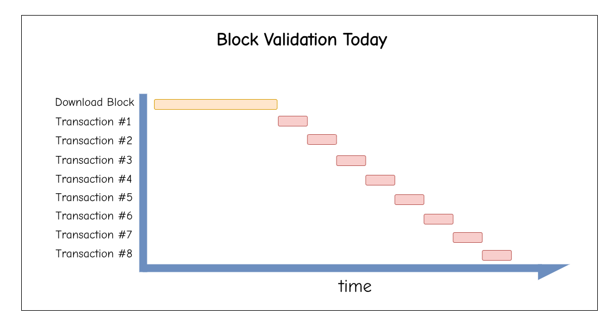
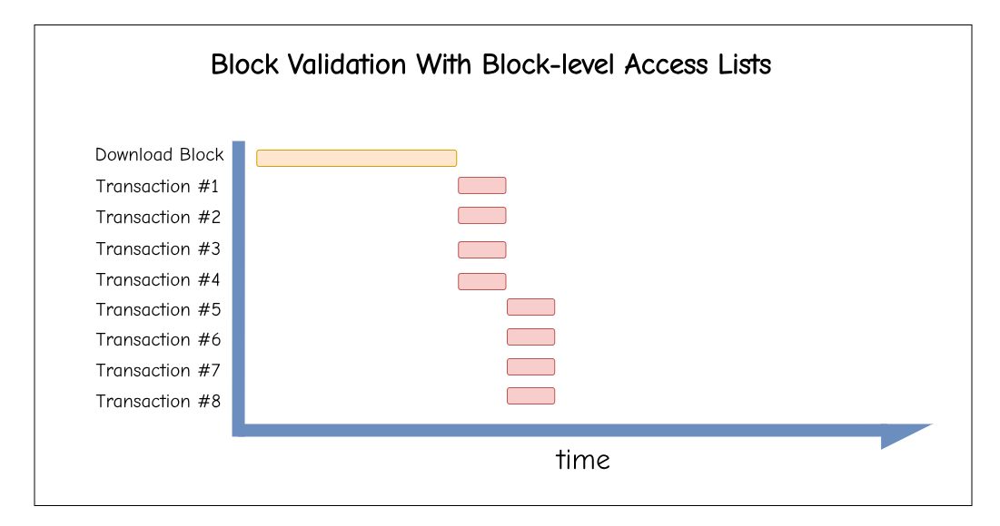
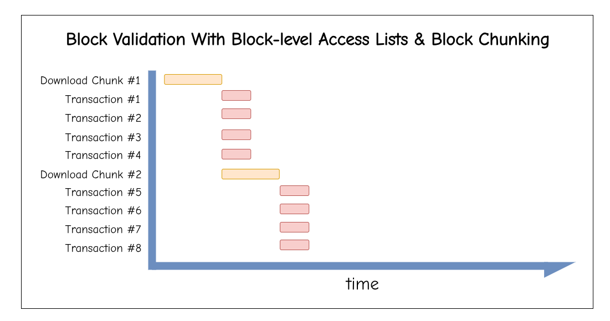
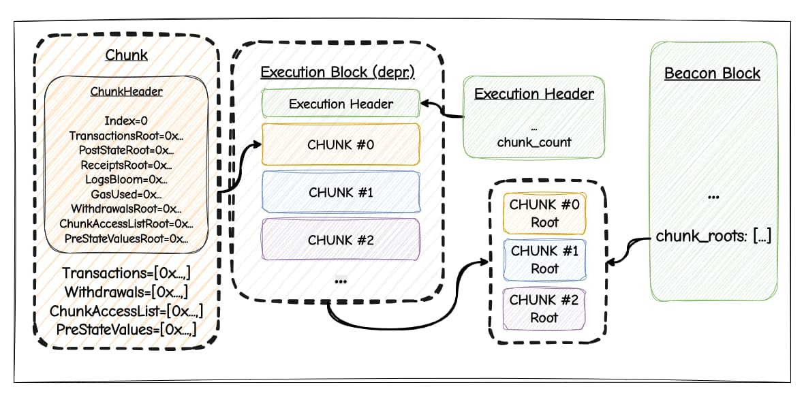
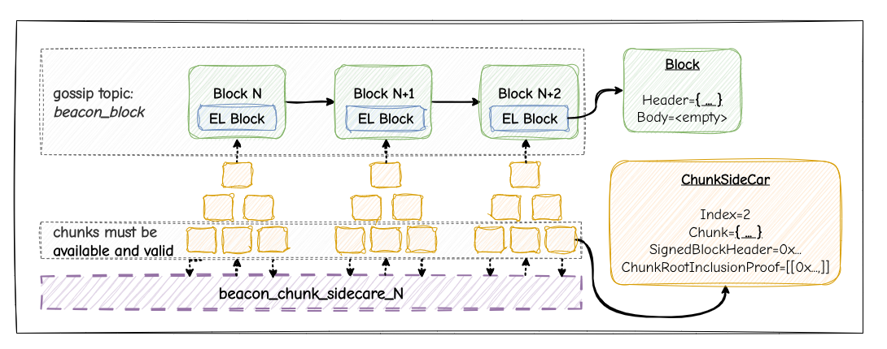

# Payload Chunking

**tl;dr:** Split an EL block (*=payload*) into multiple mini‑blocks (“*chunks*”) of fixed gas budget (e.g. `2**24 = 16.77M`) that propagate **independently** as side cars. Each chunk carries the pre‑state it needs to execute statelessly and commits to its post‑state diff. Chunks are ordered but **can be executed fully independently in parallel**. CL commits to the set of chunk headers; sidecars carry bodies and inclusion proofs. 
Validation becomes more of a continuous stream.


## Motivation

Today, blocks are large, monolithic objects that will become even larger in the future. Validation requires receiving the full block before execution can begin. This creates latency bottlenecks in block propagation and execution.

After the block is received over the p2p network, transactions are executed sequentially. We cannot start validating while downloading or parallelize execution.


> Messages on the p2p layer are usually compressed using Snappy. The *block-format* of Snappy that is used on Ethereum cannot be streamed. Thus, we need to slice the block into chunks **before** compression.

With [EIP-7928: Block-level Access Lists](https://github.com/ethereum/EIPs/blob/master/EIPS/eip-7928.md), the situation improves, but we're still waiting for the download to finish before starting block validation. With 4 cores, we get the following Gantt chart:


Instead, we can **stream blocks as chunks**:

* Each chunk contains ≤ `2**24` gas of transactions.
    * One could also have the chunk size increase geometrically (`2**22`, `2**23`, ..., `2**25`) in gas. This would give us varying latencies for chunks, enabling better parallelization - but I'm not sure it'd be worth the complexity.
* Transactions **remain ordered**. Chunks are indexed and ordered, but **independent** of each other, so they can be validated in parallel. Still, the post-state of chunk 0 is the pre-state of chunk 1.
* (optional) Each chunk carries the state it needs to be executed *statelessly*.



This shifts validation from “*download full block, then process” → “process while receiving the rest.*”

---

## Execution Layer Changes

We extend the EL block format to support chunking:

```python
class ELHeader:
    parent_hash: Hash32
    fee_recipient: Address
    block_number: uint64
    gas_limit: uint64
    timestamp: uint64
    extra_data: ByteList[MAX_EXTRA_DATA_BYTES]
    prev_randao: Bytes32
    base_fee_per_gas: uint256
    parent_beacon_block_root: Root
    blob_gas_used: uint64
    excess_blob_gas: uint64
    transactions_root: Root
    state_root: Root
    receipts_root: Root
    logs_bloom: Bloom
    gas_used: Uint
    withdrawals_root: Root
    block_access_list_hash: Bytes32
    # New fields
    chunk_count: int  # >= 0
```

There is _**no** commitment_ to the individual chunks in the EL header. We only add the chunk count to it. The execution outputs (`state_root`, `logs_bloom`, `receipts_root`, `gas_used`) must be either the same as the value in the last chunk (applies to state root and withdrawals root), or the root after aggregating the chunk's values (applies to transactions, receipts, logs, gas used, and the block access list).

### Execution Chunks

Chunks are never put on-chain; only their roots are committed.

Chunks contain the fields we would usually expect in the EL block body. Transactions are split up over chunks with a limit of `2**24` gas per chunk. Withdrawals must only be included in the last chunk. Mirroring block-level access lists, chunks come with their own chunk access list, and one could additionally add pre-state values to chunks, unlocking statelessness.

```python
class Chunk:
    header: ChunkHeader
    transactions: List[Tx]
    withdrawals: List[Withdrawal]  # only in chunk at index -1
    chunk_access_list: List[ChunkAccessList]
    pre_state_values: List[(Key, Value)] #  optional
```

Each chunk comes with a header including the chunk index. Transactions are ordered by `chunk.header.index` and their index in the chunk. Commitments to each chunk's execution output are included in the header.

```python
class ChunkHeader:
    index: int
    txs_root: Root
    post_state_root: Root
    receipts_root: Root
    logs_bloom: Bloom
    gas_used: uint64
    withdrawals_root: Root
    chunk_access_list_root: Root
    pre_state_values_root: Root  # optional
```

To prevent proposers splitting their blocks into too many chunks, the protocol can enforce that chunks must be at least half full ($\geq\frac{chunk\_gas\_limit}{2}$) OR `chunk.header.index == len(beaconBlock.chunk_roots)` (*= last chunk in that block*).

---

## Consensus Layer Changes



Beacon blocks track chunks with new fields:

```python
class BeaconBlockBody:
    ...
    chunk_roots: List[ChunkRoot, MAX_CHUNKS_PER_BLOCK]  # SSZ roots of chunks

class ExecutionPayloadHeader:
    ...
    chunk_count: int
```

The CL receives the execution chunks from the EL via a new `ChunkBundle` container which includes the EL header and the chunks (*=similar to blobs*).
The CL computes chunk roots using SSZ’s `hash_tree_root` and puts them into the beacon block body.


### Sidecar Design

Chunks are carried in **sidecars**:

```python
class ExecutionChunkSidecar:
    index: uint64  #  chunk index
    chunk: ByteList[MAX_CHUNK_SIZE]  # Opaque chunk data
    signed_block_header: SignedBeaconBlockHeader
    chunk_root_inclusion_proof: Vector[Bytes32, PROOF_DEPTH]
```

The consensus layer ensures all chunks are available and properly linked to the beacon block body via Merkle proofs against `chunk_roots` (*=similar to blobs*).

### Networking

The proposer gossips only the lightweight beacon block with commitments (`chunk_count`, `chunk_headers_root`) on the normal `beacon_block` topic, while the heavy execution data is streamed separately as `ExecutionChunkSidecar`s across **X parallel subnets** (`beacon_chunk_sidecar_{0..X}`), deduped by `(block_root, index)`. 

Initially, all nodes must subscribe to all subnets and custody all chunks. While this doesn't reduce bandwidth/storage requirements yet, it enables the immediate benefits of parallelization. Partial custody can be added in a future upgrade once the basic mechanism is proven and/or zk-proving becomes viable.



### Fork Choice

Fork choice requires that all sidecars are both available and successfully validated before a block is considered valid. The beacon block with the `chunk_roots` propagates quickly, but the block only becomes fork-choice eligible once every chunk has been received and inclusion-proven against the root. The beacon block still contains the EL header with all the necessary commitments (=*committing to parent block and execution outputs*). What we knew as *block body* on the EL stays empty in this design.

---

## Benefits

* **Streaming validation**: execution can start while other parts of the block are still downloading or busy loading from disk. Chunks are independent (if pre-state provided), or rely on the chunk-access list (*with chunk-level state diffs*) and the pre-block-state; multiple CPUs/cores can validate chunks simultaneously; distribute bandwidth usage over slot instead of beginning-of-slot bursts.
* **Streamlined proving**: ZK Provers can parallelize proving multiple chunks at the same time, benefiting from the independence of chunks.
* **Stateless friendliness**: since a single chunk is smaller than a block, we might consider adding pre-state values such that there is no need for local state access. A practical middle ground is to include pre-state values only in chunk `0`, guaranteeing that at least one chunk can always be executed while the node loads the state required for other chunks from disk into cache.
* **Future extensibility**: clear path to integrate zk-proofs over chunks or going for sharded execution.

## Design Space

### Chunk Size

`2**24` gas (~16.7M) emerged as a natural chunk size:
- **Max Transaction Size**: As of Fusaka (EIP-7825), `2**24` is the max possible transaction size.
- **Current blocks:** 45M gas blocks naturally split into ~3 chunks, providing immediate parallelism
- **Future blocks:** Scales well - 100M gas blocks would have ~6 chunks  

### Validator

1. **Execution engine** splits the block into chunks internally (opaque to CL) and passes them to the CL through an `ExecutionChunkBundle`.
2. **Proposer** wraps each chunk in a sidecar with inclusion proof. The proposer also computes the hash tree root of each chunk and puts them into the beacon block body.
3. **Publishing** happens in parallel across all subnets
4. **Attesters** wait for all chunks and validate them before voting

### Builders

Proposers can publish chunks as they're finished building, and validators can start validating them even before receiving the beacon block. Since chunks contain the signed beacon block header and an inclusion proof against it, one can validate (*=execute*) chunks as they come in, trusting their source (*=proposer*).

## Open Questions & Future Work

### Progressive Chunk Sizes?
The idea of geometrically increasing chunk sizes (`2**22`, `2**23`, ..., `2**25`) seems beneficial but adds complexity. The first chunk could be smaller (5M gas) with pre-state values for immediate execution, while later chunks are larger. This remains an area for experimentation.

### Partial Custody Path
While the initial implementation requires full custody, the architecture naturally supports partial custody:
- Nodes could custody only Y subnets out of X
- Reconstruction mechanisms (similar to DAS) could recover missing chunks

### Compatible with ePBS and Delayed Execution

At first glance, the proposed design seems compatible with both [EIP-7732](https://eips.ethereum.org/EIPS/eip-7732) and [EIP-7886](https://eips.ethereum.org/EIPS/eip-7886). Under ePBS, the chunk roots would likely move into the `ExecutionPayloadEnvelope`, and we'd put an additional root over the chunk roots into the `ExecutionPayloadHeader`. The PTC would not only have to check that a single EL payload is available, but that all chunks are. This is not much different from blobs. 

The advantages of block chunking and independent validation scale with higher gas limits and may contribute to reducing spikiness in node bandwidth consumption.