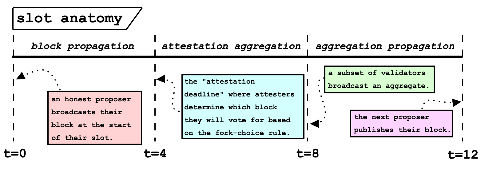
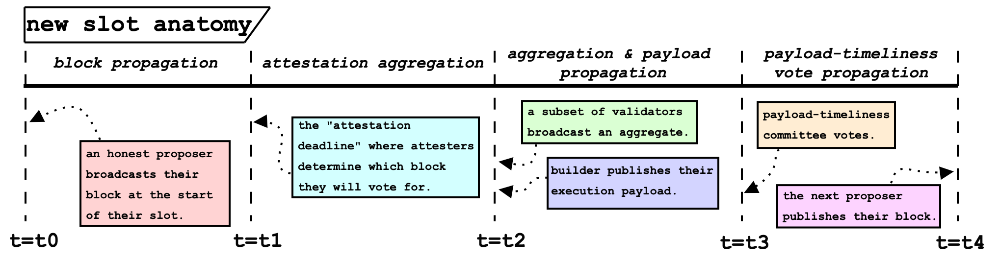
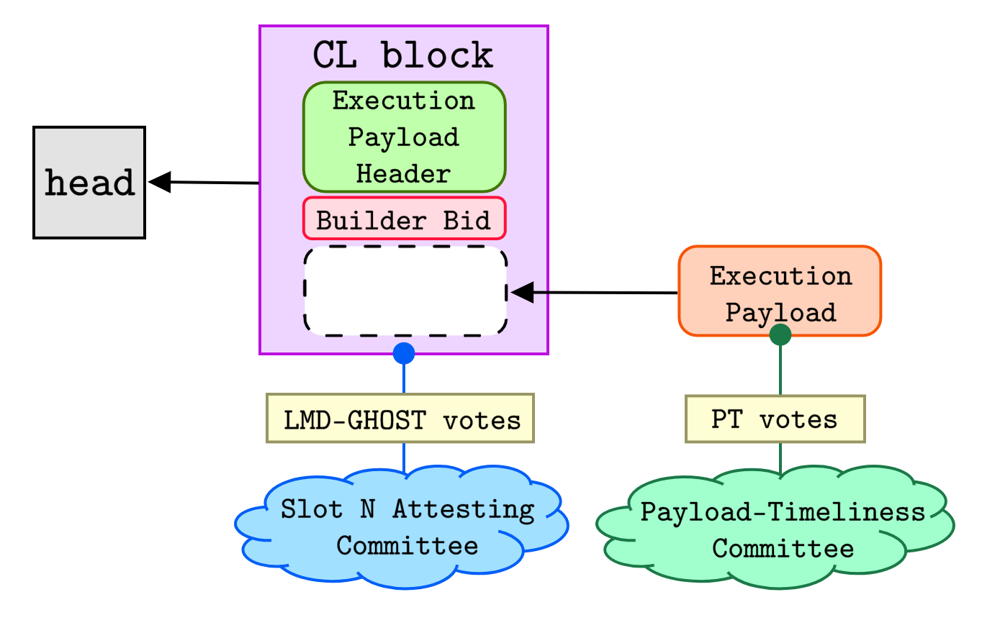
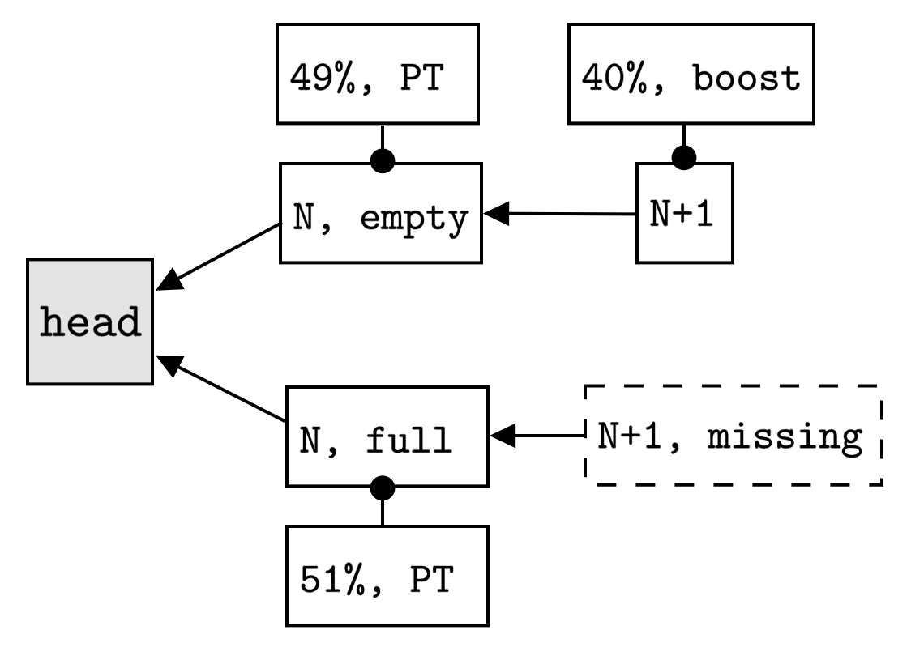
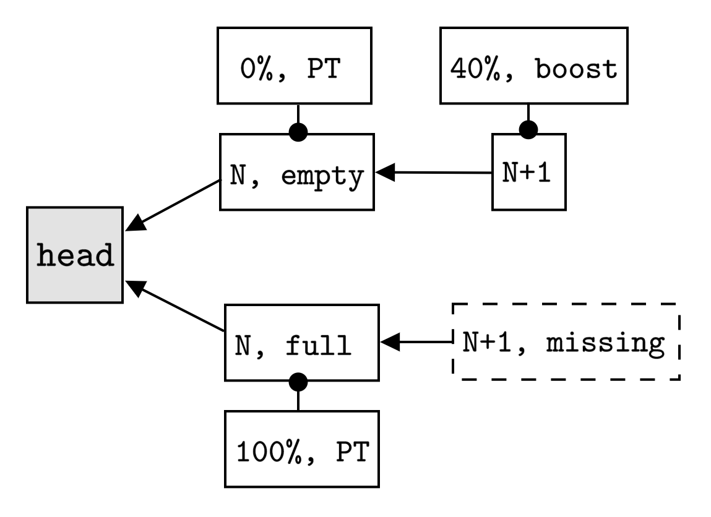
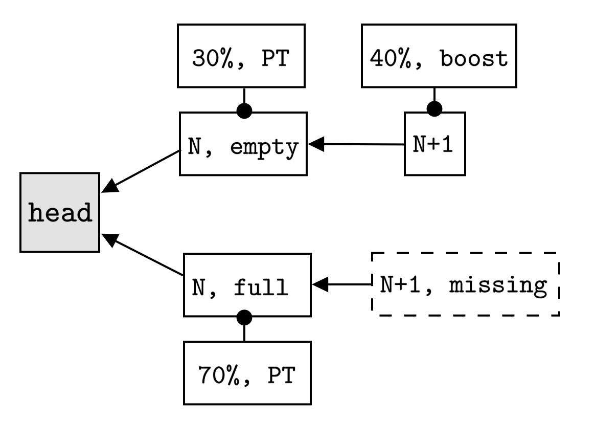
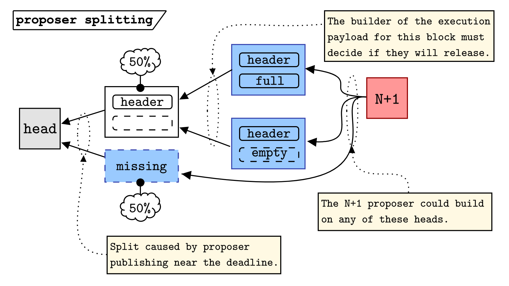
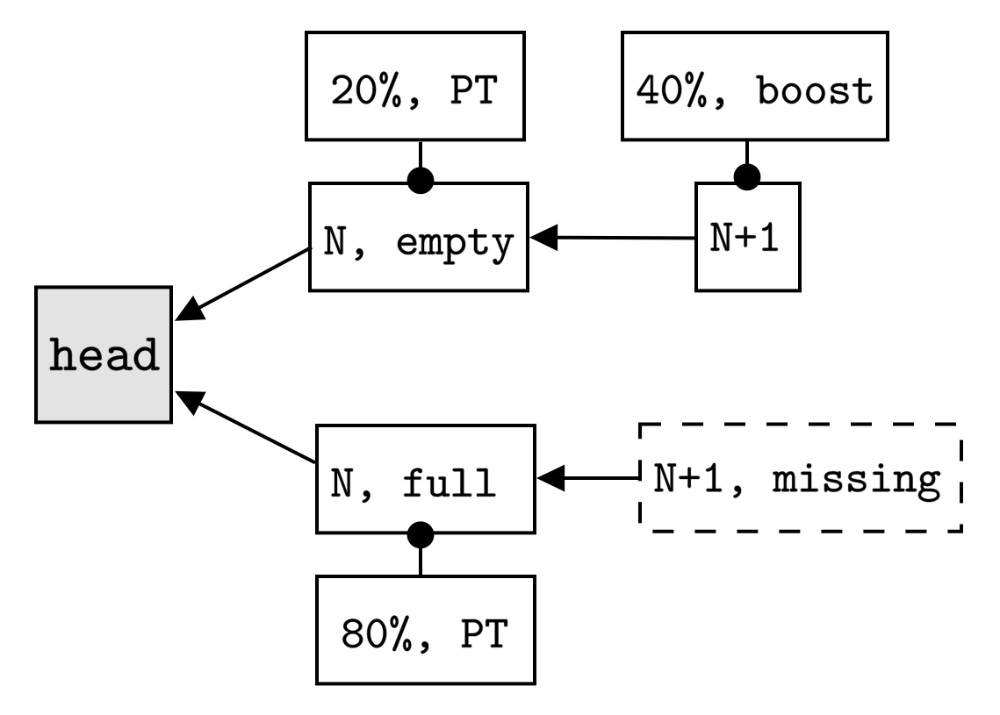

# Payload-timeliness committee (PTC) – an ePBS design 

*by [mike](https://twitter.com/mikeneuder) & [francesco](https://twitter.com/fradamt) – based on discussions with [potuz](https://twitter.com/potuz1) & [terence](https://twitter.com/terencechain) – july 6, 2023*
$\cdot$
*h/t Potuz for coming up with the idea of not giving the builder block explicit fork-choice weight, but rather using a committee to decide on the timeliness of the payload. This document is the result of a number of iterations on this concept.*
$\cdot$
*tl;dr; We present a new design for ePBS called Payload-Timeliness Committee (abbr. PTC). We include: a high-level overview, the new honest attesting behavior, and an initial analysis of the properties and potential new attack vectors. This document omits the formal specification, which will follow as we gain confidence in the soundness of this design.*
$\cdot$
*Many thanks to [Danny](https://twitter.com/dannyryan), [Barnabé](https://twitter.com/barnabemonnot), [Caspar](https://twitter.com/casparschwa), [Toni](htts://twitter.com/nero_eth), [Vitalik](https://twitter.com/vitalikbuterin), [Justin](https://twitter.com/drakefjusin), [Jon](https://twitter.com/jon_charb), [stokes](https://twitter.com/ralexstokes), [Jacob](https://twitter.com/jacobykaufmann), [Aditya](https://twitter.com/adiasg), and [Chris](https://twitter.com/metachris) for relevant discussions.*

<!-- --- -->

## New concepts
- ***payload-timeliness committee (PTC)*** – a subset of the attestation committee from each slot that votes on the builder's payload release.
- ***`full`, `empty`, and `missing` blocks*** –  a `full` block has a valid `ExecutionPayload`  that becomes canonical (results in an update to the EL state). An `empty` block is a CL block does not have a canonical `ExecutionPayload` (does not update the EL state). A `missing` block is an empty slot that becomes canonical. With [block-slot](https://github.com/ethereum/consensus-specs/pull/2197) voting, `missing` blocks can have fork-choice weight. 
- ***payload-timeliness (PT) votes*** – the set of votes cast by the PTC. 
   - The PT votes for slot `N` are only used by the proposer and attesting committee in slot `N+1`.
   - The PT votes for slot `N` determine the proportion of the fork-choice weight given to the `full` vs. `empty` versions of the slot `N` block.

***Note** – Throughout this document, we describe block-slot voting as a prerequisite for PTC. However, we can make use of the existing voting mechanics and treat ancestral block votes in slot `N` as votes for the `missing` version of the slot `N` block. For clarity in the examples, we describe `missing` as part of the competing fork, but adding pure block-slot voting may not be necessary in practice.*

## Design overview
We first present a minimal description of the new design. Note that this does not include the full specification of behavior and is intended to present the high-level details only. 

### Old slot anatomy

Presently, the 12 second slot is partitioned into the following three phases. Figure from [Time, slots, and the ordering of events in Ethereum Proof-of-Stake](https://www.paradigm.xyz/2023/04/mev-boost-ethereum-consensus).

*Flow*
1. At `t=0` block proposed by the elected PoS validator.
2. At `t=4`, the attestation deadline, the attesting committee for slot `N` uses the fork-choice rule to determine the head of the chain in their view and makes an attestation.
3. At `t=8` the aggregate attestations are sent.
4. At `t=12` the next proposer builds on whatever head they see according to their fork-choice view.

### New slot anatomy
The new slot contains an additional phase for the PT votes to propagate. 

*Flow*
1. The slot `N` block that is published at `t=t0` is the CL block proposed by the elected PoS validator. This block contains a builder bid, but no `ExecutionPayload`.
2. The attestation deadline at `t=t1` is unchanged. The entire attesting committee for slot `N` uses the fork-choice rule to determine the head of the chain in their view and makes an attestation.
3. The broadcast of aggregate attestations for the slot still begins at `t=t2`. Additionally, the builder publishes their execution payload if they have not seen an equivocation from the proposer (the builder does not need to have a full view of the attestations).
4. At `t=t3` the PTC casts their vote for whether the payload was released on time.
5. At `t=t4` the slot `N+1` proposer publishes their block, building on either the `full` or `empty` block based on the PT votes and attestations that they have seen. 
<!--    - If the proposer builds on the empty block, the attesting committee uses the fork-choice rule and their local view of the payload-timeliness to determine what CL block to vote for.
   - If the proposer builds on the full block, the attesting committee votes for that block so long as it is head according to their fork-choice.
   - If the proposer builds on an empty slot, the attesters run the fork-choice rule to determine their head. -->

***Note** – Timestamps are not specified because we can adjust the duration of each phase based on performance testing. The key details are what happens in the four phases and at the boundaries.*

***Note 2** – Depending on the size of the PTC, we may need a fifth slot phase to aggregate the votes of said committee. Larger committees may need aggregation, but are more secure, which is the design tradeoff.*
   
### Block production
The full block is assembled in two phases. First, the CL (beacon) block is produced with a commitment to a builder bid. Any double-signing of this block represents a proposer's equivocation. Once the builder has observed the CL block, they produce their `ExecutionPayload` to construct the `full` version of the block. The PTC casts votes on the timeliness of this object in their view.

The slot `N` committee votes on the CL block, while the slot `N` PTC observes the payload release, which informs the fork-choice rule in the subsequent slot. We propose that the PTC is a strict subset of the slot `N` attesting committee (e.g., the first 1000 members). 
<!-- $$\text{Payload-Timeliness Committee} \subset \text{Slot N Attesting Committee}
$$ -->

## Honest attesting behavior

Consider the honest attesting committee at `t=t1` of slot `N+1`. Assume that there was a block in slot `N` and the slot `N+1` proposer built a child block (it extends w.l.o.g. to `missing` blocks in either slot). The slot `N+1` block could either build on the `empty` or `full` block from slot `N`. Similarly, the PTC cast their votes on `full` or `empty` based on the payload-timeliness at `t=t3` of the previous slot. The attesting committee in slot `N+1` assigns weight to the `full` vs `empty` block respectively by using the proportion of PT votes from slot `N`. 

### Examples

Assume the slot `N` block is canonical and received 100% of the slot `N` attestations. Let `W` denote the total weight of each attesting committee. `PT` indicates the payload-timeliness vote and `boost` is the 40% proposer boost given to each proposer block.

#### Case 1

The slot `N` PTC is split, with 51% voting for the `full` block and 49% voting for the `empty` block. The slot `N+1` proposer builds on the empty block and is given proposer boost, which is equivalent to 40% of the weight of the attesting committee. The attesting committee at `N+1` now sees a split and has to choose between attesting to `N+1` or `N+1,missing`. The PT votes divide the attestation weight of the slot `N` attestations, so we have,
$$
weight(N+1) = 0.49W + 0.4W = 0.89W,
$$
while,
$$
weight(N+1,missing) = 0.51W.
$$
Thus, the attesters vote for `N+1` (the top fork).

#### Case 2

Here we have 100% of the PT votes agreeing that the block should be full. Now the attesting committee for slot `N+1` votes against the proposer, and for `N+1,missing` because
$$
weight(N+1) = 0.4W < weight(N+1,missing) = W.
$$
In this case, the PTC from slot `N` overrules the slot `N+1` proposer, who clearly built on the wrong head. The bottom fork wins.

#### Case 3

In the worst case, the slot `N+1` attesters see this split view. Here 
$$
weight(N+1) = 0.7W = weight(N+1,missing),
$$
and they have to tie-break to determine which fork to vote for. The key here is that this split is difficult to achieve because you need 70% of the PTC to vote for `full`, while the proposer builds on `empty`. More on this in "Splitting considerations" (below).

<!-- 1. The consensus layer (CL) block is still proposed by the elected PoS validator.
2. The block contains an `ExecutionPayloadHeader` and the associated `BuilderBid`. 
   - The `ExecPayloadHeader` is a commitment to a builder produced block that and the `BuilderBid` contains the bid metadata (value, builder pubkey, signature).
3. At the attestation deadline, the full attesting committee casts LMD-GHOST votes for the CL block (same as done today).
4. After the aggregation and propagation of the attestations, the builder publishes (or decides not to) the `ExecutionPayload` (the list of transactions & withdrawals).
5. The Payload DA Committee votes on the timliness of the publication.
   - These votes do not impact fork choice, only signify the presence of the payload. 
   - These votes determine whether the fork-choice weight of the attestations for the CL block are given to the `empty` or `full` block.
   - Honest Payload DA committee members will attest for a payload *only if they determine a unique builder, otherwise they vote for option (iii).*
6. The DA votes are propogated.
7. The next proposer uses HLMD-GHOST to choose the CL block that they will base their next block on. 
8. The next proposer uses the Payload DA votes for that CL block to decide on building on the `empty` or `full` block.  -->

## Analysis
The properties specified below were initially presented in [Why enshrine Proposer-Builder Separation? A viable path to ePBS](https://ethresear.ch/t/why-enshrine-proposer-builder-separation-a-viable-path-to-epbs/15710). We modify `honest-builder payload safety` to the weaker condition of `honest-builder same-slot payload safety`.

### Properties
1. **honest-builder payment safety** – if an honest builder is selected and their payment is processed, their payload becomes canonical.
2. **honest-proposer safety** – if an honest proposer commits to a single block on time, they will unconditionally receive the payment from the builder for the bid they committed to.
3. **honest-builder same-slot payload safety** – if an honest builder publishes a payload, they can be assured that no competing payload for that same slot will become canonical. This protects builders from same-slot unbundling. ***Note**: This property relies on a 2/3 honest majority assumption of the validator set.*

### Non-properties
1. **honest-builder payload safety** – the builder cannot be sure that if they publish the payload, it will become canonical. The builder is not protected from next-slot unbundling (the builder is not protected from that in `mev-boost` either, as length-1 reorgs happen regularly). More on this in "Splitting considerations" (below).

***Note** – In terms of CL engineering, making the transition function able to process `empty` blocks is important. Because `empty` blocks will not update the EL state, they must exclude withdrawals.*
<!-- 2. **honest proposer head certainty** – Proposers must determine whether or not to build on the `empty` or `full` CL blocks. If their view differs from the attesting committee, they may end up building on an incorrect head. See [Payload DA Splitting](https://notes.ethereum.org/EvB_vuwTRQSF0EmUWeZwzA#Payload-DA-committee-splitting). -->

<!-- #### New fork-choice logic
To be applied by the honest attesting committee in slot `N` at the attestation deadline.
1. Perform HLMD-GHOST with block-slot voting to determine the head of the chain for slot `N` (with block-slot the head could be empty).
2. If there exists a block at slot `N`, use the DA votes from slot `N-1` and proposer boost for slot `N` to determine the payload state for slot `N-1`.
3. Cast the attestation according to the new head. -->

### Builder payment processing

<!-- Builder payments are processed during the epoch finalization process (open for discussion, could just be on a one-epoch lag). The payment takes place if:
1. The builder `ExecutionPayloadHeader` and the corresponding `ExecutionPayload` are part of the canonical chain (the happy-path) (i.e., the CL block for that slot is `full`).
   - Implied by the current head of the chain. If the `ExecutionPayload` for a specific slot was included, then the subsequent block reflects that.
2. The builder `ExecutionPayloadHeader` is part of the canonical chain even if the corresponding `ExecutionPayload` is not (consensus that the builder was not on time) (i.e., the CL block for that slot is `empty`).
   - Implied by the current head of the chain. The `N+1` attesting committee will only vote for an empty `N+1` block if their local view did not include a timely payload release. 
3. There is no evidence of proposer equivocation.
   - A builder can publish an equivocation proof in order to avoid the unconditional payment. -->
<!-- 3. Half of the Payload DA Committee votes that are present vote for "unavailable payload."
   - This implies that the builder did not produce a timely, valid payload, and without equivocation evidence, the proposer needs to be paid. -->
   

Builder payments are processed during the epoch finalization process (open for discussion, could just be on a one-epoch lag). The payment takes place if both of these conditions are satisfied:
1. The builder `ExecutionPayloadHeader` is part of the canonical chain (i.e., the CL block for that slot is *not* `missing`). This includes two cases:
   - The corresponding `ExecutionPayload` is also part of the canonical chain (the happy-path) (i.e., the CL block for that slot is `full`).
   - The builder `ExecutionPayloadHeader` is part of the canonical chain even if the corresponding `ExecutionPayload` is not (consensus that the builder was not on time) (i.e., the CL block for that slot is `empty`).
2. There is no evidence of proposer equivocation.
   - A builder who sees an equivocation can get the validator slashed. Any slashed validator will not receive the unconditional builder payment.

### Differences from other designs
1. The payload timeliness determines how to allocate the fork-choice vote, but it cannot create a separate fork. 
2. The payload view determines how the subsequent attesting committee votes. 
3. The builder is never given a proposer boost or explicit LMD-GHOST weight.
4. The unconditional payments are handled asynchronously, after enough time has passed for equivocations to be detected and the corresponding validators to be slashed.
5. The PT votes only inform the attesting behavior of the subsequent slot. Similar to proposer boost, the effect is bound to a single slot.

<!-- #### Payload DA committee splitting
One new attack vector enabled by this design is splitting the Payload DA committee. The bulider can strategically time the release of their payload so that approximately 70% of the honest committee members see it on-time, while the other 30% (including the next proposer)  see it as late. This impacts the next proposer, because they need to decide whether to build on the `empty` or `full` block. See the figure below for an example.

Consider the above view from a member of the `N+1` attesting committee.

- 70% of the DA committee that they see has voted for `N,full`. This means `N,full` has 70% of the CL attestations for slot `N`.
- The slot `N+1` proposer built on `N,empty`, which has 30% of the CL attestations and gets a 40% proposer boost. 
- Honest attesters in `N+1` see a tie and may end up orphaning `N+1`.

**Implication** – The builder of the block at slot `N` splits the DA committee view by strategically timing the release of the payload. The slot `N+1` proposer is griefed into publishing on a non-canonical block. 

**Comparison to today** – This splitting attack is not possible today because there is no block-slot voting. The next proposer only needs to determine if they are going to build on the `N-1` block or the `N` block, which they will do by evaluating the attestation weight of each. If the attestation weight is >20% on `N`, they use it as the head, otherwise the `honest reorg` logic dictates that they build on `N-1` to reorg `N`. With block-slot voting, this attack would be possible by every proposer, and with ePBS it would also be possible for each builder.

 -->
 
<!-- ### Full behavior specification
 
Firstly, a change in the general fork-choice: equivocating blocks have their attestation weight move to their parent. When you are choosing between multiple sibling leaves without weight because of an equivocation, you always choose the `missing` leaf. 

In slot `N+1`, attesters only take into account equivocations that you knew about already at the payload-timeliness deadline of the slot `N`, plus those which are revealed once you observe the new proposal. The proposer takes into account all equivocations, and includes evidence of them. In other words, view-merge over block equivocations is performed.
 
 #### Attestation behavior
 
We go through the attestation logic of an attester at slot `N+1`. Before attesting, there are two local variables which are set at the payload-timeliness attestation deadline (`t = 12s`) of the previous slot `N`: `equivocation_detected: Boolean`, `payload: ExecutionPayload`. `equivocation_detected` is set based on whether a pair of equivocating proposals for this slot has been observed up to this point. `payload` is set only if `equivocation_detected = False` and if a (single) proposal and associated `ExecutionPayload` have been observed up to this point, in which case `payload` is set to the latter.

As usual, an attester at a slot `N+1` attests either at the attestation deadline or when it receives a proposal, whichever comes first. The attestation logic is then the following:

1. [**Equivocation detection**] If a proposal `B'` is received, set`equivocation_detected = true` if `B'` contains equivocation evidence from slot `N` or if `payload` is set s.t. `slot(parent(B')) = N` and `parent(B')` conflicts with `payload`.
2. [**Fork-choice**] Run the fork-choice rule, identify a head of the chain `B` up to `slot(N)`
3. [**Attest**] In the following, we say "attest to an extension of a block", to mean that the vote should go to a proposal extending the block, if one has been received, and to the block itself otherwise. The attestation behavior is then:
    - If `slot(B) < N`, then attest to an extension of `B` (normal attestation behavior)
    - If `slot(B) = N`:
        - If `equivocation_detected = false`, compute the `timeliness_score` for the `ExecutionPayload` of `B` as the difference between the timeliness votes for `full` minus those for `empty`, plus a proposer boost proportional to the weight of the timeliness committee. Then:
            -  If `timeliness_score >= 0`, attest to an extension of the `full` version of `B`
            - If `timeliness_score < 0`, attest to an extension of the `empty` version of `B`
        - If `equivocation_detected = true`, attest to an extension of the `missing` version of `B`

#### Builder behavior

We specify one possibility for the builder publication logic. It is possible for builders to follow a different logic, for example incorporating information from the attestations, which they are able to obtain before the execution payload publication deadline, if they subscribe to all attestation subnets. Nevertheless, this simple behavior is sufficient to obtain the honest builder properties, i.e. *honest builder payment safety* and *honest builder same-slot payload safety*.

The builder publishes an `ExecutionPayload` at the execution payload deadline (`t = 8s`) of slot `N` if:
- A CL block from slot `N` with the corresponding `ExecutionPayloadHeader` has been observed
- No conflicting CL block has been observed, i.e., no equivocation

#### Proposer behavior

The proposer of slot `N+1` decides what to extend as follows:

1. Run the fork-choice rule, identify a head of the chain `B`
2. If `slot(B) < N`, extend `B` (includes the case of equivocations in slot `N`, so that the outcome must be `missing`)
3. If `slot(B) = N`, compute the `timeliness_score` for the `ExecutionPayload` of `B` as the difference between the timeliness votes for `full` minus those for `empty`. Then:
    -  If `timeliness_score >= 0`, extend the `full` version of `B`
    - If `timeliness_score < 0`, attest to an extension of the `empty` version of `B`

### Proof of properties

#### Honest builder same-slot safety

In the following, we are going to assume prefix-stability in slot `N`, i.e., that the chain until slot `N-1` will not be reorged. In other words, there is some stable block `A` which the proposer of slot `N` is forced to extend, as it is guaranteed to stay canonical. Moreover, all builders in slot `N` will bid with payloads extending `A`, because they also see it as head of the chain. The reasoning behind this assumption is that, where that not to be the case, searchers and builders would be able to observe that and behave accordingly, with caution: searchers can avoid submitting bundles whose unbundling would be very costly to them, and builders can bid conservatively.

Say that a builder publishes `P`, an `ExecutionPayload` for block `B` at slot `N` (built on `A`), after following the publication logic outlined above, meaning that by time `t=8s` they have not observed an equivocation. Since that is the case, no proposals other than `B` could have been observed by any honest attester by time `t=4s`, so all honest attestations from slot `N` are either for `B` or `missing`, i.e., for (`A`,`N`), in the (block, slot) notation. Later, we will make use of this fact.

Consider now a different `ExecutionPayload` for slot `N`, `P'` associated to block `B'`, which contains transactions taken from `P`. Consider also an attester of slot `N+1`. At the payload-timeliness attestation deadline of slot `N`, at time `t=12s`, they observe `P`. Now, the following can happen:
- They also observe another proposal conflicting with `B` by `t=12s`, and set `equivocation_detected = true`. Then, `equivocation_detected` stays `true` no matter what, and there are two cases:
    - the head of the chain is `A`, and, since `slot(A) < N`, the attester votes for a proposal extending it, i.e., extending `(A, N)`, the `missing` slot.
    - the head of the chain is a block from slot `N`, so the attester votes for the`missing` version of it, i.e., again `(A, N)`
- They do not observe an equivocation, and thus set `payload = P`. Now, for them to attest to the `full` version of *some* block from slot `N`, it must be the case that `payload` matches the `ExecutionPayloadHeader` in the block. Since `paylaod = P`, that only happens if the block is `B`. Otherwise, they attest either to a block from a slot `< N`, i.e., to `A`, or to the `empty` version of a block from slot `N`.

Therefore, the attester only ever attests to a `full` block from slot `N` if the block is `B`. Since this is the case for any honest attester, a majority of the committee of slot `N+1` does so -->

### Splitting considerations
"Splitting" is an action undertaken by a malicious participant to divide the honest view of the network. In today's PoS, proposers can split the network by timing the release of their block near the attestation deadline. Some portion of the network will see the block on time, while other will vote for the parent block because it was late. Proposer boost is the mechanism in-place to give the next proposer power to resolve these forks if the weight of competing branches is evenly split. The PTC introduces more potential splitting vectors, which we present below.

#### Proposer-initiated splitting
First, consider the case where the proposer splits the chain in an attempt to grief the builder.

The sequence of events is as follows:
1. The slot `N` proposer releases their block near the attestation deadline, causing a split of the honest attesting set. 50% of the honest attesters saw it on time and voted for the block, while the other 50% did not see it on time and thus voted for a `missing` block.
2. The builder of the header included in the block must make a decision about releasing the payload that corresponds to this block. The block is either `full` or `empty` based on that decision.
3. The slot `N+1` proposer resolves the split by building on the `missing`, `full`, or `empty` head (any of the blue blocks). Because the proposer will have a boost, the fork is resolved.

Now consider the builder's options. 
1. **Publish the payload** – If the `missing` block becomes canonical, they published the payload, but it never made it on-chain (bad outcome). Otherwise, the `full` payload became canonical (good outcome). 
2. **Withhold the payload** – If the `empty` block becomes canonical, the unconditional payment goes through, but they aren't rewarded by the payload being included (bad outcome). If the `missing` block becomes canonical, then they didn't needlessly reveal their payload (good outcome).

In summary, either publishing or withholding the payload can result in a good or bad outcome, depending on the behavior of the slot `N+1` proposer (which is uncertain even if they are honest).

***Key point 1 –*** *By not giving fork-choice weight to the builder, we cannot protect them from the proposer splitting in an attempt to grief. However, the builder can be certain that their block will not be reorged by a block in the same slot, so they can protect their transactions by bounding them to slot `N`.*

***Key point 2 –*** *Today, such splitting is possible as well; it just looks slightly different. If the proposer intentionally delays their publication such that the next proposer might try to reorg their block using the honest-reorg strategy, the `mev-boost` builders have no certainty that their block won't be one-block reorged. Indeed, we see many [one-block reorgs](https://etherscan.io/blocks_forked) presently. See [Time, Slots](https://www.paradigm.xyz/2023/04/mev-boost-ethereum-consensus) for more context.*

### Builder-initiated splitting
As hinted at above, builders can try to grief the slot `N+1` proposer into building on a fork with a weak PT vote by selectively revealing the payload to a subset of the PTC.

In this case, the `N+1` proposer is going to get orphaned by the `N+1,missing` block because there was such a disparity in the PT votes. Specifically, if the builder can get the proposer to build on the `full` or `empty` block which is the opposite of what the PTC votes for, then they orphan the block. Let `N,empty` be the block that the proposer of `N+1` builds on (w.l.o.g.), and let $\beta$ denote the proportion of the PTC voting for `N,full`. If $\beta > 0.7$, then the `N+1` validator will be orphaned. In other words, the proposer needs to agree with at least 30% of the PTC to avoid being orphaned.

#### Spitting conclusion
Neither of these splitting conditions seem too critical. The proposer-initiated splitting is already possible today with `mev-boost` and builder-initiated splitting will be difficult to execute if the PTC is sufficiently large. Any ePBS design involves some additional degrees of freedom for network participants (by enshrining the builder role), and this design is no exception. Further analysis on the probability and feasibility of splitting will be an important part of the full evaluation of the PTC design.

<!-- Builders cannot meaningfully grief the `N+1` slot proposer. The only situation in which the attesting committee for `N+1` votes against the proposer is if the attesting committee has seen the payload on-time, but the proposer builds on the empty block  `(self=full,proposer=empty)`. This is only possible if the payload was actually released before `t=12`. Given the proposer doesn't make their decision on the `full` or `empty` block until `t=16`, the builder has no way to stop proposer from seeing the block and building on the full block (assuming 4s network synchrony). As long as the proposer builds on the full block, the attesting committee will payload view-merge and accept that block as canonical, even if their local view was for `empty`.  -->