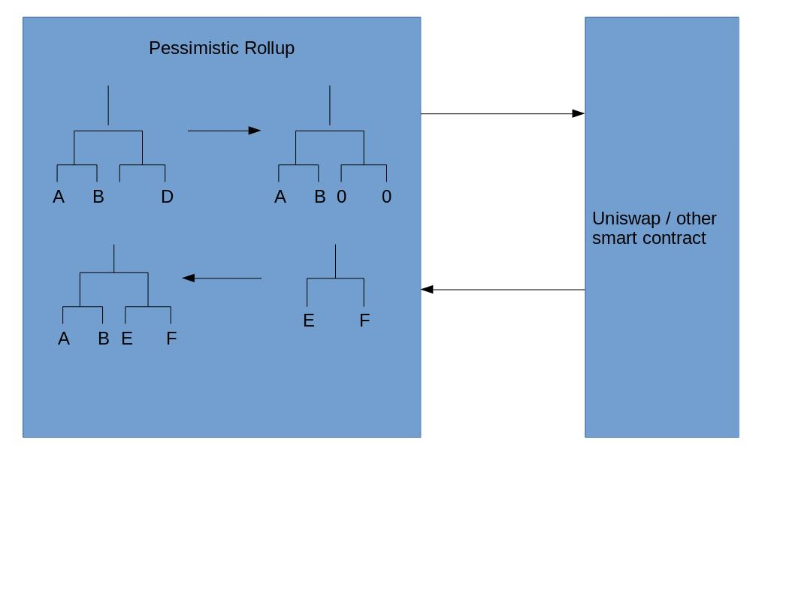

## Intro 

Current scalability solutions move the users into another domain where their transactions are validated. If they want to leave that domain they may have to pay a high cost. There are ways to [minimize](https://ethresear.ch/t/mass-migration-to-prevent-user-lockin-in-rollup/7701) these costs.

The concern remains that if we do not allow layer 2 to call smart contracts on layer 1 then arbitrage opportunity and price differences between assets will cause problems.  

There seems to be some urgency to scale interactions between users and smart contracts given the current gas market fluctuations. 

Here we propose a temporary scalability improvement of 3x on layer 1 by putting many users in a smart contract "super" wallet and batching their various uniswap interactions. This solution can realistically be build audited and deployed in a few months. It is composable with smart contracts that allow batched user interactions for example uniswap where matching pool operations are very similar no matter how many users funds are included. Something like DAI where users have a specific smart CDP that they own is not so well suited. 

This will work in the short term. In the medium term a zkrollup with similar properties can be built. Which will allow this to scale orders of magnitude more. 

Another benefit of this approach is that it prepares the defi and broader smart contract communities for building on layer 1 in a way that can easily interface with layer 2. 

## Method

Many users funds are held in a smart contract. The smart contract has a merkle root that maps users public key to tokens owned. 

For example lets say that Carol wants to trade 10 dai for eth and Dave wants to trade 100 dai for eth. Instead of both of these users performing this trade at a cost of ~115k gas each. We combine them together. We perform a single swap on uniswap for 110 eth and the funds are divide in the super wallet between Carol and Dave. See diagram

To make this system trustless. We don't have any exit game or complex zkp components. So withdraw time as well as proof generation time is almost instant. See appendix 1 for details of the validity proof. 

## Cost Estimates 

### Cost Naive
For n users. 

| Description | Cost (gas) | Number Required |
| -------- | -------- | -------- |
|  uniswap| 115,842 | n |
 
For each user it costs ~115000 gas

### Cost Pessimism 
n is the number of users

| Description | Cost (gas) | Number Required |
| -------- | -------- | -------- |
| merkle_proof| | n | 
| signature_verificaion | | n |
| root_storage | | n | 
|Total|30000| n |

for each user it costs ~ 30000 gas. 
Which is an 115842 / 30000 = 3.8614 x improvement. Here we assume a uniswap interaction but we can replace with arbitrary smart contract. 

### Future optimizations 

It is possible to reduce the cost further to approach 6x improvement by instead of taking the full merkle proof for each transaction. Take only a partial merkle proof for each tx until it reaches a node from a previous tx. Then expand the matched nodes to the merkle root. 

## Conclusion

Here we propose a short term scaling improvement for layer 1 interactions. About ~3x more transactions per second taking uniswap as an example. This requires just solidity components and should be possible to build it in a short amount of time. 

In the medium term we can replace the solidity proof of validity with a ZKP based proof of validity. 

## Appendix 1: Example Flow

So now we want to update this state. 

Carol and Dave say they want to trade their DAI for ETH on uniswap. They both sign their respective message. 

Carol_message = hash(uniswap_address, swap,  eth, 10)
Dave_message = hash(uniswap_address, swap, eth, 11)

They pass their signatures to a coordinator. 

The coordinator creates a witness and calls a smart contract function for both users 

The smart contract 

1. Proves that Carols leaf is in the root stored in the smart contract memory
2. It then updates the root with Carols leaf removed 
3. Proves Dave leaf is in the updated_root stores it in smart contract memory
4. Sets Dave leaf to zero and updates root so that his leaf is zero. 

At this stage both Dave and Carol leaves have been removed from the tree and are stored in smart contract memory. This memory will be freed at the end of the transaction. 

5. The smart contract now confirms that Carol and Dave's signatures are correct 
6. Then it checks they both consented to the same operation basically swapping dai for eth on uniswap. 
7. Checks the nonce or both transaction are correct to prevent transaction replays
8. Then it add the dai amount they are transferring together. 
9. Executes the trade on uniswap 
10. Shares the proceeds of the users based on how much dai they contributed. 
11. Uses Batch [deposits](https://ethresear.ch/t/batch-deposits-for-op-zk-rollup-mixers-maci/6883) to add ownership of the proceeds back into the merkle tree for Carol and Dave.