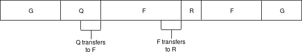
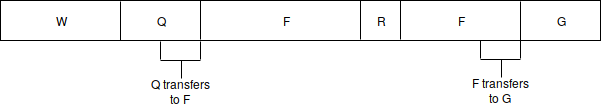
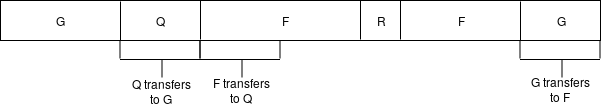

_Special thanks to Ben Jones for the more pre-signed defragmentation idea_

See also https://ethresear.ch/t/plasma-cash-defragmentation/3410 and https://ethresear.ch/t/plasma-cash-defragmentation-take-2/3515

This time, we go back to "voluntary defragmentation", where in order for the index of any user's coins to change that user must actively participate, but we propose and implement a specific algorithm. Suppose that $A$ wants to send $x$ coins to $B$, and for simplicity $A$ has a single fragment containing these coins. Simply transferring that fragment to $B$ may increase total fragmentation by 1, as $A$'s fragment of $y \ge x$ may split up into two fragments of $x$ (owned by $B$) and $y-x$ (still owned by $A$) if $y > x$.

But we can instead try to look for a **non-fragmenting path**. We define a non-fragmenting path for a transfer of $x$ coins as follows. We consider $G$ a _forward-neighbor_ of $F$ if there exists a fragment controlled by $G$ which is adjacent to a fragment controlled by $F$ of size $\ge x$:

 

Because $G$ has a 2-coin slice adjacent to $F$ at the end, $G$ is a forward-neighbor of $F$ for $\le 2$ coins, but _not_ $\ge 3$ coins. $F$ is a forward-neighbor for $G$ for $\le 3$ coins.

A non-fragmenting path from $A$ to $B$ for $x$ coins is a sequence $A = S_0$, $S_1$, ... ,$S_{n-1}$, $S_n = B$, where $S_{i+1}$ is a forward-neighbor for $S_i$ for $x$ coins. If such a path exists, then we know that every $S_i$ can make a non-fragmenting transfer to $S_{i+1}$ by transferring ownership of their slice adjacent to $S_{i+1}$, and so we can make a transfer from $A$ to $B$ as an atomic swap: $A$ sends coins to $S_1$, $S_1$ to $S_2$ .... $S_{n-1}$ to $B$.

 

If $Q$ wanted to transfer a coin to $G$, and the slice on the left was not controlled by $G$, then this is also possible (notice that the slice $F$ uses to receive and the slice $F$ uses to send are different):

The entire path can be completed as a single atomic swap transaction. Large transfers can be split up into multiple paths if the fragments are not large enough to complete them as a single path. Large transfers can actually be good for defragmentation, as all paths except the last involve the sender sacrificing ownership of a complete fragment, thereby decreasing fragmentation by 1.

Paths should be easy to find. When a user has $N$ fragments, for small transfers they have $\approx 2 * N$ forward-neighbors, and so if portion $p$ of them are online, they have $2 * p * N$ neighbors they can count on in the pathfinding graph. 

Here is simulation code for using this as a way of sending transactions in Plasma Cash: https://github.com/ethereum/research/blob/master/defrag/send_bfs.py . One key result is that the number of fragments stabilizes (at least given the assumptions in the simulation about ownership and transfer sizes) when $p * N \approx 10$, and even there the code is likely suboptimal; in any case, it is clear that under any reasonable assumptions, keeping fragmentation permanently below a fixed number of fragments per user with this algorithm is feasible.

But we can go further. First of all, the above fragmentation-limiting mechanism does not need to happen at the same time as transfers. Instead, we can use it to find a path between a user and a slice beside themselves.

 

 

Note that defragmentation makes pathfinding harder, eg. after this defragmentation round, the only path from $G$ to $R$ depends on $Q$, which was not the case before. This is why there will inevitably arise an equilibrium of fragment sizes, though simulations show that a small number of fragments per user is sufficient.

Now, here's the next optimization: we can ask users to pre-sign defragmentation swaps that are scheduled at some block in the future, and execute them only if everyone else listed in the swap also comes online before that time (and no parties involved make any other transfers). This allows us to keep fragmentation low even if a very small portion of users are online at the same exact time.

An atomic swap only requires two users with coins A and B to both sign a transaction that specifies that the transaction's use in the Plasma exit game for either coin A or B requires providing the Merkle branches proving inclusion in both coins at a given exact height (see [discussion here](https://ethresear.ch/t/plasma-cash-minimal-atomic-swap/3409/2)), so atomic swaps are easy to execute, and can be safely pre-signed.

This allows us to use Plasma Cash in a way that keeps fragmentation very low, keeping its on-chain resource consumption limited even if the minimal denomination is very small.